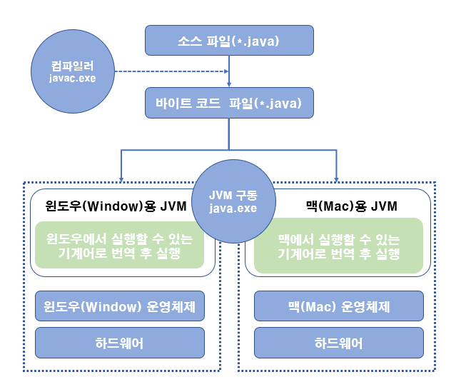

# 자바란?
## 자바의 특징
### 이식성이 높은 언어이다.
> 이식성이란 서로 다른 실행환경을 가진 시스템 간에 프로그램을 옮겨 실행할 수 있는 것을 말한다. MS 윈도우에서 실행되는 대부분의 프로그램들은 MS 윈도우 환경에 최적화 되어 있기 때문에 유닉스나 리눅스에서 실행하려면 프로그램으 소스파일을 수정한 후, 재컴파일 과정을 거쳐야 한다. 하지만 자바로 개발된 프로그램은 소스파일을 다시 수정하지 않아도 JRE가 설치되어 있는 모든 운영체제에서 실행가능하다.

### 객체지향언어이다.
> 자바는 100% 객체지향 언어이다. 객체를 만들기 위한 설계도 역할인 클래스를 작성해야 하고, 객체와 객체를 연결하여 목적에 맞는 프로그램을 만들어 낸다. 처음부터 객체를 고려하여 설계되었기 때문에 캡슐화, 상속, 다형성 기능을 완벽하게 지원하고 있다.

### 함수적 스타일 코딩을 지원한다.
> 자바는 객체 지향 프로그래밍이 소프트웨어 개발의 주요 패러다임이었던 1990년대에 디자인되었다. 객체지향 프로그래밍이 나오기 오래전부터 Lisp 또는 Scheme와 같은 함수적 프로그래밍 언어들이 있었는데, 학계를 제외하고는 현업에서 큰 호응을 얻지 못했다. 최근 들어 함수적 프로그래밍이 다시 부각되고 있는데, 대용량 데이터의 병렬처리 그리고 이벤트 지향 프로그래밍을 위해 적합하기 때문이다. 자바는 함수적 프로그래밍을 위해 람다식을 자바 8부터 지원한다. 람다식을 사용하면 컬렉션의 요소를 필터링, 매핑, 집계 처리하는것이 쉬워쥐고 코드가 매우 간결해진다.

### 메모리를 자동으로 관리한다.
> C++은 메모리에 생성된 객체를 제거하기 위해 개발자가 직접 코드를 작성해야한다. 메모리 할당 부터 제거까지 신경써주어야 하는데, 여기서 오류가 많이 발생한다. 가령 메모리를 제대로 회수하지 않아 프로그램 실행시 누수가 일어나면 프로그램이 중단되거나 자원을 쓸데없이 낭비할 수 있다. 자바는 개발자가 직접 메모리에 접근할 수 없도록 설계되었으며, 메모리는 자바가 직접관리한다. 객체 생성 시 자동으로 메모리 영역을 찾아서 할당하고, 사용이 완료되면 쓰레기 수집기를 실행시켜 자동으로 사용하지 않는 객체를 제거시켜준다. 따라서 개발자는 메모리 관리의 수고스러움을 덜고, 핵심기능 코드 작성에 집중할 수 있다.

### 다양한 애플리케이션을 개발할 수 있다.
> 자바는 윈도우, 리눅스, 맥 등 다양한 운영체제에서 실행되는 프로그램을 개발할 수 있다. 자바는 다양한 운영체제에서 사용할 수 있는 개발 도구와 API를 묶어 에디션 형태로 정의하고 있다.
> > **Java SE (Standard Edtion) - 기본 에디션**  
> > Java SE는 자바 프로그램들이 공통적으로 사용하는 자바 가상 기계(JVM)을 비록해서 자바 프로그램 개발에 필수적인 도구와 라이브러리 API를 정의한다. 클라이언트와 서버 프로그램에 관계없이 자바 프로그램을 개발하고 실행하기 위해서는 반드시 Java SE 구현체인 자바 개발 키트(JDK)를 설치해야한다.
> 
> > **Java EE (Enterprise Edtion) - 서버용 애플리케이션 개발 에디션**  
> > Java EE는 분산환경(네트워크, 인터넷)에서 서버용 애플리케이션을 개발하기 위한 도구 및 라이브러리 API를 정의한다. 서버용 애플리케이션으로는 Servlet/JSP를 이용한 웹 애플리케이션, 분산 처리 컴포넌트인 EJB(Enterprise Java Bean) 그리고 XML 웹 서비스(Web Services) 등이 있다.

### 멀티 스레드를 쉽게 구현할 수 있다.
> 하나의 프로그램이 동시에 여러가지 작업을 처리해야 할 경우와 대용량 작업을 빨리 처리하기 위해 서브 작업으로 분리해서 병렬 처리하려면 멀티 스레드 프로그래밍이 필요하다. 프로그램이 실행되는 운영체제에 따라서 멀티 스레드를 구현하는 방법이 다르지만, 자바는 스레드 생성 및 제어와 관련된 라이브러리 API를 제공하고 있기 때문에 실행되는 운영체제와 관련없이 멀티스레드를 쉽게 구현할 수 있다.  

### 동적 로딩을 지원한다.
> 자바 애플리케이션은 여러개의 객체가 서로 연결되어 실행되는데, 이 객체들은 클래스로부터 생성된다. 애플리케이션이 실행될 때 모든 객체가 생성되지 않고, 객체가 필요한 시점에 클래스를 동적 로딩해서 객체를 생성한다. 또한 개발 완료 후 유지보수가 발생하더라도 해당 클래스만 수정하면 되므로 전체 애플리 케이션을 다시 컴파일할 필요가 없어 유지보수를 쉽고 빠르게 진행할 수 있다.  

### 막강한 오픈소스 라이브러리가 풍부하다.
> 자바는 오픈소스언어이기 때문에 자밮 프로그램에서 사용하는 라이브러리 또한 오픈소스가 넘쳐난다. 고급 기능을 구현하는 코드를 직접 작성할 경우, 시간과 노력이 필요하고, 실행 안전성을 보장할 수 없지만, 검증된 오픈솟스 라이브러리를 사용하면 개발 기간을 단축하면서 안전성이 높은 애플리케이션을 개발할 수 있다.

## 자바 가상 기계(JVM)
운영체제는 자바 프로그램을 바로 실행할 수 없는데, 그 이유는 자바 프로그램은 완전한 기계어가 아닌, 중간 단계의 바이트 코드이기 때문에 이것을 해석하고 실행할 수 있는 가상의 운영체제가 필요하다. 이것이 자바가상기계(JVM)이다. JVM은 실 운영체제를 대신해서 자바를 실행하는 가상의 운영체제 역할을 한다. 저수준 언어 개발자라면 잘 알겠지만, CPU 아키텍쳐마다 동일한 연산에 대한 기계어가 다 다르기 때문에 한 OS만 지원하더라도 각 CPU용의 프로그램으로 컴파일 해주어야 한다. 이와 같이 운영체제별로 프로그램을 실행하고 관리하는 방법이 다르기 때문에 운영체제별로 자바 프로그램을 별도로 개발하는 것 보다는 운영체제와 자바 프로그램을 중계하는 JVM을 두어 자바 프로그램이 여러 운영체제 상에서 동일한 실행결과가나오도록 설계한 것이다. 따라서 개발자는 운영체제와 상관없이 자바 프로그램을 개발할 수 있다.  

Java 가상 머신이라고 해서 Java 바이트 코드만 인식하는 것은 아니다. 이 바이트 코드를 Java가 아닌 다른 언어(Kotlin이나 Scala, Groovy 같은 언어)를 가지고도 생성할 수 있기 때문이다. 따라서 지금의 JVM은 Java만을 위한것이라고 생각하면 안된다. 그렇다 하더라도 처음 Java를 위해 설계되었다보니 Java 소스코드와 바이트 코드는 비교적 직관적으로 연결되지만 코틀린이나 스칼라의 경우 Java와 호환되지만 상대적으로 비 직관적이며, Java 지식을 어느정도 필요로 한다.

바이트 코드는 모든 JVM에서 동일한 실행결과를 보장하지만 JVM은 운영체제에 종속적이다. 자바 프로그램을 운영체제가 이해하는 기계어로 번역해서 실행해야 하므로 JVM은 운영체제에 맞게 설치되어야 한다. JVM은 JDK 또는 JRE를 설치하면 자동으로 설치되는데, JDK와 JRE가 운영체제별로 제공된다. 

자바 프로그램은 확장자가 .java인 파일을 작성하는 것부터 시작된다. 이것을 소스파일이라고 하는데, 이 소스 파일을 컴파일러(javac.exe)로 컴파일하면 확장자가 .class인 바이트 코드 파일이 생성된다. 바이트 코드 파일은 JVM 구동 명령어(java.exe)에 의해 JVM에서 해석되고 해당 운영체젱 맞게 기계어로 번역된다. 바이트 코드는 하나지만, JVM에 의해서 번역되는 기계어는 운영체제에 따라서 달라진다. 이러한 이식성은 매우 매력적이지만 C나 C++의 한번의 컴파일만으로 만들어지는 완전한 기계어보다는 속도가 느리다는 단점을 가지고 있다. JVM 내부의 최적화된 JIT 컴파일러를 통해 속도의 격차는 줄어들고 있는 편이다.

## 자바 개발 환경
### JDK, JRE

> 자바 프로그램의 개발환경을 구축하기 위해서는 먼저 Java SE(Standard Edition)의 구현체인 JDK를 설치해야 한다.  Java SE의 구현체는 자바개발키트(Java Developement Kit)와 자바 실행환경(Java Runtime Environment) 두 가지 버전이 있다. JDK는 프로그램 개발에 필요한 자바 가상 기계(JVM), 라이브러리 API, 컴파일러 등의 개발 도구가 포함되어 있고, JRE에는 프로그램 실행에 필요한 자바 가상 기계(JVM), 라이브러리 API만 포함되어 있다. 이미 개발된 프로그램을 실행만 한다면 JRE만 설치하면 된다.  

- JRE = JVM + 표준 클래스 라이브러리
- JDK = JRE + 개발도구

## [연습문제 풀이](./ChapterTest.md)