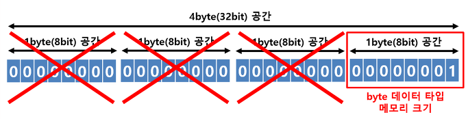

# 데이터 타입
## 기본타입 (primitive)
> 기본타입이란 정수, 실수, 문자, 논리 등 리터럴을 직접 저장하는 타입을 말한다.

### 정수타입
> 자바는 기본적으로 정수연산을 int타입으로 수행한다. 저장하려는 값이 정수리터럴이라면 특별한
> 이유가 없는 한 int타입 변수에 저장하는것이 좋다.

#### 1. byte 타입  
> byte 타입은 색상정보 및 파일 또는 이미지 등의 이진(binary)  데이터를 처리할 때 주로 사용된다.

##### 쓰레기 값 
> 저장할 수 있는 범위를 초과해서 값이 저장될 경우 엉터리 값이 변수에 저장되는데 이러한 값을 쓰레기 값이라고 한다.  

참고 : [GarbageValueExample.java](./sec02_example/GarbageValueExample.java)

#### 2. char 타입
> 자바는 모든 문자를 유니코드(Unicode)로 처리한다. 유니코드는 세계 각국의 문자들을 코드값으로 매핑한 국제 표준 규약이다.
> 유니코드는 0~65535 범위의 2byte 크기를 가진 정수값이다.  
> char 변수에는 작은 따옴표(')로 감싼 문자뿐 아니라 유니코드 정수값을 저장할 수도 있다. 특정 문자의 유니코드값을 
> 안다면 10진수 또는 16진수로 저장하면 된다. (16진수의 경우는 '\u + 16진수값' 형태로 저장)

참고 : [CharExample.java](./sec02_example/CharExample.java)

- 위 예제와 같이 System.out.println()은 변수의 타입이 char이면 유니코드에 해당하는 문자를 출력한다.  
- char 타입의 변수에 어떤 문자를 대입하지 않고 단순히 초기화를 할 목적으로 '' 와 같은 빈 문자를 대입하면 컴파일 에러가 발생한다.
그렇기 때문에 공백 하나를 포함해서 ' '로 초기화 해야한다.
- 참조타입 String은 ""으로 초기화가 가능하다.
- int 타입으로 Promotion되면 유니코드 값이 저장된다.
- char는 2byte의 크기를 가지지만 양수의 범위만을 가지므로, -128~127의 범위를 갖는 byte는 char로 Promotion이 불가능하다.

#### 3. short 타입
> short 타입은 2byte의 정수값을 저장할 수 있는 데이터 타입이다. c언어와의 호환을 위해 사용되며 비교적 자바에서는
> 잘 사용되지 않는다.

#### 4. int 타입
> 4byte 정수로 표현되는 정수값을 저장할 수 있는 데이터 타입으로 자바에서 정수연산의 기본타입으로 사용된다. 
> 즉, byte 타입 또는 short타입의 변수를 + 연산하면 int 타입으로 변환된 후 연산되고 연산의 결과 역시 int이다.
> 이것은 자바에서 정수연산을 4byte로 처리하기 떄문이다.  
> 
> 또한, 변수에 어떤값을 입력하더라도 동일한 값이 2진수로 변환되어 저장된다. 10이 int 타입 변수에 저장되면 메모리에 생성되는 변수는
> 다음과 같다.
> 
> 00000000 00000000 00000000 00001010 4byte의 공간을 차지하면서 총 32 bit로 10을 표현한다.

#### 5. long 타입
> long 타입은 8byte로 표현되는 정수값을 저장할 수 있느 데이터 타입으로 long타입의 변수를 초기화 할 때는 정수값 뒤에
> 소문자 'l'이나 대문자 'L'을 붙일 수 있다. 이것은 4byte 정수데이터가 아니라 8byte 정수데이터임을 컴파일러에게 알려주기
> 위한 목적이다. int type의 범위를 넘어서는 큰 정수는 반드시 'l'이나 'L'을 붙여줘야 한다. 그렇지 않는 경우 컴파일 에러가 발생한다.
> 일반적으로 'L'이 1과의 혼동이 없으므로 선호된다.

참고 : [LongExample.java](./sec02_example/LongExample.java)

### 실수타입
> 소수점이 있는 실수 데이털르 저장할 수 있는 타입으로 메모리 사용크기에 따라 float과 double이 있다.

#### float, double 타입
> 정수타입과는 달리 [부동소수점](https://blog.naver.com/0908f/222263057233?trackingCode=blog_bloghome_searchlist) 방식으로 저장된다.
> 실수연산의 기본타입은 double이므로, 실수리터럴을 float타입에 저장하려면 리터럴 뒤에 소문자 'f'나 대문자 'F'를 붙여야 한다.

- e또는 E가 포함된 정수리터럴은 정수타입 변수에 저장할 수 없고 실수타입 변수에 저장해야한다.  

참고 : [FloatDoubleExample.java](./sec02_example/FloatDoubleExmaple.java)

### 논리타입
#### boolean 타입
> boolean 타입은 1byte로 표현되는 논리값을 저장할 수 있는 데이터 타입으로 조건문과 제어문의 실행흐름을 변경하는데 사용된다.

# 타입 변환
> 타입 변환이란 데이터 타입을 변환하는 것을 말한다. 타입 변환에는 강제타입변환(Casting) 자동타입변환(Promotion)과 같이 두 가지 종류가 있다.

## 자동타입변환
> 자동타입변환은 프로그램 실행 도중에 자동적으로 타입변환이 일어나는 것을 말한다. 작은 크기를 가지는 타입이 큰 크기를 가지는 타입에 저장될 때 발생한다.

- 정수타입을 실수타입으로 변환하는것은 무조건 자동타입변환이된다.
- 음수가 저장될 수도 있는 byte 타입은 char 타입으로 변환될 수 없다.

참고 : [PromotionExample.java](./sec02_example/PromotionExample.java)

## 강제타입변환


> 강제타입변환은 캐스팅 연산자 ()을 사용해 괄호안에 들어가는 타입으로 쪼개는 것이다. 4byte를 차지하는 int타입의 변수를
> 1byte의 byte타입으로 강제타입변환하면 값이 손실된다.

- int 타입을 char타입으로 Casting한 값을 출력하면 그 값에 해당하는 유니코드 대응 문자가 출력된다.
- 실수타입을 정수타입으로 Casting하면 소수점 이하 부분은 버려지고 정수 부분만 사용된다.

참고 : [CastingExample.java](./sec02_example/CastingExample.java)

### 데이터 손실 방지
> Casting을 할때 주의할 점은 값의 손실이 발생하면 안된다는 것이다. 변환하기전에 우선 안전하게 값이 보존될 수 있는지
> 검사하는 것이 좋다.

참고 : [CheckValueBeforeCasting.java](./sec02_example/CheckValueBeforeCasting.java)

### 정밀도 손실 방지
> 정수 타입을 실수값으로 변환할 때 정밀도 손실을 주의해야한다. int type은 32bit까지 표현이 가능한데, float의 가수부는 23bit이므로
> 23bit를 초과하는 int 타입 변수가 Casting 되었을 경우 정확한 값을 표현할 수 없어 근사치로 표현된다.
> 그래서 이러한 값을 int -> float -> int로 변환시 원래의 값을 얻지 못하는 정밀도 손실이 발생한다.

참고 : [FromIntToFloat.java](./sec02_example/FromIntToFloat.java) 

## 연산식에서의 자동타입변환
> <u>연산은 기본적으로 같은 타입의 피연산자 간에만 수행</u>되기 때문에 서로다른 타입의 피연산자가 있을경우 두 피연산자 중 크기가 큰 타입으로
> 자동변환 후 연산을 수행한다.

```java
    int intValue = 10;
    double doubleValue = 5.5;
    double result = intValue + doubleValue; // result에 15.5가 저장
    double intResult = intValue + (int)doubleValue // intResult에 15가 저장
```
- int 타입 피연산자와 double 타입 피연산자를 덧셈연산하면 두 피연산자는 실수연산을 하므로 실수연산의 기본타입인 double로 자동타입변환이 일어난 
후 연산이 수행된다. 
- int 타입 연산이 필요하다면 double타입 변수를 int로 Casting 후 연산을 수행하면된다.

```java
    char ai = 'A';
    int result = ai + 1;     // 'A'의 유니코드보다 1이 큰 유니코드가 저장
    char na = (char) result; // B가 저장됨
```
- 크기가 4byte보다 작은 타입은 4byte인 int타입으로 변환된 후 연산을 수행되고 그 결과도 int이다.
- char타입의 연산결과는 int타입으로 산출되므로 int타입 변수에 결과를 저장해야한다. 연산의 결과를 문자로 출력하기 위해서는 다시 char타입으로
Casting 해 주어야 한다.

참고 : [OperationsPromotionExample.java](./sec02_example/OperationExample.java)

## [연습문제 풀이](./ChapterTest.md)