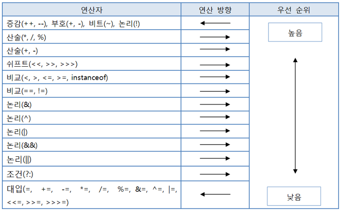

# 연산자
## 연산자와 연산식
연산자는 필요로 하는 피연산자의 수에 따라 단항, 이항, 삼항 연산자로 구분된다. 
```java
// 단항 연산자 : 증감, 부호, 비트반전, 논리부정 연산자
++x, -x, ~x, !x

// 이항 연산자 : 대부분의 연산자
x + y;

// 삼항 연산자 : 조건 연산자
(sum > 90) ? "A" : "B";
```
연산식은 반드시 하나의 값을 산출한다. 연산자 수가 아무리 많아도 두 개 이상의 값을 산출하는 연산식은 없다.  
그렇기 때문에 하나의 값이 올 수 있는 곳이면 어디든지 값 대신에 연산식을 사용할 수 있다.

## 연산의 방향과 우선순위
  
프로그래밍 언어는 연산자의 연산방향과 연산자 간의 우선순위가 정해져 있다. 다양한 연산자가 복합적으로 구성된 경우  
연산자 우선순위에 따라 연산이 수행된다.
```java
x > 0 && y < 0  // 비교 연산이 우선 수행된 후 논리연산이 수행된다.
100 * 2 / 3 % 5 // 우선순위가 같은 경우, 몇몇 연산자를 제외한 대부분의 연산자에대해 자바 컴파일러는 좌행연산을 지원한다.
a = b = c = 5;  // 단항 연산자(++, --, ~, !), 부호 연산자(+, -), 대입 연산자(=, +=, -=, ...)는 <- 방향으로 연산된다.
```
> 1. 단항, 이항, 삼항 연산자 순으로 우선순위를 가진다.
> 2. 산술, 비교, 논리, 대입 연산자 순으로 우선순위를 가진다.
> 3. 단항과 대입 연산자를 제외한 모든 연산자는 좌행연산(->)
> 4. 복잡한 연산식에는 괄호를 사용해서 우선순위를 정해주면 좀더 식별하기 쉽다.

## 단항연산자
### 부호 연산자(+,-)  
- 부호연산자는 양수 및 음수를 표시하는 +, - 를 말한다.
- boolean 타입과 char 타입을 제외한 나머지 기본 타입에 사용할 수 있다.
- 부호 연산자의 산출 타입은 int 타입이 된다. 
```java
short s = 100;
short result = -s; // 컴파일 에러
int result = -s;
```
참고 : [SignOperatorExample.java](./SignOperatorExample.java)

### 증감 연산자(++, --)
- 증감연산자는 변수의 값을 1증가시키거나 감소시키는 연산자를 말한다.
- boolean 타입을 제외한 모든 기본타입의 피연산자에 사용할 수 있다.
- x++과 x = x + 1은 컴파일 시 동일한 바이트 코드로 생성되기 때문에 성능은 동일하다.
```java
// 증감 연산자만 사용하는 경우 변수 앞, 뒤 어디든 결과는 같다.
++i, i++;
// 다른 연산자와 함께 사용하는 경우 증감연산자의 위치에 따라 결과가 달라진다.
int x = 1, y = 1;
int result1 = ++x + 10; // 12
int result2 = y++ + 10; // 11, 이 다음줄에서 출력하는 경우 12
```
참고 : [IncreaseDecreaseOperatorExample.java](./IncreaseDecreaseOperatorExample.java)

### 논리 부정 연산자(!)
- true를 false로, false를 true로 변경하기 때문에 boolean 타입에만 사용할 수 있다.
```java
boolean play = true;
System.out.println(play);  //true

play = !play;
System.out.println(play);  //false

play = !play;
System.out.println(play);  //true
```

### 비트 반전 연산자(~)
- __정수타입(byte, short, int, long)의 피연산자에만 사용되며, 연산을 수행하기 전에 int 타입으로 변환되고, 산출타입은 int가 된다.__
- 피연산자를 2진수로 표현했을 때 비트값인 0을 1로, 1은 0으로 반전한다.
- 연산후 부호비트인 최상위 비트를 포함해서 모든 비트가 반전되기 때문에 부호가 반대인 새로운값이 산출된다.
```java
byte v1 = 10;
byte v2 = ~v1; // 컴파일 에러
byte v2 = ~v1;
```
자바는 정수값을 총 32bit의 문자열로 리턴하는 Integer.toBinaryString() 메소드를 제공한다. 앞의 bit가 0인경우 0은 생략되기  
때문에 총 32개의 문자열을 모두 얻기 위해서는 아래와 같은 코드가 필요하다.
```java
public static String toBinaryString(int value) {
    String str = Integer.toBinaryString(vlaue);
    while(str.length() < 32) {
        str = "0" + str;
    }
    return str;
}
```
참고 : [BitReverseOperatorExample.java](./BitReverseOperatorExample.java)

## 이항 연산자
### 산술 연산자(+, -, *, /, %)
- 산술 연산자는 boolean 타입을 제외한 모든 기본타입에 사용할 수 있다.
> 1. Long을 제외한 정수타입 연산은 int 타입으로 산출되고, long이 포함된 연산이라면 long 타입으로 산출됨.
> 2. 피연산자 중 하나라도 실수타입이면 그 중 크기가 큰 실수타입으로 결과가 산출된다.
> 3. char 타입도 산술 연산시 int 타입으로 산출 but 리터럴 간 연산은 타입변환 x
```java
byte byte1 = 1;
byte byte2 = 1;
byte byte3 = byte1 + byte2; // 컴파일 에러 발생
int byte3 = byte1 + byte2;

int int1 = 10;
int int2 = 4;
int result2 = int1 / int2;      // 2

// 2.0, 정수연산은 int타입으로 이루어지므로, 결과인 2를 실수타입에 할당할 뿐이고, 이 때 실수화가 일어나서 2.0이 된다.
double result3 = int1 / int2;   

// 2.5를 산출결과로 얻고 싶다면, 실수연산이 발생해야한다.
double result3 = (int1*1.0) / int3;
double result3 = (double) int1 / int2;
double result3 = int1 / (double) int2;

// char 타입 연산
char c1 = 'A' + 1;
char c2 = 'A';
//char c3 = c2 + 1;             // 컴파일 에러
System.out.println("c1:"+c1);   // c1:B => 리터럴 간의 연산은 타입변환없이 해당타입으로 계산
System.out.println("c2:"+c2);   // c2:A
//System.out.println("c3:"+c3);   
```
참고 : [AtrithmeticOperatorExample.java](./AtrithmeticOperatorExample.java)

### 오버플로우 탐지
산술연산을 할 때 주의할 점은 연산후의 산출값이 산출 타입으로 충분히 표현 가능한지 살펴봐야 한다.
```java
int x = 1000000;
int y = 1000000;
int z = x * y;
long w = x * y;
System.out.println(z); // overflow 발생
System.out.println(w);
```
참고 : [CheckOverflowExample.java](./CheckOverflowExample.java)

### 정확한 계산은 정수사용
정확하게 계산해야 할 때는 부동소수점(실수)타입은 사용하지 않는 것이 좋다. 실수가 필요하거나 정확한 계산이 필요한 경우  
일반적으로 java.math.BigDecimal 클래스를 사용한다.
```java
// 사과 1개를 0.1단위 10조각으로 보고, 그 중 7조각을 뺀 3조각(0.3)을 result 변수에 저장한다.  
int apple = 1;
double pieceUnit = 0.1;
int number = 7;

double result = apple - number * pieceUnit;

System.out.println("남은 조각 : " + result); // 0.29999999999999993 조각이 남는다.
```
위 소스코드의 출력된 결과를 보면 result 변수의 값은 3이 아닌 0.29999999999999993이 되어 정확히 0.3이 되지 않는다.  
이것은 이진 포맷의 가수를 사용하는 부동소수점 타입은 0.1을 정확히 표현할 수 없어 근사치로 처리하기 때문이다. 정확한 계산이 필요하다면 정수연산을 하고 마지막에 실수를 곱해주는 형식을 취한다.
```java
int apple = 1;

int totalPieces = apple * 10;
int number = 7;
int temp = totalPieces - number;

double result = temp/10.0;
System.out.println("남은 조각 : " + result); // 0.3
```
### NaN과 Infinity 연산
- 좌측 피연산자가 정수타입인 경우 제수가 0일때 ArithmeticException이 발생한다.
```java
5 / 0 => ArithmeticException 발생
5 % 0 => ArithmeticException 발생
```
- 좌측 피연산자가 정수타입일 때, 제수가 0.0 또는 0.0f인 경우에는 NaN(Not a Number) 또는 Infinity가 발생한다.
- NaN 또는 Infinity가 발생한 경우 다음 연산의 수행결과 또한 NaN과 Infinity가 나오므로 더이상의 연산을 수행해선  
안된다. 이 경우 Double.isNaN() 또는 Double.isInfinity()를 이용해 검사한다.
```java
5 / 0.0 => Infinity 발생
5 % 0.0 => NaN 발생

int x = 5;
double y = 0.0;

double inf = x / y;
double nan = x % y;

System.out.println(Double.isInfinite(inf));         // true
System.out.println(Double.isNaN(nan));              // true
System.out.println(inf + 1);                        // Infinity
System.out.println(nan + 1);                        // NaN
```
### 입력값의 NaN 또는 Infinity 검사
- 부동소수점을 입력받을 때는 반드시 NaN 검사를 해야 한다. 악의있는 사용자가 NaN 또는 Infinity를 입력한다면 결과데이터가 엉망이된다.
- NaN 또는 Infinity는 != 연산자를 제외한 모든 비교연산자를 사용할 경우 결과는 false이므로, Double.isNan 또는 Double.isInfinity를 사용해야한다.
```java
String userInput = "NaN";
dobule val = Double.valueOf( userInput );

double currentBalance = 10000.0;

//NaN을 검사
if(Double.isNaN(val)) { 
    System.out.println("NaN이 입력되어 처리할 수 없음.");
    val = 0.0;
}

currentBalance += val;
System.out.println(currentBalace); // NaN
```
## 문자열 연결 연산자 (+)
- \+ 연산자는 산술연산자, 부호연산자인 동시에 문자열 연결 연산자이기도 하다.
- 피연산자 중 한쪽이 문자열이면 \+ 연산자는 문자열 연결 연산자로 사용되어 다른 피연산자를 문자열로 변환하고 결합한다.
- 문자열과 숫자가 혼합된 \+ 연산식은 왼쪽에서부터 오른쪽으로 연산이 진행된다.
```java
"JDK" + 3 + 3.0; //JDK33.0
3 + 3.0 "JDK"; //6.0JDK
```

## 비교 연산자 (<, <=, >, >=, !=)
- 비교 연산자는 대소(<, <=, >, >=) 또는 동등(==, !=)을 비교해서 boolean 타입인 true/false를 산출한다.
- 대소 연산자는 boolean타입을 제외한 기본타입에 사용가능하고, 동등 연산자는 모든 타입에 사용가능하다.
- 만약 피연산자가 char타입이면 유니코드 값으로 비교 연산을 수행한다.
```java
('A' < 'B') -> (65 < 66)
```
- 예외적으로 아래와 같이 0.1과 0.1f를 비교하는 경우 true가 반환되어야 하지만, false가 산출된다. 이진 포맷의 가수를 사용하는 모든 
부동소수점 타입은 0.1을 정확히 표현할 수 없어 근사값으로 표현하기 때문.
- double이나 float 둘 중 한 타입으로 모든 피연산자를 Casting하여 비교연산하거나, 모든 피연산자를 정수로 변환 후 비교하면 된다.
```java
int v2 = 1;
int v3 = 1.0;
System.out.println(v2 == v3); // true

double v4 = 0.1;              // double 타입의 리터럴
float v5 = 0.1f;              // float 타입의 리터럴
System.out.println(v4 == v5); // false
```
## 논리 연산자 (&&, ||, &, |, ^, !)
- 논리 연산자는 피연산자가 boolean타입인 경우에만 사용가능하다.
- &&와 &는 산출결과는 같지만 &&의 경우 앞의 연산자가 false이면 뒤의 연산자는 평가하지 않아, 조금 더 효율적이다. 이는 |와 ||에서도 유사하다.

## 비트 연산자 (&, |, ^, ~, <<, >>, >>>)
- 비트 연산자는 데이터를 비트 단위로 연산한다. (즉, 0과 1이 피연산자이므로, 정수타입만 비트연산 가능)
### 비트 논리 연산자 (&, |, ^)
- 비트 논리연산자에는 &, |, ^가 있다. &, |, ^ 연산자는 피연산자가 boolean 타입일 경우에는 일반논리 연산자이고, 피연산자가 정수 타입일 경우에는 비트논리연산자로 사용된다.
- 비트 연산자는 피연산자를 int타입으로 자동 변환 후 연산을 수행한다.
```java
byte num1 = 45;
byte num2 = 25;
byte result = num1 & num2; //컴파일 에러
```
참고 : [BitLogicExample.java](./BitLogicExample.java)

### 비트 이동 연산자 (>>>, >>, <<)

- 비트 이동 연산자는 비트를 좌측 또는 우측으로 밀어서 이동시키는 연산을 수행한다.  

참고 : [BitShiftExmaple.java](./BitShiftExmaple.java)

## 대입 연산자
- 대입 연산자는 오른쪽 피연산자의 값을 좌측 피연산자인 변수에 저장한다.
- 모든 연산자들 중에 가장 낮은 연산 순위를 가지고 있다.
- 연산의 진행방향이 왼쪽 -> 오른쪽이다.

## 삼항 연산자
- ? 앞의 조건에 따라 콜론 앞뒤의 피연산자가 선택된다고해서 조건 연산식이라고 부르기도 한다.