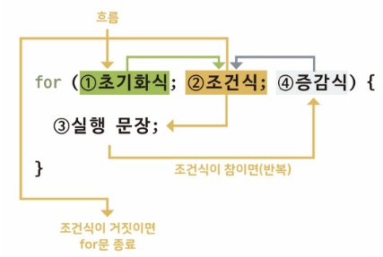
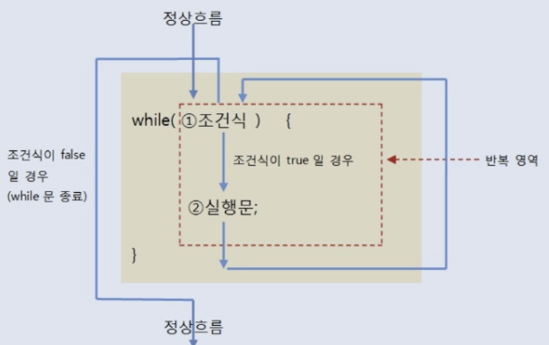

# 코드 실행흐름 제어
## 조건문(if, switch)
### if 문
### if-else 문 
### if-else if-else 문
### 중첩 if 문
### switch 문
- if 문처럼 조건식이 true일 경우에 블록내부의 실행문을 실행하는 것이 아닌, 변수가 어떤값을 갖느냐에 따라 실행문이 선택된다.
- 만약 괄호안의 값과 동일한 값을 같는 case가 없으면 default로 가서 실행문을 실행시킨다. (default는 생략가능하다.)
- break이 없다면 다음 case가 연달아 실행되는데, 이 경우에는 case의 값과 상관없이 실행된다.
- char 타입 변수도 switch문에 사용될 수 있다.
- java6 까지는 switch문의 괄호에는 정수타입(byte, char, short, int, long) 변수나 정수값을 산출하는 연산식만 올 수 있었지만,  
java7부터는 String 타입의 변수도 올 수 있다.
```java
int num = (int)(Math.random()*6) + 1 // 1~6까지의 난수

switch(num) {
    case 1:
        System.out.println("1");
        break;
    case 2:
        System.out.println("2");
        break;
    case 3:
        System.out.println("3");
        break;
    case 4:
        System.out.println("4");
        break;
    case 5:
        System.out.println("5");
        break;
    default:
        System.out.println("6");
        break;
}
```

## 반복문 (for, while, do-while)
- for문은 주로 반복횟수를 알고있을 때 사용하고, while은 조건에 따라 반복할 때 주로 사용한다.
### for 문 (중요)
  
- 루프 카운터 변수를 선언할 때 부동소수점 타입을 사용하지 말아야 한다.

### while 문
  
- 조건식에는 boolean 변수나 true/false 값을 산출하는 어떠한 연산식도 올 수 있다.

참고 : [WhileKeyControlExample.java](./WhileKeyControlExample.java)

### do-while 문
- while문의 괄호 뒤에 세미콜론을 반드시 붙여야 한다.
### break 문
- 기본적으로 가장 가까운 반복문을 종료시키지만, 반복문에 라벨을 붙이고 break 라벨을 사용하면 그 반복문까지 역순으로 종료한다.
```java
// 가장 안쪽 반복문에서 lower 변수가 'g'를 갖게 되면 바깥쪽 for문 까지 빠져나오도록 작성
public class BreakOutterExample {
    public static void main(String[] args) {
        Outter:for(char upper='A'; upper<='Z'; upper++) {
            for(char lower='a'; lower<='z'; lower++) {
                System.out.println(upper + "-" + lower);
                if(lower=='g') {
                    break Outter;
                }
            }
        }
        System.out.println("프로그램 실행 종료");
    }
}
```
### continue 문
- for 문, while 문, do-while 문에서만 사용되는데, 블록내부 continue 문이 실행되면 for 문의 증감식 또는 while 문, do-while 문의 조건식으로 이동한다.
```java
public class ContinueExample {
    public static void main(String[] args) {
        for(int i=1; i<=10; i++){
            if(i%2 != 0) {
                continue;
            }
            System.out.println(i);
        }
    }
}
```