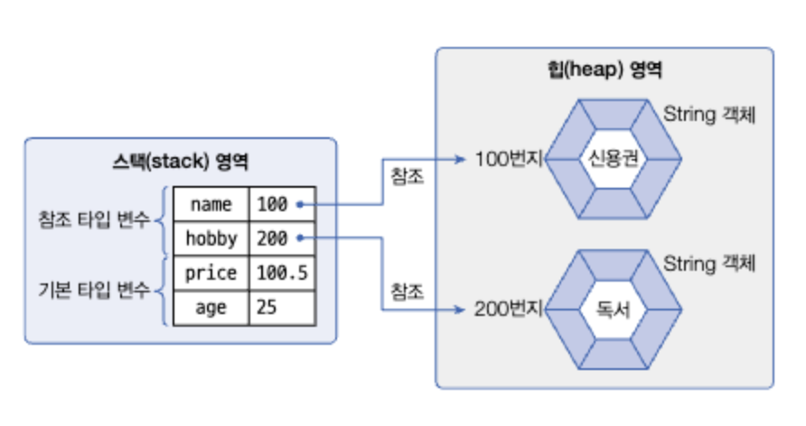
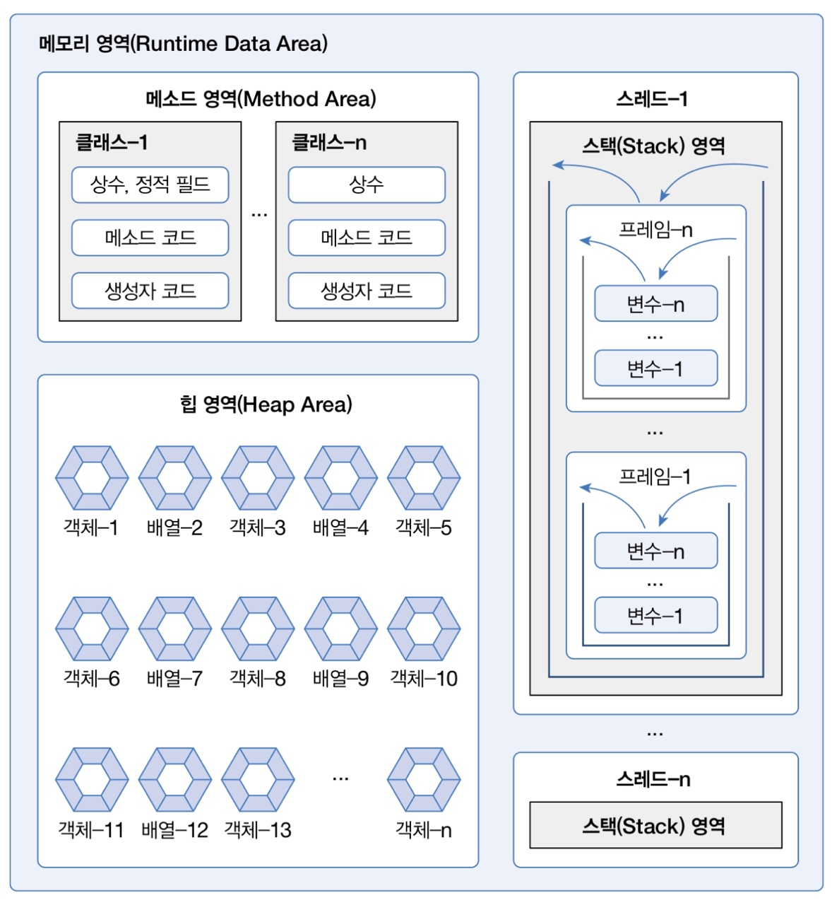
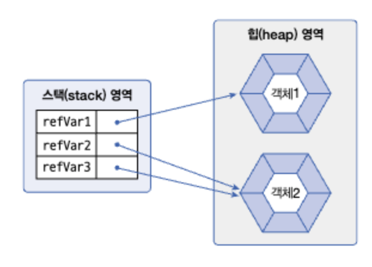
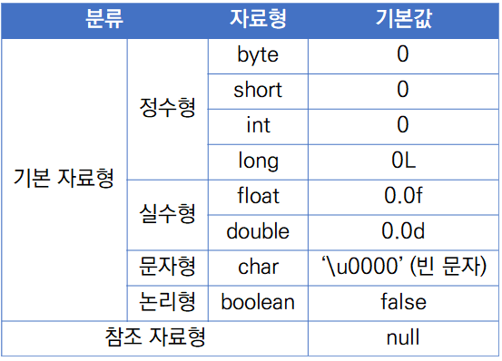
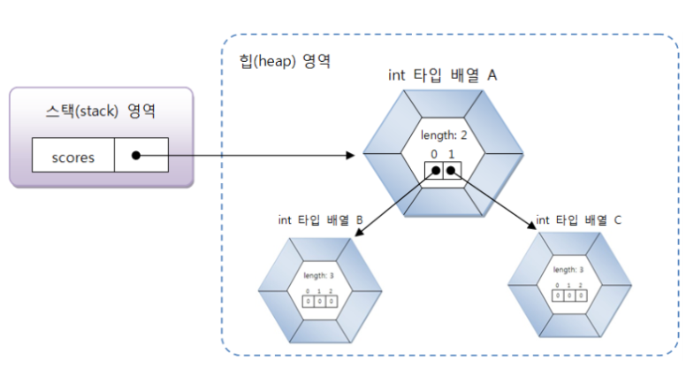

# 참조 타입
객체(Object)의 번지를 참조하는 타입으로 배열, 열거, 클래스, 인터페이스 타입을 말한다. 기본타입으로 선언된 변수는 실제 값을 변수안에 저장하지만, 참조타입을 이용해 선언된 변수는 메모리의 번지를 값으로 갖는다.


## 메모리 사용 영역
java.exe로 JVM이 시작되면, JVM은 운영체제에서 할당받은 메모리 영역을 다음과 같이 세부영역으로 구분하여 사용한다.



### 메소드 영역
코드에서 사용되는 클래스(~.class)들을 클래스 로더로 읽어 클래스별로 런타임 상수풀, 필드 데이터, 메소드 데이터, 메소드 코드, 생성자 코드 등을 분류해서 저장한다. 메소드 영역은 JVM이 시작할 때, 생성되고 모든 스레드가 공유하는 영역이다.

#### 런타임 상수풀
> 주로 클래스와 관련된 메타데이터(클래스와 인터페이스에 대한 참조 등)과 클래스 구조, 필드, 상수 값, 메서드와 같은 데이터를 저장한다.  

### 힙 영역
객체와 배열이 생성되는 영역으로, 모든 인스턴스 변수는 여기 저장된다. 힙 영역에 생성된 객체와 배열은 JVM스택영역의 변수나 다른 객체의 필드에서 참조한다. 참조하는 변수나 필드가 없다면 의미없는 객체가 되기 때문에 이것을 쓰레기로 취급하고 JVM은 쓰레기 수집기를 실행시켜 쓰레기 객체르 힙 영역에서 자동으로 제거한다.

### JVM 스택영역
JVM 스택 영역은 각 스레드마다 하나씩 존재하며 스레드가 시작될 때 할당된다. 자바 프로그램에서 추가적으로 스레드를 생성하지 않았다면, main 스레드만 존재하므로 JVM 스택도 하나이다. <u>JVM 스택은 메서드를 호출할 때마다 프레임을 추가</u>하고 메소드가 종료되면 해당 프레임을 제거하는 동작을 수행한다. 예외 발생시 printStackTrace() 메소드로 보여주는 StackTrace의 각 라인은 하나의 프레임을 표현한다.  
프레임 내부에는 로컬 변수 스택이 있는데, 기본타입변수와 참조타입 변수가 추가되거나 제거된다. 변수가 이 영역에 생성되는 시점은 초기화가 될 때, 즉 최초로 변수에 값이 저장될 때이다.

## 참조변수의 ==, != 연산
기본 타입 변수의 !=, == 연산은 값이 같은지 아닌지만 조사하지만, 참조 타입 변수간의 !=, == 연산은 동일한 객체를 참조하는지, 다른 객체를 참조하는지 알아볼 때 사용된다.

## null과 NullPointerException


참조타입의 변수는 힙 영역의 객체를 참조하지 않는다는 뜻으로 null값을 가질 수 있다. null값도 초기값으로 사용할 수 있기 때문에 <u>null로 초기화된 참조변수는 스택영역에 생성된다.</u> 참조타입 변수가 null값을 가지는지 확인하려면 아래와 같이 !=, == 연산을 하면 된다.
```java
refVar1 == null // 결과 false
refVar1 != null // 결과 true

refVar2 == null // 결과 true
refVar2 != null // 결과 false
```
프로그램 실행 도중 발생한 오류를 예외라고 하는데, NullPointerException이 발생한다면 예외가 발생된 곳에서 객체를 참조하지 않은 상태로 참조타입 변수를 사용하고 있음을 알아야 한다. 

## String 타입
문자열은 String 객체로 생성되고, 변수는 String 객체를 참조한다. String 객체를 생성하는 방법으로는 문자열 리터럴을 String 타입 변수에 할당하는것과, new 연산자를 이용해 String 객체를 생성하는 방법 두 가지가 있다. new 연산자는 힙 영역에 새로운 객체를 만들 때 사용하는 연산자로 객체 생성 연산자라고도 한다.

### 💡 String Constant Pool  

>Java에서 문자열 리터럴을 저장하는 독립된 영역을 String Constant Pool이라고 부른다. String Constant Pool은 메소드 영역에 존재하며, 리터럴을 통해 생성된 String 객체는 힙 영역에 생성된다. String Constant Pool에는 이 객체에 대한 참조가 저장된다. 
> > [참고] String Constant Pool은 일반적으로 GC가 되지 않지만, 해당 문자열을 참조하는 대상이 없는 경우 선택적으로 GC대상이 되기도 한다.
> 
>소스 코드에서 문자열 리터럴로 선언된 문자열의 참조가 이 저장공간에 저장되며, 동적으로 생성된 문자열(new 연산자, 리플렉션, 클론, 팩토리 패턴 등으로 생성된 문자열)은 저장되지 않는다. 그리고 리터럴로 생성된 문자열 객체에 한하여 <u>한번 저장된 문자열은 소스코드에서 동일한 문자열에 대해 재사용하여 메모리를 절약하는 역할을 한다.</u>  

위와 같은 이유로 문자열 리터럴로 생성하느냐 new 연산자로 생성하느냐에 따라 비교 연산자의 결과가 달라질 수 있다. 동일한 문자열 리터럴로 String 객체를 생성할 경우 == 연산자의 결과는 true가 나오지만, new 연산자로 생성한 경우 ==연산의 결과는 false가 나온다.  
String 객체 내부의 값을 비교하기위해서는 String.equals() 메서드를 사용해야 한다.
```java
String name1 = "주은찬";   // heap > StringConstantPool에 생성
String name2 = "주은찬";   // heap > StringConstantPool에 이미 생성된 문자열 재사용 (naem1과 같은 주소 할당)
String name3 = new String("주은찬");   // heap 영역에 새로 메모리 할당
```
### 💡 불변 객체
> 불변객체란 한번 생성된 후 내부 상태가 변하지 않는 객체를 의미한다. 불변 객체의 상태는 변경될 수 없으며, 모든 필드는 초기화된 후 수정되지 않는다. 내부 상태의 변경은 불가능하지만 그 객체가 할당된 주소는 변경이 가능하다.  
> 흔히 PS에서 문자열은 StringBuffer, StringBuilder 클래스를 사용하여 조작하곤 하는데, 그 이유도 String이 불변객체이기 때문이다. 이 특성때문에 같은 문자열이 계속 생성되는 경우 메모리의 낭비를 야기할 수 있기 때문에, 리터럴로 생성된 문자열에 한해 재사용하여 메모리를 절약한다.

참고 : [StringEqualsExample.java](./example/example/StringEqualsExample.java)

## 배열타입
같은 타입의 많은 데이터를 다루는 방법으로, 선언과 동시에 저장할 수 있는 데이터 타입이 결정되고, 한번 생성된 배열은 길이를 늘이거나 줄일 수 없다. 길이의 수정이 필요하다면, 새로운 배열을 생성하고 복사해야한다.
### 배열 선언
대괄호 []는 배열 변수를 선언하는 기호로 사용되는데, 타입 뒤와 타입 앞 어디든 붙을 수 있다. 또한 배열 변수는 참조변수에 속하고, 배열도 객체이므로 힙 영역에 생성되고 배열 변수는 힙 영역의 배열 객체를 참조하게 된다. 참조 할 배열 객체가 없다면 null값으로 초기화 될 수 있다.  
만약 배열 변수가 null값을 가진 상태로 배열변수[인덱스]로 값을 읽거나 저장하게 되면 NullPointerException이 발생한다.
```java
int[] intArray;
double[] doubleArray;
String[] strArray;

int intArray[];
double doubleArray[];
String strArray[];

타입[] 변수 = null;
```

### 값 목록으로 배열 생성
배열에 저장될 값의 목록이 있다면, 다음과 같이 간단하게 배열 객체를 만들 수 있다. 중괄호 {}는 주어진 값들을 항목으로 가지는 배열 객체를 힙에 생성하고, 배열 객체의 번지를 리턴한다. 배열 변수는 리턴된 번지를 저장함으로써 참조가 이루어진다.

```java
데이터타입[] 변수 = { 값0, 값1, 값2, 값3, 값4, 값5 };

// 값 목록으로 배열객체 생성할 때의 주의점
타입 [] 변수;
변수 = { 값0, 값1, 값2, 값3, 값4, 값5 };    // 컴파일 에러
```
값 목록으로 배열객체를 생성할 때 주의할 점이 있는데, 배열 변수를 이미 선언한 후에 다른 실행문에서 중괄호를 사용한 배열 생성은 허용되지 않는다. 배열변수를 미리 선언한 후, 값 목록들이 나중에 결정되는 상황이라면 new 연산자를 사용해서 값 목록을 지정해주면 된다. 메소드의 매개값이 배열일 경우에도 마찬가지다.
```java
변수 = new 타입[] { 값0, 값1, 값2, 값3, 값4, 값5 };   // 정상
int add(new int[] {95,85, 90}) //매개값이 배열인 경우
```
참고 : [ArrayCreateByValueListExample.java](./example/ArrayCreateByValueListExample.java)

### new 연산자로 배열 생성
값의 목록을 가지고 있지 않지만, 향후 값들을 저장할 배열을 미리 만들고 싶다면, new 연산자로 다음과 같이 배열 객체를 생성시킬 수 있다. new 연산자를 이용해 배열을 생성하는 경우에는 미리 선언된 배열변수에 할당 가능하다. 이렇게 생성된 배열은 기본값으로 초기화된다.
```java
타입[] 변수 = new 타입[길이];

타입[] 변수 = null;
변수 = new 타입[길이];
```
#### new 연산자와 길이만으로 배열 생성 시 기본값


### 배열 길이
배열에 저장할 수 있는 전체 항목수를 배열길이라고한다. 배열의 길이를 얻을려면 배열 객체의 length 필드를 읽으면 된다. length 필드는 읽기전용이기 때문에 값을 변경할 수 없다.
```java
intArray.length = 10 // 잘못된 코드
```

### 다차원 배열
행과 열로 구성된 배열을 2차원 배열이라고 한다. 자바는 2차원 배열을 중첩 배열 방식으로 구현한다. 예를 들어 2x3 행렬을 만들기 위해 다음과 같은 코드를 사용한다.
```java
int[][] scores = new int[2][3];
```
이 코드는 메모리에 다음과 같이 세 개의 배열 객체를 생성한다.


배열 변수인 score는 길이 2인 배열 A를 참조한다. 배열 A의 score[0]은 다시 길이 3인 배열 B를 참조한다. 그리고 score[1] 역시 길이 3인 배열 C를 참조한다. 자바는 일차원 배열이 서로 연결된 구조로 다차원 배열을 구현하기 때문에 <u>행렬구조(각 행의 열 개수가 일정함)가 아닌 계단식 구조를 가질 수 있다.</u>

### 배열 복사
배열은 한번 생성하면 크기를 변경할 수 없기 때문에 더 많은 저장공간이 필요하다면 보다 큰 배열을 새로 만들고 이전 배열로부터 항목 값들을 복사해야 한다. 배열 간의 항목값들을 복사 하려면 for문을 사용하거나 System.arrcopy() 메소드를 사용하면 된다.
```java
// for 문을 이용한 배열복사
public class ArrayCopyByForExmaple {
    public static void main(String[] args) {
        int[] oldIntArray = { 1, 2, 3 };
        int[] newIntArray = new int[5];
        
        for(int i=0; i<oldIntArray.length; i++) {
            newIntArray[i] = oldIntArray[i];
        }
        
        for(int i=0; i<newIntArray.length; i++) {
            System.out.println(newIntARrayp[i] + ", ");
        }
    }
}

//System.arrcopy() 를 이용한 배열복사
public class ArrayCopyExample {
    public static void main(String[] args) {
        String[] oldStrArray = { "java", "array", "copy" };
        String[] newStrArray = new String[5];
        
        // arraycopy( 원본배열, 복사할 항목(원본배열)의 시작인덱스, 새 배열, 붙여넣을 항목(새 배열)의 시작 인덱스)
        System.arraycopy( oldStrArray, 0, newStrArray, oldStrArray.length );
        
        for(int i=0; i<newStrArray.length; i++) {
            System.out.println(newStrArray[i] + ", ");
        }
    }
}
```

## 열거 타입
데이터 중에는 요일, 계절과 같이 몇 가지로 한정된 값만을 갖는 경우가 흔히 있다. 이와 같이 한정된 값만을 갖는 데이터 타입을 열거타입이라고 한다. 열거 타입은 정해진 상수들의 집합을 정의하는 특수한 클래스이다. 일반 클래스는 new 연산자를 이용해 객체를 만들지만 enum 타입의 인스턴스는 자동으로 생성되며 추가생성이 불가능하다.  

### 열거 타입 선언
열거타입을 선언하기 위해서는 먼저 열거 타입의 이름을 정하고, 열거 타입 이름으로 소스파일을 생성해야 한다. 열거타입이름은 관례적으로 첫 문자를 대문자로 하고 나머지는 소문자로 구성한다.  
```java
public enum Week {
    MONDAY,
    TUESDAY,
    WEDNESDAY,
    THURSDAY,
    FRIDAY,
    SATURDAY,
    SUNDAY
}
```
public enum 키워드는 열거 타입을 선언하기 위한 키워드로 반드시 소문자여야 하고, 열거타입 이름(Week)은 소스 파일명과 대소문자가 모두 일치해야 한다. 열거 상수는 열거타입의 값으로 사용되는데, 관례적으로 열거 상수는 모두 대문자로 작성한다. 만약 열거 상수가 여러 단어로 구성될 경우에는 단어사이를 밑줄로 연결하는것이 관례이다.

### 열거 타입 변수
열거 타입도 하나의 데이터 타입이므로 변수를 선언하고 사용해야한다. 열거 타입 또한 참조타입으로, 열거타입을 구성하는 모든 열거상수들은 JVM이 시작할 때, 힙 영역에 객체로 생성되고, 이후에는 재사용 된다. 자세한 내용은 다음과 같다.  
1. 열거 타입이 로드되면, 메소드 영역에 해당 열거 타입의 메타데이터와 열거 상수가 로드된다.
2. 각 열거 상수는 힙 영역에 객체로 생성된다. 이때, 열거 객체는 열거상수의 문자열을 내부 데이터로 가지고 있다.
3. 일반 클래스의 상수와 달리 열거상수들은 하나하나가 객체이므로 힙에 생성되며, 메소드 영역의 정적 필드에 열거 상수 객체의 참조가 저장된다. enum 클래스는 마치 미리 생성된 객체를 보관하는 곳 처럼 동작하며, 열거 상수를 호출할 때마다 새로운 객체가 만들어지는것이 아니라, 이미 존재하는 객체를 재사용 하는 것이다.  
```java
Week today;
Week reservationDay;

Week today = Week.SUNDAY;
Week birthday = null;

Week week1 = Week.SATURDAY;
Week week2 = Week.SATURDAY;
System.out.println( week1 == week2 ); // true
```

#### Example
자바는 컴퓨터의 날짜 및 요일, 시간을 프로그램에서 사용할 수 있도록 하기 위해 Date, Calendar, LocalDateTime 등의 클래스를 제공한다. LocalDateTime은 자바 8부터 지원하는 API이다. 이전 버전과의 호환성을 위해 Calendar를 이용해 날짜와 시간을 얻는 방법을 알아보자.
```java
// Calendar 변수를 생성한 후, Calendar.getInstance() 메소드가 리턴하는 Calendar 객체를 얻는다.
Calendar now = Calendar.getInstance();

// get() 메서드를 이용해서 년, 월, 일, 요일, 시간, 분, 초를 다음과 같이 얻을 수 있다.
int year = now.get(Calendar.YEAR);
int month = now.get(Calendar.MONTH) + 1;
int day = now.get(Calendar.DAY_OF_MONTH);
int week = now.get(Calendar.DAY_OF_WEEK);
int hour = now.get(Calendar.HOUR);
int minute = now.get(Calendar.MINUTE);
int second = now.get(Calendar.SECOND);
```
그러면 Calendar를 이용해서 오늘의 요일을 얻고, 열거타입 변수 today에 각 날짜에 해당하는 Calendar 추상클래스의 상수를 대입하는 예제를 살펴보자.
```java
import java.util.Calendar;

public class EnumWeekExample {
    public static void main(String[] args) {
        Week today = null;  // 열거타입 변수 선언
        
        Calendar cal = Calendar.getInstance();
        int week = cal.get(Calendar.DAY_OF_WEEK);
        
        switch(week) {
            case 1:
                today = Week.SUNDAY;
                break;
            case 2:
                today = Week.MONDAY;
                break;
            case 3:
                today = Week.TUESDAY;
                break;
            case 4:
                today = Week.WEDNESDAY;
                break;
            case 5:
                today = Week.THURSDAY;
                break;
            case 6:
                today = Week.FRIDAY;
                break;
            case 7:
                today = Week.SATURDAY;
                break;
        }

        System.out.println("오늘 요일 : " + today);
        
        if(today == Week.SUNDAY) {
            System.out.println("월요일에는 축구를 합니다.");
        } else {
            System.out.println("열심히 자바 공부 합니다.");
        }
    }
}
```  
### 열거 객체의 메소드
열거타입은 컴파일 시에 Enum 클래스를 상속하게 되어 있기 때문에, java.lang.Enum 클래스에 선언된 메소드를 사용할 수 있다.  

|리턴타입|메소드(매개변수)|설명|
|:---|:---|---|
|String|name()|열거 객체의 문자열을 리턴|
|int|ordinal()|열거 객체의 순번(0부터 시작)을 리턴|
|int|compareTo()|열거 객체를 비교해서 순번 차이를 리턴|
|열거 타입|valueOf(String name)|주어진 문자열의 열거 객체를 리턴|
|열거 배열|values()|모든 열거 객체들을 배열로 리턴|

#### name( ) 메서드
> name( ) 메서드는 열거객체가 가지고 있는 문자열을 리턴한다. 이 때 리턴되는 문자열은 열거타입을 정의할 때 사용한 상수 이름과 동일하다.
> ```java
> Week today = Week.SUNDAY;
> String name = today.name();
> System.out.println(name);   // SUNDAY
> ```

#### ordianl( ) 메서드
> ordinal( ) 메서드는 전체 열거 객체 중 몇번째 열거 객체인지 알려준다. 순번은 0번째부터 시작한다.
> ```java
> int ordinal = today.ordinal();
> System.out.println(ordinal);  // 6
> ```

#### compareTo( ) 메서드
> compareTo( ) 메서드는 매개값으로 주어진 열거 객체를 기준으로 전후로 몇 번째 위치하는지를 비교한다. 만약 열거객체가 매개값의 열거객체보다 순번이 빠르다면 음수가, 순번이 늦어진다면 양수가 리턴된다.
> ```java
> Week day1 = Week.MONDAY;
> Week day2 = Week.WEDNESDAY;
> 
> int result1 = day1.compareTo(day2);
> int result2 = day2.compareTo(day1);
> 
> System.out.println(result1);  // -2
> System.out.println(result2);  // 2
> ```

#### valueOf( ) 메서드
> valueOf( ) 메서드는 매개값으로 주어지는 문자열과 동일한 문자열을 가지는 열거 객체를 리턴한다. 이 메서드는 외부로부터 문자열을 입력받아 열거 객체로 변환할 때 유용하게 사용할 수 있다.
> ```java
> if(args.length == 1) {
>   String strDay = args[0];
>   Week weekDay = Week.valueOf(strDay);
>   if(weekDay == Week.SATURDAY || weekDay == Week.SUNDAY) {
>       System.out.println("주말");
>   } else {
>       System.out.println("평일");
>   }
> }
> ```

#### values( ) 메서드
> values( ) 메서드는 열거 타입의 모든 열거 객체들을 배열로 만들어 리턴한다. 배열의 인덱스는 열거객체의 순번과 같고, 각 인덱스 값은 해당 순번의 열거 객체 번지이다.
> ```java
> Week[] days = Week.values();
> for(Week day : days) {
>   System.out.println(day);
> }
> ```

## 참고
> #### enum 상수는 반드시 가장 먼저 나와야 함
> 상수 뒤에는 ;가 있거나 없을 수 있음 (있으면 필드/메서드 정의 가능), 상수 뒤에 다른 필드/메서드가 온다면 ;를 반드시 붙여야 함. 즉, 열거 타입 내부 일반 필드나 메서드의 선언이 가능하다. 그러나 그 위치는 반드시 열거 상수 뒤여야 한다.
>
> ```java
> public enum Day {
> MON, TUE, WED; // 세미콜론 필수 (아래에 필드/메서드 있으므로)
>
>    private String label;
>
>    public String getLabel() {
>        return label;
>    }
> }
> ```

> #### ✅ 메시지 등 부가 정보가 필요한 경우
> ```java
> public enum Status {
> SUCCESS("성공"), FAIL("실패");
>     private final String message;
>     Status(String message) {
>         this.message = message;
>     }
>
>     public String getMessage() {
>         return message;
>     }
> }
> ```
> 
> 사용 예:
> ```java
> System.out.println(Status.SUCCESS.getMessage()); // → "성공"
> ```
> 👉 부가 설명, 코드, 메시지 등을 함께 관리하고 싶을 때 사용합니다.
> 
>| 상황                  | enum 형태         | 설명          |
>| ------------------- | --------------- | ----------- |
>| 단순 상태 구분만 필요할 때     | `SUCCESS, FAIL` | 가볍고 직관적     |
>| 상태마다 메시지나 속성이 필요할 때 | `SUCCESS("성공")` | 생성자 + 필드 사용 |
> 따라서, 필요에 따라 선택하면 된다.  
> “값이 필요 없다면 단순 상수로, 값이 필요하면 생성자와 필드로” 구성.

## [연습문제 풀이](./ChapterTest.md)