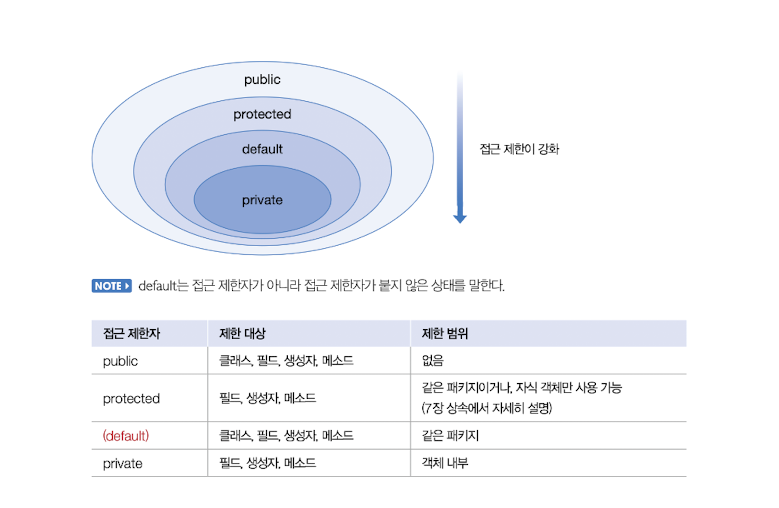

# 클래스
## 객체 지향 프로그래밍
참고 : [java와 객체지향 언어의 특징](https://blog.naver.com/0908f/222260111822)

## 객체와 클래스
참고 : [java의 class 개념이란](https://blog.naver.com/0908f/222256272545)

## 클래스 선언
클래스 이름은 한글이든 영어든 상관없지만, 한글로 작성하는 경우는 거의 없다. 자바 언어는 영어 대소문자를 다른 문자로 취급하기 때문에 클래스 이름도 대소문자를 구분한다. 관례적으로 클래스 이름은 파스칼 케이스를 사용한다.  
일반적으로 소스파일당 하나의 클래스를 선언한다. 두 개 이상의 클래스가 선언된 소스파일을 컴파일하면 바이트 코드 파일은 (.class) 클래스를 선언한 개수만큼 생긴다. 주의할 점은 파일 이름과 동일한 이름의 클래스 선언에만 public 접근 제한자를 붙일 수 있다.

## 객체 생성과 클래스 변수
클래스로부터 객체를 생성하는 방법은 new 연사자를 사용하면 된다. new 연산자는 힙 영역에 객체를 생성시킨 후 객체의 주소를 리턴하도록 되어있다.  
클래스는 라이브러리(API)와 실행 클래스(main 메서드) 두 가지가 있다. 프로그램 전체에서 사용되는 클래스가 100개라면 99개는 라이브러리이고 단 하나가 실행클래스이다. 실행 클래스는 프로그램의 실행 진입점인 main() 메소드를 제공하는 역할을 한다.

## 클래스의 구성 멤버
### 필드
>필드는 객체의 고유 데이터, 부품객체, 상태정보를 저장하는 곳이다. 선언 형태는 변수와 비슷하지만 변수라고 부르지는 않는다. 변수는 생성자와 메서드 내에서만 사용되고 생성자와 메소드가 실행종료되면 자동 소멸된다. 하지만 필드는 생성자와 메소드 전체에서 사용되며 객체가 소멸되지 않는 한 객체와 함께 존재한다.
### 생성자
>new 연산자로 호출되는 특별한 중괄호 블럭이다. 객체 생성 시 초기화를 담당한다. 생성자는 메서드와 비슷하게 생겼지만 클래스 이름으로 되어 있고 리턴 타입이 없다.
### 메소드
>객체의 동작에 해당하는 중괄호 블럭을 말한다. 중괄호 블럭은 이름을 가지고 있는데, 이것이 메서드 이름이다. 메서드를 호출하게 되면 중괄호 블록에 있는 모든 코드들이 일괄적으로 실행된다.

## 필드
### 필드 선언
>필드 선언은 클래스 중괄호 블록 어디서든 존재할 수 있다. 생성자와 메소드 선언의 앞과 뒤 어디서든 필드 선언이 가능하지만, 생성자와 메소드 중괄호 블럭 내부에는 선언될 수 없다.(생성자와 메서드 중괄호 블럭 내에서는 로컬변수가 됨) 보통 클래스 변수, 멤버 변수라는 명칭을 쓰기도 한다.
><u>필드는 초기값을 지정하지 않을 경우 자동으로 기본 초기값을 설정한다.</u>

### 필드 사용
> 필드를 사용한다는 것은 필드값을 읽고, 변경하는 작업을 말한다. 클래스 내부의 생성자나 메소드에서 사용할 경우 단순히 필드이름을 읽고 변경하면 되지만, 클래스 외부에서 사용할 경우 우선적으로 클래스로부터 객체를 생성한 뒤 필드를 사용해야한다. 필드는 객체에 소속된 데이터이므로 객체가 존재하지 않으면 필드도 존재하지 않기 때문이다.

## 생성자
> new 연산자와 같이 사용되어 클래스로부터 객체를 생성할 때 호출되어 객체의 초기화를 담당한다. 만약 생성자가 성공적으로 실행되지 않고 예외가 발생했다면 객체는 생성되지 않는다.

### 기본 생성자
모든 클래스는 반드시 생성자가 존재하며, 하나 이상을 가질 수 있다. 만약 개발자가 클래스 내부에 생성자 선언을 생략했다면 컴파일러는 다음과 같이 중괄호 블럭이 비어있는 기본 생성자를 바이트 코드에 자동으로 추가시킨다.
```java
[접근제어자] 클래스명() {}
```
클래스를 생성한 후, 컴파일된 .class 파일을 디컴파일해보면 확인할 수 있다.
클래스에 명시적으로 선언한 생성자가 한 개라도 있으면, 컴파일러는 기본 생성자를 추가하지 않는다.

### 생성자 선언
생성자가 명시적으로 선언되어 있는 클래스인 경우 반드시 선언된 생성자를 호출해서 객체를 생성해야만 한다.
```java
// Car.java
public class Car {
    Car(String color, int cc) {
        
    }
}

// CarExample.java
public class CarExample {
    public static void main(String[] args) {
        Car myCar = new Car("검정", 3000);
        // Car myCar = new Car(); // x 기본생성자 호출 불가
    }
}
```

[//]: # (#### 필드 초기화)
### 생성자 오버로딩
참고 : [생성자와 생성자 오버로딩](https://blog.naver.com/0908f/222450300948)
### 다른 생성자 호출 
생성자 오버로딩이 많아질 경우 생성자 간의 중복된 코드가 발생할 수 있다. 이 경우 필드 초기화 내용은 한 생성자에게만 집중적으로 작성하고 나머지 생성자는 초기화 내용을 가지고 있는 생성자를 호출하는 방법으로 개선할 수 있다. this()는 자신의 다른 생성자를 호출하는 코드로 생성자의 첫 줄에서만 허용된다.

## 메서드
### 메서드 선언
### 매개 변수의 수를 모를 경우
메소드의 매개변수는 이미 정해져 있는것이 일반적이지만, 경우에 따라서는 메소드를 선언할 때 매개 변수의 개수를 알 수 없는 경우가 있다. 보통 이러한 경우 매개 변수를 배열 타입으로 선언한다.
```java
int sum(int[] values) { }

int[] values = { 1, 2, 3 };
int result = sum(values);
int result = sum(new int[] { 1, 2, 3, 4, 5 });
```
매개 변수를 배열타입으로 메소드를 호출하기 전에 배열을 생성해야 하는 불편한 점이 있다. 이 점을 해결하기위해 `가변인자(variable argument) - JDK 1.5부터 지원`를 이용해 값의 리스트만 넘겨줄 수도 있다.
```java
int sum(int ... values) { }

int result = sum(1, 2, 3);
int result = sum(1, 2, 3, 4, 5);

// ...로 선언된 매개변수는 배열타입이므로 다음과 같이 배열을 직접 매개값으로 사용해도 된다.
int[] values = { 1, 2, 3 };
int result = sum(values);
int result = sum(new int[] { 1, 2, 3, 4, 5 });
```
참고 : [ComputerExample.java](./example/ComputerExample.java)

### 리턴문
메소드 선언에 리턴 타입이 있는 메소드는 반드시 리턴문을 사용해서 리턴값을 지정해야 한다. 만약 return문이 없다면 오류가 발생하고 return문이 실행되면, 메소드는 즉시 종료된다. return문의 리턴값은 리턴 타입이거나, 리턴 타입으로 변환될 수 있어야 한다.  
예를 들어, 리턴 타입이 int인 plus() 메소드에서 byte, short, int 타입의 값이 리턴되어도 상관없다. byte, short는 int로 자동타입변환되어 리턴되기 때문이다.
return 문을 사용할 때 주의할 점은 return문 이후에 실행문이 오면 그 실행문은 실행될 수 없기 때문에 `Unreachable code`라는 컴파일 오류가 발생한다.

### 메소드 호출
### 메소드 오버로딩
참고 : [메소드 오버로딩](https://blog.naver.com/0908f/222308304408)

## 인스턴스 멤버와 this
참고 : [인스턴스 멤버, 클래스 멤버의 접근](https://blog.naver.com/0908f/222486591597)

## 정적멤버와 static
클래스에 고정된 멤버로서 객체를 생성하지 않고 사용할 수 있는 필드와 메소드를 말한다.
### 정적 멤버 선언
정적 필드와 정적 메소드는 클래스에 고정된 멤버이므로 클래스 로더가 클래스(바이트 코드)를 로딩해서 메소드 메모링 영역에 적재할 때 클래스 별로 관리된다. 따라서 클래스의 로딩이 끝나면 바로 사용할 수 있다. 필드를 선언할 때, 인스턴스 필드와 정적필드의 선택기준은 객체마다 가지고 있을 데이터라면 인스턴스, 모든 객체가 동일한 값을 가져야 하는 공용데이터 라면 정적 필드로 둔다.

### 정적 초기화 블록
정적 필드는 필드 선언과 동시에 초기값을 주는것이 보통이다.
```java
static double pi = 3.14159;
```
그러나 계산이 필요한 초기화 작업이 있을 수 있다. 인스턴스 필드는 생성자에서 초기화 하지만, 정적 필드는 객체생성 없이도 사용해야 하므로 생성자에서 초기화 작업을 할 수 없기 때문에 정적 필드를 위한 초기화 작업을 하는 정적 블록을 사용한다. 
정적 블록은 클래스가 메모리로 로딩될 때 자동으로 실행된다. 정적 블록은 클래스 내부에 여러개가 선언되어도 상관없다.
```java
public class Television {
    static String company = "Samsung";
    static String model = "LCD";
    static String info;
    
    static {
        info = company + "-" + model;
    }
}

public class TelevisionExample {
    public static void main(String[] args) {
        System.out.println(Television.info);
    }
}
```

### 정적 메소드와 블록 선언 시 주의할 점
정적 메소드와 정적 블록을 선언할 때 주의할 점은 객체가 없어도 실행된다는 특징 때문에, <u>이들 내부에 인스턴스 필드나 인스턴스 메소드를 사용할 수 없다</u>. 또한 <u>객체 자기자신의 참조인 this도 사용할 수 없다.</u>
```java
// 컴파일 오류 발생 예시
public class ClassName {
    // 인스턴스 필드와 메서드
    int field1;
    void method1() {...}
    
    // 정적 필드와 메서드
    static int field2;
    static void method2() {...};
    
    // 정적 블록
    static {
        field1 = 10;    // x
        method1();      // x
        field2 = 10;
        method2();
    }
    
    // 정적 메소드
    static void Method3 {
        this.field1 = 10;   // x
        this.method1();     // x
        field2 = 10;
        method2();
        
        // 정적 메소드와 정적 블록에서 인스턴스 멤버를 사용하고 싶다면 다음과 같이 객체를 먼저 생성하고 참조변수로 접근해야 한다.
        ClassName obj = new ClasName();
        obj.field1 = 10;
        obj.method1();
    }
}
```
### 싱글톤 패턴
전체 프로그램에서 단 하나의 객체만 만들도록 보장해야 하느 경우 사용하는 디자인 패턴이다. 외부에서 생성자를 통해 객체를 생성할 수 없도록 생성자 앞에 private 접근 제한자를 붙인다.  
```java
singleton variable1 = singleton.getInstance();
singleton variable2 = singleton.getInstance();
```
외부에서 객체를 얻는 유일한 방법은 getInstance() 메소드를 호출하는 방법이다. 위의 변수1과 변수2는 동일한 객체를 참조한다.  

참고 : [싱글톤](https://blog.naver.com/0908f/222499010774)

## final 필드와 상수
final 필드는 초기값이 저장되면 최종값이 되어 프로그램 실행 도중에 수정할 수 없다. final 필드에 초기값을 주는 방법은 필드 선언 시와 생성자에서 주는 방법 두 가지 뿐이다. 또한 초기화되지 않은 final 필드를 남겨두면 컴파일 에러가 발생한다.
### 상수 (static final)
일반적으로 불변의 값(원주율, 지구둘레 등)을 상수라고 한다. final 필드는 객체마다 저장되고 생성자의 매개값을 통해 여러 값을 가질 수 있기 때문에 상수로 사용하지 않는다. 상수는 객체마다 저장할 필요가 없는 공용성을 띄기 때문에 static + final한 성질을 가지고, 클래스에만 포함되며, 상수명은 모두 대문자로 작성하는 것이 관례이다.

## 패키지
> 프로젝트를 진행하다 보면 적게는 수십 개, 많게는 수백 개의 클래스를 작성해야 한다. 클래스를 체계적으로 관리하지 않으면 클래스 간의 관계가 뒤엉켜셔 복잡하고 난해한 프로그램이 되어 결국 유지보수가 어렵게 된다. 자바에서는 클래스를 체계적으로 관리하기 위해 패키지를 사용한다. 우리가 폴더를 만들어 저장 관리 하듯이 패키지를 만들어 클래스를 저장 관리 한다. 패키지의 물리적인 형태는 파일 시스템의 폴더이다.  
> 패키지는 단순히 파일 시스템의 폴더 기능만 하는것이 아니라 클래스의 일부분이다. 패키지는 클래스 이름이 동일하더라도 패키지가 다르면 다른 클래스로 인식한다. 클래스의 전체 이름은 "패키지명 + 클래스명"인데 패키지가 상•하위로 구분이 되어 있다면 도트(.)를 사용해서 다음과 같이 표현한다.
> > 상위패키지.하위패키지.클래스
> 
> 예를 들면, 웹 통신시 주로 사용되는 JSON형식의 문자열을 파싱하는 자바클래스 중 많이 사용되는 것은 Jackson과 Gson 두가지가 있다. 이 두 패키지 모두 JsonParser라는 클래스를 가지지만 각각 com.fasterxml.jackson.coreJsonParser, com.google.gson.JsonParser 로 다른 패키지 체계를 가지는 것을 알 수 있다.

### 패키지 생성
패키지는 클래스를 컴파일하는 과정에서 자동적으로 생성되는 폴더이다. 컴파일러는 클래스에 포함되어 있는 패키지 선언을 보고, 파일 시스템의 폴더로 자동 생성시킨다. 다음은 패키지를 선언하는 방법이다.
> package 상위패키지.하위패키지
> 
> public class ClassName { ... }
> 
패키지 명에도 암묵적인 명명 규칙이 있다.
1. 숫자로 시작해서는 안되고, _, $ 를 제외한 특수문자를 사용해서는 안 된다.
2. java로 시작하는 패키지는 자바 표준 API에서만 사용하므로 사용해서는 안 된다.
3. 모두 소문자로 작성하는 것이 관례이다.

여러 개발 회사가 함께 참여하는 대규모 프로젝트나, 다른 회사의 패키지를 이용해서 개발할 경우, 패키지 이름이 중복될 가능성이 잇다. 그래서 회사들 간에 패키지가 서로 중복되지 않도록 흔히 회사의 도메인 이름으로 패키지를 만든다. 도메인 자체는 등록기관에서 유일한 이름이 되도록 검증되었기 때문에, 도메인 이름으로 패키지를 생성하면 패키지가 중복되는 경우가 발생하지 않는다. 보통 도메인의 역순으로 패키지 이름을 지어준다.
> com.samsung.projectname  
> com.hyndai.projectname

### import
같은 패키지 내에 속하는 클래스들은 아무런 조건없이 다른 클래스들을 사용할 수 있지만, 다른 패키지에 속하는 클래스를 사용하려면 패키지명과 클래스를 모두 기술하거나, 사용하고자 하는 패키지를 import문을 이용해 선언하고 패키지 기술을 생략하는 것이다.
```java
package com.mycompany;

// 1. 패키지와 클래스를 모두 기술
public class Car {
    com.hankook.Tire tire = new com.hankook.Tire();
}
```
이 방법은 불편하지만 서로 다른 패키지에 존재하는 동일한 클래스이름의 클래스 둘 다를 import 하여 사용할 때 필수적이다. 하지만 오픈소스 라이브러리의 동명 클래스는 유사한 기능을 가지는 경우가 많기 때문에 취사 선택하여 사용하는 경우가 많고, 애초에 오픈소스 개발자던, 사내의 시니어 개발자던 보통 중복되는 명칭을 채택하지 않는다.

```java
package com.mycompany;
import com.hankook.Tire;
// 또는 import com.hankook.*;

// 2. import 문을 이용
public class Car {
    Tire tire = new Tire();
}
```
import 문을 이용할 때 주의할 점은 import 문으로 지정된 패키지의 하위 패키지는 import 대상이 아니다. 만약 하위 패키지에 있는 클래스도 사용하고 싶다면 import 문을 하나 더 작성해야 한다.
```java
import com.mycompany.*;
import com.mycompany.project.*;
```

### ClassPath
> JVM이 클래스를 찾는 경로로, JVM은 클래스 패스에 설정된 디렉토리 또는 JAR 파일들 내에서 .class 파일을 찾는다. 각 클래스는 패키지 구조에 따라 특정 디렉토리 구조에 저자오디어야 하고, JVM은 클래스 패스를 기준으로 이 디렉토리 구조를 탐색하여 클래스를 로드한다. 따라서 클래스패스는 패키지의 최상위 디렉토리가 되어야 한다.

## 접근 제한자
  

### 클래스의 접근 제한
클래스를 선언할 때 고려해야 할 사항은 같은 패키지 내에서만 사용할 것인지, 아니면 다른 패키지에서도 사용할 수 있도록 할 것인지를 결정해야한다. 클래스에 적용할 수 있는 접근제한은 public과 default 단 두가지 인데, 다음과 같은 형식으로 작성한다.
```java
// default 접근 제한
class 클래스 { ... }
 
// public 접근 제한
public class 클래스 { ... }
```

### 생성자의 접근제한
### 필드와 메서드의 접근제한

참고 : [접근제한자](https://blog.naver.com/0908f/222300463161)

## Getter와 Setter 메소드
참고 : [Getter와 Setter](https://blog.naver.com/0908f/222619804150)

## 어노테이션
어노테이션은 메타데이터라고도 볼 수 있다. 메타데이터란 컴파일 과정과 실행과정에서 코드를 어떻게 컴파일하고 처리할 것인지를 알려주는 정보이다. 어노테이션은 보통 다음과 같은 세 가지 용도로 사용된다.
1. 컴파일러에게 코드 문법 에러를 체크하도록 정보를 제공
2. 소프트웨어 개발 툴이 빌드나 배치 시 코드를 자동으로 생성할 수 있도록 정보제공 
3. 실행 시(런타임 시) 특정 기능을 실행하도록 정보 제공

1의 대표적인 예는 @Override 어노테이션이다. @Override는 메소드 선언 시 사용하는데, 메소드가 오버라이드 된 것임을 컴파일러에게 알려주어 컴파일러가 오버라이드 검사를 할 수 있도록 해준다. 정확히 오버라이드 되지 않았다면 컴파일러는 에러를 발생시킨다.  
어노테이션은 빌드 시 자동으로 XML 설정 파일을 생성하거나, 배포를 위해 JAR 압축 파일을 생성하는데에도 사용된다. 그리고 실행 시 클래스의 역할을 정의하기도 한다.

### 어노테이션 타입 정의 와 적용
```java
// @interface 를 사용해서 어노테이션을 정의하고, 그 뒤에는 사용할 이름이 온다.
public @interface Annotation { ... }

// 이렇게 정의한 어노테이션은 코드에서 다음과 같이 사용한다.
@Annotation

// 어노테이션은 엘리먼트를 멤버로 가질 수 있다. 각 엘리먼트는 타입과 이름으로 구성되며 디폴트 값을 가질 수 있다.
public @interface AnnotationName {
    타입 elementName() [default 값];
}

/*  엘리먼트의 타입으로는 primitiveType, String, enum, Class 타입과 이들을 element로 갖는 배열 타입을 사용할 수 있다.
    엘리먼트의 이름 뒤에는 메소드를 작성하는 것 처럼 ( )를 붙여야 한다. 
    예를 들어 String 타입의 엘리먼트와 int 타입의 엘리먼트를 다음과 같이 선언할 수 있다.       */
public @interface AnnotationNameEx {
    String elementName1();
    int elementName2() default 5;
}

// 이렇게 정의한 어노테이션을 코드에서 적용할 때에는 다음과 같이 기술한다.
@AnnotationNameEx(elementName1="값", elementName2=3);
@AnnotationNameEx(elementName1="값");

/* elementName1은 디폴트 값이 없기 때문에 반드시 값을 기술해야 하고, elementName2는 디폴트 값이 있기 때문에 생략 가능하다. 
   어노테이션은 기본 엘리먼트인 value를 가질 수 있다. */
public @interface AnnotationNameEx2 {
    String value();
    int elementName() default 5;
}

// value 엘리먼트를 가진 어노테이션을 코드에서 적용할 때에는 다음과 같이 값만 기술할 수 있다. 이 값은 기본 엘리먼트인 value 값으로 설정된다.
@AnnotationNameEx2("값");

// 만약 value 엘리먼트와 다른 엘리먼트를 값을 동시에 주고 싶다면 다음과 같이 지정하면 된다.
@AnnotationName(value="값", elementName=3);
```

### 어노테이션 적용 대상
어노테이션을 적용할 수 있는 댓앙은 java.lang.annotation.ElementType 열거 상수로 다음과 같이 정의되어 있다.

| ElementType 열거상수 | 적용대상             |
|:-----------------|:-----------------|
| TYPE             | 클래스, 인터페이스, 열거타입 |
| ANNOTATION_TYPE  | 어노테이션            |
| FIELD            | 필드               |
| CONSTRUCTOR      | 생성자              |
| METHOD           | 메서드              |
| LOCAL_VARIABLE   | 로컬변수             |
| PACKAGE          | 패키지              |
어노테이션이 적용될 대상을 지정할 때에는 @Target 어노테이션을 사용한다. @Target의 기본 엘리먼트인 value는 ElementType 배열을 값으로 가진다. 이것은 어노테이션이 적용될 대상을 복수개로 지정하기 위해서이다.

```java
import java.lang.annotation.ElementType;

// 예를 들어 다음과 같이 어노테이션을 적용할 경우
@Target({ElementType.TYPE, ElementType.FIELD, ElementType.METHOD})
public @interface AnnotationName{ }

// 다음과 같이 클래스, 필드, 메소드만 어노테이션을 적용할 수 있고, 생성자는 적용할 수 없다.
@AnnotationName
public class ClassName {
    @AnnotationName
    private String fieldName;
    
    // @AnnotationName -> @Target에 CONSTRUCT가 없어 생성자는 적용 못함
    public ClassName() { }
    
    @AnnotationName
    public void methodName() { }
}
```

### 어노테이션 유지 정책
어노테이션 정의 시 사용 용도에 따라 @AnnotationName을 어느 범위까지 유지할 것인지 지정해야 한다. 쉽게 설명하면 소스상에만 유지할 건지, 컴파일된 클래스까지 유지할 건지, 런타임 시에도 유지할 건지를 지정해야한다. 어노테이션 유지 정책은 java.lang.annotation.RetentionPolicy 열거 상수로 다음과 같이 정의되어 있다.

| RetentionPolicy 열거 상수      | 설명                                                                                                |
|:---------------------------|:--------------------------------------------------------------------------------------------------|
| SOURCE                     | 소스상에서만 어노테이션 정보를 유지한다. 소스 코드를 분석할 때만 의미가 있으며, 바이트 코드 파일에는 정보가 남지 않는다.                             |
| CLASS                      | 바이트 코드 파일까지 어노테이션 정보를 유지한다. 하지만 리플렉션을 이용해서 어노테이션 정보를 얻을수는 없다.                                     |
| RUNTIME                    | 바이트 코드 파일까지 어노테이션 정보를 유지하면서 리플렉션을 이용해서 런타임 시에 어노테이션 정보를 얻을 수 있다.                                  |

리플렉션이란 런타임 시에 클래스의 메타정볼르 얻는 기능을 말한다. 예를들어 클래스가 가지고 잇는 필드가 무엇인지, 어떤 생성자를 갖고 있는지, 어떤 메소드를 가지고 있는지, 적용된 어노테이션이 무엇인지 알아내는 것이 리플렉션이다.  
리플렉션을 이용해서 런타임 시에 어노테이션 정보를 얻으려면 어노테이션 유지 정책을 RUNTIME으로 설정해야한다. 어노테이션 유지 정책을 지정할 때에는 @Retention 어노테이션을 사용한다. @Retention의 기본 엘리먼트인 value는 RetentionPolicy 타입이므로 위 세가지 상수 중 하나를 지정하면 된다.  
우리가 작성하는 어노테이션은 대부분 런타임 시점에 사용하기 위한 용도로 만들어진다. 다음은 런타임 유지정책을 적용한 어노테이션이다.

```java
import java.lang.annotation.ElementType;
import java.lang.annotation.Retention;
import java.lang.annotation.RetentionPolicy;

@Target({ElementType.TYPE, ElementType.FIELD, ElementType.METHOD})
@Retention(RetentionPolicy.RUNTIME)
public @interface AnnotationName { }
```

### 런타임 시 어노테이션 정보 사용하기
> 런타임 시에 어노테이션이 적용되었느지 확인하고 엘리먼트 값을 이용해서 특정 작업을 수행하는 방법에 대해 알아보자. 어노테이션 자체는 아무런 동작을 가지지 않는 단지 표식일 뿐이지만, 리플렉션을 이용해서 어노테이션의 적용 여부와 엘리먼트 값을 읽고 적절히 처리할 수 있다.

> 클래스에 적용된 어노테이션 정보를 얻으려면 java.lang.Class를 이용하면 되지만, 필드, 생성자, 메소드에 적용된 어노테이션 정보를 얻으려면 Class의 다음 메소드를 통해서 java.lang.reflect 패키지의 Field, Constructor, Method 타입의 배열을 얻어야 한다.

| 리턴 타입          | 메소드명(매개변수)         | 설명                         |
|:---------------|:-------------------|:---------------------------|
| Field[ ]       | getFields( )       | 필드 정보를 Field 배열로 리턴        |
| Constructor[ ] | getConstructors( ) | 생성자 정보를 Constructor 배열로 리턴 |
| Method[ ]      | getMethod( ) | 메서드 정보를 Method 배열로 리턴      |

> 그런 다음 Class, Field, Constructor, Method가 가지고 있는 다음 메소드를 호출해서 적용된 어노테이션 정보를 얻을 수 있다.

|리턴타입| 메소드명(매개변수)                                                       | 설명                                                                                               |
|:----|:-----------------------------------------------------------------|:-------------------------------------------------------------------------------------------------|
|boolean| isAnnotationPresent(Class<? extends Annotation> annotationClass) | 지정한 어노테이션이 적용되었는지 여부, Class에서 호출했을 때 상위 클래스에 적용된 경우에도 true를 리턴한다.                                |
|Annotation| getAnnotation(Class<T> annotationClass)                          | 지정한 어노테이션이 적용되어 있으면 어노테이션을 리턴하고 그렇지 않다면 null을 리턴한다. Class에서 호출했을 때 상위 클래스에 적용된 경우에도 어노테이션을 리턴한다. |
|Annotation[ ]| getAnnotations( )                                                | 적용된 모든 어노테이션을 리턴한다. Class에서 호출했을 때 상위 클래스에 적용된 어노테이션도 모두 포함한다. 적용된 어노테이션이 없을 경우 길이가 0인 배열을 반환한다. |
|Annotation[ ]| getDeclaredAnnotations( )                                        | 직접 적용된 모든 어노테이션을 리턴한다. Class에서 호출했을 때 상위클래스에 적용된 어노테이션은 포함되지 않는다.                                |

> 어노테이션과 리플렉션을 이용한 간단한 예제를 만들어 보도록 하자. 다음은 각 메소드의 실행내용을 구분선으로 분리해서 콘솔에 출려하도록 하는 PrintAnnotation이다.
```java
import java.lang.annotation.*;

@Target({ElementType.METHOD})
@Retention(RetentionPolicy.RUNTIME)
public @interface PrintAnnotation {
    String value() default "-";
    int number() default 15;
}
```
참고 : [PrintAnnotation.java](./example/annotation/PrintAnnotation.java)

> @Target은 메소드에만 적용하도록 했고, @Retention은 런타임 시까지 어노테이션 정보를 유지하도록 했다. 기본엘리먼트 value는 구분선에 사용될 문자이고, number는 반복출력 횟수이다. 각각 디폴트 값으로 "-"와 15를 주었다. 다음은 PrintAnnotation을 적용한 Service 클래스이다.

```java
public class Service {

    @PrintAnnotation
    public void method1() {
        System.out.println("실행내용 1");
    }

    @PrintAnnotation("*")
    public void method2() {
        System.out.println("실행내용 2");
    }

    @PrintAnnotation(value="#", number=20)
    public void method3() {
        System.out.println();
    }

}
```

참고 : [Service.java](./annotation/Service.java)

> 다음 PrintAnnotationExample 클래스는 리플렉션을 이용해서 Service 클래스에 적용된 어노테이션 정보를 읽고 엘리먼트 값에 따라 출력할 문자와 출력 횟수를 콘솔에 출력한 후, 해당 메소드를 호출한다. method.invoke(new Service())는 Service 객체를 생성하고 생성된 Service 객체의 메소드를 호출하는 코드이다.

```java
import java.lang.reflect.Method;

public class PrintAnnotationExample {
    public static void main(String[] args) {
        //Service 클래스로부터 메서드 정보를 얻음
        Method[] declaredMethods = Service.class.getDeclaredMethods();
        //Method 객체를 하나씩 처리
        for(Method method : declaredMethods) {
            //PrintAnnotation이 적용되었는지 확인
            if (method.isAnnotationPresent((PrintAnnotation.class))) {
                //PrintAnnotation 객체 얻기
                PrintAnnotation printAnnotation = method.getAnnotation(PrintAnnotation.class);

                //메소드 이름 출력
                System.out.println("[" + method.getName() + "]");
                //구분선 출력
                for(int i=0; i< printAnnotation.number(); i++) {
                    System.out.print(printAnnotation.value());
                }
                System.out.println();

                try {
                    //메소드 호출
                    method.invoke(new Service());
                }catch(Exception e){
                    System.out.println();
                }
            }
        }
    }
}
```
참고 : [PrintAnnotationExample.java](./example/annotation/PrintAnnotationExample.java)

## [연습문제 풀이](./ChapterTest.md)