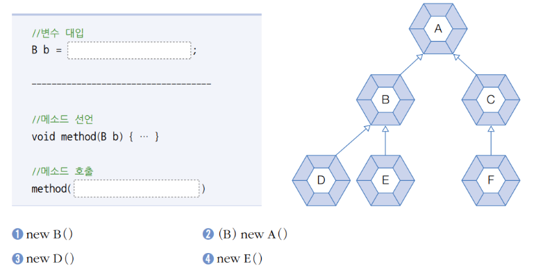

## 확인문제
### 1. 자바의 상속에 대한 설명 중 틀린것은 무엇입니까?
① 자바는 다중 상속을 허용한다.   
② 부모의 메소드를 자식 클래스에서 재정의(오버라이딩)할 수 있다.   
③ 부모의 private 접근 제한을 갖는 필드와 메소드는 상속의 대상이 아니다.  
④ final 클래스는 상속할 수 없고, final 메소드는 오버라이딩 할 수 없다.  

답 : ① 자바는 다중 상속을 허용하지 않는다, ③의 내용과 같이 private 접근 제어자가 붙은 필드와 메소드는 해당 클래스 내에서만 접근이 가능하므로 상속받는 하위클래스는 private 멤버에 접근이 불가능하다.

### 2. 클래스 타입 변환에 대한 설명 중 틀린것은 무엇입니까?
① 자식 객체는 부모 타입으로 자동 타입변환된다.  
② 부모 객체는 항상 자식 타입으로 강제 타입 변환된다.  
③ 자동 타입 변환을 이용해서 필드와 매개변수의 다형성을 구현한다.  
④ 강제 타입 변환 전에 instanceof 연산자로 변환가능한지 검사하는것이 좋다.

답 : ② 자식 타입 객체가 부모 타입 변수에 할당되어 자동형변환이 일어난 경우에만 다시 자식 타입으로 casting 할 수 있다.

### 3. final 키워드에 대한 설명으로 틀린 것은?
① final 클래스는 부모 클래스로 사용할 수 있다.  
② final 필드는 값이 저장된 후에는 변경할 수 없다.  
③ fianl 메소드는 재정의(오버라이딩)할 수 없다.  
④ static final 필드는 상수를 말한다.  

답 : ① final 클래스는 상속이 불가능하므로 부모클래스로 사용할 수 없다.

### 4. 오버라이딩에 대한 설명으로 틀린 것은?
① 부모 메소드의 시그니처(리턴 타입, 메소드명, 매개변수)와 동일해야 한다.  
② 부모 메소드보다 좁은 접근 제한자를 붙일 수 없다.  
③ @Override 어노테이션을 사용하면 재정의가 확실한지 컴파일러가 검증한다.  
④ protected 접근 제한을 갖는 메소드는 다른 패키지의 자식 클래스에서 재정의할 수 없다.  

답 : ④ protected 접근 제한은 패키지와 관계없이 자식 클래스의 멤버라면 재정의할 수 있다.

### 5. Parent 클래스를 상속해서 Child 클래스를 다음과 같이 작성했는데, Child 클래스의 생성자에서 컴파일 에러가 발생했습니다. 그 이유를 설명해보세요.
```java
//Parent.java
public class Parent{
    public String name;
    
    public Parent(String name){
        this.name = name;
    }
}
//Child.java
public class Child extends Parent {
    private int studentNo;
    
    public Child(String name, int studentNo){
        // super(name);         // 부모클래스에 name을 인자로 받는 생성자를 작성하였으므로, 컴파일러에 의한 기본생성자는 생성되지 않는다.
        this.name = name;
        this.studentNo = studentNo;
    }
}
```

### 6. Parent 클래스를 상속받아 Child 클래스를 다음과 같이 작성했습니다. ChildExample 클래스를 실행했을때 호출되는 각 클래스의 생성자의 순서를 생각하면서 출력 결과를 작성해보세요.
```java
//Parent.java
public class Parent {
    public String nation;
    
    public Parent() {
        this("대한민국");
        System.out.println("Parent() call");
    }
    
    public Parent(String nation){
        this.nation = nation;
        System.out.println("Parent(String nation) call");
    }
}

//Child.java
public class Child extends Parent {
    private String name;
    
    public Child() {
        this("홍길동");
        System.out.println("Child() call");
    }
    
    public Child(String name) {
        this.name = name;
        System.out.println("Child(String name) call");
    }
}

//ChildExample.java
public class ChildExample {
    public static void main(String[] args) {
        Child child = new Child();
    }
}
```

답 : 
Parent(String nation) call
Parent() call
Child(String name) call
Child() call

### 7. Tire 클래스를 상속받아 SnowTire 클래스를 다음과 같이 작성했습니다. SnowTireExample 클래스를 실행했을 때 출력결과는 무엇일까요?
```java
//Tire.java
public class Tire {
    public void run() {
        System.out.println("일반 타이어가 굴러갑니다.");
    }
}

//Snowtire.java
public class SnowTire extends Tire{
    @Override
    public void run() {
        System.out.println("스노우 타이어가 굴러갑니다.");
    }
}

//SnowTireExmaple.java
public class SnowTireExample{
    public static void main(String[] args) {
        SnowTire snowTire = new SnowTire();
        Tire tire = snowTire;
        
        snowTire.run();
        tire.run();
    }
}
```

답 :
스노우 타이어가 굴러갑니다.
스노우 타이어가 굴러갑니다.

### 8. 다음 빈칸에 들어올 수 없는 코드는?
  
답 : 2, 클래스의 Casting 은 자식 타입의 자동형변환 결과로 부모타입이 된 경우만 다시 자식타입으로 강제타입변환 가능하다.