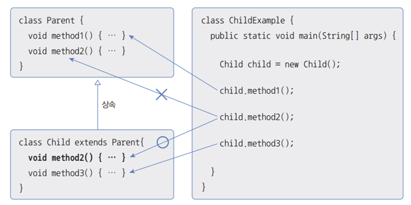

# 상속
## 상속개념
부모클래스의 멤버를 자식크래스에게 물려주는것. 부모클래스를 상위클래스, 자식클래스를 하위 클래스, 파생 클래스라고 부른다. 상속을 해도 부모 클래스의 private 클래스는 상속대상에서 제외된다. 부모 클래스와 자식클래스가 다른 패키지에 존재한다면, default 접근제한을 갖는 필드와 메소드도 상속 대상에서 제외된다.


## 클래스 상속

## 부모 생성자 호출
자바에서 자식객체를 생성하면 부모 객체가 먼저 생성되고 자식객체가 그 다음에 생성된다. 내부적으로 부모객체의 생성자가 자식 객체의 생성자 첫 줄에서 먼저 호출된 후, 자식 생성자가 호출되어 객체가 생성되기 때문에, 부모 클래스에 기본 생성자가 없고 매개변수가 있는 생성자만 있다면 자식생성자에서 부모 생성자 호출을 위해 반드시 super(매개값, ...) 을 명시해야 한다.

참고 : [상속](https://blog.naver.com/0908f/222938354024)

## 메소드 재정의
### @Override
메소드 오버라이딩은 상속된 내용이 자식 클래스에 맞지 않을 경우, 자식 클래스에서 동일한 메소드를 재정의 하는것을 말한다. 메소드가 오버라이딩 되었다면, 부모클래스는 숨겨지기 때문에 자식객체에서 메소드를 호출하면 오버라이딩된 자식메서드가 호출된다. 
@Override 어노테이션은 정확히 오버라이딩 되었는지 체크해준다. 재정의에는 몇 가지 규칙이 있다.
- 부모의 메서드와 동일한 시그니쳐를 가져야 한다.
- 접근 제한 수준을 높일 수 없다.
- 새로운 예외를 throws할 수 없다.

### 부모 메소드 호출(super)
자식 클래스에서 부모 클래스의 메소드를 오버라이딩 하게되면, 부모 클래스의 메소드는 숨겨지고 오버라이딩 된 자식 메서드만 사용된다. 하지만 부모 클래스의 메소드 호출이 필요한 경우 명시적으로 super 키워드를 붙여 부모 클래스의 메서드를 호출할수 있다.


## final 클래스와 final 메소드
클래스와 메소드 선언 시에 final 키워드가 지정되면 상속과 관련이 있다. final 키워드가 붙은 클래스와 메서드는 상속과 재정의가 불가능하다.

## protected 접근 제한자
protected 접근 제한자는 default와 public의 중간에 위치한 접근 제한 수준을 갖는다. 자식클래스이기만 하면 패키지와 관계없이 모두 접근이 가능하지만, 생성자를 직접 호출하는 방식으로 생성할 수는 없고, 상속받은 자식 클래스의 생성자에서 super()를 통해 호출할 수 있다.
```java
// protected 클래스
package package1;

public class A {
    protected String field;
    
    protected A() { }
    
    protected void method() { }
}
```
```java
// 실행 클래스
package package2;

public class C {
    public void method() {
        A a = new A();          // x
        a.field = "value";      // x
        a.method();             // x
    }
}

public class D extends A {
    public D() {
        super();
        this.field = "value";
        this.method();
    }
}
```
## 타입변환과 다형성
자바는 부모클래스로 타입 변환을 허용한다. 즉 부모 타입에 모든 자식 객체가 대입될 수 있다.

### 자동타입변환
자동타입 변환은 프로그램 실행 중 자동적으로 타입 변환이 일어나는 것을 말한다. 자동 타입 변환은 다음과 같은 조건에서 일어난다.  
> 부모클래스 변수 = 자식 클래스 타입;

부모 타입으로 자동 타입 변환된 후에는 부모 클래스에 선언된 필드와 메소드만 접근이 가능하다. 비록 변수는 자식 객체를 참조하지만 변수로 접근 가능한 멤버는 부모 클래스로만 한정된다. 예외적으로 메소드가 자식클래스에서 오버라이딩 되었다면, 자식클래스가 호출된다.

### 하나의 배열로 객체 관리
배열의 타입이 클래스일 경우 실제 저장할 항목이 배열타입의 자식객체라면 모두 저장가능하다.

### 매개변수의 다형성
매개변수의 타입이 클래스일 경우 해당 클래스 객체 뿐만 아니라 자식 객체까지도 매개값으로 사용할 수 있다.

## 강제타입변환
클래스의 강제타입변환은 다형성을 이용하기 위해 위와 같이 부모클래스를 변수나 매개변수로 두고 자식 클래스를 대입한 경우 자동 타입변환이 일어나서 부모타입에 선언된 필드와 메소드만 사용가능하다는 제약사항이 따르는데, 이 때 사용해서 자식타입의 필드와 메소드를 이용한다.

### 객체타입확인(instance of)
원시타입과 마찬가지로 클래스도 강제형변환 하기 전 변환가능한지를 확인해야 할 필요가 있다. 클래스 간의 강제형변환은 상속관계에서 자식 타입이 부모타입으로 자동형변환 되어있는 경우만 가능하기 때문. 연산자의 좌항은 객체가 오고 우항은 클래스가 온다.
```java
public void method(Parent parent) {
    if(parent instanceof Child) {
        Child child = (Child) parent;
    }
}
```

## 추상클래스
### 추상클래스의 개념
객체를 직접 생성할 수 있는 실체클래스와 대조적으로 클래스들의 공통적인 특성을 추출해서 선언한 클래스를 추상클래스라고 한다. 실체 클래스는 추상클래스의 모든 특성을 물려받고 추가적인 특성을 가질 수 있다. 
```java
public abstract class 클래스 {
    //필드
    //생성자
    //메소드
}
```
추상 클래스는 반드시 재정의하여 사용해야할 메서드를 추상메서드로 선언할 수 있다. 추상메서드는 선언부만 있고 실제 실행 코드인 중괄호(구현부)는 없는 메소드를 말한다.  
참고 : [추상클래스의 특성](https://blog.naver.com/0908f/222938411335)