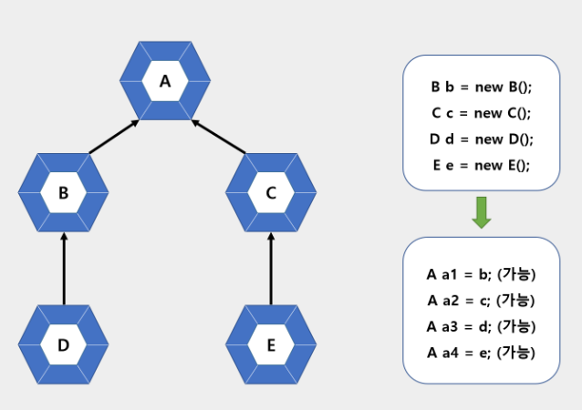

# 인터페이스
## 인터페이스의 역할
    

> 자바에서 인터페이스는 객체의 사용방법을 정의한 타입이다. 자바 8의 람다식은 함수적 인터페이스의 구현 객체를 생성하기 때문에 이전보다 중요성이 더 커졌다. 인터페이스는 개발 코드와 객체가 서로 통신하는 접점 역할을 한다. 개발 코드가 인터페이스의 메소드를 호출하면 인터페이스는 객체의 메소드를 호출시킨다. 그렇기 때문에 개발 코드는 객체의 내부구조를 알 필요가 없고 인터페이스의 메서드만 알고 있으면 된다. 개발 코드를 수정하기 않고 사용하는 객체를 변경하기 위해 인터페이스를 중간에 둔다.

## 인터페이스 선언
인터페이스는 ~.java 형태의 소스파일로 작성되고 컴파일러(javac.exe)를 통해 ~.class 형태로 컴파일되기 때문에 물리적 형태는 클래스와 동일하다. 차이점은 소스를 작성할 때 선언하는 방법이 다르다.  

### 인터페이스 선언
> [public] interface 인터페이스명 {...}

클래스는 필드, 생성자, 메소드를 구성멤버로 가지는데 비해, 인터페이스는 상수와 메소드만을 구성 멤버로 가진다. 자바 7 이전까지는 인터페이스의 메소드는 실행블록이 없는 추상메소드로만 선언이 가능했지만, 자바 8 부터는 디폴트 메소드와 정적 메소드도 선언이 가능하다.

> interface 인터페이스 명 {  
>   // 상수  
>   타입 상수명 = 값;  
> 
>   // 추상 메소드  
>   타입 메소드명(매개변수,...)  
> 
>   // 디폴트 메소드  
>   default 타입 메소드명(매개변수,...) {...}  
> 
>   // 정적 메소드  
>   static 타입 메소드명(매개변수,...) {...}  
> }  

#### 상수필드(Constant Field) => [절대적 - 인터페이스에서 제공해주는 값을 참조만 할 것]
> 인터페이스는 객체사용 설명서이므로 런타임 시 데이터를 저장할 수 있는 필드를 선언할 수 없지만, 상수필드는 선언이 가능하다. 상수는 인터페이스에 고정된 값이므로 데이터를 변경할 수 없고 반드시 초기값을 대입해야 한다.

#### 추상 메소드(Abstract Method) => [강제적 - 가이드만 줄테니 반드시 재정의할 것]
> 추상 메소드는 객체가 가지고 있는 메소를 설명한 것으로 호출할 때 어떤 매개값이 필요하고, 리턴 타입이 무엇인지만 알려준다. 실제 실행부는 구현객체가 가지고 있다.

#### 디폴트 메소드(Default Method) => [선택적 - 인터페이스에서 제공은 하지만 필요시에만 구현할 것]
> 디폴트 메소드는 인터페이스에 선언되지만 사실은 객체가 가지고 있는 인스턴스 메소드라고 생각해야한다. 자바 8에서 디폴트 메소드를 허용한 이유는 기존 인터페이스를 확장해서 새로운 기능을 추가하기 위해서이다.

#### 정적 메소드(Static Method) => [절대적 - 제공해주는것을 사용만 할 것]
> 정적 메소드도 자바 8부터 지원한다. 디폴트 메소드와 달리 객체가 없어도 인터페이스만으로 호출가능하다. 

### 상수 필드 선언
인터페이스는 데이터를 저장할 수 없기 때문에 데이터를 저장할 인스턴스 또는 정적필드를 선언할 수 없고, 상수만을 선언할 수 있다. 상수는 public static final로 선언하는데, 인터페이스 내에서는 public, static, final 키워드를 생략하더라도 컴파일러가 자동으로 붙여준다.
```java
public interface RemoteControl {
    public int MAX_VOLUME = 10;
    public int MIN_VOLUME = 0;
}
```

### 추상 메소드 선언  
  
인터페이스를 통해 호출된 메소드는 최종적을 객체에서 실행된다. 그렇기 때문에 인터페이스의 메소드는 실행 블록이 필요없는 추상메소드로 선언한다. 인터페이스에 선언된 추상 메소드는 모두 public abstract의 특성을 갖기 때문에 생략하더라도 컴파일러가 붙여준다.

```java
public interface RemoteControl {
    // 상수
    public int MAX_VOLUME = 10;
    public int MIN_VOLUME = 0;
    
    // 추상 메소드
    public void turnOn();
    public void turnOff();
    public void setVolume(int volume);
}
```

### 디폴트 메소드 선언
디폴트 메소드는 자바 8에서 추가된 인터페이스의 새로운 멤버이다. 형태는 클래스의 인스턴스 메소드와 동일한다. default 키워드가 리턴타입 앞에 붙는다. 디폴트 메소드는 public 특성을 갖기 때문에 public을 생략하더라도 컴파일 과정에서 자동으로 붙게 된다. (default는 생략 불가능)
> [public] default 리턴타입 메소드명(매개변수,...) {...}

```java
public interface RemoteControl {
    // 상수
    public int MAX_VOLUME = 10;
    public int MIN_VOLUME = 0;

    // 추상 메소드
    public void turnOn();
    public void turnOff();
    public void setVolume(int volume);
    
    // 디폴트 메소드
    default void setMute(boolean mute) {
        if(mute) {
            System.out.println("무음 처리합니다.");
        } else {
            System.out.println("무음 해제합니다.");
        }
    }
}
```

### 정적 메소드 선언
정적 메소드도 디폴트 메소드와 마찬가지로 자바 8 에서 추가된 인터페이스의 새로운 멤버이다. 형태는 클래스의 정적 메소드와 완전 동일하다. 정적 메소드는 public특성을 갖기 때문에 public을 생략하더라도 자동적으로 컴파일 과정에서 붙게 된다. (static은 생략 불가)
> [public] static 리턴타입 메소드명(매개변수,...) {...}

참고 : [RemoteControl.java](./example/interface_declaration/RemoteControl.java)

## 인터페이스 구현
개발 코드가 인터페이스 메소드를 호출하면 인터페이스는 객체의 메소드를 호출한다. 객체는 인터페이스에서 정의된 추상 메소드와 동일한 메소드 이름, 매개 타입, 리턴 타입을 가진 실체 메소드를 가지고 있어야 한다. 이러한 객체를 인터페이스의 구현(implements)객체라 하고, 구현객체를 생성하는 클래스를 구현클래스라고 한다.  

### 구현 클래스
```java
public class 구현클래스 implements 인터페이스명 {
    // 인터페이스에 선언된 추상메소드의 실체 메소드 선언
}
```
구현클래스에서 인터페이스의 추상 메소드들에 대한 실체 메소드를 작성할 때 주의할 점은 인터페이스의 모든 메소드는 기본적으로 public 접근 제한을 갖기 때문에 public 보다 낮은 접근 제한으로 작성할 수 없다. <u>만약 인터페이스에 선언된 추상메소드에 대응하는 실체 메소드를 구현하지 않으면 구현 클래스는 자동적으로 추상 메소드가 되기 때문에 클래스 선언부에 abstract 키워드를 붙여주어야 한다.</u> 구현 클래스가 작성되면 new 연산자로 객체를 생성할 수 있다. 인터페이스로 구현객체를 사용하려면 인터페이스 변수를 선언하고 구현객체를 대입해야 한다.
> 인터페이스 변수;  
> 변수 = 구현객체;  
> 인터페이스 변수 = 구현객체;  

참고 : [Audio.java](./example/interface_implementaion/Audio.java)(구현 클래스), [Television.java](./example/interface_implementaion/Television.java)(구현 클래스), [RemoteControlExample.java](./example/interface_implementaion/RemoteControlExample.java)(인터페이스 사용 클래스)

### 익명 구현 객체
구현 클래스를 만들어 사용하는 것이 일반적이고, 클래스를 재사용 할 수 있지만 일회성의 구현 객체를 만들기 위해 소스파일을 만들고 클래스를 선언하는 것은 비효율적이다. 이러한 경우 익명구현객체라하여 UI 프로그래밍의 이벤트 처리, 혹은 임시 작업 스레드를 만들기 위해 사용하는 객체 생성 방법을 제공한다. 익명 구현객체는 하나의 실행문이므로 반드시 끝에는 세미콜론을 붙여주어야 한다.
> 인터페이스 변수 = new 인터페이스() {  
>   // 인터페이스에 선언된 추상 메소드의 실체 메소드 선언  
> }
```java
public class RemoteControlExample {
    public static void main(String[] args) {
        RemoteControl rc = new RemoteControl() {
            public void turnOn() { /*실행문*/ }
            public void turnOff() { /*실행문*/ }
            public void setVolume() { /*실행문*/ }
        };
    }
}
```
모든 객체는 클래스로부터 만들어지는데 익명구현 객체도 예외는 아니다. `RemoteControlExample.java`를 컴파일하면 자바 컴파일러에 의해 자동으로 `RemoteControlExample$1.class`라는 클래스 파일이 만들어진다. RemoteControlExample 뒤에 $가 붙고 생성 순서에 따라 숫자가 붙는다.  

참고 : [RemoteControlExample.java](./example/interface_implementaion/anonymous_implementaion_object/RemoteControlExample.java)

### 다중 인터페이스 구현 클래스
객체는 다음 그림과 같이 다수의 인터페이스 타입으로 사용할 수 있다.  
  
인터페이스 A와 B가 이 객체의 메소드를 호출할 수 있으려면 객체는 이 두 인터페이스를 모두 구현해야 한다. 따라서 구현 클래스는 다음과 같이 작성되어야 한다.
> public class 구현클래스명 implements 인터페이스A, 인터페이스B {  
> // 인터페이스 A에 선언된 추상 메소드의 실체 메소드 선언  
> // 인터페이스 B에 선언된 추상 메소드의 실체 메소드 선언  
> }  

다중 인터페이스를 구현하는 경우 구현 클래스는 모든 인터페이스의 추상 메소드에 대해 실체 메소드를 작성해야 한다. 만약 구현하지 않은 추상 메서드가 있다면 그 클래스는 추상클래스가 된다.  

참고 : [RemoteControl.java](./example/interface_declaration/RemoteControl.java)(인터페이스), [Searchable.java](./example/interface_implementaion/multi_implementation/Searchable.java)(인터페이스), [SmartTelevision.java](./example/interface_implementaion/multi_implementation/SmartTelevision.java)(두 인터페이스를 구현한 클래스), [RemoteControlExample.java](./example/interface_implementaion/multi_implementation/RemoteControlExample.java)(인터페이스 사용 클래스)

## 인터페이스 사용
구현객체를 인터페이스로 사용하려면 인터페이스 변수를 선언하고 구현객체를 대입해야 한다. 인터페이스 변수는 참조 타입이기 때문에 구현객체의 번지가 저장된다. 상속과 마찬가지로 클래스의 필드, 생성자, 메소드의 매개변수, 생성자 또는 메소드의 로컬변수로 선언될 수 있는데 이 경우 그 인터페이스를 구현한 구현객체또한 대입될 수 있다.

### 추상메소드 사용
구현 객체가 인터페이스 타입에 대입되면 인터페이스에 선언된 추상 메소드를 개발코드에서 호출할 수 있게된다.
```java
RemoteControl rc = new Television();
rc.turnOn();    //Television의 turnOn()실행
rc.turnOff();   //Television의 turnOff()실행
```

### 디폴트메소드 사용
디폴트 메소드는 인터페이스에 선언되지만, 인터페이스에서 바로 사용할 수 없다. 디폴트 메소드는 추상 메소드가 아닌 인스턴스 메소드이므로 구현 객체가 있어야 사용할 수 있다.  

디폴트 메소드는 인터페이스의 모든 구현객체가 가지고 있는 기본 메소드라고 생각하면 된다. 그러나 어떤 구현 객체는 디폴트 메소드의 내용이 맞지 않아 수정이 필요할 수 있는데, 이경우 수정하면 디폴트 메소드가 호출될 때 자신을 재정의한 메소드가 호출된다.

### 정적메소드 사용
정적메소드는 인터페이스로 바로 호출이 가능하다.
```java
public class RemoteControlExample {
    public static void main(String[] args) {
        RemoteControl.changeBattery();
    }
}
```

참고 : [Audio.java](./example/interface_elements_use/Audio.java)(인터페이스 구현 클래스), [Television.java](./example/interface_elements_use/Audio.java)(인터페이스 구현 클래스), [RemoteControlExample.java](./example/interface_elements_use/RemoteControlExample.java)(인터페이스 사용 클래스)

## 타입 변환과 다형성
클래스의 상속관계에서와 유사한 형태로 인터페이스도 다형성을 구현할 수 있다. 프로그램을 개발할 때 인터페이스를 사용해서 메소드를 호출하도록 작성했다면, 구현객체를 교체하는것은 매우 손쉽고 빠르게 할 수 있다. 예를 들자면 클래스 A를 이용한 프로그램이 일부 문제가 있어 클래스 B로 교체하기로 하였다. 하지만 클래스 B는 클래스 A의 메소드명, 변수명 등이 달라서 A클래스의 변수, 메서드가 사용된 곳을 모두 찾아 B클래스의 메소드로 변경해야 한다.  

만약 인터페이스를 사용하였다면 인터페이스를 구현한 B클래스를 만들고 단 한줄만 수정한다면 소스코드는 변함이 없지만 구현객체의 교체로 인해 프로그램의 실행 결과가 달라진다.  
### 자동 타입 변환
  

> 구현 객체가 인터페이스 타입으로 변환되는것은 자동 타입 변환에 해당한다. 인터페이스 구현 클래스를 상속해서 자식 클래스를 만들었다면 자식 객체 역시 인터페이스 타입으로 자동 변환시킬 수 있다.  

### 필드의 다형성  
다형성을 구현한 인터페이스 클래스는 promotion을 이용해 자동차 부품처럼 모듈화 된 소스코드를 교체할 수 있다. 

참고 : [Tire.java](./example/interface_polymorphism/Tire.java)(인터페이스), [HankookTire.java](./example/interface_polymorphism/HankookTire.java)(구현객체), [KumhoTire.java](./example/interface_polymorphism/KumhoTire.java)(구현객체), [Car.java](./example/interface_polymorphism/Car.java)(인터페이스 사용 클래스), [CarExample.java](./example/interface_polymorphism/CarExample.java)(인터페이스 사용 클래스로 만든 인스턴스)

### 매개변수의 다형성
매개변수를 인터페이스 타입으로 선언하고 호출할 때에는 구현객체를 대입한다. Driver 클래스에는 drive() 메소드가 정의되어 있는데 Vehicle 타입의 매개변수가 선언되어 있다. 
```java
public class Driver {
    public void drver(Vehicle vehicle) {
        vehicle.run();
    }
}
```
아래와 같은 Vehicle 인터페이스 타입이 있다고 가정해보자.
```java
public interface Vehicle {
    public void run();
}
```
만약 Bus가 구현 클래스라면 다음과 같이 Driver의 drive() 메소드를 호출할 때 Bus 객체를 생성해서 매개값으로 줄 수 있다. 이처럼 매개변수의 타입이 인터페이스일 경우 어떠한 구현 객체도 매개값으로 사용할 수 있고, 구현 객체에 따라 메소드의 실행결과는 다양해질 수 있다.  

### 강제 타입 변환
구현객체가 인터페이스 타입으로 자동 변환하면, 인터페이스에 선언된 메소드만 사용가능하다는 제약 사항이 따른다. 인터페이스를 구현한 클래스에서도 일반 메서드를 자유롭게 추가할 수 있기 때문에 만약 인터페이스에는 메소드가 3개이고, 구현 클래스에는 메소드가 5개인 경우 인터페이스에 대입한 구현객체는 인터페이스의 메서드 3개 밖에 사용할 수 없다. 하지만 경우에 따라 구현 클래스에 선언된 필드와 메소드를 사용해야 할 경우 Casting을 통해 구현 클래스의 필드와 메소드를 사용할 수 있다.

```java
//Vehicle.java
public interface Vehicle {
    public void run();
}
```
```java
//Bus.java
public class Bus implements Vehicle {
    @Override
    public void run() {
        System.out.println("버스가 달립니다.");
    }
    
    public void checkFare(){
        System.out.println("승차요금을 체크합니다.");
    }
}
```
```java
//VehicleExample.java
public class VehicleExample {
    public static void main(String[] args) {
        Vehicle vehicle = new Bus();
        
        vehicle.run();
        //vehicle.checkFar(); (x) => Vehicle 인터페이스에는 checkFare()가 없음.
    
        Bus bus = (Bus) vehicle;    // Casting
        bus.run();
        bus.checkFare();
    }
}
```

### 객체 타입 확인
강제 타입 변환은 구현객체가 인터페이스 타입으로 변환되어 있는 상태에서 가능하다. 그러나 어떤 구현 객체가 변환되어 있는지 알 수 없는 상태에서 무작정 변환을 할 경우 ClassCastException이 발생할 수도 있다. 상속에서 사용한 instanceof 연산자는 인터페이스에도 사용할 수 있다.  
```java
if(vehicle instanceof Bus) {
    Bus bus = (Bus) vehicle;
}
```

### 인터페이스 상속
인터페이스도 다른 인터페이스를 상속할 수 있다. 클래스와는 달리 다중 상속을 허용한다. 다음과 같이 extends 키워드 뒤에 상속할 인터페이스들을 나열할 수 있다.
> public interface 하위인터페이스 extends 상위인터페이스1, 상위인터페이스2 {...}

## 디폴트 메소드와 인터페이스 확장
### 디폴트 메소드의 필요성
인터페이스에서 디폴트 메소드를 허용한 이유는 기존 인터페이스를 확장해서 새로운 기능을 추가하기 위해서이다. 만약 추상클래스를 이용해 새로운 기능을 추가할 경우, 이전 개발 클래스들도 반드시 구현해야하므로 불편하기 때문.

### 디폴트 메소드가 있는 인터페이스 상속
자식 인터페이스에서 디폴트 메소드를 활용하는 방법은 다음 세 가지가 있다.
- 디폴트 메소드를 단순히 상속만 받는다.
- 디폴트 메소드를 재정의 해서 구현부를 변경한다. 
- 디폴트 메소드를 추상 메소드로 재선언한다.  
=> 재선언 한 인터페이스 클래스를 구현할 경우 해당 default 메소드는 반드시 구현부가 작성되어야 한다.

궁금해서 정리해 둔 관련 글  
참고 : [상속과 합성](https://blog.naver.com/0908f/222953688943)

## 참고
> 인터페이스의 모든 메서드는 기본적으로 명시하지 않아도`public abstract`가 붙으며 모든 필드 또한 별도의 명시 없이도 `public static final` 이 붙는다.

> 인터페이스에는 인스턴스 필드나 생성자 포함이 불가능 하고, java8 부터는 default, static 메소드를 허용하고, java9 부터는 default 메서드 내부에서 private 메서드를 사용할 수 있다.

> 인터페이스를 구성하기 위한 최소 요건은 interface 키워드로 선언되어야 하는 것이며, 내부 멤버는 없어도 유효하다.
## [연습문제 풀이](./ChapterTest.md)