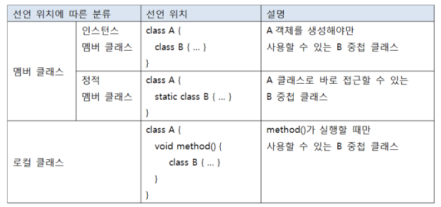
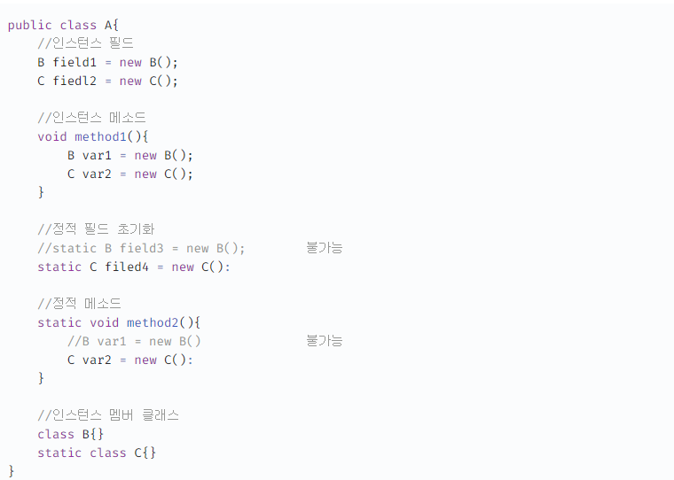
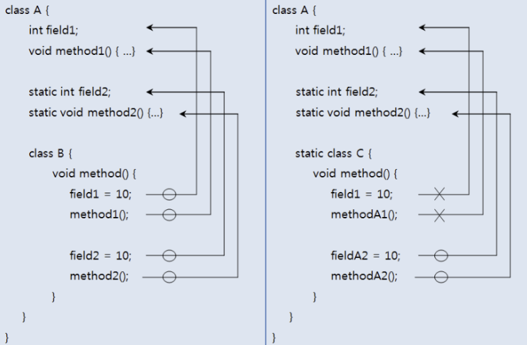
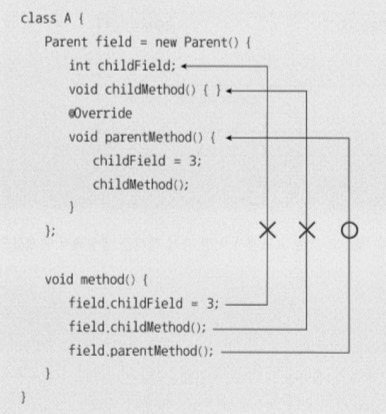

# 중첩 클래스와 중첩 인터페이스
## 중첩 클래스와 중첩 인터페이스란?
어떤 클래스가 특정 클래스와 주로 관계를 맺는 경우 관계 클래스를 내부에 선언하는 것이 서로 쉽게 접근할 수 있는 장점이 있고, 외부에 불필요한 관계클래스를 감출 수 있어 좋다. 중첩 클래스는 주로 UI 프로그래밍에서 이벤트를 처리할 목적으로 많이 만들어진다.

## 중첩 클래스
중첩 클래스는 내부에 선언되는 위치에 따라 두 가지로 분류된다. 클래스의 멤버로서 선언되는 중첩 클래스를 멤버 클래스라 하고, 메소드 내부에서 선언되는 중첩 클래스를 로컬 클래스라고 한다.멤버 클래스는 클래스나 객체가 사용중이라면 언제든지 재사용이 가능하지만, 로컬 클래스는 메소드 실행 시에만 사용되고, 메소드가 실행 종료되면 없어진다.


멤버 클래스도 하나의 클래스이기 때문에 컴파일 하면 바이트 코드 파일(.class)이 별도로 생성된다. 바이트 코드 파일명은 다음과 같이 결정된다.
> A $ B .class

로컬 클래스일 경우에는 다음과 같이 $1이 포함된 바이트 코드 파일이 생성된다. 익명 클래스오 로컬 클래스의 한 종류이므로 이와 같은 방식으로 클래스 파일명이 정해진다.  
> A $1 B .class

### 인스턴스 멤버 클래스
인스턴스 멤버 클래스는 static 키워드 없이 선언된 클래스를 말한다. 인스턴스 멤버 클래스는 인스턴스 필드와 메소드로만 선언이 가능하고 정적 필드와 메소드는 선언할 수 없다.
```java
class A {
    /** 인스턴스 멤버 클래스 **/
    class B {
        B() {}
        int field;
        // static int field2;
        void method1() {}
        // static void method2() {}
    }
}
```
A 클래스 외부에서 인스턴스 멤버 클래스 B의 객체를 생성하려면 먼저 A객체를 생성하고 B 객체를 생성해야 한다.
```java
A a = new A();
A.B b = a.new B();
b.field1 = 3;
b.method1();
```

### 정적 멤버 클래스
정적 멤버와 클래스는 static 키워드로 선언된 클래스를 말한다. 정적 멤버 클래스는 모든 종류의 필드와 메소드를 선언할 수 있다.
```java
class A {
    /** 정적 멤버 클래스 **/
    static class C {
        C() {}
        int field1;
        static int field2;
        void method1() {}
        static void method2() {}
    }
}
```
A 클래스 외부에서 정적 멤버 클래스 C의 객체를 생성하기 위해서는 A객체를 생성할 필요가 없고 다음과 같이 C 객체를 생성하면 된다.
```java
A.C c = new A.C();
c.field1 = 3;
c.method1();
A.C.field2 = 3
A.C.method2();
```

### 로컬 클래스
중첩 클래스는 메소드 내에서도 선언할 수 있다 . 이것을 로컬 클래스라고 한다. <u>로컬클래스는 접근제한자(public, private) 및 static을 붙일 수 없다.</u> (로컬클래스는 메소드 내부에서만 사용되므로 접근을 제한할 필요가 없기때문) 로컬 클래스 내부는 인스턴스 필드와 메서드만 선언이 가능하다.
```java
void method() {
    /** 로컬 클래스 **/
    class D() {
        D() {}
        int field1;
        //static int field2
        void method1() {}
        //static void method2() {}
    }
    D d = new D();
    d.field1 = 3;
    d.method1();
```
로컬 클래스는 메소드가 실행될 때 메소드 내에서 객체를 생성하고 사용해야한다. 주로 비동기처리를 위한 스레드 객체를 만들 때 사용된다.
```java
void method() {
    class DownloadThread extends Thread {...}
    DlownloadThread thread = new DownloadThread();
    thread.start();
}
```

## 중첩 클래스의 접근 제한
### 바깥 필드와 메소드에서 사용 제한
인스턴스 멤버 클래스는 바깥 클래스의 인스턴스 필드의 초기값이나 인스턴스 메소드에서 객체를 생상할 수 있으나, 정적 필드의 초기값이나 정적 메소드에서는 객체를 생성할 수 없다. 반면 정적 멤버 클래스는 모든 필드의 초기값이나 모든 메소드에서 객체를 생성할 수 있다. (정적 멤버의 경우 객체 생성없이도 호출될 수 있기 때문에 대입하는 모든 요소도 static이야 한다.)  

### 멤버 클래스에서 사용 제한
인스턴스 멤버 클래스 안에서는 바깥 클래스의 모든 필드와 모든 메소드에 접근할 수 있지만, 정적 멤버 클래스 안에서는 바깥 클래스의 정적 필드와 메소드에만 접근할 수 있고, 인스턴스 필드와 메소드에는 접근할 수 없다.  
  

### 로컬 클래스에서의 사용제한
> 로컬 클래스 내부에서는 바깥 클래스의 필드나 메소드를 제한없이 사용할 수 있다. 문제는 메소드의 매개변수나 로컬변수를 로컬 클래스에서 사용할 때이다. 로컬 클래스의 객체는 메소드 실행이 끝나도 힙 메모리에 존재해서 계속 사용될 수 있다. 매개변수나 로컬변수는 메소드 실행이 끝나면 스택 메모리에서 사라지기 때문에 로컬객체에서 사용할 경우 문제가 발생한다.
>
> 자바는 이 문제를 해결하기 위해 컴파일 시 로컬 클래스에서 사용하는 메소드의 매개변수, 로컬변수의 값을 로컬 클래스 내부에 복사해두고 사용한다. 그리고 매개변수나 로컬변수가 수정되어 값이 변경되면 로컬 클래스 내부에 복사해둔 값과 달라지는 문제를 해결하기 위해 매개변수나 로컬 변수를 final로 선언해 수정을 막았다. 즉, 로컬 클래스에서 사용가능한 것은 final 로 선언된 매개변수와 로컬변수 뿐이다.
>
> final 키워드 존재 여부의 차이점은 로컬 클래스의 복사 위치이다. final 키워드가 있다면 로컬 클래스의 메소드 내부에 지역변수로 복사되어 그대로 사용할 수 있지만, final 키워드가 없다면 로컬 클래스의 필드로 초기 값만 복사된다.  
>
> 
>```java
> // final이 있는 경우
> public void method() {
>    final int num = 10;  // final 지역 변수
>    class LocalClass {
>        void print() {
>            System.out.println(num); // 지역 변수 그대로 사용
>        }
>    }
> }
>```
>```java
> // final이 없는 경우
> public void method() {
>    int num = 10;  // final이 없음
>    class LocalClass {
>       int copiedNum = num;  // 필드로 복사
>       void print() {
>            System.out.println(copiedNum); 
>        }
>    }
> }
>```
> [특이사항]   
> ✔ Java 7 이전: `final`이 없으면 로컬 클래스의 필드로 복사, `final`이 있으면 메서드 내부 지역 변수로 유지됨.  
> ✔ Java 8 이후:  `effectively final`개념이 생겨 `final`이 없어도 값이 변경되지 않으면 지역 변수로 취급됨.
> 
> effectively final이란?
> > 자바에서 final 키워드가 선언되지 않은 변수지만, 값이 재할당되지 않아 final 과 유사하게 동작하는 것을 effectively final이라고 한다. 이 개념은 자바 8에서 도입되었는데, 익명 클래스(Anonymous Classes) 또는 람다식(Lambda Expressions)이 사용된 코드에서 쉽게 찾아볼 수 있다. 익명 클래스 또는 람다식에서는 참조하는 외부 지역 변수가 final로 선언됐거나 선언된 후 참조가 변경되지 않는 effectively final인 경우에만 접근 가능하다. 예를 들어 아래 예제와 같이 참조하는 지역 변수가 내부에서 변경된다면 “local variables referenced from a lambda expression must be final or effectively final” 오류 메시지와 함께 컴파일 에러가 발생한다.
> ```java
> // Anonymous Classes
> public void someMethod() {
>   int count = 0;
>   Runnable runnable = new Runnable() {
>       @Override
>       public void run() {
>           // "local variables referenced from an inner class
>           // must be final or effectively final"
>           count++;
>       }
>   };
> }
> ```
> 참고 : [Outter.java](nestedClass%2FlocalClass_Access%2FOutter.java)

### 중첩 클래스에서 바깥 클래스 참조 얻기
클래스 내부에서 this는 객체 자신의 참조이다. 중첩 클래스 내부에서 바깥 클래스에 대한 참조를 얻으려면 바깥 클래스의 이름을 this앞에 붙여주면 된다.  

참고 : [Outter.java](nestedClass%2FnestedClass_declarationAndAccess%2FOutter.java)

## 중첩 인터페이스
중첩 인터페이스는 클래스의 멤버로 선언된 인터페이스를 말한다. 인터페이스를 클래스 내부에 선언하는 이유는 해당 클래스와 긴밀한 관계를 맺는 구현 클래스를 만들기 위해서이다. UI프로그래밍에서 이벤트 처리를 목적으로 많이이용된다.  

예를 들어 Button을 클릭했을 때 이벤트를 처리하는 객체를 받고 싶다고 가정해보자, 그렇다고 아무 객체나 받으면 안 되고, Button 내부에 선언된 중첩 인터페이스를 구현한 객체만 받아야 한다면 다음과 같이 Button 클래스를 선언하면 된다.

```java
/* Button.java - Button 클래스를 벗어나서 쓰이지 않는 Button과 밀접한 인터페이스를 만들 때 쓰임 */
public class Button {
    OnClickListener listener;
    
    void setOnClickListener(OnClickListener listener) {
        this.listener = listener;
    }
    
    void touch() {
        listener.onClick();
    }
    
    interface OnClickListener {
        void onClick();
    }
}
```
> Button 클래스 내용을 보면 중첩 인터페이스 (OnClickListener) 타입으로 필드 (listener)를 선언하고 Setter 메소드 (setOnClickListenr())로 구현 객체를 받아 필드에 대입한다. 버튼 이벤트가 발생했을 때 (touch() 메소드가 실행되었을 때) 인터페이스를 통해 구현객체의 메소드를 호출(listener.onClick())한다. 다음은 Button의 중첩 인터페이스인 OnClickListener를 구현한 두 개의 클래스를 보여준다.
```java
/* CallListener.java */
public class CallListener implements Button.OnClickListener {
    @Override
    public void onClick() {
        System.out.println("전화를 겁니다.");
    }
}

/* MessageListener.java */
public class MessageListener implements Button.OnClickListener {
    @Override
    public void onClick() {
        System.out.println("메시지를 보냅니다.");
    }
}
```
> 다음은 버튼을 클릭했을 때 두 가지 방법으로 이벤트를 처리하는 방법을 보여준다. 어떤 구현 객체를 생성해서 객체의 setOnClickListener() 메소드로 세팅하느냐에 따라서 Button의 touch() 메소드의 실행 결과가 달라진다.

```java
import sec09_nested_ClassAndInterface.nestedInterface.MessageListener;

public class ButtonExample {
    public static void main(String[] args) {
        Button btn = new Button();

        btn.SetOnClickListener(new CallListener());
        btn.touch();

        btn.setOnClickListener(new MessageListener());
        btn.touch();
    }
}
```

## 익명 객체
재사용 하지 않는 일회성의 객체가 필요한 경우 사용하는 이름이 없는 객체를 말한다. 익명 객체는 단독으로 사용할 수 없고 클래스를 상속하거나 인터페이스를 구현해야만 생성할 수 있다. 익명 객체는 필드의 초기값이나 로컬변수의 초기값, 매개변수의 매개값으로 주로 대입된다. 이 역시 주로 UI 이벤트 처리 객체나 스레드 객체에 많이 쓰인다.  
### 익명 자식 객체
부모 타입으로 필드나 변수를 선언하고, 자식 객체를 초기값으로 대입하는 경우 보통 아래와 같이 작성한다.
```java
class Child extends Parent {...}

class A {
    Parent field = new Child();
    void method() {
        Parent localVar = new Child();
    }
}
```
그러나 자식 클래스가 재사용되지 않고, 오로지 해당 필드와 변수의 초기값으로만 사용할 경우라면 익명 자식 객체를 생성해서 초기값으로 대입하는것이 좋은 방법이다.
```java
class A {
    Parent field = new Parent() {
        int childField;
        void childMethod() { }
        @Override
        void parentMethod() { }
    };
}
```
부모 클래스의 생성자를 호출하고 중괄호 내부에는 필드나 메소드를 선언하거나 부모 클래스의 메소드를 Override한다. <u>일반 클래스와의 차이점은 생성자를 선언할 수 없다는 것이다.</u> 위 코드는 필드를 선언할 때 초기값으로 익명 자식 객체를 생성해서 대입한다.

```java
class A {
    Parent localVar = new Parents(){
      int childField;
      void childMethod() { }
      @Override
        void parentMethod() { }
    };
}
```
위 코드는 메소드 내에서 로컬 변수를 선언할 때 초기값으로 익명 자식 객체를 생성해서 대입한다.

>   
> 익명 자식 객체에 새롭게 정의된 필드와 메소드는 익명 자식 객체 내부에서만 사용하고, 외부에서는 필드와 메서드에 접근할 수 없다. 왜냐하면 익명 자식 객체는 부모타입 변수에 대입되므로 부모타입에 선언된 것만 사용할 수 있기 때문이다.    

### 익명 구현 객체 생성
인터페이스 타입으로 필드나 변수를 선언하고, 구현 객체를 초기값으로 대입하는 경우, new 연산자를 이용해 구현객체 생성 후 필드나 로컬 변수에 대입한다.  
```java
class TV implements RemoteControl { }

class A {
    RemoteControl field = new TV();
    void method() {
        RemoteControl localVar = new TV();
    }
}
```
마찬 가지로 구현 클래스가 재사용되지 않고, 오로지 해당 필드와 변수의 초기값으로만 사용하는 경우에도 익명 구현객체를 이용한다. 인터페이스의 구현객체는 선언된 추상메서드를 모두 반드시 구현해주어야 한다.

```java
/* 인터페이스 */
public interface RemoteControl {
    public void turnOn();

    public void turnOff();
}

/* 익명 구현 클래스와 객체 생성 */
public class Anonymous {
    /* 필드 초기값으로 대입 */
    RemoteControl field = new RemoteControl() {
        @Override
        public void turnOn() {
            System.out.println("TV를 켭니다.");
        }

        @Override
        public void turnOff() {
            System.out.println("TV를 끕니다.");
        }
    };

    void method1() {
        /* 로컬 변수값으로 대입 */
        RemoteControl localVar = new RemoteControl() {
            @Override
            public void turnOn() {
                System.out.println("Audio를 켭니다.");
            }

            @Override
            public void turnOff() {
                System.out.println("Audio를 끕니다.");
            }
        };
        /* 로컬 변수 사용 */
        localVar.turnOn();
    }
    
    void method2(RemoteControl rc) {
        rc.turnOn();
    }
}

/* 실행 클래스 */
public class AnonymousExample {
    public static void main(String[] args) {
        Anontymous anony = new Anonymous();
        
        /* 익명 객체 필드 사용 */ 
        anony.field.turnOn();
        
        /* 익명 객체 로컬 필드 사용 */
        anony.method1();
        
        /* 익명 객체 매개값 사용 */
        anony.method2(
                new RemoteControl() {
                    @Override
                    public void turnOn() {
                        System.out.println("SmartTV를 켭니다.");
                    }
                    
                    @Override
                    public void turnOn() {
                        System.out.println("SmartTV를 끕니다.");
                    }
                }
        )
    }
}
```

> 내부 클래스 중 로컬 클래스의 매개변수나 로컬변수가 final의 성질을 갖는것과 마찬가지로 익명 구현객체도 로컬변수를 사용시 final의 특성을 갖는다.

## [연습문제 풀이](./ChapterTest.md)