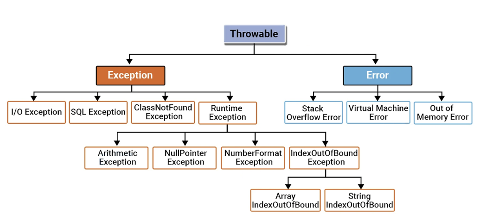
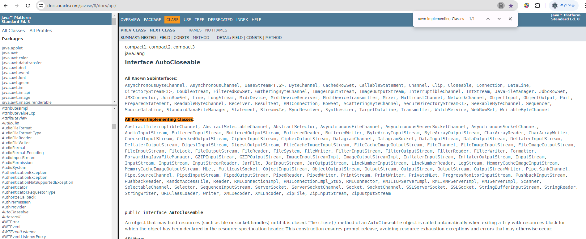

# 예외 처리
## 예외와 예외 클래스
> 컴퓨터 하드웨어의 오동작 또는 고장으로 인해 응용 프로그램 실행 오류가 발생하는 것을 자바에서는 에러라고 한다. 에러는 JVM 실행에 문제가 생겼다는 것이므로 JVM 위에서 실행되는 프로그램을 아무리 견고하게 만들어도 결국 실행 불능이 된다.  

> 자바에서는 에러 이외에 예외라고 부르는 오류가 있다. 예외란 사용자의 잘못된 조작 또는 개발자의 잘못된 코딩으로 인해 발생하는 프로그램 오류를 뜻한다. 예외가 발생되면 프로그램은 곧바로 종료되는점은 동일하지만, 예외처리를 통해 정상 실행상태를 유지하도록 할 수 있다.



예외는 일반 예외와 실행 예외 두 가지 종류가 있다. 일반 예외는 컴파일러 체크 예외라고도 하는데, 컴파일 하는 과정에서 예외처리가 필요한 코드인지, 그에 대한 예외처리가 되어있는지를 확인한다. 그러나 실행 예외는 컴파일 타임에는 확인되지 않고, 런타임에 발생하는 예외를 말한다.
```java
public class NullPointerExample {
    public static void main(String[] args) {
        String str = null;
        System.out.println(str.length()); // null 객체에 메서드를 호출하면 NullPointerException 발생
    }
}
```
위 코드에서 String 타입 변수 str의 입력을 만약 외부에서 받도록 작성되어 있다면, 컴파일 시점에는 아직 예외가 발생하지 않지만, 이후 프로그램이 실행되는중에 사용자가 null값을 입력한다면 런타임에 NPE가 발생하는것.

예외 처리 최상위 클래스는 Throwable으로, 모든 Error와 Exception의 부모 클래스이다. Throwable 클래스와 이 클래스를 상속받은 서브 클래스만이 JVM이나 throw 키워드에 의해 던져질 수 있다.
또한, 일반 예외는 Exception을 상속받고, 실행예외는 RuntimeException를 상속 받는다.  

자바는 이런 예외들을 클래스로 관리하며, JVM은 실행도중에 예외가 발생하면 해당 예외 클래스로 객체를 생성한다. 그 후 예외 처리 부분에서 객체를 이용할 수 있도록 넘겨준다.

## 실행 예외
실행 예외는 컴파일러가 체크하지 않기 때문에 개발자의 경험에 의해 예외처리 코드를 작성해야 한다. 그러나 요새는 IDE가 워낙 좋아져서 경고해주기도 한다.
### NullPointerException
가장 빈번하게 발생하는 실행 예외는 java.lang.NullPointerException로 객체 참조가 없는상태의 참조변수로 도트연산자를 사용했을 때 발생한다.
```java
public class NullPointerExceptionExample {
    public static void main(String[] args) {
        String data = null;
        System.out.println(data.toString());
    }
}
```

### ArrayIndexOutOfBoundsException
배열에서 인덱스 범위를 초과하여 사용할 경우 java.lang.ArrayIndexOutOfBoundsException 이 발생한다.
```java
public class ArrayIndexOutOfBoundsExceptionExample {
    public static void main(String[] args) {
        String data1 = args[0];
        String data2 = args[1];

        System.out.println("args[0]: " + data1);
        System.out.println("Args[1]: " + data2);
    }
}
```
main 메서드에 두 개의 인자를 주지 않았기 때문에 args는 빈 배열이고 길이는 0이므로 인덱스로 접근할 수 없다.

### NumberFormatException
종종 문자열로 되어 있는 데이터를 숫자로 변경하는 경우가 자주 발생한다. 문자열을 숫자로 변환하는 방법은 여러가지가 있지만, 보통 아래와 같은 방법을 주로 사용한다.

|반환 타입|메소드명(매개변수)|설명|
|:---|:---|:---|
|int|Integer.parseInt(String s)|주어진 문자열을 정수로 변환해서 리턴|
|double|Double.parseDouble(String s)|주어진 문자열을 실수로 변환해서 리턴|
이 메소드들은 매개값인 문자열이 숫자로 변환가능하면 숫자를 리턴하지만, 숫자로 변환될 수 없는 문자가 포함되어 있다면, java.lang.NumberFormatException을 발생시킨다.

```java
public class NumberFormatExceptionExample {
    public static void main(String[] args) {
        String data1 = "100";   // 변환가능
        String data2 = "a100";  // 변환 불가능
        
        int value1 = Integer.parseInt(data1);
        int value2 = Integer.parseInt(data2);
        
        int result value1 + value2;
        System.out.println(data1 + "+" + data2 + "=" + result);
    }
}
```

### ClassCastException
타입 변환은 상위클래스와 하위클래스 간 혹은 구현클래스와 인터페이스 간에 발생한다. 이러한 관계가 아닌데, 억지로 변환을 시도할 경우 java.lang.ClassCastException이 발생한다. ClassCastException을 발생시키지 않으려면 instanceof 연산자로 변환이 가능한지 우선 확인하는것이 좋다.  
```java
public class ClassCastExceptionExample {
    public static void main(String[] args) {
        Dog dog = new Dog();
        changeDog(dog);
        
        Cat cat = new Cat();
        changeDog(cat);
    }
    
    public static void changeDog(Animal animal) {
        //if(animal instanceof Dog) {
        Dog dog = (Dog) animal;     // 예외 발생
        //}
    }
}

class Animal {}
class Dog extends Animal {}
class Cat extends Animal {}
```

## 예외 처리 코드

## 예외 종류에 따른 처리 코드
### 다중 catch
try 블록 내부는 다양한 종류의 예외가 발생할 수 있다. 발생되는 예외별로 처리를 다르게 하려면 다중 catch 블록을 작성하면 된다. try 블록에서 예외가 하나라도 발생하면 즉시 실행을 멈추고 해당 catch 블록으로 이동하기 때문에 catch 블록이 여러개라고 할지라도 단 하나의 catch 블록만 실행된다.

### catch 순서
다중 catch 블록을 작성할 때 주의할 점은 상위 예외 클래스가 하위 예외 클래스보다 아래쪽에 위치해야 한다. 예외 클래스 간에도 상속관계가 있어서, 하위 예외 클래스는 상위 예외 클래스의 catch 블록으로 처리되어 버리기 때문이다.

### 멀티 catch
자바 7부터 하나의 catch 블록에서 여러개의 예외를 처리할 수 있도록 멀티 catch 기능을 추가했다. catch 괄호()안에 동일하게 처리하고 싶은 예외를 | 로 연결하면 된다.
```java
try {
// 실행
}catch (ArrayIndexOutOfBoundsException | NumberFormatException e) {
// 예외처리 1  
}catch (Exception e) {
// 예외처리 2
}
```

## 자동 리소스 닫기
자바 7에서 새로 추가된 try-with-resources를 사용하면 예외 발생 여부와 상관없이 사용했던 리소스 객체*각종 입출력 스트림, 서버 소켓, 소켓, 각종 채널)의 close()메소드를 호출해서 안전하게 리소스를 닫아준다.
다음은 자바6 이전까지 사용해왔던 안전한 리소스 종료를 위한 코드이다.
```java
FileInputStream fis = null;
try {
    fis = new FileInputStream("file.txt");
    ...    
} catch ( IOExceptione ) {
    ...
} finally {
    if(fis != null) {
        fis.close();        
    } catch (IOException e) { }
}
```
finally 블록에서 다시 try-catch를 상요해서 close() 메소드를 예외 처리해야 하므로 다소 복잡하게 보인다. 자바 7에서 추가된 try-with-resources를 사용하면 아래와 같이 간단해진다.

```java
import sec10_exception.TryWithResource.FileInputStream;

import java.io.IOException;

    try(FileInputStream fis = new FileInputStream("file.txt")){
        ...
        }catch(IOException) {
        ...
        }
```
try블록이 정상적으로 실행을 완료했거나 도중에 예외가 발생하게 되면 자동으로 FileInputStream의 close() 메소드가 호출된다. try에서 예외가 발생하면 우선 close()로 닫고 catch 블록을 실행한다. try-with-resource 를 사용하기 위해 리소스 객체는 java.lang.AutoCloseable 인터페이스를 구현하고 있어야 한다.
  
API document에서 AutoCloseable 인터페이스를 찾아 All Known Implementing Classes를 보면 try-with-resource와 함께 사용할 수 있는 리소스가 어떤 것이 있는지 알 수 있다.

```java
// 구현 클래스
public class FileInputStream implements AutoCloseable {
    private String file;
    
    public FileInputStream(String file) {
        this.file = file;
    }
    
    public void read() {
        System.out.println(file + "을 읽습니다.");
    }
    
    @Override
    public void close() throws Exception {
        System.out.println(file + "을 닫습니다.");
    }
}

// 실행 클래스
public class TryWithResourceExample {
    public static void main(String[] args) {
        try(FileInputStream fis = new FileInputStream("file.txt")) {
            fis.read();
            throw new Exception();
        } catch(Exception e) {
            System.out.println("예외처리 코드가 실행되었습니다.");
        }
    }
}
```

## 예외 떠넘기기
경우에 따라 예외를 처리하지 않고, 메소드를 호출한 곳으로 예외처리를 넘길 수 있는데, 이 때 사용하는 키워드가 throws이다. 이 키워드는 메소드 선언부 끝에 작성되어 메소드에서 처리하지 않은 예외를 호출한 곳으로 떠넘기는 역할을 한다. throws가 붙은 메소드는 반드시 try 블록 내에서 호출되어야 한다.
```java
public void method1() {
    try {
        method2();
    } catch(ClassNotFoundException e) {
        System.out.println("클래스가 존재하지 않습니다.");
    } catch(NullPointerException e) {
        System.out.println("Null값을 참조하고 있습니다.");
    }
}

public void method2() throws ClassNotFoundException, NullPointerException {   // 호출한 곳에서 예외처리
    Class clazz = Class.forName("java.lang.String2");
}
```

## 사용자 정의 예외와 예외 발생
은행 업무를 처리하는 프로그램에서 잔고 부족과 같은 애플리케이션 서비스와 관련된 예외를 애플리케이션 예외라고 한다. 애플리케이션 예외는 개발자가 직접 정의해서 만들어야 한다.

### 사용자 정의 예외 클래스 선언
사용자 정의 예외 클래스는 일반예외 혹은 실행예외 중 하나로 선언할 수 있다. 일반 예외인 경우 Exception을, 실행예외인 경우 RuntimeException을 상속하면 된다. 생성자는 보통 기본생성자와 예외 메세지를 전달하기 위한 String 타입 매개변수를 갖는 생성자 두개를 선언한다.
```java
public class BalanceInsufficientException extends Exception {
    public BalanceInsufficientException() {}
    public BalanceInsufficientException(String message) {
        super(message);
    }
}
```

### 예외 발생시키기
코드에서 예외를 발생시키는 방법은 아래와 같다. 예외 발생 코드를 가지고 있는 메소드는 내부에서 try-catch 블록으로 예외처리를 할 수 있지만, 대부분은 자신을 호출한 곳에서 예외를 처리하도록 throws 키워드로 예외를 떠넘긴다.
```java
throw new ClassCastException();
Throw new Exception();
```

다음은 잔고가 부족한 경우 BalanceInsufficientException을 발생 시키는 예제이다.

```java
import sec10_exception.CustomException.BalanceInsufficientException;

public class Account {
    private long balance;

    public Accout() {
    }

    public long getBalance() {
        return balance;
    }

    public void deposit(int money) {
        balance += money;
    }

    public void withdraw(int money) throws BalanceInsufficientException {
        if(balance < money ) {
            throw new BalanceInsufficientException("잔고부족:"+(money-balace)+"모자람");   // 예외 발생시키면, 메소드는 예외를 호출한 곳으로 throws한다.
        }
        balace -= money;
    }
}
```

## 예외 정보 얻기
try 블록에서 예외가 발생되면 예외 객체는 catch 블록의 매개변수에서 참조하게 되므로 매개변수를 이용하면 예외 객체의 정보를 알 수 있다. 모든 예외 객체는 Exception 클래스를 상속하기 때문에 Exception이 가지고 있는 메소드들은 모든 예외 객체에서 호출할 수 있다. 그 중에서도 getMessage(예외객체가 가지고 있는 Message 얻기)와 printStackTrace(예외의 발생 경로를 추적)가 많이 사용된다. 예외를 발생시킬 때 String 타입의 메세지를 갖는 생성자를 이용하였다면, 메세지는 자동적으로 객체 내부에 저장된다.
