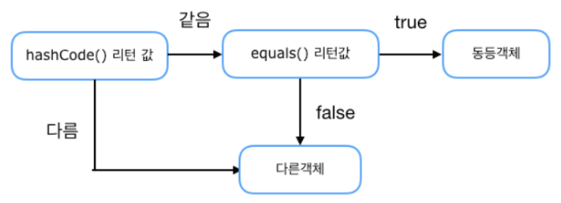

## 확인문제
### 1. Object 클래스에 대한 설명 중 틀린것은 무엇입니까?
① 모든 자바 클래스의 최상위 부모 클래스이다.  
② Object의 equals() 메소드는 == 연산자와 동일하게 번지르 비교한다.  
③ Object의 clone() 메소드는 얕은 복사를 한다.   
④ Object의 toString() 메소드는 객체의 필드값을 문자열로 리턴한다.  

답 : ④ Object의 재정의되지 않은 기본 toString()은 `[클래스 이름]@[16진수 해시코드]`이다.

### 2. 작성한 클래스를 동등비교하는 컬렉션 객체인 HashSet, HashMap, Hashtable을 사용하려고 한다. Object의 equals()와 hashCode() 메소드를 오버라이딩 햇다고 가정할 경우, 메소드 호출순서를 생각해 다음 괄호를 채우시오.

답 : hashCoe(), equals()순으로 동등검사를 한다. 둘다 같아야 논리적으로 동등한 객체로 평가한다.

### 3. Student 클래스를 작성하되, Object의 equals()와 hashCode()를 오버라이딩 해서 Student의 학번(StudentNum)이 같으면 동등객체가 될 수 있도록 작성하라.
```java
// Student.java
public class Student {
    private String studentNum;
    
    public Student(String studentNum) {
        this.studentNum = studentNum;
    }
    
    public String getStudentNum() {
        return studentNum;
    }
    
    // 아래로 답안작성
    @Override
    public boolean equals(Object obj) {
        if(obj instanceof Student) {
            Student student = (Student)obj;
            if(studentNum.equals(student.studentNum)) {
                return true;
            }
        }
        return false;
    }
    
    @Override
    public int hashCode() {
        return studentNum.hashCode();
    }
}
```
```java
public class StudentExample {
    public static void main(String[] args) {
        // Student 키로 총점을 저장하는 HashMap 객체 생성
        HashMap<Student, String> hashMap = new HashMap<Student, String>();
        
        //new Student("1")의 점수 95를 저장
        hashMap.put(new Student("1"), "95");
        
        //new Student("1")로 점수를 읽어옴
        String core = hashMap.get(new Student("1"));
        System.out.println("1번 학생의 총점: " + score);
    }
}
```
### 4. Member 클래스를 작성하되, Object의 toString() 메소드를 오버라이딩 해서 MemberExmaple 클래스의 실행결과 처럼 나오도록 작성하라. 
```java
//Member.java
public class Member {
    private String id;
    private String name;
    
    public Member(String id, String name) {
        this.id = id;
        this.name = name;
    }

    @Override
    public String toString() {
        return "Member{id='" + id + "', name='" + name + "'}";
    }
    
}
```
```java
//MemberExample.java
public class MemberExample {
    public static void main(String[] args) {
        Member member = new Member("blue", "이파란");
        System.out.println(member);
    }
}
```

### 5. class 객체에 대한 설명 중 틀린것은 무엇입니까?
① Class.forName() 메소드 또는 객체의 getClass() 메소드로 얻을 수 있다.  
② 클래스의 생성자, 필드, 메소드에 대한 정보를 알아낼 수 있다.  
③ newInstance() 메소드는 기본 생성자를 이용해서 객체를 생성시킨다.  
④ newInstance()의 리턴 타입은 생성된 객체의 클래스 타입이다.

답 : ④ 리턴 타입은 Object 타입.

### 6. 주어진 바이트 배열을 문자열로 변환시켜보시오.
> { 73, 32, 108, 111, 118, 101, 32, 121, 111, 117 }
```java
public class BytesToStringExample {
    public static void main(String[] args) {
        byte[] bytes = { 73, 32, 108, 111, 118, 101, 32, 121, 111, 117 };
        String str = new String(bytes);
        System.out.println(str);
    }
}
```
### 7. 다음 문자열에서 "자바" 문자열이 포함되어 있는지 확인하고, "자바"를 Java로 대치한 새로운 문자열을 만들어보세요. 
> "모든 프로그램은 자바 언어로 개발될 수 있다."
```java
// FindAndReplaceExample.java
public class FindAndReplaceExample {
    public static void main(String[] args) {
        String str = "모든 프로그램은 자바 언어로 개발될 수 있다.";
        int index = str.indexOf("자바");
        if(index == -1) {
            System.out.println("자바 문자열이 포함되어 있지 않습니다.");
        } else {
            System.out.println("자바 문자열이 포함되어 있습니다.");
            str = str.replace("자바", "Java");
            System.out.println("->" + str);
        }
    }
}
```

### 8. 다음 문자열에서 쉼표(,)로 구분되어 있는 문자열을 String의 split()메소드 또는 StringTokenizer를 이용해서 분리해보세요.
> 아이디, 이름, 패스워드

```java
import java.util.StringTokenizer;

// SplitExample.java
public class SplitExample {
    public static void main(String[] args) {
        String str = "아이디, 이름, 패스워드";

        // split 메서드 이용
        System.out.println(Arrays.toString(str.split("[,]")));

        // StringTokenizer 이용
        StringTokenizer token = new StringTokenizer(str, ",");
        while(token.hasMoreTokens()) {
            String tokens = token.nextToken();
            System.out.println(tokens);
        }
    }
}
```

### 9. StringBuilder를 활용해 더 효율적으로 만들어 보시오.
```java
public class StringBuilderExample {
    public static void main(String[] args) {
        String str = "";
        for(int i=1; i<=100; i++) {
            str += i;
        }
        System.out.println(str);
        
        // 답안 작성
        StringBuilder sb = new StringBuilder();
        for(int i=1; i<=100; i++) {
            sb.append(i);
        }
        System.out.println(sb.toString());
    }
}
```

### 10. 첫 번째는 알파벳으로 시작하고 두 번째 부터 숫자와 알파벳으로 구성된 8~12자 사이의 ID값인지 검사하고 싶다. 정규표현식을 이용해 검증하는 코드를 작성하라.
```java
public class PatternMatcherExample {
    public static void main(String[] args) {
        String id = "5Anger1004";
        String regExp = "[a-zA-Z]\w{7,11}";
        boolean isMatch = Pattern.matches(regExp, id);
        
        if(isMatch) {
            System.out.println("ID로 사용할 수 있습니다.");
        } else {
            System.out.println("ID로 사용할 수 없습니다.");
        }
    }
}
```

### 11. 숫자 100과 300으로 각각 박싱된 Integer 객체를 == 연산자로 비교했더니 100을 박싱한 Integer 객체는 true가 나오는데, 300을 박생한 Integer 객체는 false가 나오는 이유를 설명하시오.
```java
public class IntegerCompareExample {
    public static void main(String[] args) {
        Integer obj1 = 100;
        Integer obj2 = 100;
        Integer obj3 = 300;
        Integer obj4 = 300;
        System.out.println(obj1 == obj2);
        System.out.println(obj3 == obj4);
    }
}
```

답 : int 타입 포장 값 비교시 -128~127 범위안에 있는 경우에만 언박싱 없이 ==, != 연산자로 값을 바로 비교할 수 있다. 

### 12. 문자열 "200"을 정수로 변환하는 코드와 숫자 150을 문자열로 변환하는 코드를 작성하시오.
```java
public class StringConvertExample {
    public static void main(String[] args) {
        Strign strData1 = "200";
        int intData1 = Integer.parseInt(strData1);
        int intData2 = 150;
        String strData2 = String.valueOf(intData2);
    }
}
```

### 13. SimpleDateFormat 클래스를 이용해서 오늘의 날짜를 다음과 같이 출력하는 코드를 작성해보시오.
> 2024년 05월 08일 화요일 10시 30분

```java
import java.text.SimpleDateFormat;

public class DatePrintExample {
    public static void main(String[] args) {
        Date now = new Date();

        // 답안 작성
        SimpleDateFormat sdf = new SimpleDateFormat("yyyy년 MM월 dd일 E요일 HH시 mm분");
        String strDate = sdf.format(now);

        System.out.println(strDate);
    }
}
```