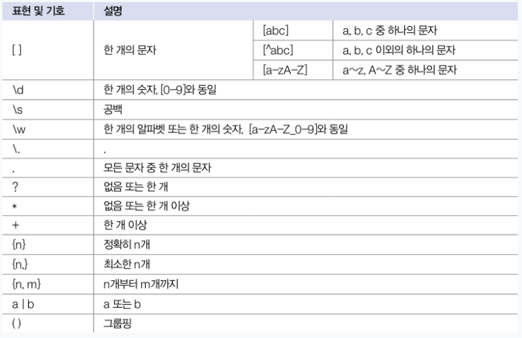

# 기본 API 클래스
## 자바 API 도큐먼트
참고 : [javaDOC](./https://docs.oracle.com/javase/8/docs/api/)
## java.lang과 java.util 패키지
### java.lang 패키지
>java.lang 패키지는 문자열 처리, 수학 연산, 스레드 처리 ,예외 처리, 기본 자료형 클래스와 같은 자바 프로그램의 기본적인 클래스를 담고 있는 패키지이다. 그러므로 import 없이 사용할 수 있다. 아래 나열된 클래스 외에도 Exception, Error, Enum, Throwable 같은 클래스도 속해있다.


### java.util 패키지
> 컬렉션 프레임워크, 날짜 및 시간 클래스, 랜덤 및 난수 생성과 관련한 중요한 유틸리티 클래스들을 제공하며 데이터 구조와 관련된 많은 기능을 제공한다.

### Object 클래스
> 클래스를 선언할 때 extends 키워드로 다른 클래스를 상속하지 않으면 암시적으로 java.lang.Object 클래스를 상속하게 된다. 따라서 자바의 모든 클래스들은 Object 클래스의 자식이거나 자손 클래스이다.

#### 객체 비교(equals())
> public boolean equals(Object obj) { ... }

equals() 메소드의 매개 타입은 Object인데, 이것은 모든 객체가 매개값으로 대입될 수 있음을 말한다. equals는 == 과는 달리 논리적 동등성을 비교한다. String 객체의 equals() 메서드가 객체 내 문자열이 동일한지 비교하는 것도 Object 클래스의 equals()메소드를 문자열 비교로 재정의하였기 때문이다. 

```java
public class Member {
    public String id;
    public Member(String id) {
        this.id = id;
    }
    
    @Override
    public boolean equals(Object obj) {
        if(obj instanceof Member) {
            Member member = (Member) obj;
            if(id.equals(member.id)) {
                return true;
            }
        }
        return false;
    }
}
```

#### 객체 해시코드 (hashCode())
객체 해시코드란 객체를 식별할 하나의 정수값을 말한다. Object의 hashCode() 메소드는 객체의 메모리 번지를 이용해서 해시코드를 만들어 리턴하기 때문에 객체마다 다른 값을 가지고 있다. hash기반 컬렉션에서 논리적 동등 비교 시 hashCode()를 오버라이딩 할 필요성이 있는데, 컬렉션 프레임워크 중 HashSet, HashMap, Hashtable은 hashCode()를 실행해서 리턴된 결과값을 비교한 후, 같으면 equals()로 다시 비교한다. 둘다 같아야만(true) 동등객체로 판단한다.


```java
public class Key {
    public int number;
    
    public Key (int number) {
        this.number = number;
    }
    
    @Override
    public boolean equals(Object obj) {
        if(obj instanceof Key) {
            Key compareKey = (Key) obj;
            if(this.number == compareKey.number) {
                return true;
            }
        }
        return false;
    }
    
    /* 해시코드 재정의 */
//    @Override
//    public int hashCode() {
//        return number;
//    }
}
```
> Key 클래스는 equals() 메소드를 재정의해서 number 필드값이 같으면 true를 리턴하도록 했다. 그러나 hashCode() 메소드는 재정의하지 않았기 때문에 Object의 hashCode() 메서드가 사용된다.  

> 이런 경우 HashMap의 식별키로 Key 객체를 사용하면 저장된 값을 찾아오지 못한다. 왜냐하면 number 필드값이 같더라도 hashCode() 메소드에서 리턴하는 해시코드가 다르기 때문에 다른 식별키로 인식하기 때문이다. 

```java
public class KeyExample {
    public static void main(String[] args) {
        // Key 객체를 식별자로 사용해서 String 값을 저장하는 HashMap 객체 생성
        HashMap<Key, String> hashMap = new HashMap<Key,String>();
        
        // 식별키 new Key(1) 로 홍길동을 저장함
        hashMap.put(new Key(1), "홍길동");
        
        // 식별키로 홍길동을 읽어옴
        String value = hashMap.get(new Key(1));
        System.out.println(value);  // null
    }
}
```
> hash 기반의 컬렉션은 hashCode() 값을 비교하기 때문에 멤버변수 number로 1을 가지는 Key 객체에 대한 값을 조회하려한다. 하지만 값을 읽어올 때랑 삽입할 때 new 연산자로 객체를 새로생성하므로 해시코드값도 당연히 다르고 해시 컬렉션은 이 두 객체를 다른 객체로 간주한다. hashCode()값이 달라도 equals()가 true라면 같은 객체로 판단하도록 하고싶다면 hashCode()를 재정의 해야한다.

```java
public class Member {
    public String id;
    
    public Member(String id){ 
        this.id = id;
    }
    
    @Override
    public boolean equals(Object obj){
        if(obj instanceof Member) {
            Member member = (Member) obj;
            if(id.equals(member.id)){
                return true;
            }
        }
        return false;
    }
    
    @Override
    public int hashCode() {     //  원래는 객체 메모리 번지의 hashCode()값을 비교하지만 재정의하여 String의 hashCode()값을
        return id.hashCode();   //  비교한다. String.hashCode()는 문자열이 동일한 경우 같은 해시코드를 리턴한다.
                                        
                                    
    }
}
```

#### 객체 문자 정보(toString())
```java
Object obj = new Object());
System.out.println(obj.toString()); //  java.lang.Object@de6ced
```
Object 클래스의 toString() 메소드는 객체의 문자정보를 리턴한다. Getter(), Setter()와 함께 ide가 자동생성을 제공하는 경우가 많다. 기본적으로 Object 클래스의 toString() 메소드는 "클래스명@16진수해시코드"로 구성된 문자정보를 리턴한다.

```java
public class ToStringExample {
    public static void main(String[] args) {
        Object obj1 = new Object();
        Date obj2 = new Date();

        System.out.println(obj1.toString());    // java.lang.Object@1b15692
        System.out.println(obj2.toString());    // Wed Nov 13 09:33:96 KST 2013
    }
}
```
> Object의 toString() 메서드의 리턴값은 자바 애플리케이션에서는 별 값어치가 없는 정보이므로 Object 하위 클래스는 toString() 메서드를 재정의하여 유익한 정보를 제공한다. Date클래스의 toString()은 현재 시스템의 날짜와 시간정보를 리턴한다.

#### 객체복제(clone())
객체 복제는 원본 객체의 필드값과 동일한 값을 가지는 새로운 객체를 새로 생성하는 것으로, 원본 객체를 안전하게 보호하기 위해 작업 시 복사한 객체를 이용하기 위해 사용한다.

얕은복제(thin clone)
> 얕은복제란 단순히 필드값을 복사해서 객체를 복제하는것을 말한다. 필드가 기본타입일 경우 값 복사가 일어나고, 참조타입일 경우 객체의 번지가 복사된다.(즉 참조타입은 원본과 동일한 객체를 참조한다.) 


이 메소드로 객체를 복제하려면 원본객체는 반드시 java.lang.Cloneable 인터페이스를 구현하고 있어야 한다. 메소드 선언이 없음에도 불구하고 이 인터페이스를 구현하는 이유는 클래슷 설계자가 복제를 허용한다는 의도적인 표시를 하기 위해서이다. 이 인터페이스를 구현하지 않았다면 clone() 메서드를 호출할 때 CloneNotSurpportedException 예외가 발생하여 복제가 실패된다.

```java
public class Member implements Cloneable {
    public String id;
    public String name;
    public String password;
    public String age;
    public String adult;
    
    public Member(String id, String name, String password, String age, String adult) {
        this.id = id;
        this.name = name;
        this.password = password;
        this.age = age;
        this.adult = adult;
    }
    
    public Member getMember() {
        Member cloned = null;
        try{
            cloned = (Member) clone(); // 재정의 없이 바로 사용
        } catch(CloneNotSupportedException e) { }
        return cloned;
    }
}
```

#### 깊은복제(deep clone)
얕은 복제의 경우 원본객체에서 참조타입 필드의 번지만 복사하기 때문에 복제객체의 참조타입 필드가 변경된다면 원본 객체도 변경이 되는 단점이 있다. 깊은 복제를 이용하면 참조하고 있는 객체도 복제할 수 있다.


>깊은 복제를 하려면 Object의 clone() 메소드를 재정의해서 참조 객체를 복제하는 코드를 직접 작성해야 한다.

```java
public class Member implements Cloneable {
    public String name;
    public int age;
    public int[] scores;
    public Car car;
    
    public Member(String name, int age, int[] scores, Car car) {
        this.name = name;
        this.age = age;
        this.scores = score;
        this.car = car;
    }
    
    @Override
    protected Object clone() throws CloneNotSupportedException {
        Member cloned = (Member) super.clone();     // shallow copy를 해서 name, age를 복제한다.
        cloned.scores = Arrays.copyOf(this.scores, this.scores.length); // scores 복제
        cloned.car = new Car(this.car.model);
        
        return cloned;
    }
}

public Member getMember() {
    Member cloned = null;
    try {
        cloned = (Member) clone();
    } catch (CloneNotSupportedException e) {
        e.printStackTrace();
    }
    return cloned;
}

public class Car {
    public String model;
    
    public Car(String model){
        this.model = model;
    }
}
```

> Array.copyOf(원본배열, 복사할 길이)  
> System.arraycopy를 Wrapping한 메서드. 내부적으로 새로운 배열을 생성하고, System.arraycopy를 사용해 데이터를 분석한다.

#### 객체 소멸자
참조하지 않는 배열이나 객체는 쓰레기 수집기가 힙 영역에서 자동으로 소멸시킨다. 쓰레기 수집기는 객체를 소멸하기 전에 마지막으로 객체의 소멸자(finalize())를 실행시킨다. 소멸자는 기본적으로 실행내용이 없지만, 만약 객체가 소멸되기 전에 마지막으로 사용했던 자원을 닫고 싶거나 중요한 데이터를 저장하고 싶다면 재정의 할 수 있다.
```java
public class Counter {
    private int no;
    
    public Counter (int no) {
        this.no = no;
    }
    @Override
    protected void finalize() throws Throwable {
        System.out.println(no+"번 객체의 finalize()가 실행됨");
    }
}
```
```java
public class FinalizeExample {
    public static void main(String[] args) {
        Counter counter = null;
        for(int i=0; i<=500; i++) {
            counter = new Counter(i);
            counter = null;
            System.gc();
        }
    }
}
```
> 한두개의 객체를 쓰레기로 만들었다고 해서 바로 쓰레기 수집기가 실행되는것은 아니기 때문에 반복해서 객체를 생성하고 쓰레기로 만들고, 반복할 때마다 System.gc()를 호출해서 쓰레기 수집기의 빠른 실행을 요청한다.   

> 실행 결과를 보면 GC는 순서대로 소멸시키지 않고, 무작위로 소멸시키며, 전부 소멸시키는것이 아닌 메모리의 상태를 보고 일부만 소멸시킨다. 일반적으로는 메모리가 부족하고 CPU가 한가할 때 JVM에 의해서 자동 실행되기때문에, 자원해제나 데이터의 최종저장은 소멸자가 아닌 일반 메소드에 작성하는것이 좋다.

> 현재 finalize()는 java9 이후로 deprecated 상태이다. 주된 이유는 아래와 같다.  
> 
> - 예측 불가능성: finalize() 메서드가 언제 호출될지 알 수 없기 때문에 자원 해제가 지연될수 있습니다.
> - 성능 저하: 가비지 컬렉터가 객체를 수집할 때 finalize() 메서드를 호출하는 것은 추가 작업을 발생시켜 성능을 저하시킬 수 있습니다.  
> - 보안 문제: finalize() 메서드는 보안 상의 취약점을 유발할 수 있습니다.

효율적인 대안 존재: Java 9 이후부터는 Cleaner 클래스가 더 나은 자원 해제 방법으로 제안되고 있습니다.

### Objects 클래스
Object와 유사한 이름을 가진 java.util.Objects 클래스는 객제비교, 해시코드생성, null 여부, 객체 문자열 리턴 등의 연산을 수행하는 static 메소드들로 구성된 Object의 유틸리티 클래스이다. s가 붙은 유틸리티 클래스는 일반적으로 객체 생성없이 사용할 수 있도록 만들어 놓은 클래스이다.  


#### 객체비교(compare(T a, T b, Comparator<T> c))
Objects.compare(T a, T b, Comparator<T> c) 메소드는 두 객체를 비교자로 비교해서 int값을 리턴한다. java.util.Comparator<T>는 제네릭 인터페이스 타입으로 두 객체를 비교하는 compare<T a, T b> 메소드가 정의되어 있다. compare 메소드의 리턴타입은 int인데, a가b보다 작으면 음수, 크면 양수를 리턴하도록 구현 클래스를 만들어야 한다.
```java
class StudentComparator implements Comparator<Student> {
    @Override
    public int compare(Student a, Student b) {
        if(a.sno<b.sno) return -1;
        else if(a.sno == b.sno) return 0;
        else return;
    }
}
```
> 다음 예제는 세 개의 학생 객체를 StudentComparator로 비교해서 결과를 리턴한다.

```java
import java.util.Comparator;

public class CompareExample {
    public static void main(String[] args) {
        Student s1 = new Student(1);
        Student s2 = new Student(1);
        Student s3 = new Student(2);

        int result = Objects.compare(s1, s2, new StudentComparator());
        System.out.println(result);
        result = Objects.compare(s1, s2, new StudentComparator());
        System.out.println(result);

        static class Student {
            int sno;

            Student(int sno) {
                this.sno = sno;
            }
        }

        static class StudentComparator implements Comparator<Student> {
            @Override
            public int compares(Student o1, Student o2) {
                return Integer.compare(o1.sno, o2.sno);
            }
        }
    }
}
```

#### 동등 비교(equals()와 deepEquals())
> Objects.equals(Object a, Object b)는 두 객체의 동등을 비교하는데, 다음과 같은 결과를 리턴한다. 특이한 점은 a와 b모두 null인 경우 true를 리턴한다는 것이다.  
> Objects.deepEquals(Object a, Object b)역시 두 객체의 동등을 비교하는데, a와 b가 서로 다른 배열일 경우, 항목값이 모두 같다면 true를 리턴한다.

#### 해시코드 생성
Objects.hash(Object... values) 메소드는 매개값으로 주어진 값들을 이용해서 해시 코드를 생성하는 역할을 하는데, 주어진 매개값들로 배열을 생성하고 Array.hashCode(Object[])를 호출해서 해시코드를 얻고 이 값을 리턴한다. hashCode() 메서드와 달리 hash()는 클래스가 여러 필드를 가지고 있을 때 이 필드를 인자로 주어 해시를 생성하게 되면 동일한 필드값을 가지는 객체가 동일한 해시코드를 가지도록 할 수 있다.  

> 
> @Override  
> public int hashCode() {  
>   return Objects.hash(field1, field2, field3);  
> }  

Objects.hashCode(Object o)는 매개값으로 주어진 객체의 해시코드를 리턴하기 때문에 Object.hashCode()의 리턴값과 동일하다. 아래 참고의 예제는 학생번호와 학생이름을 매개값으로 해서 Objects.hash()메소드를 호출했다. 이 두 필드가 동일하다면 같은 해시코드를 얻을 수 있다.  

참고 : [HashCodeExample.java](./objectsClass/hashcode/HashCodeExample.java)

#### 널 여부 조사
Objects.inNull(Object obj)는 매개값이 null일 경우 true를 리턴한다. 반대로 nonNull(Object)는 매개값이 not null일 경우 true를 리턴한다. requireNonNull()는 다음 세 가지로 오버로딩 되어 있다.

|리턴 타입|메소드(매개변수)|설명|
|:---|:---|:---|
|T|requireNonNull(T obj)|not null -> obj, null -> NullPointerException|
|T|requireNonNull(T obj, String message)|not null -> obj, null -> NullPointerException(message)|
|T|requireNonNull(T obj, Supplier<String> msgSupplier)|not null -> obj, null -> NullPointerException(msgSupplier.get())|

첫번쨰 매개값이 not null이면 첫번째 매개값을 리턴하고, NullPointerException을 발생 시킨다.

```java
import java.util.Objects;

public class NullExample {
    public static void main(String[] args) {
        String str1 = "홍길동";
        String str2 = null;

        System.out.println(Objects.requireNonNull(str1));
        
        try {
            String name = Objects.requireNonNull(str2);
        } catch (Exception e) {
            System.out.println(e.getMessage());
        }
        
        try { 
            String name = Objects.requireNonNull(str2, "이름이 없습니다.");
        } catch (Exception e) {
            System.out.println(e.getMessage());
        }
        
        try {
            String name = Objects.requireNonNull(str2, ()->"이름이 없다니깐요");
        } catch (Exception e) {
            System.out.println(e.getMessage());
        }
    }
}
```
Supplier<T>는 자바의 함수형 인터페이스 중 하나로, 인자를 받지 않고 결과를 반환하는 함수형 인터페이스이다.
> Supplier<String> messageSupplier = () -> "Custom error message: value cannot be null";

#### 객체 문자 정보 (toString())
Objects.toString()은 객체의 문자 정보를 리턴하는데 다음 두 가지로 오버로딩 되어있다.

|리턴 타입|메소드(매개변수)|설명|
|:---|:---|:---|
|String|toString(Object o)|not null -> o.toString(), null -> "null"|
|String|toString(Object o), String nullDefault)|not null -> o.toString(), null -> nullDefault|

첫번째 매개값이 not null이면 toString()으로 얻은 값을 리턴하고, null이면 "null" 또는 두 번째 매개값인 nullDefault를 리턴한다.  
```java
public class ToStringExample {
    public static void main(String[] args) {
        String str1 = "홍길동";
        String str2 = null;

        System.out.println(Objects.toString(str1));
        System.out.println(Objects.toString(str2));
        System.out.println(Objects.toSTring(str2, "이름이 없습니다."));
    }
}
```
### System 클래스
> 자바 프로그램은 JVM위에서 실행되기에 운영체제의 모든 기능을 자바 코드로 직접 접근하기는 어렵다. 하지만 java.lang 패키지의 System 클래스를 이용하면 운영체제의 일부 기능(프로그램 종료, 키보드로부터 입력, 모니터로 출력, 메모리 정리, 현재 시간 읽기, 시스템 프로퍼티 읽기, 환경 변수 읽기 등)을 이용할 수 있다. System 클래스의 모든 필드와 메소드는 정적 필드와 정적 메소드로 구성되어 있다.

#### 프로그램 종료(exit())
System.exit()은 경우에 따라 강제로 JVM을 종료시켜야할 때 호출한다. exit()은 현재 실행중인 프로세스를 강제 종료시키는데 종료 상태값이라는 int타입 매개값을 넘겨준다. 정상 종료는 0 비정상 종료인 경우 0이외의 값을 준다.

> System.exit(0);

어떤값을 주더라도 종료가 되는데, 만약 특정값이 입력되었을 경우만 종료하고 싶다면 SecurityManager를 설정해서 종료상태값을 확인하면 된다. System.exit()가 실행되면 보안 관리자의 checkExit() 메소드가 자동 호출되는데, 이 메서드에서 종료 상태값을 조사해서 특정값이 입력되지 않으면 SecurityException을 발생시켜 System.exit()을 호출한 곳에서 예외처리를 할 수 있도록 해준다.
```java
public class ExitExample {
    public static void main(String[] args) {
        System.setSecurityManager(new SecurityManager() {
            @Override
            public void checkExit(int status) {
                if(status != 5) throw new SecurityException();
            }
        });
        
        for(int i=; i<10; i++) {
            System.out.println(i);
            try {
                System.exit(i);
            } catch (SecurityException e) { }
        }
    }
}
```
> 현재 java 17 이후로는 SecurityManager가 deprecated 상태로 더이상 지원하지 않는다. 오랫동안 사용되지 않았고, 효과적으로 사용하기 어려운데다, 최근의 보안 관행상 자바보다는 프레임워크 혹은 네트워크, 서비스에서 권한기반 접근제어 및 인증, 암호화 등을 하기때문

#### 쓰레기 수집기 실행(gc())
> 자바는 개발자가 메모리를 직접 관리하지 않고, JVM이 알아서 관리한다. JVM은 메모리가 부족하거나, CPU가 한가할 때 GC를 실행시켜 사용하지 않는객체(보통 참조가 없는)를 자동 제거한다. 쓰레기 수집기는 개발자가 직접 실행할 수는 없고 System.gc()가 호출되면 JVM은 빠른시간내에 gc를 실행시키기 위해 노력한다.

> 쓰레기가 생길 때마다 쓰레기 수집기가 동작한다면, 정작 수행되어야 할 프로그램의 속도가 떨어지기 때문에 성능측면에서 좋지않다. 다음은 GC가 객체를 삭제하는지 확인하기 위해 소멸자를 이용하였다. GC는 객체를 삭제하기 전에 마지막으로 객체의 소멸자를 실행한다.

```java
public class GcExample {
    public static void main(String[] args) {
        Employee emp;

        emp = new Employee(1);
        emp = null;
        emp = new Employee(2);
        emp = new Employee(3);

        System.out.print("emp가 최종적으로 참조하는 사원번호 : ");
        System.out.println(emp.no);
        system.gc();
    }
}

class Employee {
    public int eno;
    
    public Employee(int eno) {
        this.eno = eno;
        System.out.println("Employee(" + eno + ") 가 메모리에 생성됨");
    }
    
    public void finalize() {
        System.out.println("Employee(" + eno + ") 이 메모리에서 제거됨");
    }
}
```

#### 현재 시각 읽기(currentTimeMillis(), nanoTime())
> System 클래스의 currentTimeMillis() 메소드와 nanoTime() 메소드는 컴퓨터의 시계로부터 현재 시간을 읽어서 밀리세컨드(1/1000초) 단위와 나노 세컨드(1/10^9) 단위의 long 값을 리턴한다.

다음 예제는 for문을 사용해서 1부터 1000000까지의 합을 구하는데 걸린 시간을 출력한다.
```java
public class SystemTimeExample {
    public static void main(String[] args) {
        long time1 = SYstem.nanoTiem();
        
        int sum = 0;
        for(int i=1; i<=1000000; i++) {
            sum += i;
        }
        
        long time2 = System.nanoTime();

        System.out.println("1~1000000까지의 합: " + sum);
        System.out.println("계산에 " + (time2-time1) + " 나노초가 소요되었습니다.");
    }
}
```

#### 시스템 프로퍼티 읽기(getProperty())
><u>시스템 프로퍼티(System Property)는 JVM이 시작할 때 자동 설정되는 시스템의 속성값</u>을 말한다. 운영체제의 종류, 자바 프로그램을 실행시킨 사용자 id, JVM의 버전등이 여기에 속한다.


> 시스템 프로퍼티를 읽어오기 위해서는 System.getProperty() 메소드를 이용하면 된다. 이 메소드는 시스템 프로퍼티의 키 이름을 매개값으로 받고 해당 키에대한 값을 문자열로 리턴한다.

> 다음 예제에서는 운영체제 이름, 사용자 이름, 사용자 홈 디렉토리를 알아내고 출력한다.

```java
public class GetPropertyExample {
    public static void main(String[] args) {
        String osName = System.getProperty("os.name");
        String userName = System.getProperty("user.name");
        String userHome = System.getProperty("user.home");

        System.out.println("운영체제 이름 : " + osName);
        System.out.println("사용자 이름 : " + userName);
        System.out.println("사용자 홈 디렉토리 : " + userHome);

        System.out.println("--------------------------");
        System.out.println(" [ key ] value");
        System.out.println("--------------------------");
        
        Properties props = System.getProperties();      // 모든 키,값 쌍을 가진 Properties 객체를 리턴
        Set Keys = props.keySet();                      // 키만으로 구성된 set 객체를 얻음
        for(Object objkey : keys) {
            String key = (String) objkey;
            String value = (String) objkey.getProperty(key);
            System.out.println("[ " + key + " ] " + value);
        }
    }
}
```

#### 환경변수 읽기
> 대부분의 운영체제는 실행되는 프로그램들에게 유용한 정보를 주기위한 환경변수를 제공한다. 자바 프로그램에서는 환경 변수의 값이 필요할 때 System.getenv() 메소드를 사용한다. 매개값으로 환경변수 이름을 주면 값을 리턴한다.

```java
public class SystemEnvExample {
    public static void main(String[] args) {
        String javaHome = System.getenv("JAVA_HOME");
        System.out.println("JAVA_HOME:"+javaHome);
    }
}
```

### Class 클래스
자바는 클래스와 인터페이스의 메타 데이터(클래스의 이름, 생성자 정보, 필드 정보, 메소드 정보)를 java.lang.Class 클래스로 관리한다. 

#### Class 객체 얻기(getClass(), forName())
프로그램에서 Class 객체를 얻기 위해서는 Object 클래스가 가지고 있는 getClass() 메소드를 이용하면 된다. 
> Class clazz = obj.getClass();

getClass()는 해당 클래스로 객체를 생성했을 때만 사용할 수 있는데, 객체를 생성하기 전에 직접 Class 객체를 얻을 수 있다. Class는 생성자를 감추고 있기 때문에 new 연산자로 객체를 얻을 수 없고, 정적 메소드인 forName()을 이용해야 한다. forName() 메소드는 클래스 전체 이름(패키지가 포함된 이름)을 매개값으로 받고 Class 객체를 리턴한다.  
```java
public class ClassExample {
    public static void main(String[] args) {
        Car car = new Car();
        Class clazz1 = car.getClass();
        
        System.out.println(clazz1.getName());               // 패키지를 포함한 클래스 명
        System.out.println(clazz1.getSimpleName());         // 패키지명을 제외한 클래스 명
        System.out.println(clazz1.getPackage());            // 현재 클래스가 속한 패키지 객체 반환
        System.out.println(clazz1.getPackage().getName());  // 패키지 명
        System.out.println();
        
        try {
            Class clazz2 = Class.forName("sec06.exam01_class.Car");
            System.out.println(clazz2.getName());
            System.out.println(clazz2.getSimpleName());
            System.out.println(clazz2.getPackage().getName());
        } catch (ClassNotFoundException e) {
            e.printStackTrace();
        }
        
    }
}
```
> Class.forName() 메소드는 매개값으로 주어진 클래스를 찾지 못하면 ClassNotFoundException을 발생시키기 때문에 예외처리가 필요하다.


#### 리플렉션(getDeclaredConstructors(), getDeclaredFields(), getDeclaredMethods())
Class 객체를 이용하면 클래스의 생성자, 필드, 메소드 정보를 알아낼 수 있다. 이것을 리플렉션이라고 한다. Class 객체는 reflection을 위해 getDeclaredConstructors(), getDeclaredFields(), getDeclaredMethods()를 제공한다.  
> Constructor[] constructors = clazz.getDeclaredConstructors();  
> Field[] fields = clazz.getDeclaredFields();  
> Method[] methods = clazz.getDeclaredMethods();  

> 메소드 이름에서 알 수 있듯이 세 메소드는 각각 생성자 배열, 필드 배열, 메소드 배열을 반환한다. Constructor, Field, Method 클래스는 모두 java.lang.reflect 패키지에 소속이 되어있다.  

> getDeclaredFields(), getDeclaredMethods()는 클래스에 선언된 멤버만 가져오고 상속된 멤버는 가져오지 않는다. 만약 상속된 멤버도 얻고 싶다면, getFields(), getMethods()를 이용해야 한다. 다만, getFields(), getMethods()는 public 멤버만 가져온다. 

다음은 Car 클래스에서 선언된 생성자, 필드, 메소드의 정보를 얻고 출력한다.

```java
import java.lang.reflect.Constructor;

public class ReflectionExample {
    public static void main(String[] args) throws Exception {
        Class clazz = Class.forName("sec07_inheritance.class_promotion.inheritance_example.Car");

        System.out.println("[클래스 이름]");
        System.out.println(clazz.getName());
        System.out.println();

        System.out.println("[생성자 정보]");
        Constructor[] constructors = clazz.getDeclaredConstructors();
        for (Constructor constructor : constructors) {
            System.out.println(constructor.getName() + "(");
            Class[] parameters = constructor.getParameterTypes();
            printParameters(parameters);
            System.out.println(")");
        }

        System.out.println();

        System.out.println("[필드 정보]");
        Field[] fields = clazz.getDeclaredFields();
        for(Field field : fields) {
            System.out.println(field.getType().getSimpleName() + " " + field.getName());
        }
        System.out.println();

        System.out.println("[메소드 정보]");
        Method[] methods = clazz.getDeclaredMethods();
        for(Method method : methods) {
            System.out.println(method.getName() + "(");
            Class[] parameters = method.getParameterTypes();
            printParameters(parameters);
            System.out.println();
        }
        
        private static void printParameters(Class[] parameters) {
            for(int i=0; i<parameters.length; i++){
                System.out.println(parameters[i].getName());
                if(i<(prameters.length-1)) System.out.print(",");
            }
        }
    }
}
```

#### 동적 객체 생성(newInstance())
> Class 객체를 이용하면 new연산자를 이용하지 않아도 동적으로 객체를 생성할 수 있다. 이 방법은 <u>코드 작성 시에 클래스 이름을 결정할 수 없고, 런타임 시에 클래스 이름이 결정되는 경우</u>에 매우 유용하게 사용된다. 

> Class.forName() 메소드로 Class 객체를 얻은 다음 newInstance() 메소드를 호출하면 Object 타입의 객체를 얻을 수 있다.  

```java
    try {
        Class clazz = Class.forName("런타임 시 결정되는 클래스 이름");
        Object obj = clazz.newInstance();
    }catch(ClassNotFoundException e) {  // forName() 메소드로 인해 발생할 수 있는 예외
    }catch(InstantiationException e) {
    }catch(IllegalAccessException e) {
    }
```
> newInstance() 메소드는 두 가지 예외가 발생할 수 있다.
> - InstantiationException 예외 : 해당 클래스가 추상 클래스이거나 인터페이스일 경우에 발생
> - IllegalAccessException 예외 : 클래스나 생성자가 접근 제한자로 인해 접근할 수 없을 경우에 발생

> newInstance() 메소드는 기본생성자를 호출해서 객체를 생성하기 때문에 반드시 클래스에 기본생성자가 존재해야 한다. <u>매개변수가 있는 생성자를 호출하고 싶다면 Constructor 객체를 얻어 newInstance() 메소드를 호출</u>하면 된다. 
```java
    tyr {
        Class clazz = Class.forName("런타임 시 결정되는 클래스 이름");
        Constructor constructor = clazz.getDeclaredConstructor(String.class);       // 기본생성자가 아닌 생성자를 호출하기 위해 리플렉션으로 Construtor 객체 얻기
        Object obj = (Object) constructor.Instance("AnotherParameterConstructor");  // Constructor 객체로 newInstance() 호출
    }catch(ClassNotFoundException e) {
    }catch(InstantiationException e) {
    }catch(IllegalAccessException e) {
    }catch(NoSuchMethodException e) {     // getConstructor()로 인한 예외를 처리
    }catch(InvocationTargetException e) { // constructor.newInstance()로 인한 예외를 처리
    }
```

> newInstance를 기본생성자 이외의 생성자로 동적객체생성을 하는 경우는 위와 달리 두 개의 예외가 더 발생할 수 있다.  
> - NoSuchMethodException : 지정한 매개변수 타입에 맞는 생성자가 없는경우 발생
> - InvocationTargetException : 생성자 또는 생성자가 호출하는 메소드에서 예외가 발생

> newInstance의 리턴타입은 Object이므로 이것을 원래 클래스 타입으로 변환해야만 메소드를 사용할 수 있다. (클래스 Casting 시 재정의 된 메소드가 아니라면 부모의 연산만 사용가능)  

> 이러한 경우, newInstance()로 생성할 동적객체들이 공통으로 가지는 연산을 동적객체들의 슈퍼타입이되는 부모클래스나, 인터페이스로 구현해두고 동적객체를 생성한 후 이 인터페이스나 부모클래스로 Casting한다.

참고 :  
[NewInstanceExample.java](./newInstance/NewInstanceExample.java)  
[Action.java](./newInstance/Action.java)  
[ReceiveAction.java](./newInstance/ReceiveAction.java)  
[SendAction.java](./newInstance/SendAction.java)  

> 현재 Class 객체에 바로 .newInstance()를 사용하는건 JAVA9 이후로 deprecated 되었다. 대신 위 예제처럼 Constructor 객체를 이용해 동적객체를 생성하는 방법이 권장된다.

### String 클래스
#### String 생성자
자바의 문자열은 java.lang.String 클래스의 인스턴스로 관리된다. String의 생성자는 Deprecated를 제외하고 약 13개인데, 그 중 사용 빈도수가 높은 생성자를 아래에 표기했다. 파일의 내용을 일거나, 네트워크를 통해 받은 데이터는 보통 byte[] 배열이므로 이것을 문자열로 변환하기 위해 사용된다.

```java
// 배열 전체를 String 객체로 생성
String str = new String(byte[] bytes);
// 지정한 문자셋으로 디코딩
String str = new String(byte [] bytes, String charset(Name));

// 배열의 offset 인덱스 위치부터 length만큼 String 객체로 생성
String str = new String(byte[] bytes, int offset, int length);
// 지정한 문자셋으로 디코딩
String str = new String(byte[] bytes, int offset, int length, String charsetName);
```
다음 예제는 byte 배열을 문자열로 변환하는 예제이다.
```java
public class ByteToStringExample {
    public static void main(String[] args) {
        byte[] bytes = {72,101,108,108,111,32,74,97,118,97};
        
        String str1 = new String(bytes);
        System.out.println(str1);
        
        String str2 = new String(bytes, 6, 4);
        System.out.println(str2);
    }
}
```
다음 예제는 키보드로부터 읽은 바이트 배열을 문자열로 변환하는 방법을 보여준다.
```java
public class KeyboardToStringExample {
    public static void main(String[] args) {
        byte[] bytes = new byte[100];

        System.out.print("입력: ");
        int readByteNo = System.in.read(bytes);
        
        String str = new String(bytes, 0, readByteNo-2);
        System.out.println(str);
    }
}
```
문자를 입력 후 엔터를 치면 \r과 \n같은 캐리지리턴 및 개행문자로 인해 실제 문자수는 7바이트가 된다. (운영체제에 따라 캐리지 리턴은 생략되어 6바이트가 되는경우도 있음)

#### String 메소드
| 리턴타입    |메소드명(매개변수)|설명|
|:--------|:---|:---|
| char    |charAt(int index)|특정 위치의 문자 리턴|
| boolean |equals(Object obj)|두 문자열을 비교|
|byte[]|getBytes()|byte[]로 리턴|
|byte[]|getBytes(Charset charset)|주어빈 문자셋으로 인코딩한 byte[]로 리턴|
|int|indexOf(String str)|문자열 내에서 주어진 문자열의 위치를 리턴|
|int|length()|총 문자의 수를 리턴|
|String|replace(CharSequence tartet, CharSequence replacement)|target 부분을 replacement로 대치한 새로운 문자열을 리턴|
|String|substring(int beginIndex)|beginIndex 위치에서 끝까지 잘라낸 새로운 문자열을 리턴|
|String|substring(int beginIndex, int endIndex)|beginIndex 위치에서 endIndex 전까지 잘라낸 새로운 문자열을 리턴|
|String|toLowerCase()|알파벳 소문자로 변환한 새로운 문자열을 리턴|
|String|toUpperCase()|알파벳 대문자로 변환한 새로운 문자열을 리턴|
|String|trim()|앞뒤 공백을 제거한 새로운 문자열을 리턴|
|String|valueOf(int i), valueOf(double d)|기본 타입값을 문자열로 리턴|

##### 바이트 배열로 변환(getBytes())
종종 문자열을 바이트 배열로 변환하는 경우(네트워크로 문자열을 전송하거나, 문자열을 암호화 할 때) 사용한다.

```java
    try{
        byte[] bytes = "문자열".getBytes();    // 시스템 기본 문자셋으로 인코딩된 바이트 배열을 리턴.
        byte[] bytes = "문자열".getBytes(Charest charset);
    }catch(UnsupportedEncodingException e) { }
```
어떤 문자셋으로 인코딩하느냐에 따라 배열의 크기가 달라진다. 인자로 잘못된 문자셋을 넘겨주는 경우 java.io.UnsupportedEncodingException이 발생하므로 예외처리가 필요하다. 바이트 배열을 다시 문자열로 디코딩할 때는 생성자의 인자로 넘겨주면 된다.

참고 : [StringGetBytesExample.java](./StringExample/StringGetBytesExample.java)

##### 문자열 찾기(indexOf())
> indexOf() 메소드는 매개값으로 주어진 문자열이 시작되는 인덱스를 리턴한다. 만약 주어진 문자열이 포함되어 있지 않으면 -1을 리턴한다. indexOf() 메소드는 if문의 조건식에서 특정 문자열이 포함되어 있는지 여부에 따라 실행을 달리할 때 자주 사용된다.
```java
if(문자열.indexOf("찾는문자열") == -1) {
    // 포함되어 있는 경우
} else {
    // 포함되어 있지 않은 경우
}
```

참고 : [StringIndexOfExample.java](./StringExample/StringIndexOfExample.java)

##### 문자열 대치(replace())
replace() 메소드는 첫 번째 매개값인 문자열을 찾아 두 번째 매개값인 문자열로 대치한 새로운 문자열을 생성하고 리턴한다. String은 불변이 특성을 가지고 있기 때문에 이 메소드가 리턴하는 문자열은 기본 문자열의 수정본이 아닌 완전히 새로운 문자열이다.

```java
import org.w3c.dom.ls.LSOutput;

public class StringReplaceExample {
    String oldStr = "자바는 객체지향 언어입니다.";
    String newStr = oldStr.replace("자바", "JAVA");
    System.out.println(oldStr);
    System.out.println(newStr);
}
```

##### 문자열 잘라내기(substring())
> substring() 메소드는 주어진 인덱스에서 문자열을 추출한다. 매개값의 수에 따라 두 가지 형태로 사용된다.  
> - substring(int beginIndex) : 주어진 인덱스부터 끝까지 문자열 추출
> - substring(int beginIndex, int endIndex) : 주어진 시작과 끝 인덱스 사이의 문자열을 추출

```java
public class StringSubstringExample {
    public static void main(String[] args) {
        String ssn = "123456-7890123";
        
        String firstNum = ssn.substring(0,6);
        System.out.println(firstNum);
        
        string secondNum = ssn.substring(7);
        System.out.println(secondNum);
    }
}
```
##### 알파벳 대·소 문자 변경(toLowerCase(), toUpperCase())
문자열을 모두 대문자 또는 소문자로 바꾼 새로운 문자열을 생성 후 리턴한다. equals() 메소드를 사용해 문자열을 비교할때 대소문자와는 무관하게 문자열만 비교하려면 비교이전에 대문자나 소문자로 변경후 비교해야 한다. 그러나 equalsIgnoreCase() 메소드를 사용하면 이 작업이 생략된다.  
```java
public class StirngToLowerUpperCaseExample {
    public static void main(String[] args) {
        String str1 = "Java Programming";
        String str2 = "JAVA Programming";

        System.out.println(str1.equals(str2));
        
        String lowerStr1 = str1.toLowerCase();
        String lowerStr2 = str2.toLowerCase();
        System.out.println(lowerStr1.equals(lowerStr2));

        System.out.println(str1.equalsIgnoreCase(str2));
        
    }
}
```

##### 문자열 앞뒤 공백제거(trim())
문자열의 앞뒤 공백을 제거한 새로운 문자열을 생성하고 리턴한다. 앞뒤의 공백만 제거할 뿐 중간의 공백은 제거하지 않는다.  
```java
public class StringTrimExample {
    public static void main(String[] args) {
        String tel1 = "  02";
        String tel2 = "123 ";
        String tel3 = "  1234  ";
        
        String tel = tel1.trim() + tel2.trim() + tel3.trim();
        System.out.println(tel);
    }
}
```

##### 문자열 변환(valueOf())
valueOf() 메소드는 기본 타입의 값을 문자열로 반환하는 기능을 가지고 있다.
```java
public class StringVlaueOfExmaple {
    public static void main(String[] args) {
        String str1 = String.valueOf(10);
        String str2 = String.valueOf(10.5);
        String str3 = String.valueOf(true);

        System.out.println(str1);
        System.out.println(str2);
        System.out.println(str3);
    }
}
```

### StringTokenizer 클래스
문자열이 특정 구분자로 연결되어 있을 경우, 구분자를 기준으로 부분 문자열을 분리하기 위해서는 String.split()을 이용하거나, java.util.StringTokenizer 클래스를 이용할 수 있다. spilt()은 정규표현식으로 구분하고, StringTokenizer는 문자로 구분한다.  

#### split() 메소드
> String.split() 메소드는 정규표현식을 구분자로 해서 문자열을 분리한 후, 배열에 저장하고 리턴한다.  
> 
> String[] result = "문자열".split("정규표현식");
```java
public class StringSplitExample {
    public static void main(String[] args) {
        String text = "홍길동&이수홍, 박연수, 김자바-최명호";
        
        String[] names = text.split("&|,|-");
        
        for(String name : names) {
            System.out.println(name);
        }
    }
}
```

#### StringTokenizer 클래스
문자열이 한 종류의 구분자로 되어있을 경우, StringTokenizer 클래스를 사용하면 손쉽게 문자열 토큰을 분리해낼 수 있다. StringTokenizer 객체를 생성할 때 첫번째 매개값으로 전체문자열을 주고, 두번째 매개값으로 구분자를 주면 된다. 만약 구분자를 생략하면 공백이 구분자가 된다.  
> String text = "홍길동/이수홍/박연수";  
> StringTokenizer st = new StringTokenizer(text, "/");
> 부분문자열을 분리해낸 StringTokenizer 객체를 아래 메서드를 이용해 토큰을 읽으면 된다.

| 반환타입 |메소드|설명|
|:-----|:---|:---|
| int  |countTokens()|꺼내지 않고 남아있는 토큰의 수|
|boolean|hasMoreToken()|남아 있는 토큰이 있는지 여부|
|String|nextToken()|토큰을 하나씩 꺼내옴|

```java
import java.util.StringTokenizer;

public class StringTokenizerExample {
    public static void main(String[] args) {
        String text = "홍길동/이수홍/박연수";

        //how1 : 전체 토큰수를 얻어 for문으로 루핑
        StringTokenizer st = new StringTokenizer(text, "/");
        int countTokens = st.countTokens();
        
        for(int i=0; i<countTokens; i++) {
            String token = st.nextToken();
            System.out.println(token);
        }
        System.out.println();
        
        //how2 : 남아 있는 토큰을 확인하고 while 문으로 루프함
        st = new StringTokenizer(text, "/");
        while(st.hasMoreTokens()) {
            String tokens = st.nextToken();
            System.out.println(token);
        }
    }
}
```

### StringBuffer, StringBuilder 클래스
문자열을 결합하는 + 연산자를 많이사용할 수록 그만큼 String 객체의 수가 늘기 때문에 프로그램의 성능을 느리게 하는 요인이 된다. 문자열을 변경하는 작업이 많은 경우에는 java.lang 패키지의 StringBuffer 또는 StringBuilder 클래스를 사용하는 것이 좋다. 이 두 클래스는 내부 버퍼에 문자열을 저장해 두고, 그 안에서 추가, 수정, 삭제 작업을 할 수 있도록 설계되어 있다.  

StringBuffer와 StringBuilder의 차이는 StringBuffer는 멀티 스레드 환경에서 사용할 수 있도록 동기화가 적용되어 있어 스레드에 안전하지만, StringBuilder는 단일스레드환경에서만 사용하도록 설계되어있다. StringBuilder는 버퍼가 부족할 경우 자동으로 크기를 늘려쥑 때문에 초기 버퍼의 크기는 그다지 중요하지 않다.  

| 메소드                        |설명|
|:---------------------------|:---|
| append(...)                |문자열 끝에 주어진 매개값을 추가|
| insert(int offset, ...)    |문자열 중간에 주어진 매개값을 추가|
| delete(int start, int end) |문자열의 일부분을 삭제|
|deleteCharAt(int index)|문자열에서 주어진 index의 문자를 삭제|
|replace(int start, int end, Strint str)|문자열의 일부분을 다른 문자열로 대치|
|reverse()|문자열의 순서를 뒤바꿈|
|setCharAt(int index, char ch)|문자열에서 주어진 index의 문자를 다른 문자로 대치|

append()와 insert()는 매개변수가 다양한 타입으로 오버로딩 되어있기 때문에, 대부분의 값을 문자로 추가 또는 삽입할 수 있다.  

```java
public class StringBuilderExample {
    public static void main(String[] args) {
        StringBuilder sb = new StringBuilder();
        
        sb.append("Java ");
        sb.append("Program Study");
        System.out.println(sb.toString());
        
        sb.insert(4, "2");
        System.out.println(sb.toString());
        
        sb.setCharAt(4,'6');
        System.out.println(sb.toString());
        
        sb.replace(6,13,"Book");
        System.out.println(sb.toString());
        
        sb.delete(4,5);
        System.out.println(sb.toString());
        
        int length = sb.length();
        System.out.println("총문자수:"+length);
        
        String result = sb.toString();
        System.out.println(result);
    }
}
```

### 정규 표현식과 Patter 클래스
문자열이 정해져 있는 형식으로 구성되어 있는지 검증해야 하는 경우 사용하는 클래스

#### 정규표현식 작성 방법

  

##### 전화번호를 위한 정규 표현식(02-xxx-xxxx or 010-xxxx-xxxx)
> (02|010)-\d{3,4}-\d{4}  

##### 이메일을 위한 정규 표현식(white@naver.com)
> \w+@\w+\\. \w+(\\.\w+)?

| 기호        | 설명                      |
|:----------|:------------------------|
| \w+       | 한 개 이상의 알파벳 또는 숫자       |
| @         | @                       |
| \w+       | 한 개 이상의 알파벳 또는 숫자       |
| \\.       | .                       |
| \w+       | 한 개 이상의 알파벳 또는 숫자       |
| (\\.\w+)? | \\.\w+이 없거나 한번 더 올 수 있음 |

주의할 점은 \\.과 .은 다른데, \\.은 문자로서의 점을 말하지만 .은 모든 문자 중에서 한개의 문자를 뜻한다.  

#### Pattern 클래스
정규 표현식으로 문자열을 검증하려면 java.util.regex.Pattern 클래스의 정적 메소드인 matches()를 이용하면 된다. 첫번째 매개값은 정규표현식이고, 두 번재 매개값은 검증할 문자열이다. 검증 후 결과가 boolean타입으로 리턴된다.

```java
import java.util.regex.Pattern;

public class PatternExample {
    public static void main(String[] args) {
        String regExp = "(02|010)-\d{3,4}-\d{4}";
        String data = "010-123-4567";

        boolean result = Pattern.matches(regExp, data);
        if(result) {
            System.out.println("정규식과 일치합니다.");
        } else {
            System.out.println("정규식과 일치하지 않습니다.");
        }
        
        regExp = "\w+@\w+\\. \w+(\\.\w+)?";
        data = "anger@navercom";
        result = Pattern.matches(regExp, data);
        if(result) {
            System.out.println("정규식과 일치합니다.");
        } else {
            System.out.println("정규식과 일치하지 않습니다.");
        }
    }
}
```

### Arrays 클래스
Arrays 클래스는 배열 조작 기능을 가지고 있다. 배열 조작이란 배열의 복사, 항목 정렬, 항목 검색과 같은 기능을 말한다. 단순한 배열 복사는 System.arraycopy() 메소드를 이용하면 되지만 Arrays는 추가적으로 항목정렬, 항목 검색, 항목 비교와 같은 기능을 제공해 준다.  

|리턴 타입| 메소드 이름                            | 설명                                                                           |
|:---|:----------------------------------|:-----------------------------------------------------------------------------|
|int| binarySearch(배열, 찾는값)             | 전체 배열 항목에서 찾는 값이 있는 인덱스 리턴                                                   |
|타겟 배열| copyOf(원본 배열, 복사할 길이)             | 원본 배열의 0번 인덱스에서 복사할 길이만큼 복사한 배열 리턴, 복사할 길이는 원본 배열의 길이보다 커도되며, 타겟 배열이 길이가 된다. |
|타겟 배열| copyOfRange(원본 배열, 시작 인덱스, 끝 인덱스) | 원본 배열의 시작 인덱스에서 끝 인덱스 전까지 복사한 배열 리턴                                          |
|boolean| deepEquals(배열, 배열)                | 두 배열의 깊은 비교(중첩 배열의 항목까지 비교)                                                  |
|booelan| equals(배열, 배열)                    | 두 배열의 얕은 비교(중첩 배열의 항목은 비교하지 않음)                                              |
|void| fill(배열, 값)                       | 전체 배열에 동일한 값을 저장                                                             |
|void| fill(배열, 시작 인덱스, 끝 인덱스, 값)        | 시작 인덱스부터 끝 인덱스까지 항목에만 동일한 값을 저장                                              |
|void| sort(배열)                          | 배열의 전체 항목을 오름차순으로 정렬                                                         |
|String| toString(배열)                      | "[값1, 값2, ...]"와 같은 문자열 리턴                                                   |

#### 배열 복사
배열 복사를 위해 사용할 수 있는 메소드는 Arrays.copyOf(원본배열, 복사할 길이), Arrays.copyOfRange(원본배열, 시작인덱스, 끝 인덱스)이다. 복사할 배열의 길이는 원본배열의 길이보다 커도 되며, 타겟 배열의 길이가 된다.  
> char[] arr1 = {'J', 'A', "V", "A"};  
> char[] arr2 = Arrays.copyOf(arr1, arr1.length);

copyOfRange(원본배열, 시작 인덱스, 끝 인덱스)는 원본 배열의 시작 인덱스에서 끝 인덱스까지 복사한 배열을 리턴한다. 이때 시작인덱스는 포함되지만, 끝 인덱스는포함되지 않는다.
> char[] arr1 = {'J', 'A', "V", "A"};  
> char[] arr2 = Arrays.copyOfRange(arr1, 1, 3);

단순히 배열을 복사할 목적이라면 Arrays 클래스가 아닌 System.arraycopy() 메소드를 이용할 수 있다. 이 메소드는 다음과 같이 5개의 매개값이 필요하다.  
> System.arraycopy(원본배열, 원본시작인덱스, 타겟배열, 타겟시작인덱스, 복사개수)  

```java
public class ArrayCopyExampl {
    public static void main(String[] args) {
        char[] arr1 = {'J', 'A', 'V', 'A'};
        
        // 방법 1
        char[] arr2 = Arrays.copyOf(arr1, arr1.length);
        System.out.println(Arrays.toString(arr2));
        
        // 방법 2
        char[] arr3 = Arrays.copyOfRange(arr1, 1, 3);
        System.out.println(arr3.toString());
        
        // 방법 3
        char[] arr4 = new char[arr1.length];
        System.arraycopy(arr1, 0, arr4, 0, arr1.length);
        for(int i=0;i<arr4.length; i++) {
            System.out.println("arr4["+i+"]="+arr4[i]);
        }
    }
}
```

#### 배열 항목 비교
Arrays.equals()와 Arrays.deepEquals()는 배열 항목을 비교한다. equals()는 1차 항목의 값만 비교하고, deepEquals()는 1차항목이 서로 다른 배열을 참조할 경우 중첩된 배열의 항목까지 비교한다.

```java
import java.util.Arrays;

public class EqualsExample {
    public static void main(String[] args) {
        int[][] original = {{1, 2}, {3, 4}};

        // 얕은 복사 후 비교
        System.out.println("[얕은 복제후 비교]");
        int[][] cloned1 = Arrays.copyOf(original, original.length);
        System.out.println("배열 번지 비교: " + original.equals(cloned2));         // Object.equals()
        System.out.println("1차 배열 항목값 비교: " + Arrays.equals(original, cloned1));
        System.out.println("중첩 배열 항목값 비교: " + Arrays.deepEquals(original, cloned1));
        
        // 깊은 복사 후 비교
        System.out.println("[깊은 복제후 비교]");
        int[][] cloned2 = Arrays.copyOf(original, original.length);
        cloned2[0] = Arrays.copyOf(original[0], original[0].length);
        cloned2[1] = Arrays.copyOf(original[1], original[1].length);
        System.out.println("배열 번지 비교: " + original.equals(cloned2));         // Object.equals()
        System.out.println("1차 배열 항목값 비교: " + Arrays.equals(original, cloned2));
        System.out.println("중첩 배열 항목값 비교: " + Arrays.deepEquals(original, cloned2));
    }
}
```

#### 배열 항목 정렬
기본타입 또는 String 배열은 Arrays.sort() 메소드의 매개값으로 지정해주면 자동으로 오름차순 정렬이 된다. 사용자 정의 클래스 타입일 경우에는 클래스가 Comparable 인터페이스를 구현하고 있어야 정렬이 된다. 아래는 Member 배열을 정렬하기 위해 Comparable 인터페이스를 구현한 Member 클래스이다.
```java
public class Member implements Comparable<Member> {
    String name;
    Member(String name) {
        this.name = name;
    }
    
    @Override
    public int compareTo(Member o) {
        return name.compareTo(o.name);
    }
}
```
> Comparable<Member>는 Member 타입만 비교하기 위해 제네릭<>을 사용하였고, compareTo()메소드는 String 비교값(사전순)을 리턴하도록 재정의했다. compareTo() 메소드는 오름차순일 때, 호출한 String 시퀀스가 인자로 넘겨준 String 시퀀스보다 낮을경우(앞설경우) 음수, 같은경우 0, 높을 경우 양수를 리턴한다.
```java
public class SortExample {
    public static void main(String[] args) {
        int[] scores = {99, 97, 98};
        Arrays.sort(scores);
        for(int i=0;i<scores.length;i++){
            System.out.println("score["+i+"]="+scores[i]);
        }
        System.out.println();

        String[] names = {"홍길동", "박동수", "김민수"};
        Arrays.sort(names);
        for(int i=0;i<names.length;i++){
            System.out.println("names["+i+"]="+names[i]);
        }
        System.out.println();

        Member m1 = new Member("홍길동");
        Member m2 = new Member("박동수");
        Member m3 = new Member("김민수");
        Mebmer[] members = {m1, m2, m3};
        Arrays.sort(members);
        for(int i=0;i<members.length;i++){
            System.out.println("members["+i+"].name="+members[i].name);
        }
        System.out.println();
    }
}
```
> Comparator를 구현한 비교자 객체를 Object.compare()로 비교하는 것과 비슷한 형태이다. 차이점은 Comprator는 여러 정렬기준을 갖도록 할 수 있고, 클래스 자체를 수정하지 않고 Comparator 객체만 작성하면 된다. 그러나 Comparable 인터페이스는 비교의 대상이 되는 클래스 자체에 정렬기준을 포함시키고, 단일 정렬기준만을 가질때 사용하면 좋다.

#### 배열 항목 검색
배열항목에서 특정값이 위치한 인덱스를 얻는것을 배열 검색이라고 한다. 배열 항목을 검색하려면 먼저 Arrays.sort() 메소드로 항목들을 오름차순으로 정렬한 후, Arrays.binarySearch() 메소드로 항목을 찾아야 한다.

참고 : [SearchExmaple.java](./ArraysExample/SearchExample.java)

## Wrapper(포장) 클래스
자바는 기본 타입의 값을 갖는 객체를 생성할 수 있다. 이런 객체를 포장객체라고 하는데, 그 이유는 기본 타입의 값을 내부 필드로 둔 객체를 생성하여 기본타입을 참조타입과 같이 이용하기 때문이다. 포장 객체의 특징은 포장하고 있는 기본 타입 값은 외부에서 변경할 수 없다. 만약 내부의 값을 변경하고 싶다면 새로운 포장 객체를 만들어야한다.  

포장 클래스는 java.lang 패키지에 포함되어 있는데, 아래와 같이 기본 타입에 대응되는 클래스들이 있다.

|기본타입|포장 클래스|
|:---|:---|
|byte|Byte|
|char|Character|
|short|Short|
|int|Interger|
|long|Long|
|float|Float|
|double|Double|
|boolean|Boolean|

### 박싱과 언박싱
기본타입의 값을 포장 객체로 만드는 과정을 박싱이라고 하고, 반대로 포장 객체에서 기본 타입의 값을 얻어내는 과정을 언박싱 이라고 한다. 간단하게 포장 클래스의 생성자 인수로 기본타입의 값 또는 문자열을 넘겨주면 된다.

| 기본타입의 값을 줄 경우                       |문자열을 줄 경우|
|:------------------------------------|:---|
| Byte obj = new Byte(10);            |Byte obj = new Byte("10");|
| Character obj = new Character('가'); | 없음 |
| Short obj = new Short(100);         |Short obj = new Short("100");|
| Integer obj = new Integer(1000);    |Integer obj = new Integer("1000");|
| Long obj = new Long(10000);         |Long obj = new Long("10000");|
|Float obj = new Double(3.5);|Double obj = new Double("3.5");|
|Boolean obj = new Boolean(true);|Boolean obj = new Boolean("true");|

생성자를 이용하지 않아도 다음과 같이 각 포장 클래스마다 가지고 있는 정적 valueOf() 메소드를 사용해도 된다.
> Integer obj = Integer.valueOf(1000);  
> Integer obj = Integer.valueOf("1000");

이렇게 박싱된 포장 객체에서 다시 기본타입의 값을 얻어 내기 위해서는(언박싱하기 위해서는) 각 포장 클래스마다 가지고 있는 기본타입명+value() 메소드를 호출하면된다.

| 기본타입의 값을 이용                       |
|:----------------------------------|
| byte num = obj.byteValue();       |
| char num = obj.charValue();       |
| short num = obj.shortValue();     |
| int num = obj.intValue();         |
| long num = obj.longValue();       |
| float num = obj.floatValue();     |
| double num = obj.doubleValue();   |
| booelan num = obj.booleanValue(); |

```java
public class BoxingUnBoxingExample {
    public static void main(String[] args) {
        // Boxing
        Integer obj1 = new Integer(100);
        Integer obj2 = new Integer("200");
        Integer obj3 = new Integer.valueOf("300");
        
        // obj1과 obj2의 Wrapper 객체 생성 방식은 java9 이후로 Deprecated 되어 16에서 사라졌다.
        
        // UnBoxing
        int value1 = obj1.intValue();
        int value2 = obj2.intValue();
        int vlaue3 = obj3.intValue();

        System.out.println(value1);
        System.out.println(value2);
        System.out.println(value3);
    }
}
```

### 자동 박싱과 언박싱
기본타입 값을 직접 박싱, 언박싱 하지 않아도 자동으로 일어나는 경우가 있다. 자동 박싱은 포장클래스 타입의 변수에 primitive 값이 대입될 경우에 자동 boxing이 일어나 힙영역에 Integer 객체가 생성된다.  
> Integer obj = 100; //자동 언박싱

자동 언박싱은 기본타입의 변수에 Wrapper 객체가 대입될 경우에 발생한다. 
> Integer obj = new Instance(200);  
> int value = obj;  
> int value2 = obj + 100;

컬렉션 객체에 int값을 저장하면 자동 박싱이 일어나 Integer 객체가 저장된다.
> List<Integer> list = new ArrayList<Integer>();
> list.add(200); // 자동 언박싱

```java
import java.sql.SQLOutput;

public class AutoBoxingUnBoxingExample {
    public static void main(String[] args) {
        // 자동 Boxing
        Integer obj = 100;
        System.out.println("value: " + obj.intValue());
        
        // 대입 시 자동 Unboxing
        int value = obj;
        System.out.println("value: " + value);
        
        // 연산 시 자동 Unboxing
        int result = obj + 100;
        System.out.println("result: " + result);
    }
}
```

### 문자열을 기본타입의 값으로 변환
포장 클래스의 주요 용도는 기본 타입의 값을 박싱해서 포장 객체로 만드는 것이지만, 문자열을 기본 타입 값으로 변환할 때에도 많이 사용된다. 대부분의 Wrapper 클래스에는 parse+기본타입 명으로 된 정적 메소드가 있다. 이 메소드는 문자열을 인자로 넘겨받아 기본타입 값으로 변환한다.

|기본 타입의 값을 이용|
|:---|
|byte num = Byte.parseByte("10");|
|short num = Short.parseShort("100");|
|int num = Integer.parseInt("1000");|
|float num = Float.parseFloat("2.5F");|
|double num = Double.parseDouble("3.5");|
|boolean bool = Boolean.parseBoolean("true");|

### 포장 값 비교
포장 객체는 내부의 값을 비교하기 위해 ==와 != 연산자를 사용할 수 없다. 내부의 값만 비교하려면 언박싱한 값을 얻어 비교해야 한다. 예외로 박싱된 값이 만약 boolean과 char, byte, short, int 라면 ==와 != 연산자로 값을 바로 비교할 수 있다.

|타입|값의 범위|
|:---|:---|
|boolean|true, false|
|char|\u0000 ~ \u0071|
|byte, short, int|-128~127|

포장객체에 정확히 어떤 값이 저장될 지 모르는 상황이라면 비교연산자를 이용하는것보단 내부 값을 언박싱해서 비교하거나, equals() 메소드로 내부 값을 비교하는 것이 좋다. 포장 클래스의 equals()메소드는 내부의 값을 비교하도록 오버라이딩 되어있다.  

## Math, Random 클래스
### Math 클래스
java.lang.Math 클래스는 수학 계산에 사용할 수 있는 메소드를 제공하고 있다. Math 클래스가 제공하는 메소드는 모두 static이므로 바로 사용이 가능하다.

| 메소드                    | 설명          | 예제 코드                         | 리턴값              |
|:-----------------------|:------------|:------------------------------|:-----------------|
| int abs(int a)         | 절대값         | int v1 = Math.abs(-5);        | v1 = 5           |
| double ceil(double a)  | 올림값         | double v3 = Math.ceil(-5.3);  | v3 = -5.0        |
| double floor(double a) | 버림값         | double v5 = Math.floor(-5.3); | v3 = -6.0        |
| int max(int a, int b)  | 최대값         | int v7 = Math.max(5,9);       | v7 = 9           |
| int min(int a, int b)  | 최소값         | int v9 = Math.min(5,9);       | v9 = 5           |
| double random()        | 랜덤값         | double v11 = Math.random()    | 0.0 <= v11 < 1.0 |
| double rint(double a)  | 가까운 정수의 실수값 | double v12 = Math.rint(5.3)   | v12 = 5.0        |
| long round(double a)   | 반올림값        | long v14 = Math.round(5.3)    | v14 = 5          |

```java
double value = 12.3456;  
double temp1 = value * 100;  
long temp2 = Math.round(temp1);  
double v16 = temp / 100.0;  
System.out.println("v1"+v16); // 12.35    
```
round() 메소드는 항상 소수점 첫째 자리에서 반올림해서 정수값을 리턴한다. 원하는 소수 자릿수에서 반올림된 값을 얻기 위해서는 반올림할 자릿수가 소수점 첫째 자리가 되도록 10^n을 곱한 후 round() 의 리턴값을 얻은 후 그 값을 다시 10^n으로 나누어주면 된다.  

```java
public class MathRandomExample {
    public static void main(String[] args) {
        int num = (int)(Math.random() * 6) + 1;
        System.out.println("주사위의 눈: "+num);
    }
}
```
위는 한번 던져서 나오는 랜덤한 주사위의 눈을 구하기 위해 작성한 코드이다. Math.random() 메소드는 0.0이상 1.0미만의 범위에 속하는 하나의 double 타입의 값을 리턴한다. start <= ... < (start+n)의 범위에 속하는 하나의 정수를 얻기 위해서는 연산식을 이렇게 작성한다.  
> int num = (int)(Math.random() * n) + start;

### Random 클래스
java.util.Random 클래스는 난수를 얻어내기 위해 다양한 메소드를 제공한다. Math.random() 메소드는 0.0에서 1 사이의 doulbe 난수를 얻는데만 사용한다면, Random 클래스는 boolean, int, long, float, double 난수를 얻을 수 있다. 또 다른 차이점은 Random 클래스는 종자값(seed)을 설정할 수 있다. 종자값은 난수를 만드는 알고리즘에 사용되는 값으로 종자값이 같으면 같은 난수를 얻는다. Random클래스로부터 Random객체를 생성하는 방법은 다음 두 가지가 있다.

| 생성자               | 설명                               |
|:------------------|:---------------------------------|
| Random()          | 호출 시마다 다른 종자값(현재시간 이용)이 자동 설정된다. |
| Random(long seed) | 매개값으로 주어진 종자값이 설정된다.             |

다음은 Random 클래스가 제공하는 메소드이다.

| 리턴값     | 메소드(매개변수)      | 설명                                   |
|:--------|:---------------|:-------------------------------------|
| boolean | nextBoolean    | boolean 타입의 난수를 리턴                   |
| double  | nextDouble()   | double 타입의 난수를 리턴(0.0 <= ~ < 1.0)    |
| int     | nextInt()      | int 타입의 난수를 리턴 (-2^31 <= ~ < 2^31-1) |
| int     | nextInt(int n) | int 타입의 난수를 리턴 (0<= ~ < n)           |

```java
public class RandomExample {
    public static void main(String[] args) {
        // 선택번호
        int[] selectNumber = new int[6];
        Random random = new Random(3);
        System.out.println("선택 번호: ");
        
        for(int i=0; i<6; i++) {
            selectNumber[i] = random.nextInt(45) + 1;
            System.out.println(selectNumber[i] + " ");
        }
        System.out.println();
        
        // 당첨번호
        int[] winningNumber = new int[6];
        random = new Random(5);
        System.out.println("당첨 번호: ");

        for(int i=0; i<6; i++) {
            winningNumber[i] = random.nextInt(45) + 1;
            System.out.println(winningNumber[i] + " ");
        }
        System.out.println();
        
        // 당첨여부
        Arrays.sort(selectNumber);      // 비교하기 전 정렬
        Arrays.sort(winningNumber);
        boolean result = Arrays.equals(selectNumber, winningNumber);
        System.out.println("당첨 여부: ");
        if(result) {
            System.out.println("1등에 당첨되셨습니다.");
        } else {
            System.out.println("당첨되지 않았습니다.");
        }
        
        // 서로 다른 종자값을 주었기 때문에 선택번호와 당첨번호는 다를 수 밖에 없다.
    }
}
```

## Date, Calendar 클래스
자바는 시스템의 날짜 및 시각을 읽을 수 있도록 Date와 Calendar 클래스를 제공하고 있다. 이 두 클래스는 모두 java.util 패키지에 포함되어 있다.
### Date 클래스
Date 클래스는 객체 간에 날짜 정보를 주고 받을 때 주로 사용된다. Date 클래스에는 여러개의 생성자가 선언되어 있지만 대부분 Deprecated(비권장) 되어 현재는 기본생성자만 주로 사용한다. Date() 생성자는 컴퓨터의 현재 날짜를 읽어 Date 객체로 만든다.
> Date now = new Date();  

현재 날짜를 문자열로 얻고 싶다면 toString() 메소드를 사용하면 된다. toString() 메소드는 영문으로 된 날짜를 리턴하는데 만약 특정 문자열 포맷으로 얻고 싶다면 java.text.SimpleDateFormat 클래스를 이용하면 된다.  

### Calendar 클래스
Calendar 클래스는 달력을 표현한 클래스이다. 이 클래스는 추상 클래스이므로 new 연산자를 사용해서 인스턴스를 생성할 수 없다. 날짜와 시간을 계산하는 방법이 지역과 문화, 나라에 따라 다르기 때문이다. 그래서 Calendar 클래스는 날짜와 시간을 계산하는데 꼭 필요한 메소드들만 선언되어있고, 특정한 역법을 따르는 계산로직은 하위클래스에서 구현하도록 되어있다. 특별한 역법을 사용하는 경우가 아니라면 직접 하위 클래스를 만들 필요는 없고 Calendar 클래스의 정적 메소드인 getInstance() 메소드를 이용하면 현재 운영체제에 설정되어 있는 시간대를 기준으로 한 Calendar 하위 객체를 얻을 수 있다.  
> Calendar now = Calendar.getInstance();

