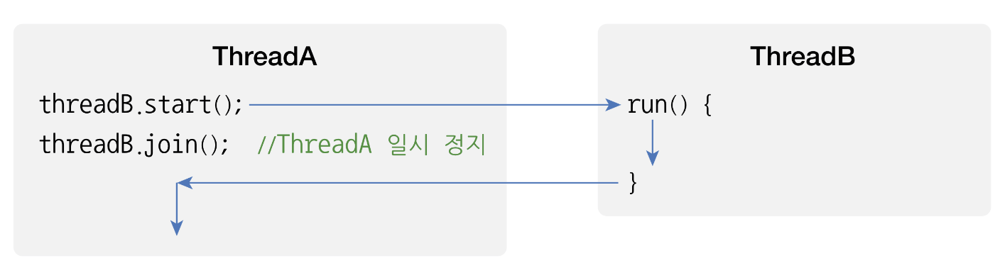

# 멀티 스레드
# 멀티 스레드 개념


> 멀티 프로세스들은 운영체제에서 할당받은 자신의 메모리를 가지고 실행하기 때문에 서로 독립적이다. 따라서 하나의 프로세스에서 오류가 발생해도 다른 프로세스에 영향을 미치지 않는다. 하지만 멀티 프로세스는 하나의 프로세스 내부에 실행되기 때문에 하나의 스레드가 예외를 발생시키면, 프로세스 자체가 종료될 수 있어 다른 스레드에게 영향을 미치게 된다. 그렇기 때문에 멀티스레드에서는 예외처리에 만전을 기해야 한다.  

> 멀티 스레드는 대용량의 데이터의 처리 시간을 줄이기 위해 데이터를 분할해서 병렬로 처리하는 곳에서 사용되기도 하고, UI를 가지고 있는 애플리케이션에서 네트워크 통신을 하기 위해 사용하기도 한다. 또한 다수 클라이언트의 요청을 처리하는 서버를 개발할 때에도 사용된다.

# 메인 스레드
모든 자바 애플리케이션은 메인 스레드가 main() 메소드를 실행하면서 시작된다. 메인 스레드는 main() 메소드의 첫 코드부터 아래로 순차적으로 실행하고, main() 메소드의 마지막 코드를 실행하거나, return 문을 만나면 실행이 종료된다.

>메인 스레드는 필요에 따라 작업 스레드들을 만들어서 병렬로 코드를 실행시킬 수 있다. 즉 멀티스레드를 생성해서 멀티 태스킹을 수행한다. 다음 그림에서 우측의 멀티 스레드 애플리케이션을 보면 메인 스레드가 작업 스레드 1을 생성하고 실행한 다음, 곧이어 작업 스레드 2를 생성하고 실행한다.


> 싱글 스레드 애플리케이션에서는 메인 스레드가 종료하면 프로세스도 종료된다. 하지만 멀티 스레드 애플리케이션에서는 실행중인 스레드가 하나라도 있다면, 프로세스는 종료되지 않는다. 메인 스레드가 작업 스레드보다 먼저 종료되더라도, 작업 스레드가 계속 실행중이면 프로세스는 종료되지 않는다.  

# 작업 스레드 생성과 실행
멀티 스레드로 실행하는 애플리케이션을 개발하려면 먼저 몇개의 작업을 병렬로 실행할지 결정하고 각 작업별로 스레드를 생성해야 한다. 어떤 자바 애플리케이션이건 메인 스레드는 반드시 존재하기 때문에 메인 작업 이외에 추가적인 병렬 작업의 수만큼 스레드를 생성하면 된다. 자바에서는 작업 스레드도 객체로 생성되기 때문에 클래스가 필요하다. java.lang.Thread 클래스를 직접 객체화에서 생성해도 되지만, Thread를 상속해서 하위 클래스를 만들어 생성할 수도 있다.  

## Thread 클래스로부터 직접 생성

```java
Thread thread = new Thread(Runnable target);
```

Runnable은 작업 스레드가 실행할 수 있는 코드를 가지고 있는 객체라고 해서 붙여진 이름이다. Runnable은 인터페이스 타입이기 때문에 구현 객체를 만들어 대입해야 한다. Runnable에는 run() 메서드 하나가 정의되어 있는데, 구현 클래스는 run() 을 재정의 해서 작업 스레드가 실행할 코드를 만들어야 한다.

```java
class Task implements Runnable {
    public void run() {
        // 스레드가 실행할 코드;
    }
}
```

Runnable은 작업 내용을 가지고 있는 객체이지 실제 스레드는 아니다. Runnable 구현 객체를 생성한 후, 이것을 매개값으로 해서 Thread 생성자를 호출하면 비로소 작업 스레드가 생성된다.  

```java
Runnable task = new Task();
Thread thread = new Thread(task);
```

익명 객체, 람다를 사용해 코드를 더 줄일 수 있다.

```java
Thread thread = new Thread(new Runnalbe() {
    public void run() {
        // 스레드가 실행할 코드;
    }
});
```

```java
Thread thread = new Thread(() -> {
    // 스레드가 실행할 코드;
})
```

작업 스레드는 생성즉시 실행되는것이 아니라, start() 메소드를 다음과 같이 호출해야만 비로소 실행된다.
```java
thread.start();
```
start() 메서드가 호출되면, 작업 스레드는 매개값으로 받은 Runnable의 run() 메소드를 실행하면서 자신의 작업을 처리한다.

> 다음 예제는 메인스레드만을 이용해 비프음과 프린팅을 하도록 한다. 메인 스레드가 동시에 두 작업을 처리할 수 없기 때문에 메인 스레드는 비프음을 모두 발생한 다음, 프린팅을 시작한다.

```java
// BeepPrintExample1.java - 메인스레드만 이용하는 경우

import java.awt.*;

public class BeepPrintExample1 {
    public static void main(String[] args) {
        Toolkit toolkit = Toolkit.getDefaultToolkit();
        for(int i=0; i<5; i++) {
            toolkit.beep();
            try { Thread.sleep(500); } catch(Exception e) {}
        }
        
        for(int i=0; i<5; i++) {
            System.out.println("띵");
            try { Thread.sleep(500); } catch(Exception e) {}
        }
    }
}
```

> 비프음을 발생시키면서 동시에 프린팅을 하려면 두 작업 중 하나를 메인 스레드가 아닌 다른 스레드에서 실행시켜야 한다. 프린팅은 메인 스레드가 담당하고 비프음을 들려주는 것은 작업 스레드가 담당하도록 수정하였다. 우선 작업을 정의하는 Runnable 구현 클래스를 다음과 같이 작성한다.  

```java
// BeepTask.java - 비프음을 들려주는 작업 정의
public class BeepTask implements Runnable {

	@Override
	public void run() {
		// TODO Auto-generated method stub
		Toolkit toolkit = Toolkit.getDefaultToolkit();
		for(int i=0; i<5; i++) {
			toolkit.beep();
			try {Thread.sleep(500);} catch(Exception e) {}
		}
	}
}

// BeepPrintExample2.java - 메인 스레드와 작업 스레드가 동시에 실행
public class BeepPrintExample2 {
    public static void main(String[] args) {
        //작업객체 생성
        Runnable beepTask = new BeepTask();
        Thread thread = new Thread(beepTask);
        thread.start();

        for(int i=0; i<5; i++) {
            System.out.println("띵");
            try {Thread.sleep(500);} catch(Exception e) {}
        }
    }
}
```

## Thread 하위 클래스로부터 생성
작업 스레드가 실행할 작업을 Runnable로 만들지 않고, Thread의 하위 클래스로 작업 스레드를 정의하면서 작업 내용을 포함시킬 수도 있다. Thread 클래스를 상속한 후 run 메소드를 재정의해서 스레드가 실행할 코드를 작성하면 된다. 

> 다음은 BeepThread 클래스를 이용해서 작업 스레드 객체를 생성하고 실행한다.  

```java
// BeepThread.java - 메인 스레드와 작업 스레드가 동시 실행
public class BeepThread extends Thread{
    @Override
    public void run() {
        Toolkit toolkit = Toolkit.getDefaultToolkit();
        for(int i=0; i<5; i++) {
            toolkit.beep();
            try {Thread.sleep(500);} catch(Exception e) {}
        }
    }
}

// BeepPrintExample3.java
public class BeepPrintExample3 {
    public static void main(String[] args) {
        //작업객체 생성
        Thread thread = new BeepThread();
        thread.start();

        for(int i=0; i<5; i++) {
            System.out.println("띵");
            try {Thread.sleep(500);} catch(Exception e) {}
        }
    }
}
```

## 스레드의 이름
스레드는 자신의 이름을 가지고 있다. 스레드의 이름이 큰 역할을 하는 것은 아니지만, 디버깅할 때 어떤 스레드가 어떤 작업을 하는지 조사할 목적으로 가끔 사용된다. 메인 스레드는 "main"이라는 이름을 가지고 있고, 우리가 직접 생성한 스레드는 자동적으로 "Thread-n"이라는 이름으로 설정된다. n은 스레드의 번호를 말한다. 다른 이름으로 설정하고 싶다면, Thread 클래스의 setName() 메소드로 변경하면 된다.  
```java
thread.setName("스레드 이름");
```
스레드 이름을 알고 싶을 경우에는 getName() 메소드를 호출하면 된다.
```java
thread.getName();
```

setName()과 getName()은 Thread의 인스턴스 메소드이므로 스레드 객체의 참조가 필요하다. 만약 스레드 객체의 참조를 가지고 있지 않다면 Thread의 정적 메소드인 currentThread()로 코드를 실행하는 현재의 참조를 얻을 수 있다.

```java
Thread thread = Thread.currentThread();
```

> 다음 예제는 메인 스레드의 참조를 얻어 스레드 이름을 콘솔에 출력하고, 새로 생성한 스레드의 이름을 setName() 메소드로 설정한 후, getName() 메소드로 읽어오도록 했다.  

```java
// ThreadNameExample.java - 메인 스레드 이름 및 UserThread 생성 및 시작
public class ThreadNameExample {

	public static void main(String[] args) {
		// TODO Auto-generated method stub
		Thread mainThread = Thread.currentThread();
		System.out.println("프로그램 시작 스레드 이름: "+mainThread.getName());
		
		ThreadA threadA = new ThreadA();
		System.out.println("작업 스레드 이름: "+threadA.getName());
		threadA.start();
		
		ThreadB threadB = new ThreadB();
		System.out.println("작업 스레드 이름: "+threadB.getName());
		threadB.start();
	}
}

// ThreadA.java - ThreadA 클래스
public class ThreadA extends Thread{
    public ThreadA() {
        setName("ThreadA");
    }

    public void run() {
        for(int i=0; i<2; i++) {
            System.out.println(getName() + "가 출력한 내용");
        }
    }
}

// ThreadB.java - ThreadB 클래스
public class ThreadB extends Thread{
    public void run() {
        for(int i=0; i<2; i++) {
            System.out.println(getName() + "가 출력한 내용");
        }
    }
}
```

# 스레드 우선순위
멀티 스레드는 동시성 또는 병렬성으로 실행된다. 동시성은 멀티작업을 위해 하나의 코어에서 멀티 스레드가 번갈아가며 실행하는 성질을 말하고, 병렬성은 멀티 작업을 위해 멀티 코어에서 개별 스레드를 동시에 실행하는 성질을 말한다. 싱글코어 CPU를 이용한 멀티 스레드 작업은 병렬적으로 실행되는 것처럼 보이지만, 사실은 번갈아가며 실행하는 동시성 작업이다.


스레드의 개수가 코어의 수보다 많을 경우, 스레드를 어떤 순서에 의해 동시성으로 실행할 것인가를 결정해야 하는데, 이것을 스레드 스케줄링이라 한다. 스레드 스케줄링에 읭해 스레드들은 아주 짧은 시간에 번갈아가면서 그들의 run() 메소드를 조금씩 실행한다.  


자바의 스레드 스케줄링은 우선순위 방식과 순환할당 방식을 사용한다. 우선순위 방식은 우선순위가 높은 스레드가 실행 상태를 더 많이 가지도록 스케줄링하는 것을 말한다. 순환 할당 방식은 시간 할당량을 정해서 하나의 스레드를 정해진 시간만큼 실행하고 다시 다른 스레드를 실행하는 방식을 말한다. 스레드 우선순위 방식은 스레드 객체에 우선 순위 번호를 부여할 수 있기 때문에 개발자가 코드로 제어할 수 있다. 하지만 순환 할당 방식은 JVM에 의해서 정해지기 때문에 코드로 제어할 수 없다.  

우선순위 방식에서 우선순위는 1에서 10까지 부여되는데 1이 가장 우선순위가 낮고, 10이 가장 높다. 우선순위를 부여하지 않으면 모든 스레드들은 기본적으로 5의 우선순위를 할당받는다. 만약 우선순위를 변경하고 싶다면 Thread 클래스가 제공하는 setPriority() 메소드를 이용하면 된다.  
```java
thread.setPriority(우선순위);
```
우선순위의 매개값으로 1~10을 직접 주어도 되지만, 코드의 가독성(이해도)을 높이기 위해 Thread 클래스의 상수를 사용할 수도 있다.  
```java
thread.setPriority(Thread.MAX_PRIORITY);
thread.setPriority(Thread.NORM_PRIORITY);
thread.setPriority(Thread.MIN_PRIORITY);
```
위의 상수는 순서대로 각각 10, 5, 1의 우선순위를 갖는다. 동일한 계산 작업을 하는 스레드들이 있고, 싱글 코어에서 동시성으로 실행할 경우, 우선 순위가 높은 스레드가 실행 기회를 더 많이 가지기 때문에 우선순위가 낮은 스레드보다 계산 작업을 빨리 끝낸다. 쿼드 코어의 경우에는 4개의 스레드가 병렬성으로 실행될 수 있기 때문에 4개 이하의 스레드를 실행할 경우에는 우선순위 방식이 크게 영향을 미치지 못한다. 최소한 5개이상의 스레드가 실행되어야 우선순위의 영향을 받는다.  

> 다음은 스레드 10개를 생성하고 20억 번의 루핑을 누가 더 빨리 끝내는가를 테스트한 예제이다. Thread1~9는 우선순위를 가장 낮게 주었고, Thread10은 우선순위를 가장 높게 주었다. 결과는 Thread10의 계산 작업이 가장 빨리 끝난다.  

```java
// CalcThread.java - 작업스레드
public class CalcThread extends Thread{
    public CalcThread(String name) {
        setName(name);
    }

    public void run() {
        for(int i=0; i<2000000000; i++) {

        }
        System.out.println(getName());
    }
}

// PriorityExample.java - 우선순위를 설정해서 스레드 실행  
public class PriorityExample {
    public static void main(String[] args) {
        for(int i=1; i<=10; i++) {
            Thread thread = new CalcThread("thread" + i);
            if(i != 10) {
                thread.setPriority(Thread.MIN_PRIORITY);
            } else {
                thread.setPriority(Thread.MAX_PRIORITY);
            }
            thread.start();
        }
    }
}
```

# 동기화 메소드와 동기화 블록
## 공유객체를 사용할 때의 주의점
싱글 스레드 프로그램에서는 한 개의 스레드가 객체를 독차지해서 사용하면 되지만,멀티 스레드 프로그램에서는 스레드들이 객체를 공유해서 작업해야 하는 경우가 있다. 이 경우, 스레드 A를 사용하던 객체가 스레드 B에 의해 상태가 변경될 수 있기 때문에 스레드 A가 의도했던 것과는 다른 결과를 산출할 수도 있다. 이는 마치 여러 사람이 계산기를 함께 나눠쓰는 경우와 같아서 서로의 연산상태를 침범하지 않도록 할 필요가 있다. 


> User1 스레드가 Calcualtor 객체의 memory 필드에 100을 먼저 저장하고 2초간 일시 정지 상태가 된다. 그동안에 User2 메소드가 memory 필드값을 50으로 변경한다. 2초가 지나 User1스레드가 다시 실행상태가 되어 memory 필드의 값을 출력하면 User2가 저장한 50이 나온다.  

```java
// MainThreadExample.java - 메인 스레드가 실행하는 코드
public class MainThreadExample {

    public static void main(String[] args) {
        // TODO Auto-generated method stub
        Calculator calculator = new Calculator();

        User1 user1 = new User1();
        user1.setCalculator(calculator);
        user1.start();

        User2 user2 = new User2();
        user2.setCalculator(calculator);
        user2.start();
    }
}

// Calculator.java - 공유 객체
public class Calculator {
    private int memory;

    public int getMemory() {
        return memory;
    }

    public void setMemory(int memory) {
        this.memory = memory;

        try {
            Thread.sleep(2000);
        } catch (InterruptedException e) {}
        System.out.println(Thread.currentThread().getName() + ": " + this.memory);
    }
}

// User1.java
public class User1 extends Thread {
    private Calculator calculator;

    public void setCalculator(Calculator calculator) {
        this.setName("User1");
        this.calculator = calculator;
    }

    public void run() {
        calculator.setMemory(100);
    }
}

// User2.java
public class User2 extends Thread {
    private Calculator calculator;

    public void setCalculator(Calculator calculator) {
        this.setName("User2");
        this.calculator = calculator;
    }

    public void run() {
        calculator.setMemory(50);
    }
}
```

## 동기화 메소드 및 동기화 블록
스레드가 사용 중인 객체를 다른 스레드가 변경할 수 없도록 하려면 스레드 작업이 끝날 때까지 객체에 잠금을 걸어서 다른 스레드가 사용할 수 없도록 해야한다. 멀티 스레드 프로그램에서 단 하나의 스레드만 실행할 수 있는 코드 영역을 임계 영역이라고 한다. 자바는 임계 영역을 지정하기 위해 동기화 메소드와 동기화 블록을 제공한다. 스레드가 객체 내부의 동기화 메소드 또는 블록에 들어가면 즉시 객체에 잡금을 걸어 다른 스레드가 임계 영역 코드를 실행하지 못하도록 한다. 동기화 메소드를 만드는 방법은 다음과 같이 메소드 선언에 synchronized 키워드를 붙이면 된다. 이 키워드는 인스턴스와 정적 메소드 어디든 붙일 수 있지만 그 위치는 반환타입 앞에 와야 한다.
```java
public synchronized void method() {
    임계 영역; // 단 하나의 스레드만 실행
}
```
동기화 메소드는 메소드 전체 내용이 임계 영역이므로 스레드가 동기화 메소드를 실행하는 즉시 객체에는 잠금이 일어나고, 스레드가 동기화 메소드를 실행 종료하면 잠금이 풀린다. 메소드 전체 내용이 아니라 일부 내용만 임계 영역으로 만들고 싶다면 다음과 같이 동기화 블록을 만들면 된다.
```java
public void method() {
    // 여러개의 스레드가 실행 가능한 영역
    ...
    synchronized(공유객체) {
        임계영역 // 단 하나의 스레드만 실행
    }
    // 여러 스레드가 실행 가능 영역
    ...
}
```
동기화 블록의 외부 코드들은 여러 스레드가 동시에 실행할 수 있지만, 동기화 블록의 내부 코드는 임계영역이므로 한 번에 한 스레드만 실행할 수 있고, 다른 스레드는 실행할 수 없다. 만약 동기화 메소드와 동기화 블록이 여러개 있을 경우, 스레드가 이들 중 하나를 실행할 때 다른 스레드는 해당 메소드는 물론이고 다른 동기화 메소드 및 블록도 실행할 수 없다. 하지만 일반 메소드는 실행이 가능하다.  


> 다음 예제는 이전 예제에서 문제가 된 공유 객체인 Calculator를 수정한 것이다. setMemory() 메소드를 동기화 메소드로 만들어서 User1 스레드가setMemory()를 실행할 동안 User2스레드가 setMemory()를 실행할 수 없도록 했다.  

```java
// Calculator.java - 동기화 메소드로 수정된 공유 객체
public class Calculator {
    private int memory;

    public int getMemory() {
        return memory;
    }

    public synchronized void setMemory(int memory) {
        this.memory = memory;

        try {
            Thread.sleep(2000);
        } catch (InterruptedException e) {}

        System.out.println(Thread.currentThread().getName() + ": " + this.memory);
    }
}
```
MainThreadExample을 다시 실행시켜 보면 User1은 100, User2는 50이라는 출력값을 얻는다. 아래와 같이 동기화 블록으로도 만들 수 있다.  

```java
public void setMemory(int memory) {
    synchronized (this) {
        this.memory = memory;

        try {
            Thread.sleep(2000);
        } catch (InterruptedException e) {}

        System.out.println(Thread.currentThread().getName() + ": " + this.memory);
    }
```
스레드가 동기화 블록으로 들어가면 this (Calculator 객체)를 잠그고, 동기화 블록을 실행한다. 동기화 블록을 모두 실행할 때까지 다른 스레드들은 this(Calculator 객체)의 모든 동기화 메소드 또는 동기화 블록을 실행할 수 없게 된다.  

# 스레드 상태
스레드 객체를 생성하고, start() 메소드를 호출하면 곧바로 스레드가 실행되는 것처럼 보이지만 사실은 실행대기상태가 된다. 실행 대기 상태란 아직 스케줄링이 되지 않아서 실행을 기다리고 있는 상태를 말한다. 실행 대기 상태에 있는 스레드 중에서 스레드 스케주링으로 선택된 스레드가 비로소 CPU를 점유하고 run() 메소드를 실행한다. 이때를 실행(Running) 상태라고 한다.  

실행상태의 스레드는 run() 메소드를 모두 실행하기 전에 스레드 스케줄링에 의해 다시 실행 대기 상태로 돌아갈 수 있다. 그리고 실행 대기 상태에 있는 다른 스레드가 선택되어 실행 상태가 된다. 이렇게 스레드는 실행 대기 상태와 실행 상태를 번갈아가면서 자신이 run() 메소드를 조금씩 실행한다. 실행 상태에서 run() 메소드가 종료되면, 더 이상 실행할 코드가 없기 때문에 스레드의 실행은 멈추게 된다. 이 상태를 종료 상태라고 한다.  


경우에 따라서는 스레드는 실행 상테에서 실행 대기 상태로 가지 않을 수도 있다. 실행 상태에서 일시 정지 상태로 가기도 하는데, 일시 정지 상태는 스레드가 실행할 수 없는 상태이다. 일시 정지 상태는 WAITING, TIMED_WAITING, BLOCKED가 있다. 스레드가 다시 실행 상태로 가기 위해서는 일시정지 상태에서 실행 대기 상태로 가야한다.   


이러한 스레드의 상태를 코드에서 확인할 수 있도록 하기 위해 자바 5부터 Thread 크래스에 getState() 메소드가 추가되었다. getState() 메소드는 다음 표처럼 스레드 상태에 따라서 Thread.State 열거 상수를 리턴한다.  

|상태|열거 상수| 설명                                     |
|---|---|----------------------------------------|
|객체 생성|NEW| 스레드 객체가 생성, 아직 start() 메소드가 호출되지 않은 상태 |
|실행 대기|RUNNABLE| 실행 상태로 언제든지 갈 수 있는 상태                  |
|일시 정시|WAITING|다른 스레드가 통지할 때까지 기다리는 상태|
||TIMED_WAITING|주어진 시간동안 기다리는 상태|
||BLOCKED|실행을 마친 상태|
|종료|TERMINATED|실행을 마친 상태|

> 다음은 스레드의 상태를 출력하는 StatePringThread 클래스이다. 생성자 매개값으로 받은 타겟 스레드의 상태를 0.5초 주기로 출력한다. 그 아래는 타겟 스레드 클래스이다. 3라인에서 10억 번 루핑을 돌게 해서 RUNNABLE 상태를 유지하고 7라인에서 sleep() 메소드를 호출해서 1.5초간 TIMED_WAITING 상태를 유지한다. 그리고 10라인에서는 다시 10억 번 루핑을 돌게 해서 RUNNABLE 상태를 유지한다.

```java
/* StatePrintThread.java - 타겟 스레드의 상태를 출력하는 스레드 */
public class StatePrintThread extends Thread {
    private Thread targetThread;

    public StatePrintThread(Thread targetThread) {
        this.targetThread = targetThread;
    }

    public void run() {
        while (true) {
            Thread.State state = targetThread.getState();
            System.out.println("타겟 스레드 상태: " + state);

            if (state == Thread.State.NEW) {
                targetThread.start();
            }

            if (state == State.TERMINATED) {
                break;
            }
            
            try {
                // 0.5초간 일시정지
                Thread.sleep(500);
            } catch (Exception e) {}
        }
    }
}

/* TargetThread.java - 타겟 스레드 */
public class TargetThread extends Thread {
    public void run() {
        for(long i=0; i<1000000000; i++) {}
        try {
            // 1.5초간 일시 정지
            Thread.sleep(1500);
        } catch (Exception e) {}
        
        for(long i=0; i<1000000000; i++) {}
    }
}

/* ThreadStateExample.java - 실행 클래스 */
public class ThreadStateExample {
    public static void main(String[] args) {
        StatePrintThread statePrintThread = new StatePrintThread(new TargetThread());
        statePrintThread.start();
    }
}
```

# 스레드 상태 제어
실행중인 스레드의 상태를 변경하는 것을 스레드 상태 제어라고 한다. 멀티 스레드 프로그램을 만들기 위해서는 정교한 스레드 상태 제어가 필요한데, 상태 제어가 잘못되면 프로그램은 불안정해져서 먹통이 되거나 다운된다. 스레드 제어를 제대로 하기 위해서는 스레드의 상태 변화를 가져오는 메소드들을 파악하고 있어야 한다.


위 그림에서 취소선을 가진 메소드는 스레드의 안전성을 해친다고 하여 더 이상 사용하지 않도록 권장된 Deprecated 메소드들이다.

| 메소드                                                     | 설명                                                                                                                                              |
|---------------------------------------------------------|-------------------------------------------------------------------------------------------------------------------------------------------------|
| interrupt()                                             | 일시 정지 상태의 스레드에서 interruptedException 예외를 발생시켜, 예외 처리 코드에서 실행 대기 상태나 종료 상태로 전이되도록 한다.                                                            |
| notify(), notifyAll()                                   | 동기화 블록 내에서 wait() 메소드에 의해 일시 정지 상태에 있는 스레드를 실행 대기 상태로 만든다.                                                                                      |
| resume()                                                | suspend() 메소드에 의해 일시 정지 상태에 있는 스레드를 실행 대기 상태로 만든다. `Deprecated(대신 notify(), notifyAll() 사용 권장`                                                  |
| sleep(long millis), sleep(long millis, int nanos)       | 주어진 시간 동안 스레드를 일시 정지 상태로 만든다. 주어진 시간이 지나면 자동적으로 실행 대기 상태가 된다.                                                                                   |
| join(), join(long millis), join(long millis, int nanos) | join() 메소드를 호출한 스레드는 일시 정지 상태가 된다. 실행 대기 상태로 가려면, join() 메소드를 멤버로 가지는 스레드가 종료되거나, 매개값으로 주어진 시간이 지나야 한다.                                         |
| wait(), wait(long millis), wait(long millis, int nanos) | 동기화(synchronized) 블록 내에서 스레드를 일시 정지 상태로 만든다. 매개값으로 주어진 시간이 지나면 자동적으로 실행 대기 상태가 된다. 시간이 주어지지 않으면 notify(), notifyAll() 메소드에 의해 실행 대기 상태로 갈 수 있다. |
| suspend()                                               | 스레드를 일시 정지 상태로 만든다. resume() 메소드를 호출하면 다시 실행 대기 상태가 된다. `Deprecated(대신 wait() 사용)`|
| yield()                                                 | 실행 중에 우선순위가 동일한 다른 스레드에게 실행으 ㄹ양보하고 실행 대기 상태가 된다. |
| stop()                                                  | 스레드를 즉시 종료시킨다. `Deprecated` |

위 표에서 wait(), notify(), notifyAll()은 Object 클래스의 메서드이고, 그 이외의 메서드는 모두 Thread 클래스의 메소드들이다.   

## 주어진 시간동안 일시정지(sleep())
실행중인 스레드를 일정 시간 멈추게 하고 싶다면 Thread 클래스의 정적 메소드인 sleep()을 사용하면 된다. 다음과 같이 Thread.sleep()을 호출한 스레드는 주어진 시간 동안 일시 정지 상태가 되고, 다시 실행 대기 상태로 돌아간다.  
```java
try {
    Thread.sleep(1000);
} catch(InterruptedException e) {
    // interrupt() 메소드가 호출되면 실행    
}
```

매개값에는 얼마 동안 일시 정지 상태로 있을 것인지, 밀리세컨드(1/1000) 단위로 시간을 주면 된다. 위와 같이 1000이라는 값을 주면 스레드는 1초가 경과할 동안 일시 정지 상태로 있게 된다. 일시 정지 상태에서 주어진 시간이 되기 전에 interrupt() 메소드가 호출되면 InterruptedException이 발생하기 때문에 예외 처리가 필요하다.  

> 다음 예제는 3초 주기로 비프(beep)음을 10번 발생시킨다. 메인 스레드를 3초 동안 일시 정지 상태로 보내고, 3초가 지나면 다시 실행 준비 상태로 돌아온다.  


```java
/* SleepExample.java - 3초 주기로 10번 비프음 발생 */
public class SleepExample {
    public static void main(String[] args) {
        Toolkit toolkit = Toolkit.getDefaultToolkit();
        for(int i=0; i<10; i++) {
            toolkit.beep();
            try{
                Thread.sleep(3000);
            } catch (InterruptedException e) {}
        }
    }
}
```

## 다른 스레드에게 실행 양보(yield())
스레드가 처리하는 작업은 반복적인 실행을 위해 for문이나 while문을 포함하는 경우가 많다. 가끔은 이 반복문들이 무의미한 반복을 하는 경우가 있다.  

```java
public void run() {
    while(true) {
        if(work) {
            System.out.println("ThreadA 작업 내용");
        }
    }
}
```

스레드가 시작되어 run() 메소드를 실행하면 while(true) { } 블록을 무한 반복 실행한다. 만약 work의 값이 false라면 그리고 work의 값이 false에서 true로 변경되는 시점이 불명확하다면, while문은 어떠한 실행문도 실행하지 않고 무의미한 반복을 한다. 이것보다는 다른 스레드에게 실행을 양보하고 자신은 실행 대기 상태로 가는 것이 전체 프로그램 성능에 도움이 된다. 이런 기능을 위해서 스레드는 yield() 메소드를 제공하고 있다. yield() 메소드를 호출한 스레드는 실행 대기 상태로 돌아가고 동일한 우선순위 또는 높은 우선순위를 갖는 다른 스레드가 실행 기회를 가질 수 있도록 해준다.  

다음 코드는 의미없는 반복을 줄이기 위해 yield() 메소드를 호출해서 다른 스레드에게 실행 기회를 주도록 수정한 것이다.  
```java
public void run() {
    while(true) {
        if(work) {
            System.out.println("ThreadA 작업 내용");
        } else {
            Thread.yield();
        }
    }
}
```

> 다음 예제에서는 처음 실행 후 3초 동안은 ThreadA와 ThreadB가 각 스레드의 처리완료 순대로(번갈아 가며x, 처리가 끝나는 임의의 순서대로) 실행된다. 3초 뒤에 메인 스레드가 ThreadA의 work 필드를 false로 변경함으로써 ThreadA는 yield() 메소드를 호출한다. 따라서 이후 3초 동안에는 ThreadB가 더 많은 실행 기회를 얻게 된다. 메인 스레드는 3초 뒤에 다시 ThreadA의 work 필드를 true로 변경해서 ThreadA와 ThreadB가 번갈아가며 실행하도록 한다. 마지막으로 메인 스레드는 3초 뒤에 ThreadA와 ThreadB의 stop 필드를 true로 변경해서 두 스레드가 반복 작업을 중지하고 종료하도록 한다.  

```java
/* YieldExample.java - 스레드 실행 양보 예제 */
public class YieldExample {
    public static void main(String[] args) {
        ThreadA threadA = new ThreadA();
        ThreadB threadB = new ThreadB();
        
        threadA.start();
        threadB.start();
        
        try { Thread.sleep(3000); } catch (InterruptedException e) {}
        threadA.work = false;
        
        try { Thread.sleep(3000); } catch (InterruptedException e) {}
        threadA.work = true;

        try { Thread.sleep(3000); } catch (InterruptedException e) {}
        threadA.stop = true;
        threadB.stop = true;
    }
}

/* ThreadA.java */
public class ThreadA extends Thread {
    public boolean stop = false;    // 종료 플래그
    public boolean work = true;     // 작업 진행 여부 플래그
    
    public void run() {
        while(!stop) {
            if(work) {
                System.out.println("ThreadA 작업 내용");
            } else {
                Thread.yield();
            }
        }
        System.out.println("ThreadA 종료");
    }
}

/* ThreadB.java */
public class ThreadB extends Thread {
    public boolean stop = false;
    public boolean work = true;

    public void run () {
        while(!stop) {
            if(work) {
                System.out.println("ThreadB 작업 내용");
            } else {
                Thread.yield();
            }
        }
        System.out.println("ThreadB 종료");
    }
}
```
### 💡 참고 사항  
> 출력 순서와 빈도는 시스템 스케줄러에 따라 다르며, 매 실행마다 다를 수 있습니다. Thread.yield()는 CPU를 반드시 양보한다는 보장은 없음 → 실제 실행 순서는 예측이 어렵습니다.

### ⏱️ 왜 메인 스레드가 sleep을 써야 할까?
> Java의 스레드는 비동기적이기 때문에, 메인 스레드가 아무 제어 없이 threadA.work = false 같은 플래그를 즉시 바꾸면 A/B 스레드가 실행되기도 전에 false로 바뀔 수 있습니다.  
> 따라서 sleep()을 사용해서, 스레드가 먼저 일정 시간 동안 실행되도록 시간을 벌어주고, 이후에 상태를 바꿔가며 실행 흐름을 제어하려는 목적입니다.

## 다른 스레드의 종료를 기다림(join())
스레드는 다른 스레드와 독립적으로 실행하는 것이 기본이지만, 다른 스레드가 종료될 때까지 기다렸다가 실행해야 하는 경우가 발생할 수도 있다. 



> 다음 예제는 메인 스레드는 SumThread가 계산 작업을 모두 마칠 때까지 일시 정지 상태에 있다가 SumThread가 최종 계산된 결과값을 산출하고 종료하면 결과값을 받아 출력한다.  

```java
/* SumThread.java - 1부터 100까지 합을 계산하는 스레드 */
public class SumThread extends Thread {
    private long sum;
    
    public long getSum() {
        return sum;
    }
    
    public void setSum(long sum) {
        this.sum = sum;
    }
    
    public void run() {
        for(int i=0; i<=100; i++) {
            sum += i;
        }
    }
}

/* JoinExample.java - 다른 스레드가 종료될 때까지 일시 정지 상태 유지 */
public class joinExample {
    public static void main(String[] args) {
        SumThread sumThread = new SumThread();
        sumThread.start();

        try {
            sumThread.join();
        } catch (InterruptedException e) {}

        System.out.println("1~100 합 : " + sumThread.getSum());
    }
}
```

## 스레드 간 협업(wait(), notify(), notifyAll())
경우에 따라서는 두 개의 스레드를 교대로 번갈아가며 실행해야 할 경우가 있다. 정확한 교대 작업이 필요한 경우, 자신의 작업이 끝나면 상대방 스레드를 일시 정지 상태에서 풀어주고, 자신은 일시 정지 상태로 만드는 것이다. 이 방법의 핵심은 공유 객체에 있다. 공유 객체는 두 스레드가 작업할 내용을 각각 동기화 메소드로 구분해 놓는다. ***한 스레드가 작업을 완료하면 notify() 메소드를 호출해서 일시 정지 상태에 있는 다른 스레드를 실행 대기 상태로 만들고, 자신은 두 번 작업을 하지 않도록 wait() 메소드를 호출하여 일시 정지 상태로 만든다.***


만약 wait() 대신 wait(long timeout)이나, wait(long timeout, int nanos)를 사용하면 notify()를 호출하지 않아도 지정된 시간이 지나면 자동적으로 실행 대기 상태가 된다. notify() 메소드와 동일한 역할을 하는 notifyAll()도 있는데, notify()는 wait()에 의해 일시정지된 스레드 중 한 개를 실행 대기 상태로 만들고, notifyAll() 메소드는 wait()에 의해 일시 정지된 모든 스레드들을 실행 대기 상태로 만든다. 이 메소드들은 ***Thread 클래스가 아닌 Object 클래스에 의해 선언된 메소드들이므로, 모든 공유 객체에서 호출이 가능하다. 주의할 점은 이 메소드들은 동기화 메소드 또는 동기화 블록 내에서만 사용할 수 있다.***  

> 다음 예제는 두 스레드의 작업을 WorkObject의 methodA()와 methodB()에 정의해 두고, 두 스레드 ThreadA와 ThreadB가 교대로 methodA()와 methodB()를 호출하도록 했다.  

```java
/* WorkObject.java - 두 스레드의 작업 내용을 동기화 메소드로 작성한 공유 객체 */
public class WorkObject {
    public synchronized void methodA() {
        System.out.println("ThreadA의 methodA() 작업 실행");
        notify();
        try {
            wait();
        } catch (InterruptedException e) {}
    }
    
    public synchronized void methodB() {
        System.out.println("ThreadB의 methodB() 작업 실행");
        notify();
        try {
            wait();
        } catch (InterruptedException e) { }
    }
}

/* ThreadA.java - WorkObject의 methodA()를 실행하는 스레드 */
public class ThreadA extends Thread {
    private WorkObject workObject;
    
    public ThreadA(WorkObejct workObject) {
        this.workObject = workObject;
    }
    
    @Override
    public void run() {
        for(int i=0; i<10; i++) {
            workObject.methodA();
        }
    }
}

/* ThreadA.java - WorkObject의 methodB()를 실행하는 스레드 */
public class ThreadB extends Thread {
    private WorkObject workObject;
    
    public ThreadA(WorkObejct workObject) {
        this.workObject = workObject;
    }
    
    @Override
    public void run() {
        for(int i=0; i<10; i++) {
            workObject.methodB();
        }
    }
}

/* WaitNotifyExample.java - 두 스레드를 생성하고 실행하는 메인 스레드 */
public class WaitNotifyExample {
    public static void main(String[] args) {
        WorkObject sharedObject = new WorkObject();
        
        ThreadA threadA = new ThreadA(sharedObject);
        ThreadB threadB = new ThreadB(sharedObject);

        threadA.start();
        threadB.start();
    }
}
```

> 다음 예제는 데이터를 저장하는 스레드 (생산자 스레드)가 데이터를 저장하면, 데이터를 소비하는 스레드 (소비자 스레드)가 데이터를 읽고 처리하는 교대 작업을 구현한 것이다.  


생산자 스레드는 소비자 스레드가 읽기 전에 새로운 데이터를 두 번 생성하면 안 되고, 소비자 스레드는 생산자 스레드가 새로운 데이터를 생성하기 전에 이전 데이터를 두 번 읽어서도 안 된다. 구현 방법은 공유 객체에 데이터를 저장할 수 있는 data 필드의 값이 null이면 생산자스레드를 실행 대기 상태로 만들고, 소비자 스레드를 일시 정지 상태로 만드는 것이다. 반대로 data 필드의 값이 null이 아니면 소비자 스레드를 실행 대기 상태로 만들고, 생산자 스레드를 일시 정지 상태로 만들면 된다. (세마포어를 이용한 생산자-소비자 문제 해결과 비슷한듯 하다.)  

```java
/* DataBox.java - 두 스레드의 작업 내용을 동기화 메소드로 작성한 공유 객체 */
public class DataBox {
    private String data;
    
    public synchronized String getData() {
        if(this.data == null) {
            try {
                wait();
            } catch (InterruptedException e) {}
        }
        String returnValue = data;
        System.out.println("ConsumerThread가 읽은 데이터: " + returnValue);
        data = null;
        notify();
        return returnValue;
    }
    
    public synchronized void setData(String data) {
        if(this.data != null) {
            try {
                wait();
            } catch (InterruptedException e) {}
        }
        this.data = data;
        System.out.println("ProducerThread가 생성한 데이터: " + data);
        notify();
    }
}

/* ProducerThread.java - 데이터를 생산하는 스레드 */
public class ProducerThread extends Thread {
    private DataBox dataBox;
    
    public ProducerThread(DataBox dataBox) {
        this.dataBox = dataBox;
    }
    
    @Override
    public void run() {
        for(int i=1; i<=3; i++) {
            String data = "Data-"+i;
            dataBox.setData();
        }
    }
}

/* ConsumerThread.java - 데이터를 소비하는 스레드 */
public class ConsumberThread extends Thread {
    private DataBox dataBox;
    
    public ConsumberThread(DataBox dataBox) {
        this.dataBox = dataBox;
    }
    
    @Override
    public void run() {
        for(int i=1; i<=3; i++) {
            String data = "Data-"+i;
            dataBox.getData();
        }
    }
}

/* WaitNotifyExample.java - 두 스레드를 생성하고 실행하는 메인 스레드 */
public class WaitNotifyExample {
    public static void main(String[] args) {
        DataBox dataBox = new DataBox();
        
        ProducerThread producerThread = new ProducerThread(dataBox);
        ConsumberThread consumberThread = new ConsumberThread(dataBox);
        
        producerThread.start();
        consumberThread.start();
    }
}
```

## 스레드의 안전한 종료(stop 플래그, interrupt()) 
스레드는 자신의 run() 메소드가 모두 실행되면 자동적으로 종료된다. 경우에 따라서는 실행중인 스레드를 즉시 종료할 필요가 있다. Thread는 스레드를 즉시 종료 시키기 위해서 stop() 메소드를 제공하고 있는데, 이 메소드를 이용해 스레드를 갑자기 종료시키게 되면 스레드가 사용중이던 자원이 불안전한 상태로 남겨지기 때문에 `deprecated` 되었다. 스레드를 안전하게 종료시키는 방법은 아래와 같이 두 가지가 있다. 둘 중 빠른 종료가 필요한 경우는 interrupt() 메서드를 호출해서 간접적으로 종료상태로 전이되도록 한다.  

### stop 플래그를 이용하는 방법
스레드는 run() 메소드가 끝나면 자동적으로 종료되므로, run() 메소드가 정상적으로 종료되도록 유도하는 것이 최선의 방법이다. 다음 코드는 stop 플래그를 이용해서 run() 메소드의 종료를 유도한다.

```java
public class XXXThread extends Thread {
    private boolean stop;   // stop 플래그 필드
    
    public void run() {
        while(!stop) {
            // 스레드가 반복 실행하는 코드
        }
        // 스레드가 사용한 자원 정리
    }
}
```

위 코드에서 stop 필드가 false일 경우에는 while문의 조건식이 true가 되어 반복실행하지만, stop 필드가 true일 경우에는 while문의 조건식이 false가 되어 while문을 빠져나온다. 그리고 스레드가 사용한 자원을 정리하고, run() 메소드가 끝나게 됨으로써 스레드는 안전하게 종료된다.  

> 다음 예제는 PrintThread1을 실행한 후 1초 후에 PrintThread1을 멈추도록 setStop() 메소드를 호출한다.  

```java
/* StopFlagExample.java - 1초 후 출력 스레드를 중지시킴 */
public class StopFlagExample {
    public static void main(String[] args) {
        PrintThread1 = printThread = new PrintThread1();
        printThread.start();
        try { Thread.sleep(1000); } catch (InterruptedException e) {}
        
        printThread.setStop(true);
    }
}

/* PrintThread1.java - 무한 반복해서 출력하는 스레드 */
public class PrintThread1 extends Thread {
    private boolean stop;
    
    public void setStop(boolean stop) {
        this.stop = stop;
    }
    
    public void run() {
        while(!stop) {
            System.out.println("실행 중");
        }
        System.out.println("자원 정리");
        System.out.println("실행 종료");
    }
}
```

> #### ✅ 실행 흐름 정리
> 1. main()에서 printThread.setStop(true) 호출 → stop = true로 변경됨  
> 2. PrintThread1 내부에서 while (!stop) 조건이 false가 되어 루프를 빠져나옴
> 3. 루프 아래 코드(System.out.println("자원 정리");, System.out.println("실행 종료");) 실행  
> 4. run() 메서드의 끝까지 도달 → 스레드 종료됨  
> 
> => 즉, run() 종료가 곧 스레드의 종료.

### interrupt() 메소드를 이용하는 방법  
interrupt() 메소드는 스레드가 일시 정지 상태에 있을 때 InterruptedException 예외를 발생시키는 역할을 한다. 이것을 이용하면 run() 메소드를 정상 종료 시킬 수 있다. 


ThreadA가 ThreadB의 interrupt() 메소드를 실행하게 되면 ThreadB가 sleep() 메소드로 이리 정지 상태가 될 때 ThreadB에서 interruptException이 발생하여 예외 처리(catch) 블록으로 이동한다. 결국 ThreadB는 while문을 빠져나와 run() 메소드를 정상 종료하게 된다.  

> 다음 예제는 PrintThread2를 실행한 후 1초 후에 PrntThread2를 멈추도록 interrupt() 메소드를 호출한다. 

```java
/* InterruptExample - 1초 후 출력 스레드를 중지시킴 */
public class InterruptExample {
    public static void main(String[] args) {
        Thread thread = new PrintThread2();
        thread.start();

        try {
            Thread.sleep(1000);
        } catch (InterruptedException e) {}

        thread.interrupt();
    }
}

/* PrintThread2.java - 무한 반복해서 출력하는 스레드 */
public class PrintThread2 extends Thread {
    public void run() {
        try {
            while (true) {
                System.out.println("실행 중");
                Thread.sleep(1);
            }
        } catch (InterruptedException e) { }
        
        System.out.println("자원 정리");
        System.out.println("실행 종료");
    }
}
```

***주목할 점은 스레드가 실행 대기 또는 실행 상태에 있을 때 interrupt() 메소드가 실행되면 즉시 InterruptedException 예외가 발생하지 않고, 스레드가 미래에 일시 정지 상태가 되면 InterruptedException 예외가 발생한다는 것이다.*** 따라서 스레드가 일시 정지 되지 않으면 interrupt() 메소드 호출은 아무런 의미가 없다. 그래서 짧은 시간이나마 일시 정지시키기 위해 Thread.sleep(1)을 사용한다. 

#### main() 메서드에서 Thread.sleep(1000)을 호출하는 이유

> ##### ✅ 목적: PrintThread2가 충분히 실행되도록 하기 위해
> ``` java
> try {
> Thread.sleep(1000);  // ⚠ 메인 스레드가 1초 동안 일시정지
> } catch (InterruptedException e) {}
> ```
> ▶ 이 코드의 역할은 간단히 말해 PrintThread2 스레드가 **“1초 동안 실행될 시간”** 을 보장하기 위함입니다.  
> 그 후 main()이 interrupt()를 호출해 PrintThread2를 중단시킵니다.
> 
> 🔁 만약 이 코드가 없다면?
> ```java
> // thread.start();
> thread.interrupt(); // 거의 즉시 인터럽트됨
> ```
> PrintThread2는 아직 실행을 시작하기도 전에 interrupt()를 받게 될 수 있음, 그러면 "실행 중" 메시지도 출력 안 된 채 즉시 종료되거나 비정상 흐름이 될 수 있음

일시 정지를 만들지 않고도 interrupt() 호출 여부를 알 수 있는 방법이 있다. interrupt() 메소드가 호출되었다면 스레드의 interrupted()와 isInterrupted() 메소드는 true를 리턴한다. intterrupted() 메소드는 정적 메소드로 현재 스레드가 interrupted 되었는지 확인하는 것이고, isInterrupted()는 인스턴스 메소드로 현재 스레드가 interrupted 되었는지 확인할 때 사용한다. 둘 중 어떤것을 사용해도 무관하다.  

```java
boolean status = Thread.interrupted();
boolean status = Thread.currentThread().isInterrupted();
```

> 다음은 PrintTHread2를 수정한 것으로, 일시 정지 코드인 Thread.sleep(1)을 사용하지 않고, Thread.interrupted()를 사용해서 PrintThread2의 interrupt()가 호출되었는지 확인한 다음 while문을 빠져나가도록 했다.  

```java
/* PrintThread2.java - 무한 반복해서 출력하는 스레드 */
public class PrintThread2 extends Thread {
    public void run() {
        while(true) {
            System.out.println("실행 중");
            if(Thread.interrupted()) {  //WAIT발생 대신 interrupted() 메서드 사용
                break;
            }
        }

        System.out.println("자원 정리");
        System.out.println("실행 종료");
    }
}
```

# 데몬 스레드
데몬(daemon) 스레드는 주 스레드의 작업을 돕는 보조적인 역할을 수행하는 스레드이다. 주 스레드가 종료되면 데몬 스레드는 강제적으로 자동 종료되는데, 그 이유는 주 스레드의 보조 역할을 수행하므로 주 스레드가 종료되면 데몬 스레드의 존재 의미가 없어지기 때문이다. 이 점을 제외하면 데몬 스레드는 일반 스레드와 큰 차이가 없다.  

스레드를 데몬으로 만들기 위해서는 주 스레드가 데몬이 될 스레드의 setDaemon(true)를 호출해주면 된다. 아래 코드를 보면 메인 스레드가 주 스레드가 되고 AutoSaveThread가 데몬 스레드가 된다.  

```java
public static void main (String[] args) {
    AutoSaveThread = new AutoSaveThread();
    thread.setDaemon(true);
    thread.start();
    ...
}
```

주의할 점은 start() 메소드가 호출되고 나서 setDaemon(true)를 호출하면 IllegalThreadStateException이 발생하기 때문에 start() 메소드 호출 전에 setDaemon(true)를 호출해야 한다. 현재 실행중인 스레드가 데몬 스레드인지 아닌지를 구별하는 방법은 isDaemon() 메소드의 리턴값을 조사해보면 된다.  

> 다음 예제는 1초 주기로 save() 메소드를 자동 호출하도록 AutoSaveThread를 작성하고, 메인 스레드가 3초 후 종료되면 AutoSaveThread도 같이 종료되도록 AutoSaveThread를 데몬 스레드로 만들었다.  

```java
/* AutoSaveThread.java - 1초 주기로 save() 메소드를 호출하는 데몬 스레드 */
public class AutoSaveThread extends Thread {
    public void save() {
        System.out.println("작업 내용을 저장함");
    }

    @Override
    public void run() {
        while(true) {
            try {
                Thread.sleep(1000);
            } catch (InterruptedException e) {
                break;
            }
            save();
        }
    }
}

/* DaemonThread.java - 메인 스레드가 실행하는 코드 */
public class DaemonExample {
    public static void main(String[] args) {
        AutoSaveThread autoSaveThread = new AutoSaveThread();
        //데몬스레드로 지정하지 않는경우 스레드는 메인스레드가 종료되어도 계속 동작
//        autoSaveThread.setDaemon(true);
        autoSaveThread.start();

        try {
            Thread.sleep(3000);
        } catch (InterruptedException e) {

        }

        System.out.println("메인 스레드 종료");
    }
}
```

# 스레드 그룹
***스레드 그룹은 관련된 스레드를 묶어서 관리할 목적으로 이용***된다. ***JVM이 실행되면 system 스레드 그룹을 만들고, JVM 운영에 필요한 스레드들을 생성해서 system 스레드 그룹에 포함시킨다.*** 그리고 system의 하위 스레드 그룹으로 main을 만들고 메인 스레드를 main 스레드 그룹에 포함시킨다. ***스레드는 반드시 하나의 스레드 그룹에 포함되는데, 명시적으로 스레드 그룹에 포함시키지 않으면 기본적으로 자신을 생성한 스레드와 같은 스레드 그룹에 속하게 된다.*** 우리가 생성하는 작업 스레드는 대부분 main 스레드가 생성하므로, 기본적으로 main 스레드 그룹에 속하게 된다.  

## 스레드 그룹 이름 얻기
현재 스레드가 속한 스레드 그룹의 이름을 얻고 싶다면 다음과 같은 코드를 사용할 수 있다.  

```java
ThreadGroup group = Thread.currentThread().getThreadGroup();
String groupName = group.getName();
```

Thread의 정적 메소드인 getAllStackTraces()를 이용하면 프로세스 내에서 실행하는 모든 스레드에 대한 정보를 얻을 수 있다.  

```java
Map<Thread, StackTraceElement[]> map = Thread.getAllStackTraces();
```

getAllStackTraces() 메소드는 Map 타입의 객체를 리턴하는데, 키는 스레드 객체이고 값은 스레드의 상태 기록들을 갖고 있는 StackTraceElement[] 배열이다.

> 다음 예쩨는 현재 실행하고 있는 스레드의 이름과 데몬 여부 그리고 속한 스레드 그룹이 무엇인지 출력한다.  

```java
/* ThreadInfoExample.java - 현재 실행중인 스레드 정보 */
public class ThreadInfoExample {
    public static void main(String[] args) {
        AutoSaveThread autoSaveThread = new AutoSaveThread();
        autoSaveThread.setName("AutoSaveThread");
        autoSaveThread.setDaemon(true);
        autoSaveThread.start();
        
        Map<Thread, StackTraceElement[]> map = Thread.getAllStackTraces();
        Set<Thread> threads = map.keys();
        for(Thread thread : threads) {
            System.out.println("Name: " + thread.getName() + ((thread.isDaemon()) ?"(데몬)" :"(주)"));
            System.out.println("\t" + "소속그룹: " + thread.getThreadGroupt().getName());
            System.out.println();
        }
    }
}
```
> **실행결과**
> 
> 
>
> 실행 결과를 보면 가비지 컬렉션을 담당하는 Finalizer 스레드를 비롯한 일부 스레드들이 system 그룹에 속하고, main() 메소드를 실행하는 main 스레드는 system 그룹의 하위 그룹인 main에 속하는 것을 볼 수 있다. 그리고 main 스레드가 실행시킨 AutoSaveThread는 main 스레드가 소속된 main 그룹에 포함되어 있는 것을 볼 수 있다.  

## 스레드 그룹 생성
명시적으로 스레드 그룹을 만들고 싶다면 아래 생성자를 이용해 ThreadGroup 객체를 만들면 된다. ThreadGroup 이름만 주거나, 부모 ThreadGroup과 이름을 매개값으로 줄 수 있다.  

```java
ThreadGroup tg = new ThreadGroup(String name);
ThreadGroup tg = new ThreadGroupt(ThreadGroup parent, String name);
```

스레드 그룹 생성 시 부모 스레드 그룹을 지정하지 않으면 현재 스레드가 속한 그룹의 하위 그룹으로 생성된다. 예를 들어 main 스레드가 ThreadGroup(String name)을 이용해서 새로운 스레드 그룹을 생성하면, main 스레드 그룹의 하위 스레드 그룹이 된다. 새로운 스레드 그룹을 생성한 후, 이 그룹에 스레드를 포함시키려면 Thread 객체를 생성할 때 생성자 매개값으로 스레드 그룹을 지정하면 된다. 스레드 그룹을 매개값으로 갖는 Thread 생성자는 다음 네 가지가 있다.  

```java
Thread t = new Thread(ThreadGroup group, Runnable target);
Thread t = new Thread(ThreadGroup group, Runnalbe target, String name);
Thread t = new Thread(ThreadGroup group, Runnable target, String name, long stackSize);
Thread t = new Thread(ThreadGroup group, String name);
```

Runnable 타입의 target은 Runnable의 구현 객체를 말하며, String 타입의 name은 스레드의 이름이다. 그리고 long 타입의 stackSize는 JVM이 스레드에 할당할 stack 크기이다.  

## 스레드 그룹의 일괄 interrupt() 
스레드를 스레드 그룹에 포함시키면 그룹에 속한 스레드들을 일괄적으로 제어할 수 있는 장점이 있다. 이것이 가능한 이유는 ***스레드 그룹의 interrupt() 메소드는 포함된 모든 스레드의 interrupt() 메소드를 내부적으로 호출해주기 때문이다.***  

**스레드 그룹의 interrupt() 메소드는 소속된 스레드의 interrupt() 메소드를 호출만할 뿐 개별 스레드에서 발생하는 InterruptedException에 대한 예외 처리를 하지 않는다.** 따라서 안전한 종료를 위해서는 개별 스레드가 예외 처리를 해야한다. 스레드 그룹에는 interrupt() 메소드 이외에도 suspent(), resume(), stop() 메소드들이 있는데, 불안전성 때문에 모두 Deprecated 되었다. 대신 interrupt() 메소드로 스레드들을 안전하게 종료하도록 유도하는 것이 좋다. 다음은 ThreadGroup이 가지고 있는 주요 메서드들이다.  

| 반환타입       | 메소드                       | 설명                                                                      |
|------------|---------------------------|-------------------------------------------------------------------------|
| int        | activeCount()             | 현재 그룹 및 하위 그룹에서 활동중인 모든 스레드의 수를 리턴한다.                                   |
| int        | activeGroupCount()        | 현재 그룹에서 활동중인 모든 하위 그룹의 수를 리턴한다.                                         |
| void       | checkAccess()             | 현재 스레드가 스레드 그룹을 변경할 권한이 있는지 체크한다. 만약 권한이 없으면 SecurityException을 발생 시킨다. |
| void       | destroy()                 | 현재 그룹 및 하위 그룹을 모두 삭제한다. 단, 그룹 내에 포함된 모든 스레드들이 종료 상태가 되어야 한다.            |
| boolean    | isDestroyed()             | 현재 그룹이 삭제되었는지 여부를 리턴한다.                                                 |
| int        | getMaxPriority()          | 현재 그룹에 포함된 스레드가 가질 수 있는 최대 우선순위를 리턴한다.                                  |
| void       | setMaxPriority(int pri)   | 현재 그룹에 포함된 스레드가 가질 수 있는 최대 우선순위를 설정한다.                                  |
| String     | getName()                 | 현재 그룹의 이름을 리턴한다.                                                        |
| ThreadGroup | getParent()               | 현재 그룹의 부모 그룹을 리턴한다.                                                     |
| boolean    | parentOf(ThreadGroup g)   | 현재 그룹이 매개값으로 지정한 스레드 그룹의 부모인지 여부를 리턴한다.ㅣ                                
| boolean    | isDaemon()                | 현재 그룹이 데몬 그룹인지 여부를 리턴한다.                                                |
| void       | setDaemon(boolean daemon) | 현재 그룹을 데몬 그룹으로 설정한다.                                                    |
| void       | list()                    | 현재 그룹에 포함된 스레드와 하위 그룹에 대한 정보를 출력한다.                                     |
| void       | interrupt()               | 현재 그룹에 포함된 모든 스레드들을 interrupt 한다.                                       |

> 다음 예제는 스레드 그룹을 생성하고, 정보를 출력해본다. 그리고 3초 후 스레드 그룹의 interrupt() 메소드를 호출해서 스레드 그룹에 포함된 모든 스레드들을 종료시킨다.  

```java
/* WorkThread.java - InterruptedException이 발생할 때 스레드가 종료되도록 함 */
public class WorkTHread extends Thread {
    public WorkThread(ThreadGroup threadGroup, String threadName) {
        super(threadGroup, threadName);
    }
    
    @Overridepublic void run() {
        shile(true) {
            try {
                Thread.sleep(1000);
            } catch (InterruptedException e) {
                System.out.println(getName() + "interrupted");
                break;
            }
        }
        System.out.println(getName() + "종료됨");
    }
}

/* ThreadGroupExample.java - 스레드 그룹을 이용한 일괄 종료 예제 */
public class ThreadGroupExample {
    public static void main(String[] args) {
        ThreadGroup threadGroup = new ThreadGroup("myGroup");
        WorkThread workThreadA = new WorkThread(myGroup, "workThreadA");
        WorkThread workThreadB = new WorkThread(myGroup, "workThreadB");
        
        workThreadA.start();
        workThreadB.start();

        System.out.println("[ main 스레드 그룹의 list() 메소드 출력 내용 ]");
        mainGroup.list();
        System.out.println();
        
        try { Thread.sleep(3000); } catch (InterruptedException e) {}

        System.out.println("[ myGroup 스레드 그룹의 interrupt() 메소드 호출 ]");
        myGroup.interrupt();
    }
}
```

> #### ✅ 왜 super(threadGroup, threadName)을 호출하는가?  
> super(threadGroup, threadName)을 호출하면, 해당 스레드를 특정한 스레드 그룹에 속하도록 지정할 수 있기 때문.  
> 
> => 상위 클래스는 Thread이다. 즉, **Thread(ThreadGroup tr, ThreadName tn)** 을 호출하기 위함. 이 생성자는 스레드를 생성할 때 명시적으로 스레드 그룹과 이름을 지정할 수 있게 해준다.  

> **실행결과**
> 
> 

실행 결과를 보면 12라인의 list() 메소드는 현재 스레드 그룹의 이름과 최대 우선순위를 헤더로 출력하고, 그 아래에 현재 스레드 그룹에 포함된 스레드와 하위 스레드 그룹의 내용을 보여준다. 스레드는 [스레드이름, 우선순위, 소속 그룹명]으로 출력되는 것을 볼 수 있다. 18 라인의 interrupt() 메소드를 호출하면 myGroup에 포함된 두 스레드에서 InterruptedException이 발생되어 스레드가 종료되는 것을 알 수 있다.  

# 스레드 풀
병렬 작업 처리가 많아지면 스레드 개수가 증가되고 그에 따른 스레드 생성과 스케줄링으로 인해 CPU가 바빠져 메모리 사용량이 늘어나고, 곧 애플리케이션의 성능이 저하된다. 갑작스런 병렬 작업의 폭증으로 인한 ***스레드의 폭증을 막으려면 스레드풀(ThreadPool)을 사용해야한다.*** 스레드 풀은 ***작업 처리에 사용되는 스레드를 제한된 개수만큼 정해놓고 작업 큐(Queue)에 들어오는 작업들을 하나씩 스레드가 맡아 처리한다.*** 작업 처리가 끝난 스레드는 다시 작업 큐에서 새로운 작업을 가져와 처리한다. 그렇기 때문에 작업 처리 요청이 폭증되어도 스레드의 전체 개수가 늘어나지 않으므로 애플리케이션의 성능이 급격히 저하되지 않는다.  

자바는 스레드풀을 생성하고 사용할 수 있도록 java.util.concurrent 패키지에서 ExecutorService 인터페이스와 Executors 클래스를 제공하고 있다. Executors의 다양한 정적 메소드를 이용해서 ExecutorService가 동작하는 방식을 보여준다.  


## 스레드풀 생성 및 종료
### 스레드풀 생성
ExecutorsService 구현 객체는 Executors 클래스의 다음 두 가지 메소드 중 하나를 이용해서 간편하게 생성할 수 있다.  

|메소드명(매개변수)|초기 스레드 수|코어 스레드 수|최대 스레드 수|
|---|---|---|---|
|newCachedThreadPool()|0|0|Integer.MAX_VALUE|
|newFixedThreadPool(int nThreads)|0|nThreads|nThreads|

**초기 스레드 수는 ExecutorsService 객체가 생성될 때 기본적으로 생성되는 스레드 수**를 말하고, **코어 스레드 수는 스레드 수가 증가된 후 사용되지 않는 스레드를 스레드풀에서 제거할 때 최소한의 유지해야 할 스레드 수**를 말한다. **최대 스레드 수는 스레드풀에서 관리하는 최대 스레드 수이다.**  

newCachedThreadPool() 메소드로 생성된 스레드풀의 특징은 초기 스레드 개수와 코어 스레드 개수는 0개이고, 코어 스레드 수는 nThreads이다. 스레드 개수보다 작업 개수가 많으면 새 스레드를 생성시키고 작업을 처리한다. 이론적으로는 int 값이 가질 수 있는 최대값만큼 스레드가 추가되지만, 운영체제의 성능과 상황에 따라 달라진다. ***1개 이상의 스레드가 추가되었을 경우 60초 동안 추가된 스레드가 아무 작업을 하지 않으면 추가된 스레드를 종료하고 풀에서 제거한다.*** 다음은 newCachedThreadPool()을 호출해서 ExecutorsService 구현 객체를 얻는 코드이다.  

```java
ExecutorsService executorsService = Executors.newCachedThreadPool();
```

newFixedThreadPool(int nThreads) 메소드로 생성된 스레드풀의 초기 스레드 개수는 0개이고, 코어 스레드 수는 nThreads이다. 스레드 개수보다 작업 개수가 많으면 새 스레드를 생성시키고 작업을 처리한다. 최대 스레드 개수는 매개값으로 준 nThreads이다. 이 스레드풀은 스레드가 작업을 처리하지 않고 놀고 있더라도 스레드 개수가 줄지 않는다. 다음은 CPU 코어의 수만큼 최대 스레드를 사용하는 스레드풀을 생성시킨다.  

```java
ExecutorsService executorService = Executors.newFixedThreadPool(
        Runtime.getRuntime().availableProcessors()
);
```

상술한 두 스레드풀 생성 메서드를 이용하지 않고 코어 스레드 개수와 최대 스레드 개수를 설정하고 싶다면 직접 ThreadPoolExecutor 객체를 생성하면 된다. 사실 위 두가지 메소드도 내부적으로 ThreadPoolExecutor 객체를 생성하면된다.  

> 초기 스레드 개수가 0개, 코어 스레드 개수가 3개, 최대 스레드 개수가 100개인 스레드풀을 생성한다. 그리고 코어 스레드 3개를 제외한 나머쥐 추가된 스레드가 120초 동안 놀고있을 경우 해당 스레드를 제거해서 스레드 수를 관리한다.

```java
ExecutorService threadPool = new ThreadPOolExecutor(
        3,                  // 코어 스레드 개수
        100,                // 최대 스레드 개수
        120L,               // 놀고 있는 시간
        TimeUnit.SECONDS,                   // 놀고 있는 시간 단위
        new SynchronousQueue<Runnable>()    // 작업 큐
);
```

### 스레드 풀 종료
***스레드풀의 스레드는 기본적으로 데몬 스레드가 아니기 때문에 main 스레드가 종료되더라도 작업을 처리하기 위해 계속 실행 상태로 남아 있다.*** 그래서 main() 메소드가 실행이 끝나도 애플리케이션 프로세스는 종료되지 않는다. 애플리케이션을 종료하려면 스레드풀을 종료시켜 스레드들이 종료상태가 되도록 처리해주어야 한다. ExecutorsService는 종료와 관련해서 다음 세 개의 메소드를 제공하고 있다.  

| 리턴 타입          | 메소드명(매개변수)                                    | 설명                                                                                                             |
|----------------|-----------------------------------------------|----------------------------------------------------------------------------------------------------------------|
| void           | shutdown()                                    | 현재 처리 중인 작업뿐만 아니라 작업 큐에 대기하고 있는 모든 작업을 처리한 뒤에 스레드풀을 종료 시킨다.                                                    |
| List<Runnable> | shutdownNow()                                 | 현재 작업 처리 중인 스레드를 interrupt해서 작업 중지를 시도하고 스레드풀을 종료시킨다. 리턴값은 작업 큐에 있는 미처리된 작업(Runnable)의 목록이다.                   |
| boolean        | awaitTermination(long timeout, TimeUnit unit) | shutdown() 메소드 호출 이후, 모든 작업 처리를 timeout 시간 내에 완료하면 true를 리턴하고, 완료하지 못하면 작업 처리 중인 스레드를 interrupt하고 false를 리턴한다. |

남아있는 작업을 마무리하고 스레드풀을 종료할 때에는 shutdown()을 일반적으로 호출하고, 남아있는 작업과는 상관없이 강제로 종료할 때에는 shutdownNow()를 호출한다.  

```java
executorService.shutdown();
또는
executorService.shutdownNow();
```

## 작업 생성과 처리 요청
### 작업 생성
하나의 작업(스레드 풀의 작업큐에 전달할 작업객체)은 Runnable 또는 Callable 구현 클래스로 표현한다. Runnable과 Callable의 차이점은 작업 처리 완료 후 리턴값이 있느냐 없느냐이다. 다음은 작업을 정의하기 위해 Runnable과 Callable 구현 클래스를 작성하는 방법을 보여준다.  

| Runnable 구현 클래스                                                                      | Callable 구현 클래스                                                                                                                  |
|--------------------------------------------------------------------------------------|----------------------------------------------------------------------------------------------------------------------------------|
| Runnable task = new Runnable() {<br/>@Override public void run() {<br/>// 스레드가 처리할 작업내용<br/>}<br/>} | Callable<T> task = new Callable<T>() {<br/>@Override public T call() throws Exception {<br/>// 스레드가 처리할 작업내용<br/>return T<br/>}<br/>} |

Runnable의 run() 메소드는 리턴값이 없고, Callable의 call() 메소드는 리턴값이 있다. call()의 리턴 타입은 implements Callable<T>에서 지정한 T 타입이다. 스레드풀의 스레드는 작업 큐에서 Runnable 또는 Callable 객체를 가져와 run()과 call() 메소드를 실행한다.  

### 작업 처리 요청
작업 처리 요청이란 ExecutorService의 작업 큐에 Runnable 또는 Callable 객체를 넣는 행위를 말한다. ExecutorService는 작업 처리 요청을 위해 다음 두 가지 종류의 메소드를 제공한다.  

| 리턴 타입     | 메소드명(매개 변수)                     | 설명                                                               |
|-----------|---------------------------------|------------------------------------------------------------------|
| void      | execute(Runnable command)       | Runnable을 작업 큐에 저장 / 작업 처리 결과를 받지 못함                             |
| Future<?> | submit(Runnalbe task)           | Runnable 또는 Callable을 작업 큐에 저장, 리턴된 Future를 통해 작업 처리 결과를 얻을 수 있음 |
| Future<V> | submit(Runnable task, V result) | 상동                                                               |
| Future<V> | submit(Callable<V> task)        | 상동                                                               |

`execute()`와 `submit()` 메소드의 차이점은 두 가지이다. 하나는 execute()는 작업 처리 결과를 받지 못하고 submit()은 작업 처리 결과를 받을 수 있도록 Future를 리턴한다. 또 다른 차이점은 **execute()는 작업 처리 도중 예외가 발생하면 스레드가 종료되고, 해당 스레드는 스레드풀에서 제거된다. 따라서 스레드풀은 다른 작업 처리를 위해 새로운 스레드를 생성한다.** 반면에 **submit()은 작업 처리 도중 예외가 발생하더라도 스레드는 종료되지 않고 다음 작업을 위해 재사용된다.** 그렇기 때문에 ***가급적이면 스레드의 생성 오버헤더를 줄이기 위해서 submit()을 사용하는 것이 좋다.*** 

> 다음 예제는 Runnable 작업을 정의할 때 Integer.parseInt("삼")을 넣어 NumberFormatException이 발생하도록 유도했다. 10개의 작업을 execute()와 submit() 메소드로 각각 처리 요청 했을 경우 스레드풀의 상태를 살펴본다.

```java
/* ExecuteExample.java - execute() 메소드로 작업 처리 요청한 경우 */
import java.util.concurrent.ThreadPoolExecutor;

public class ExecuteExample {
    public static void main(String[] args) {
        ExecutorService executorService = Execcutors.newFixedThreadPool(2);  //최대 스레드 개수가 2개인 스레드풀 생성

        for (int i = 0; i < 10; i++) {
            Runnable runnable = new Runnable() {
                @Override
                public void run() {
                    // 스레드 총 개수 및 작업 스레드 이름 출력
                    ThreadPoolExecutor threadPoolExecutor = (ThreadPoolExecutor) executorService;
                    int poolSize = threadPoolExecutor.getPoolSize();
                    String threadName = Thread.currentThread().getName();
                    System.out.println("[총 스레드 개수: " + poolSize + "] 작업 스레드 이름: " + threadName);
                    
                    // 예외 발생 시킴
                    int value = Integer.parseInt("삼");
                }
            };
            
            executorService.execute(runnable);
            //executorService.submit(runnable);
            
            Thread.sleep(10); // 콘솔에 출력 시간을 주기 위해 0.01초 일시 정지시킴
        }
        
        executorService.shutdown();
    }
}
```

> **execute() 실행 결과**
> 
>  
>
> 스레드풀의 스레드 최대 개수 2는 변함이 없지만, 실행 스레드의 이름을 보면 모두 다른 스레드가 작업을 처리하고 있다. 이것은 작업 처리 도중 예외가 발생했기 때문에 해당 스레드는 제거되고 새 스레드가 계속 생성되었기 때문이다.  

> **submit() 실행 결과**
>
>  
>
> 예외가 발생하더라도 스레드가 종료되지 않고 계속 재사용되어 다른 작업을 처리하고 있는 것을 볼 수 있다.  

### 블로킹 방식의 작업 완료 통보
ExecutorService의 submit() 메소드는 매개값으로 준 Runnable 또는 Callable 작업을 스레드풀의 작업 큐에 저장하고 즉시 Future 객체를 리턴한다. 

