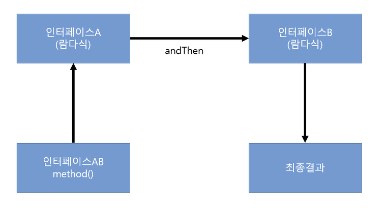
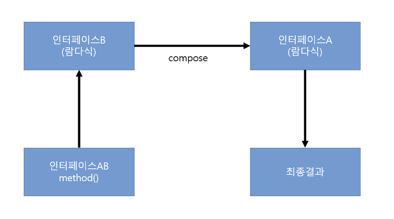
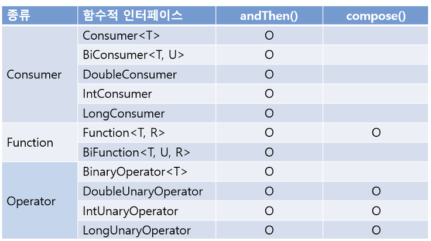
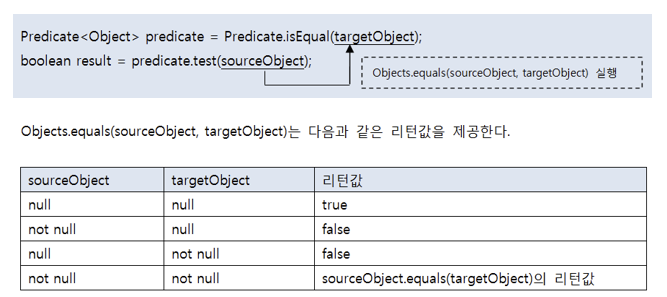

# 람다식
## 람다식이란?
자바는 함수적 프로그래밍을 위해 자바 8부터 람다식을 지원하며 기존과 많이 다른 코드 패턴을 가지며, 병렬처리와 이벤트 지향 프로그래밍에 적합하다. 람다는 익명 함수를 생성하기 위한 식이기 때문에 객체 지향 언어보다는 함수 지향 언어에 가깝다. 자바에서 람다식을 수용한 이유는 자바 코드가 매우 간결해지고, 컬렉션의 요소를 필터링하거나 매핑해서 원하는 결과를 쉽게 집계할 수 있기 때문이다. 람다식의 형태는 매개변수를 가진 코드 블록이지만, 런타임 시에는 익명 구현 객체를 생성한다.  
> 람다식 -> 매개변수를 가진 코드 블록 -> 익명 구현 객체
> ```java
> // 익명 구현 객체를 생성하는 전형적인 코드
> Runnable runnable = new Runnable() {
>   public void run() { ... }
> }
> ```
> ```java
> // 람다 표현식
> Runnable runnable () -> { ... };
> ```
> 어떤 인터페이스를 구현할 것인가는 대입되는 인터페이스가 무엇이냐에 달려있다. 위 코드는 Runnable 변수에 대입되므로 람다식은 Runnable의 익명 구현 객체를 생성하게 된다.

## 람다식 기본 문법
> ```java
> (int a) -> { System.out.println(a); }
> ```
> (타입 매개변수, ..)는 오른쪽 중괄호 { } 블록을 실행하기 위해 필요한 값을 제공하는 역할을 한다.

> ```java
> (a) -> { System.out.println(a); }
> ```
> 매개 변수의 타입은 런타임시에 대입값에 따라 자동으로 인식하기 때문에 생략가능

> ```java
> a ->  System.out.println(a); 
> ```
> 하나의 매개변수만 있을 경우에는 괄호( ) 생략 가능, 하나의 실행문만 있다면 중괄호 { } 생략가능

> ```java
> () -> { 실행문; ... }
> ```
> 매개변수가 없다면 괄호()를 생략할 수 없음

> ```java
> (x, y) -> { return x + y; }
> ```
> 리턴값이 있는 경우 return 문을 사용

> ```java
> (x, y) -> x + y
> ```
> 중괄호 { }에 return 문만 있을 경우, 중괄호와 return 생략 가능(둘은 같이 생략되어야 함)

## 타겟 타입과 함수적 인터페이스
> 인터페이스 변수 = 람다식

람다식은 매개변수를 가진 코드블록이기 때문에 마치 자바의 메소드를 선언하는것처럼 보여지지만 사실 이 메소드를 가진 객체를 생성하는 것이다. 인터페이스는 직접 객체화 할 수 없기 때문에 구현클래스가 필요한데, 람다식은 익명 구현 클래스를 생성하고 객체화 한다. <u>람다식은 대입될 인터페이스의 종류에 따라 작성 방법이 달라지기 때문에 람다식이 대입될 인터페이스를 람다식의 타겟 타입이라고 한다.</u>

### 함수적 인터페이스 (@FunctionalInterface)
모든 인터페이스를 타겟 타입으로 사용할 수는 없다. 람다식이 하나의 메소드를 정의하기 때문에 두 개 이상의 추상메소드가 선언된 인터페이스는 람다식을 이용해 구현객체를 생성할 수 없다. <u>하나의 추상메소드가 선언된 인터페이스만 람다식의 타겟 타입이 될 수 있는데, 이를 함수적 인터페이스라고 한다.</u> @FunctionalInterface 어노테이션을 이용하여 컴파일러의 문법 체크를 받을 수 있다.
```java
@FunctionalInterface
public interface MyFunctionalInterface {
    public void method();
    public void otherMethod(); // 컴파일 오류
}
```

### 매개변수와 리턴값이 없는 람다식
```java
@FunctionalInterface
public interface MyFunctionalInterface {
    public void method();
}
```
이 인터페이스를 타겟으로 갖는 람다식은 매개변수 없이 작성해야 한다. 이 함수적 인터페이스의 method()가 매개 변수를 가지지 않기 때문이다.

> MyFunctionalInterface fi = ( ) -> { ... } 

참고 : [MyFunctionalInterface](./example/basicSyntax/MyFunctionalInterface.java), [MyFunctionalInterfaceExample](./example/basicSyntax/MyFunctionalInterfaceExample.java)

### 매개 변수가 있는 람다식
```java
@FunctionalInteface
public interface MyFunctionalInterface {
    public void method(int x);
}
```
> MyFunctionalInterface fi = (x) -> { ... } 또는 x -> { ... }

참고 : [MyFunctionalInterface](./example/basicSyntax/MyFunctionalInterface.java), [MyFunctionalInterfaceExample](./example/basicSyntax/MyFunctionalInterfaceExample.java)

### 리턴값이 있는 람다식
```java
@FunctionalInterface
public interface MyFunctionalInterface {
    public int method(int x, int y);
}
```

> MyFunctionalInterface fi = (x, y) -> { return x + y; }  
> ~~MyFunctionalInterface fi = (x, y) ->  return x + y;~~ => 중괄호와 return은 항상 같이 생략되어야 함   
> MyFunctionalInterface fi = (x, y) -> x + y;   

## 클래스 멤버와 로컬변수 사용
람다식의 실행 블록에는 클래스의 멤버(필드와 메소드) 및 로컬 변수를 사용할 수 있다. 클래스의 멤버는 제약 사항 없이 사용가능하지만, 로컬 변수는 제약 사항이 따른다.  

### 클래스의 멤버 사용
람다식 실행 블록에는 클래스 멤버인 필드, 메소드를 제약없이 사용할 수 있다. 하지만 람다식에서의 this 키워드는 주의가 필요하다. 일반적으로 익명 객체 내부에서 this는 익명 객체의 참조이지만, 람다식에서 this는 내부적으로 생성되는 익명 객체의 참족 아니라 람다식을 실행한 객체의 참조이다.  

> 아래 예제는 람다식에서 바깥 객체와 중첩 객체의 참조를 얻어 필드값을 출력하는 방법을 보여주고 있다. 중첩 객체 Inner에서 람다식을 실행하기 때문에 람다식 내부에서 this는 중첩 객체 Inner이다.  

참고 : [UsingThis](./example/usingMemberAndVariable/UsingThis.java), [UsingThisExample](./example/usingMemberAndVariable/UsingThisExample.java)

### 로컬 변수 사용
람다식은 메소드 내부에서 주로 작성되기 때문에 로컬 익명 구현 객체(로컬 클래스)를 생성시킨다고 봐야 한다. 람다식에서 바깥 클래스의 필드나 메소드는 제한없이 사용할 수 있으나, 메소드의 매개 변수 또는 로컬 변수를 사용하면 이 두 변수는 final 특성을 가져야 한다. (로컬 클래스의 특징)

참고 : [UsingLocalVariable.java](./example/usingMemberAndVariable/UsingLocalVariable.java), [UsingLocalVariableExample.java](./example/usingMemberAndVariable/UsingLocalVariableExample.java)

## 표준 API의 함수적 인터페이스
자바에서 제공되는 표준 API에서 한 개의 추상 메소드를 가지는 인터페이스들은 모두 람다식을 이용해서 익명 구현 객체로 표현이 가능하다. 예를 들어 스레드의 작업을 정의하는 Runnable 인터페이스는 매개 변수와 리턴값이 없는 run() 메소드만 존재하기 때문에 다음과 같이 람다식을 이용해서 Runnable 인스턴스를 생성시킬 수 있다.  

```java
public class RunnableExample {
    public static void main(String[] args) {
        Runnable runnable = () -> {
            for(int i=0; i<10; i++) {
                System.out.println(i);
            }
        };
        
        Thread thread = new Thread(runnable);
        thread.start();
    }
}
```
Thread를 생성자를 호출할 때 다음과 같이 람다식을 매개값으로 대입해도 된다.   
```java
Thread thread = new Thread(() -> {
    for(int i=0; i<10; i++) {
        System.out.println(i);
    }
})
```

> <u>java 8 부터는 함수적 인터페이스가 java.util.function 표준 API 패키지로 제공한다. 이 패키지에서 제공하는 함수적 인터페이스의 목적은 메소드 또는 생성자의 매개 타입으로 사용되어 람다식을 대입할 수 있도록 하기 위해서이다.</u> 자바 8부터 추가되거나 변경된 API에서 이 함수적 인터페이스들을 매개타입으로 많이 사용한다. java.util.function 패키지의 함수적 인터페이스는 크게 5개로 구분되고 그 구분기준은 인터페이스에 선언된 추상 메소드의 매개값과 리턴값의 유무이다.  


| 종류        | 추상 메소드 특징                                                                 | 예시 구조도                                 |
|-------------|----------------------------------------------------------------------------------|--------------------------------------------|
| **Consumer**  | - 매개값은 있고, 리턴값은 없음                                                    | `매개값 → Consumer`                         |
| **Supplier**  | - 매개값은 없고, 리턴값은 있음                                                    | `Supplier → 리턴값`                         |
| **Function**  | - 매개값도 있고, 리턴값도 있음<br>- 주로 매개값을 리턴값으로 매핑(타입 변환)함     | `매개값 → Function → 리턴값`               |
| **Operator**  | - 매개값도 있고, 리턴값도 있음<br>- 주로 매개값을 연산하여 결과를 리턴             | `매개값 → Operator → 리턴값`               |
| **Predicate** | - 매개값은 있고, 리턴 타입은 boolean<br>- 매개값을 조사해서 true/false를 리턴      | `매개값 → Predicate → boolean`             |

### Consumer
Consumer 함수적 인터페이스의 특징은 리턴값이 없는 accept() 메소드를 가지고 있다. accept() 메서드는 매개값을 소비하는 역할만 한다. 매개변수의 타입과 수에 따라서 아래와 같은 Consumber들이 있다.  

| 인터페이스명              | 추상 메소드                         | 설명                             |
|---------------------------|-------------------------------------|----------------------------------|
| Consumer<T>               | void accept(T t)                    | 객체 T를 받아 소비               |
| BiConsumer<T, U>          | void accept(T t, U u)               | 객체 T와 U를 받아 소비           |
| DoubleConsumer            | void accept(double value)           | double 값을 받아 소비            |
| IntConsumer               | void accept(int value)              | int 값을 받아 소비               |
| LongConsumer              | void accept(long value)             | long 값을 받아 소비              |
| ObjDoubleConsumer<T>      | void accept(T t, double value)      | 객체 T와 double 값을 받아 소비   |
| ObjIntConsumer<T>         | void accept(T t, int value)         | 객체 T와 int 값을 받아 소비      |
| ObjLongConsumer<T>        | void accept(T t, long value)        | 객체 T와 long 값을 받아 소비     |

> Consumer<String> consumer = t -> { t를 소비하는 실행문; }

Consumer<T> 인터페이스를 타겟 타입으로 하는 람다식은 다음과 같이 작성할 수 있다. accept() 메소드는 매개값으로 T 객체를 가지므로 람다식도 한개의 매개변수를 사용한다. 타입 파라미터 T에 String이 대입되었기 때문에 람다식의 t 매개변수 타입은 String이 된다.

참고 : [CousnumerExample.java](./example/functionalInterfaceOfStandardAPI/ConsumerExample.java)

### Supplier
Supplier 함수적 인터페이스의 특징은 매개 변수가 없고 리턴값이 있는 getXXX() 메소드를 가지고 있다. 이 메소드들은 실행 후 호출한 곳으로 데이터를 리턴(공급)하는 역할을 한다. 리턴 타입에 따라서 아래와 같은 Supplier 함수적 인터페이스들이 있다.  

| 인터페이스명              | 추상 메소드                | 설명                         |
|---------------------------|----------------------------|------------------------------|
| Supplier<T>               | T get()                    | T 타입의 결과를 반환         |
| BooleanSupplier           | boolean getAsBoolean()     | boolean 값을 반환            |
| DoubleSupplier            | double getAsDouble()       | double 값을 반환             |
| IntSupplier               | int getAsInt()             | int 값을 반환                |
| LongSupplier              | long getAsLong()           | long 값을 반환               |

> Supplier<String> supplier = () -> { ...; return "문자열"; }

IntSupplier 인터페이스를 타겟 타입으로 하는 람다식은 다음과 같이 작성할 수 있다. getAsInt() 메소드가 매개값을 가지지 않으므로 람다식도 ()을 사용한다. 람다식의 중괄호 {}는 반드시 int값을 리턴하도록 해야한다.  

참고 : [SupplierExample.java](./example/functionalInterfaceOfStandardAPI/SupplierExample.java)

### Function
Function 함수적 인터페이스의 특징은 매개값과 리턴값이 있는 applyXXX() 메소드를 가지고 있다. 이 메소드들은 <u>매개값을 리턴값으로 매핑(타입 변환)하는 역할</u>을 한다.

| 인터페이스명              | 추상 메소드                    | 설명                                  |
|---------------------------|-------------------------------|---------------------------------------|
| Function<T, R>            | R apply(T t)                  | T 타입을 받아 R 타입으로 반환          |
| BiFunction<T, U, R>       | R apply(T t, U u)             | T, U 타입을 받아 R 타입으로 반환       |
| IntFunction<R>            | R apply(int value)            | int 값을 받아 R 타입으로 반환          |
| LongFunction<R>           | R apply(long value)           | long 값을 받아 R 타입으로 반환         |
| DoubleFunction<R>         | R apply(double value)         | double 값을 받아 R 타입으로 반환       |
| ToIntFunction<T>          | int applyAsInt(T value)       | T 타입을 받아 int 값으로 반환          |
| ToLongFunction<T>         | long applyAsLong(T value)     | T 타입을 받아 long 값으로 반환         |
| ToDoubleFunction<T>       | double applyAsDouble(T value) | T 타입을 받아 double 값으로 반환       |
| IntToDoubleFunction       | double applyAsDouble(int value) | int 값을 받아 double 값으로 반환    |
| IntToLongFunction         | long applyAsLong(int value)   | int 값을 받아 long 값으로 반환         |
| LongToDoubleFunction      | double applyAsDouble(long value) | long 값을 받아 double 값으로 반환 |
| LongToIntFunction         | int applyAsInt(long value)    | long 값을 받아 int 값으로 반환         |
| DoubleToIntFunction       | int applyAsInt(double value)  | double 값을 받아 int 값으로 반환       |
| DoubleToLongFunction      | long applyAsLong(double value)| double 값을 받아 long 값으로 반환      |

> FunctionExample1.java 예제는 List에 저장된 학생 객체를 하나씩 꺼내서 이름과 점수를 출력한다. FunctionExample의 printString() 메소드는 Function<Student, String> 매개변수를 가지고 있고, printInt() 메소드는 ToIntFunction<Student> 매개변수를 가지고 있으므로 이 메소드들을 호출할 때 매개값으로 람다식을 사용할 수 있다.


참고 : [FunctionExample1.java](./example/functionalInterfaceOfStandardAPI/FunctionExample1.java), [FunctionExample2.java](./example/functionalInterfaceOfStandardAPI/FunctionExample2.java)

### Operator
Operator 함수적 인터페이스는 Function과 동일하게 매개변수와 리턴값이 있는 applyXXX() 메소드를 가지고 있다. 하지만 이 메소드들은 <u>매개값을 리턴값으로 매핑(타입반환)하는 역할보다는 매개값을 이용해서 연산을 수행한 후 동일한 타입으로 리턴값을 제공</u>하는 역할을 한다.  

| 인터페이스명              | 추상 메소드              | 설명                                   |
|---------------------------|--------------------------|----------------------------------------|
| UnaryOperator<T>          | T apply(T t)             | T 타입을 받아 T 타입으로 반환 (단항 연산) |
| BinaryOperator<T>         | T apply(T t1, T t2)      | T 타입 두 개를 받아 T 타입으로 반환 (이항 연산) |
| IntUnaryOperator          | int applyAsInt(int operand)       | int 단항 연산 결과 반환          |
| LongUnaryOperator         | long applyAsLong(long operand)    | long 단항 연산 결과 반환         |
| DoubleUnaryOperator       | double applyAsDouble(double operand) | double 단항 연산 결과 반환    |
| IntBinaryOperator         | int applyAsInt(int left, int right)     | int 이항 연산 결과 반환         |
| LongBinaryOperator        | long applyAsLong(long left, long right) | long 이항 연산 결과 반환        |
| DoubleBinaryOperator      | double applyAsDouble(double left, double right) | double 이항 연산 결과 반환 |

> 다음 예제는 int[]배열에서 최대값과 최소값을 얻는다. maxOrMin() 메소드는 IntBinaryOperator 매개변수를 가지고 있다. 따라서 maxOrMin()을 호출할 때 람다식을 사용할 수 있다.  

참고 : [OperatorExample.java](./example/functionalInterfaceOfStandardAPI/OperatorExample.java)

### Predicate
Predicate 함수적 인터페이스는 매개 변수와 boolean 리턴값이 있는 testXXX() 메소드를 가지고 있다. <u>이 메소드들은 매개값을 조사해서 true 또는 false를 리턴하는 역할을 한다.</u>  

| 인터페이스명              | 추상 메소드                 | 설명                                 |
|---------------------------|-----------------------------|--------------------------------------|
| Predicate<T>              | boolean test(T t)           | T 타입을 검사하여 true/false 반환     |
| BiPredicate<T, U>         | boolean test(T t, U u)      | T, U 타입을 검사하여 true/false 반환 |
| IntPredicate              | boolean test(int value)     | int 값을 검사하여 true/false 반환     |
| LongPredicate             | boolean test(long value)    | long 값을 검사하여 true/false 반환    |
| DoublePredicate           | boolean test(double value)  | double 값을 검사하여 true/false 반환  |

> 다음 예제는 List에 저장된 남자 또는 여자 학생들의 평균점수를 출력한다. avg() 메소드는 Predicate<Student> 매개변수를 가지고 있다. 따라서 avg() 메소드를 호출할 때 매개값으로 람다식을 사용할 수 있다.  

참고 : [PredicateExample.java](./example/functionalInterfaceOfStandardAPI/PredicateExample.java), [Student.java](./example/functionalInterfaceOfStandardAPI/Student.java)

### andThen()과 compose() 디폴트 메소드
디폴트 및 정적 메소드는 추상 메소드가 아니기 때문에 함수적 인터페이스에 선언되어도 여전히 함수적 인터페이스의 성질을 잃어버리지 않는다. 여기서 함수적 인터페이스 성질이란 하나의 추상메소드를 가지고 있고 람다식으로 익명 구현 객체를 생성할 수 있는 것을 말한다. java.util.function 패키지의 함수적 인터페이스는 하나 이상의 디폴트 및 정적 메소드를 가지고 있다.  

> Consumer, Function, Operator 종류의 함수적 인터페이스는 andThen() 과 compose() 디폴트 메소드를 가지고 있다. andThen()과 compose() 메소드는 두 개의 함수적 인터페이스를 순차적으로 연결하고, 첫 번째 처리결과를 두 번째 매개값으로 제공해서 최종 결과값을 얻을 때 사용한다.

#### andThen( )
> 인터페이스AB = 인터페이스A.andThen(인터페이스B);  
> 최종결과 = 인터페이스AB.method();



> 인터페이스AB의 method()를 호출하면 우선 인터페이스A부터 처리하고 결과를 인터페이스B의 매개값으로 제공한다. 인터페이스B는 제공받은 매개값을 가지고 처리한 후 최종 결과를 리턴한다.  

#### compose( )
> 인터페이스AB = 인터페이스A.compose(인터페이스B);  
> 최종결과 = 인터페이스AB.method();



> 인터페이스AB의 method()를 호출하면 우선 인터페이스B부터 처리하고 결과를 인터페이스A의 매개값으로 제공한다. 인터페이스A는 제공받은 매개값을 가지고 처리한 후 최종 결과를 리턴한다.  



> 위는 andThen()과 compose() 디폴트 메소드를 제공하는 java.util.function 패키지의 함수적 인터페이스들이다.  

#### Consumer의 순차적 연결
> Consumer 종류의 함수적 인터페이스는 처리결과를 리턴하지 않기 때문에 <u>andThen() 디폴트 메소드는 함수적 인터페이스의 호출 순서만 정한다.</u> 다음 예제는 Consumer<Member> 함수적 인터페이스 두 개를 순차적으로 연결해서 실행한다. 첫 번째 Consumer<Member>는 이름을 출력하고, 두 번째 Consumer<Member>는 아이디를 출력한다.  

참고 : [ConsumerAndThenExample.java](./), [Member.java](./), [Address.java](./)

#### Function의 순차적 연결
> Function과 Operator 종류의 함수적 인터페이스는 먼저 실행한 함수적 인터페이스의 결과를 다음 함수적 인터페이스의 매개값으로 넘겨주고, 최종 처리 결과를 리턴한다.

> `Function<Member, Address>` + `Function<Address, String>` = `Function<Member, String>`

> Adress는 두 함수적 인터페이스 간의 전달 데이터이다. Address는 내부적으로 전달되기 때문에 최종 함수적 인터페이스의 형태는 입력 데이터가 Member, 출력 데이터가 String이 되는 Function<Member, String>이 된다. 다음 예제는 Member 객체의 필드인 Address()에서 city 정보를 얻어내기 위해 두 Function 함수적 인터페이스를 ahdThen()과 compose()를 이용해서 순차적으로 연결했다.

참고 : [FunctionalAndComposeExample.java](./example/functionalInterfaceOfStandardAPI/defaultMethod/FunctionalAndComposeExample.java)

### and(), or(), negate() 디폴트 메소드와 isEqual() 정적 메소드
Predicate 종류의 함수적 인터페이스는 and(), or(), negate() 디폴트 메소드를 가지고 있다. 이 메소드들은 각각 논리연산자인 &&, ||, !과 대응된다고 볼 수 있다. 
- and() 메소드는 두 Predicate가 모두 true를 리턴하면 최종적으로 true를 리턴하는 Predicate를 생성한다. 
- or() 메소드는 두 Predicate중 하나만 true를 리턴하더라도 최종적으로 true를 리턴하는 Predicate를 생성한다.
- negate() 메소드는 원래 Predicate의 결과가 true이면 false로 false이면 true를 리턴하는 새로운 Predicate를 생성한다.

다음은 and(), or(), negate() 디폴트 메소드를 제공하는 Predicate 함수적 인터페이스들이다.

| 인터페이스명             | and | or  | negate |
|--------------------------|-----|-----|--------|
| `Predicate<T>`           |  O  |  O  |   O    |
| `IntPredicate`           |  O  |  O  |   O    |
| `LongPredicate`          |  O  |  O  |   O    |
| `DoublePredicate`        |  O  |  O  |   O    |

> 다음 예제는 2의 배수와 3의 배수를 조사하는 두 Predicate를 논리연산한 새로운 Predicate를 생성한다.  

참고 : [PredicateAndOrNegateExample.java](./example/functionalInterfaceOfStandardAPI/defaultMethod/PredicateAndOrNegateExample.java)

Predicate<T>는 위 메서드 외에 isEqual() 정적 메소드를 추가로 제공한다. isEqual 메소드는 test()의 매개값인 sourceObject와 isEqual()의 매개값인 targetObject를 java.util.Objects 클래스의 equals() 매개값으로 제공하고, Objects.equals(sourceObject, targetObject)의 리턴값을 얻어 새로운 Predicate<T>를 생성한다.



> 다음 예제는 두 문자열을 비교하기 위해 Predicate의 isEqual() 정적 메소드를 사용하였다.  

참고 : [PredicateIsEqualExample.java](./example/functionalInterfaceOfStandardAPI/defaultMethod/PredicateIsEqualExample.java)

### minBy(), maxBy()
BinaryOperator<T> 함수적 인터페이스는 minBy()와 maxBy()를 제공한다. 이 두 메소드는 매개값으로 제공되는 Comparator를 이용해서 최대 T와 최소 T를 얻는 BinaryOperatr<T>를 리턴한다.

|리턴 타입|정적 메소드|
|---|---|
|BinaryOperator<T>|minBy(Comparator<? super T> comparator)|
|BinaryOperator<T>|maxBy(Comparator<? super T> comparator)|

> Comparator<T>는 다음과 같이 선언된 함수적 인터페이스이다. 
> - o1과 o2를 비교해서 o1이 작으면 음수를 리턴한다.
> - o1과 o2를 비교해서 o1가 크면 양수를 리턴한다.
> - o1과 o2를 비교해서 크기가 동일하면 0을 리턴한다.

```java
@FunctionalInterface
public interface Comparator<T> {
    public int compare(T o1, T o2);
}
```

참고 : [OperatorMinByMaxByExample.java](./example/functionalInterfaceOfStandardAPI/defaultMethod/OperatorMinByMaxByExample.java), [Fruit.java](./example/functionalInterfaceOfStandardAPI/defaultMethod/Fruit.java)


## 메소드 참조
메소드 참조란 메소드를 참조해서 매개 변수의 정보 및 리턴 타입을 알아내어, 람다식에서 불필요한 매개 변수를 제거하는 것이 목적이다.  
> 람다식은 종종 기존 메소드를 호출만 하는 경우가 많다. 예를 들어 두 개의 값을 받아 큰 수를 리턴하는 Math 클래스 max()의 정적 메소드를 호출하는 람다식은 아래와 같다.  
> ```java]
> (left, right) -> Math.max(left, right);
> ```
> 람다식은 단순히 두 개의 값을 Math.max()의 매개값으로 전달 역할만 하기 때문에 다소 불편해 보이는데, 이 경우 아래와 같이 메소드 참조를 이용하면 깔끔하게 처리할 수 있다.  
> ```java
> Math :: max; 
> ```
> 메소드 참조도 람다식과 마찬가지로 인터페이스의 익명 구현 객체로 생성되므로 타겟 타입이 인터페이스의 추상 메소드가 어떤 매개변수를 가지고, 리턴타입이 무엇인가에 따라 달라진다. IntBinaryOperator 인터페이스는 두 개의 int 값을 리턴하므로 Math::max 메소드 참조를 대입할 수 있다.
> ```java
> IntBinaryOperator operator = Math::max;
> ```
> 메소드 참조는 정적 또는 인스턴스 메소드를 참조할 수 있고, 생성자 참조도 가능하다.

### 정적 메소드와 인스턴스 메소드 참조
정적 메소드를 참조할 경우에는 클래스 이름 뒤에 :: 기호를 붙이고 정적 메소드 이름을 기술하면 된다.  
> 클래스 :: 메소드

인스턴스 메소드일 경우에는 먼저 객체를 생성한 다음 참조 변수 뒤에 :: 기호를 붙이고 인스턴스 메소드 이름을 기술하면 된다.
> 참조변수 :: 메소드  

> 다음 예제는 Caculator의 정적 및 인스턴스 메소드를 참조한다. 람다식이 메소드 참조로 대체되는 부분을 보여주는 예시이다.

참고 : [MethodReferencesExample.java](./example/methodReference/MethodReferencesExample.java), [Caculator.java](./example/methodReference/Calculator.java)

### 매개 변수의 메소드 참조
메소드는 람다식 외부의 클래스 멤버일 수도 있고, 람다식에서 제공되는 매개변수의 멤버일 수도 있다. 람다식에서 제공되는 a 매개변수의 메소드를 호출해서 b 매개변수의 매개값으로 사용하는 경우도 있다.  
> (a, b) -> {a.instanceMethod(b)}

위 식을 메소드 참조로 표현하면 a의 클래스 이름 뒤에 :: 기호를 붙이고 메소드 이름을 기술하면 된다. 작성 방법은 정적 메소드 참조와 동일하지만, a의 인스턴스 메소드가 참조되므로 전혀 다른 코드가 실행된다.  
> 클래스 :: instanceMethod

> 아래 예제는 두 문자열이 대소문자 구분없이 동일한 알파벳으로 구성되어 있는지를 비교한다.  

참고 : [ArgumentMethodReferencesExample.java](./example/methodReference/ArgumentMethodReferencesExample.java)

### 생성자 참조
메소드 참조는 생성자 참조도 포함한다. 생성자를 참조한다는 것은 객체의 생성을 의미한다. 단순히 메소드 호출로 구성된 람다식을 메소드 참조로 대치할 수 있듯이, 단순히 객체를 생성하고 리턴하도록 구성된 람다식은 생성자 참조로 대치할 수 있다.
> (a, b) -> { return new 클래스(a, b) }

위 경우를 생성자 참조로 표현하면 다음과 같다. 생성자가 오버로딩되어 여러개가 있을 경우, 컴파일러는 함수적 인터페이스의 추상 메소드와 동일한 매개변수 타입과 개수를 가지고 있는 생성자를 찾아 실행한다. 만약 해당 생성자가 존재하지 않으면 컴파일 오류가 발생한다.  
> 클래스 :: new

> 다음 예제는 생성자 참조를 이용해서 두 가지 방법으로 Member 객체를 생성한다.
> 1. Function<String, Member> 함수적 인터페이스의 Member apply(String) 메소드를 이용해서 Member 객체 생성  
> 2. BiFunction<String, String, Member> 함수적 인터페이스의 Member apply(String, String) 메소드를 이용해서 Member객체 생성  
> 생성자 참조는 두 가지 방법 모두 동일하지만, 실행되는 Member 생성자가 다름을 볼 수 있다.  

참고 : [ConstructorReferencesExample.java](./example/methodReference/ConstructorReferencesExample.java), [Member.java](./example/methodReference/Member.java)

## [연습문제 풀이](./ChapterTest.md)