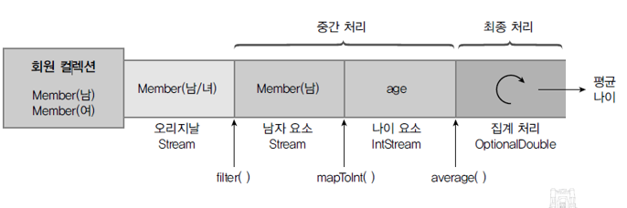

# 스트림과 병렬 처리
스트림은 자바8부터 추가된 컬렉션(배열 포함)의 저장 요소를 하나씩 참조해서 람다식으로 처리할 수 있도록 해주는 반복자이다.  

# 반복자 스트림
자바7 이전까지는 List<String> 컬렉션에서 요소를 순차적으로 처리하기 위해 Iterator 반복자를 다음과 같이 사용해왔다.  
```java
List<String> list = Arrays.asList("홍길동", "신용권", "김자바");
Iterator<String> iterator = list.iterator();
while(iterator.hasNext()) {
    String name = iterator.next();
    System.out.println(name);
}
```
이 코드를 Stream을 사용해서 변경하면 다음과 같다.
```java
List<String> list = Arrays.asList("홍길동", "신용권", "김자바");
Stream<String> stream = list.stream();
stream.forEach( name -> System.out.println(name) );
```
java.util.Collection의 stream() 메소드로 스트림 객체를 얻고 나서 `stream.forEach( name -> System.out.println(name) );` 메소드를 통해 컬렉션의 요소를 하나씩 콘솔에 출력한다. .forEach() 메소드는 다음과 같이 Consumer 함수적 인터페이스 타입의 매개값을 가지므로 컬렉션의 요소를 소비할 코드를 람다식으로 기술할 수 있다. 
```java
void forEach(Consumer<T> action) 
```
> Iterator를 사용한 코드와 Stream을 사용한 코드를 비교해보면 Stream을 사용하는 것이 훨씬 단순해 보인다. 다음 예제는 List<String> 컬렉션의 String 요소를 Iterator와 Stream을 이용해서 순차적으로 콘솔에 출력한다.

참고 : [IteratorVsStreamExample.java](./example/commonFeatures/IteratorVsStreamExample.java)

# 스트림의 특징
stream은 Iterator와 비슷한 역할을 하는 반복자이지만, 람다식으로 요소 처리 코드를 제공하는 점과 내부 반복자를 사용하므로 병렬 처리가 쉽다는 점 그리고 중간 처리와 최종 처리 작업을 수행하는 점에서 많은 차이를 가지고 있다.

## 람다식으로 요소 처리 코드를 제공한다.
strema이 제공하는 대부분의 요소 처리 메소드는 함수적 인터페이스 매개 타입을 가지기 때문에 람다식 또는 메소드 참조를 이용해서 요소 처리 내용을 매개값으로 전달할 수 있다.  
> 다음 예제는 컬렉션에 저장된 Student를 하나씩 가져와 학생 이름과 성적을 콘솔에 출력하도록 forEach() 메소드의 매개값으로 람다식을 주었다.

```java
// LambdaExpressionExample.java - 요소 처리를 위한 람다식
public class LambdaExpressionExample {
    public static void main(String[] args) {
        List<Student> list = Arrays.asList(
                new Student("홍길동", 90),
                new Student("신용권", 93)
        );

        Stream<Student> stream = list.stream();
        stream.forEach( s -> {
            String name = s.getName();
            int score = s.getScore();
            System.out.println(name + "-" + score);
        });
    }
}

// Student.java - 학생 클래스
class Student {
    private String name;
    private int score;

    public Student(String name, int score) {
        this.name = name;
        this.score = score;
    }
}
```

참고 : [LambdaExpressionExample.java](./example/commonFeatures/LambdaExpressionExample.java)

## 내부 반복자를 사용하므로 병렬 처리가 쉽다.
외부 반복자(external iterator)란 개발자가 코드로 직접 컬렉션의 요소를 반복해서 가져오는 코드 패턴을 말한다. index를 이용하는 for문 그리고 Itreator를 이용하는 while문은 모두 외부 반복자를 이용하는 것이다. 반면에 내부 반복자(internal iterator)는 컬렉션 내부에서 요소들을 반복시키고, 개발자는 요소당 처리해야 할 코드만 제공하는 코드 패턴을 말한다.  


내부 반복자를 사용해서 얻는 이점은 컬렉션 내부에서 어떻게 요소를 반복시킬 것인가는 컬렉션에게 맡겨두고, 개발자는 요소 처리 코드에만 집중할 수 있다는 것이다. 내부 반복자는 요소들의 반복 순서를 변경하거나, 멀티 코어 CPU를 최대한 활용하기 위해 요소들을 분배시켜 병렬 작업을 할 수 있게 도와주기 때문에 하나씩 처리하는 순차적 외부 반복자보다는 효율적으로 요소를 반복시킬 수 있다.  


Iterator는 컬렉션의 요소를 가져오는 것에서부터 처리하는 것까지 모두 개발자가 작성해야 하지만 스트림은 람다식으로 요소 처리 내용만 전달할 뿐, 반복은 컬렉션 내부에서 일어난다. 스트림을 이용하면 코드도 간결해지지만 무엇보다도 요소의 병렬 처리가 컬렉션 내부에서 처리되므로 일석이조의 효과를 가져온다.  
병렬(parallel) 처리란 한 가지 작업을 서브 작업으로 나누고, 서브 작업들을 분리된 스레드에서 병렬적으로 처리하는 것을 말한다. 병렬 처리 스트림을 이용하면 런타임 시 하나의 작업을 서브 작업으로 자동으로 나누고, 서브 작업의 결과를 자도응로 결합해서 최종 결과물을 생성한다.  

> 다음 예제는 순차 처리 스트림과 병렬 처리 스트림을 이용할 경우, 사용된 스레드의 이름이 무엇인지 콘솔에 출력한다. 실행 결과를 보면 병렬 처리 스트림은 main 스레드를 포함해서 ForkJoinPool(스레드풀)의 작업 스레드들이 병렬적으로 요소를 처리하는 것을 볼 수 있다.  

```java
// ParalleleExample.java - 병렬처리
public class ParallelExample {
    public static void main(String[] args) {
        List<String> list = Arrays.asList("홍길동", "신용권", "김자바", "람다식", "박병렬");

        // 순차 처리
        Stream<String> stream = list.stream();
        stream.forEach(ParallelExample :: print);   // 메소드 참조(s->ParallelExample(s)와 동일)

        System.out.println();

        // 병렬 처리
        Stream<String> parallelStream = list.parallelStream();
        parallelStream.forEach(ParallelExample :: print);
    }

    public static void print(String str) {
        System.out.println(str + " : " + Thread.currentThread().getName());
    }
}
```
> 실행결과
> 
> 

참고 : [ParallelExample.java](./example/commonFeatures/ParallelExample.java)

## 스트림은 중간 처리와 최종 처리를 할 수 있다.
스트림은 컬렉션의 요소에 대해 중간 처리와 최종 처리를 할 수 있는데, 중간 처리에서는 매핑, 필터링, 정렬을 수행하고, 최종 처리에서는 반복, 카운팅, 평균, 총합 등의 집계처리를 수행한다.  


예를 들어 학생 객체를 요소로 가지는 컬렉션이 있다고 가정해보자. 중간 처리에서는 학생의 점수를 뽑아내고, 최종 처리에서는 점수의 평균값을 산출한다.  


즉, 중간연산은 스트림을 변환하거나 필터링 하는 등의 작업을 수행하며, 다음 단계 처리를 위해 새로운 스트림을 리턴하는데, 체인 형태로 연속해 여러 번 호출될 수 있다. 종료연산은 스트림의 원소를 이용해 최종 결과를 만들어 리턴한다.

> 다음 예쩨는 List에 저장되어 있는 Student 객체를 중간 처리해서 score 필드값으로 매핑하고, 최종 처리에서 score의 평균값을 산출한다.  
```java
// MapAndReduceExample.java - 중간 처리와 최종 처리
public class MapAndReduceExample {
    public static void main(String[] args) {
        List<Student> studentList = Arrays.asList(
                new Student("홍길동", 10),
                new Student("신용권", 20),
                new Student("유미선", 30)
        );

        double avg = studentList.stream()
                /* 중간 처리 */
//                .mapToInt(s -> s.getScore())
                .mapToInt(Student :: getScore)
                /* 최종 처리 */
                .average()
                .getAsDouble();

        System.out.println("평균점수: " + avg);
    }
}
```

참고 : [MapAndReduceExample.java](./example/commonFeatures/MapAndReduceExample.java)

# 스트림의 종류
자바 8부터 새로 추가된 java.util.stream 패키지에는 stream API들이 포진하고 있다. 패키지 내용을 보면 BaseStream 인터페이스를 부모로 해서 자식 인터페이스들이 다음과 같은 상속 관계를 이루고 있다.  


BaseStream 인터페이스에는 모든 스트림에서 사용할 수 있는 공통 메소드들이 정의되어 있을 뿐 코드에서 직접적으로 사용되지는 않는다. 하위 스트림들이 직접적으로 이용되는 스트림인데, Stream은 객체 요소를 처리하는 스트림이고, IntStream, LongStream, DoubleStream은 각각 기본 타입인 int, long, double 요소를 처리하는 스트림이다. 이 인터페이스의 구현 객체는 다양한 소스로부터 얻을 수 있다. 주로 컬렉션과 배열에서 얻지만, 다음과 같은 소스로부터 스트림 구현 객체를 얻을 수도 있다.  

| 리턴 타입     | 메소드(매개변수)                                                                                  | 소스         |
|--------------|---------------------------------------------------------------------------------------------------|--------------|
| Stream<T>    | java.util.Collection.stream()<br>java.util.Collection.parallelStream()                              | 컬렉션       |
| Stream<T><br>IntStream<br>LongStream<br>DoubleStream | Arrays.stream(T[])<br>Stream.of(T[])<br>Arrays.stream(int[])<br>IntStream.of(int[])<br>Arrays.stream(long[])<br>LongStream.of(long[])<br>Arrays.stream(double[])<br>DoubleStream.of(double[]) | 배열         |
| IntStream    | IntStream.range(int, int)<br>IntStream.rangeClosed(int, int)                                        | int 범위     |
| Stream<T>    | Stream.empty()                                                                                      | 비어있는 스트림 |
| Stream<T>    | Stream.generate(Supplier<T>)<br>Stream.iterate(T, UnaryOperator<T>)                                 | 함수         |
| Stream<T>    | Pattern.compile(정규표현식).splitAsStream(CharSequence)                                             | 문자열       |
| Stream<Path> | Files.list(Path)<br>Files.walk(Path)<br>Files.find(Path, int, BiPredicate<Path, BasicFileAttributes>) | 파일 시스템  |
| Stream<String> | BufferedReader.lines()                                                                            | 파일 읽기    |
| Stream<JarEntry> | new JarFile(File).stream()                                                                      | JAR 파일     |
| Stream<Row>  | ResultSet을 Stream으로 변환 (Java 직접 지원은 안되지만 변환 가능)                                       | 데이터베이스 |
| Stream<T>    | StreamSupport.stream(Spliterator<T>, boolean)                                                       | Spliterator  |

## 컬렉션으로부터 스트림 얻기

> 다음 예제는 List<Student> 컬렉션에서 Stream<Student>를 얻어내고 요소를 콘솔에 출력한다. 

```java
// FromCollectionExample.java - 컬렉션으로부터 스트림 얻기
public class FromCollectionExample {
    public static void main(String[] args) {
        List<Student> studentList = Arrays.asList(
                new Student("홍길동", 10),
                new Student("신용권", 20),
                new Student("유미선", 30)
        );

        Stream<Student> stream = studentList.stream();
//        stream.forEach(s -> System.out.println(s.getName()));
        stream.map(Student::getName).forEach(System.out::println);
    }
}

// Student.java - 학생 클래스
class Student {
    private String name;
    private int score;

    public Student(String name, int score) {
        this.name = name;
        this.score = score;
    }

    public String getName() { return name; }
    public int getScore() { return score; }
}
```
참고 : [FromCollectionExample](./example/kindsOfStream/FromCollectionExample.java)

## 배열로부터 스트림 얻기
> 다음 예제는 String[]과 int[] 배열로부터 스트림을 얻어내고 콘솔에 출력한다.

```java
// FromArrayExample.java - 배열로부터 스트림 얻기
public class FromArrayExample {
    public static void main(String[] args) {
        String[] strArray = {"홍길동", "신용권", "김미나"};
        Stream<String> strStream = Arrays.stream(strArray);
        strStream.forEach(a -> System.out.println(a + ", "));
        System.out.println();

        int[] intArray = {1, 2, 3, 4, 5};
        IntStream intStream = Arrays.stream(intArray);
        intStream.forEach(a -> System.out.println(a + ", "));
        System.out.println();
    }
}
```
참고 : [FromArrayExample](./example/kindsOfStream/FromArrayExample.java)

## 숫자 범위로부터 스틑림 얻기
>다음은 1부터 100까지 합을 구하기 위해 IntStream의 rangeClosed() 메소드를 이용하였다. rageClosed()는 첫 번째 매개값에서부터 두 번째 매개값까지 순차적으로 제공하는 IntStream을 리턴한다. IntStream의 또 다른 range() 메소드도 동일한 IntStream을 리턴하는데, 두 번째 매개값은 포함하지 않는다.  
```java
// FromIntRangeExample.java - 정수 범위를 소스로 하는 스트림
public class FromIntRangeExample {
    public static int sum;
    public static void main(String[] args) {
        IntStream stream = IntStream.rangeClosed(1, 100);
        stream.forEach(a -> sum += a);
        System.out.println("총합: " + sum);
    }
}

```

참고 : [FromIntRangeExample](./example/kindsOfStream/FromIntRangeExample.java)

## 파일로부터 스트림 얻기
> 다음 예제는 Files의 정적 메소드인 lines()와 BufferedReader의 lines() 메소드를 이용하여 문자 파일의 내용을 스트림을 통해 행 단위로 읽고 콘솔에 출력한다.  

```java
// FromFileContentExample.java - 파일 내용을 소스로 하는 스트림
public class FromFileContentExample {
    public static void main(String[] args) throws IOException {
        Path path = Paths.get("./src/sec16_streamIterator/example/kindsOfStream/linedata.txt");
        Stream<String> stream;

        // Files.lines() 메소드 이용
        stream = Files.lines(path, Charset.defaultCharset());
        stream.forEach( System.out :: println );
        System.out.println();

        // BufferedReader의 lines() 메소드 이동
        File file = path.toFile();
        FileReader fileReader = new FileReader(file);
        BufferedReader br = new BufferedReader(fileReader);
        stream = br.lines();
        stream.forEach( System.out :: println );
    }
}

```

참고 : [FromFileContentExample](./example/kindsOfStream/FromFileContentExample.java)

## 디렉토리로부터 스트림 얻기

> 다음 예제는 Files의 정적 메소드인 list()를 이용해서 디렉토리의 내용(서브 디렉토리 또는 파일 목록)을 스트림을 통해 읽고 콘솔에 출력한다.  

```java
// FromDirectoryExample.java - 디렉토리 내용을 소스로 하는 스트림
public class FromDirectoryExample {
    public static void main(String[] args) throws IOException {
        Path path = Paths.get("./src");
        Stream<Path> stream = Files.list(path);
        stream.map(Path::getFileName).forEach(System.out::println);
    }
}
```
참고 : [FromDirectoryExample.javs](./example/kindsOfStream/FromDirectoryExample.java)

# 스트림 파이프라인
대량의 데이터를 가공해서 축소하는 것을 일반적으로 Reduction이라고 하는데, 데이터의 합계, 평균값, 카운팅, 최대값, 최소값 등이 대표적인 리덕션의 결과물이라고 볼 수 있다. 그러나 컬렉션 요소를 리덕션의 결과물로 바로 집계할 수 없을 경우에는 집계하기 좋도록 필터링, 매핑, 정렬, 그룹핑 등의 중간 처리가 필요하다.  

## 중간 처리와 최종 처리
스트림은 데이터의 필터링, 매핑, 정렬, 그룹핑 등의 중간 처리와 합계, 평균, 카운팅, 최대값, 최소값 등의 최종 처리를 파이프라인으로 해결한다. 파이프라인은 여러개의 스트림이 연결되어 있는 구조를 말한다. 파이프라인에서 최종 처리를 제외하고는 모두 중간 처리 스트림이다.  


중간 스트림이 생성될 때 요소들이 바로 중간 처리(필터링, 매핑, 정렬)되는 것이 아니라 최종 처리가 시작되기 전까지 중간 처리는 지연(lazy)된다. 최종 처리가 시작되면 비로소 컬렉션의 요소가 하나씩 중간 스트림에서 처리되고 최종 처리까지 오게 된다.  
Stream 인터페이스에는 필터링, 매핑, 정렬 등의 많은 중간 처리 메소드가 있는데, 이 메소드들은 중간 처리된 스트림을 리턴한다. 그리고 이 스트림에서 다시 중간 처리 메소드를 호출해서 파이프라인을 형성하게 된다.  



파이프 라인을 자바 코드로 표현하면 다음과 같다.
```java
Stream<Member> maleFemaleStream = list.stream();
Stream<Member> maleStream = maleFemaleStream.filter(m -> m.getSex() == Member.MALE);
IntStream ageStream = maleStream.mapToInt(Member::getAge);
OptionalDouble optionalDouble = ageStream.average();
double ageAvg = optionalDouble.getAsDouble();
```
로컬 변수를 생략하고 연결하면 다음과 같은 형태의 파이프라인 코드만 남는다.
```java
double ageAVG = list.stream()
        .filter(m -> m.getSex()==Member.MALE)
        .mapToInt(Member::getAge)
        .average()
        .getAsDouble();
```

> 다음은 위 코드에 대한 예제이다.

```java
// StreamPipeLinesExample.java - 스트림 파이프라인
public class StreamPipeLinesExample {
    public static void main(String[] args) {
        List<Member> list = Arrays.asList(
                new Member("홍길동", Member.MALE, 30),
                new Member("김나리", Member.FEMALE, 20),
                new Member("신용권", Member.MALE, 45),
                new Member("박수미", Member.FEMALE, 27)
        );

        double ageAvg = list.stream()
                .filter(m -> m.getSex() == Member.MALE)
                .mapToInt(Member::getAge)
                .average()
                .getAsDouble();

        System.out.println("남자 평균 나이: " + ageAvg);
    }
}

// Member.java - 회원 클래스
class Member {
    public static int MALE = 0;
    public static int FEMALE = 1;

    private String name;
    private int sex;
    private int age;

    public Member(String name, int sex, int age) {
        this.name = name;
        this.sex = sex;
        this.age = age;
    }

    public int getSex() { return sex; }
    public int getAge() { return age; }
}
```

참고 : [StreamPipeLinesExample.java](./example/streamPipeline/StreamPipeLinesExample.java)

## 중간 처리 메소드와 최종 처리 메소드


중간 처리 메소드와 최종 처리 메소드를 쉽게 구분하는 방법은 리턴 타입을 보면 된다. 리턴 타입이 스트림이라면 중간 처리 메소드이고, 기본 타입이거나 OptionalXXX라면 최종 처리 메소드이다. 소속된 인터페이스에서 공통의 의미는 Stream, IntStream, LongStream, DoubleStream에서 모두 제공된다는 뜻이다.  

# 필터링(distinct(), filter())