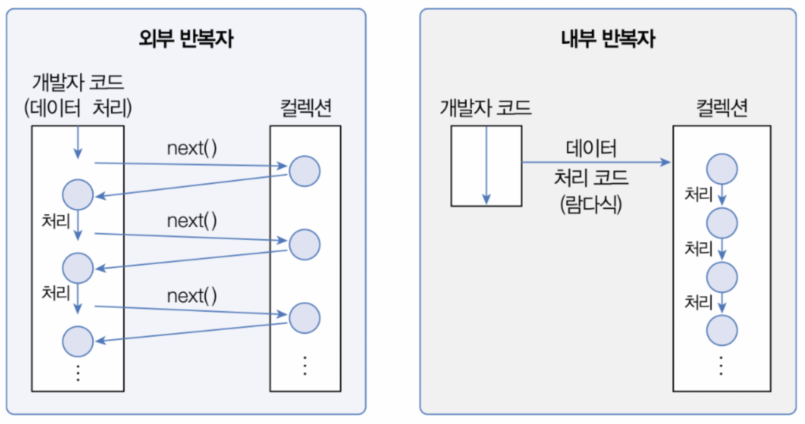
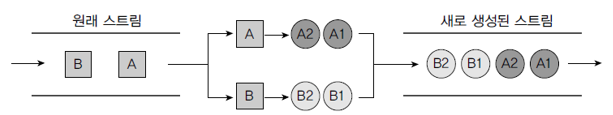
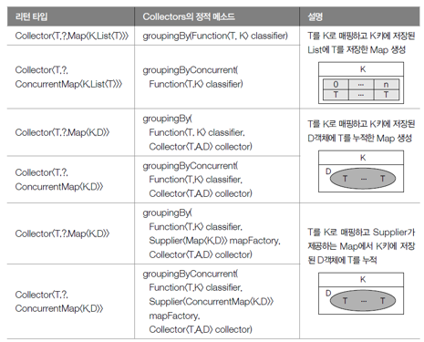

# 스트림과 병렬 처리
스트림은 자바8부터 추가된 컬렉션(배열 포함)의 저장 요소를 하나씩 참조해서 람다식으로 처리할 수 있도록 해주는 반복자이다.  

# 반복자 스트림
자바7 이전까지는 List\<String> 컬렉션에서 요소를 순차적으로 처리하기 위해 Iterator 반복자를 다음과 같이 사용해왔다.  
```java
List<String> list = Arrays.asList("홍길동", "신용권", "김자바");
Iterator<String> iterator = list.iterator();
while(iterator.hasNext()) {
    String name = iterator.next();
    System.out.println(name);
}
```
이 코드를 Stream을 사용해서 변경하면 다음과 같다.
```java
List<String> list = Arrays.asList("홍길동", "신용권", "김자바");
Stream<String> stream = list.stream();
stream.forEach( name -> System.out.println(name) );
```
java.util.Collection의 stream() 메소드로 스트림 객체를 얻고 나서 `stream.forEach( name -> System.out.println(name) );` 메소드를 통해 컬렉션의 요소를 하나씩 콘솔에 출력한다. .forEach() 메소드는 다음과 같이 Consumer 함수적 인터페이스 타입의 매개값을 가지므로 컬렉션의 요소를 소비할 코드를 람다식으로 기술할 수 있다. 
```java
void forEach(Consumer<T> action) 
```
> Iterator를 사용한 코드와 Stream을 사용한 코드를 비교해보면 Stream을 사용하는 것이 훨씬 단순해 보인다. 다음 예제는 List\<String> 컬렉션의 String 요소를 Iterator와 Stream을 이용해서 순차적으로 콘솔에 출력한다.

참고 : [IteratorVsStreamExample.java](./example/commonFeatures/IteratorVsStreamExample.java)

# 스트림의 특징
stream은 Iterator와 비슷한 역할을 하는 반복자이지만, 람다식으로 요소 처리 코드를 제공하는 점과 내부 반복자를 사용하므로 병렬 처리가 쉽다는 점 그리고 중간 처리와 최종 처리 작업을 수행하는 점에서 많은 차이를 가지고 있다.

## 람다식으로 요소 처리 코드를 제공한다.
strema이 제공하는 대부분의 요소 처리 메소드는 함수적 인터페이스 매개 타입을 가지기 때문에 람다식 또는 메소드 참조를 이용해서 요소 처리 내용을 매개값으로 전달할 수 있다.  
> 다음 예제는 컬렉션에 저장된 Student를 하나씩 가져와 학생 이름과 성적을 콘솔에 출력하도록 forEach() 메소드의 매개값으로 람다식을 주었다.

```java
// LambdaExpressionExample.java - 요소 처리를 위한 람다식
public class LambdaExpressionExample {
    public static void main(String[] args) {
        List<Student> list = Arrays.asList(
                new Student("홍길동", 90),
                new Student("신용권", 93)
        );

        Stream<Student> stream = list.stream();
        stream.forEach( s -> {
            String name = s.getName();
            int score = s.getScore();
            System.out.println(name + "-" + score);
        });
    }
}

// Student.java - 학생 클래스
class Student {
    private String name;
    private int score;

    public Student(String name, int score) {
        this.name = name;
        this.score = score;
    }
}
```

참고 : [LambdaExpressionExample.java](./example/commonFeatures/LambdaExpressionExample.java)

## 내부 반복자를 사용하므로 병렬 처리가 쉽다.
외부 반복자(external iterator)란 개발자가 코드로 직접 컬렉션의 요소를 반복해서 가져오는 코드 패턴을 말한다. index를 이용하는 for문 그리고 Itreator를 이용하는 while문은 모두 외부 반복자를 이용하는 것이다. 반면에 내부 반복자(internal iterator)는 컬렉션 내부에서 요소들을 반복시키고, 개발자는 요소당 처리해야 할 코드만 제공하는 코드 패턴을 말한다.  



내부 반복자를 사용해서 얻는 이점은 컬렉션 내부에서 어떻게 요소를 반복시킬 것인가는 컬렉션에게 맡겨두고, 개발자는 요소 처리 코드에만 집중할 수 있다는 것이다. 내부 반복자는 요소들의 반복 순서를 변경하거나, 멀티 코어 CPU를 최대한 활용하기 위해 요소들을 분배시켜 병렬 작업을 할 수 있게 도와주기 때문에 하나씩 처리하는 순차적 외부 반복자보다는 효율적으로 요소를 반복시킬 수 있다.  


Iterator는 컬렉션의 요소를 가져오는 것에서부터 처리하는 것까지 모두 개발자가 작성해야 하지만 스트림은 람다식으로 요소 처리 내용만 전달할 뿐, 반복은 컬렉션 내부에서 일어난다. 스트림을 이용하면 코드도 간결해지지만 무엇보다도 요소의 병렬 처리가 컬렉션 내부에서 처리되므로 일석이조의 효과를 가져온다.  
병렬(parallel) 처리란 한 가지 작업을 서브 작업으로 나누고, 서브 작업들을 분리된 스레드에서 병렬적으로 처리하는 것을 말한다. 병렬 처리 스트림을 이용하면 런타임 시 하나의 작업을 서브 작업으로 자동으로 나누고, 서브 작업의 결과를 자도응로 결합해서 최종 결과물을 생성한다.  

> 다음 예제는 순차 처리 스트림과 병렬 처리 스트림을 이용할 경우, 사용된 스레드의 이름이 무엇인지 콘솔에 출력한다. 실행 결과를 보면 병렬 처리 스트림은 main 스레드를 포함해서 ForkJoinPool(스레드풀)의 작업 스레드들이 병렬적으로 요소를 처리하는 것을 볼 수 있다.  

```java
// ParalleleExample.java - 병렬처리
public class ParallelExample {
    public static void main(String[] args) {
        List<String> list = Arrays.asList("홍길동", "신용권", "김자바", "람다식", "박병렬");

        // 순차 처리
        Stream<String> stream = list.stream();
        stream.forEach(ParallelExample :: print);   // 메소드 참조(s->ParallelExample(s)와 동일)

        System.out.println();

        // 병렬 처리
        Stream<String> parallelStream = list.parallelStream();
        parallelStream.forEach(ParallelExample :: print);
    }

    public static void print(String str) {
        System.out.println(str + " : " + Thread.currentThread().getName());
    }
}
```
> 실행결과
> 
> 

참고 : [ParallelExample.java](./example/commonFeatures/ParallelExample.java)

## 스트림은 중간 처리와 최종 처리를 할 수 있다.
스트림은 컬렉션의 요소에 대해 중간 처리와 최종 처리를 할 수 있는데, 중간 처리에서는 매핑, 필터링, 정렬을 수행하고, 최종 처리에서는 반복, 카운팅, 평균, 총합 등의 집계처리를 수행한다.  


예를 들어 학생 객체를 요소로 가지는 컬렉션이 있다고 가정해보자. 중간 처리에서는 학생의 점수를 뽑아내고, 최종 처리에서는 점수의 평균값을 산출한다.  


즉, 중간연산은 스트림을 변환하거나 필터링 하는 등의 작업을 수행하며, 다음 단계 처리를 위해 새로운 스트림을 리턴하는데, 체인 형태로 연속해 여러 번 호출될 수 있다. 종료연산은 스트림의 원소를 이용해 최종 결과를 만들어 리턴한다.

> 다음 예쩨는 List에 저장되어 있는 Student 객체를 중간 처리해서 score 필드값으로 매핑하고, 최종 처리에서 score의 평균값을 산출한다.  
```java
// MapAndReduceExample.java - 중간 처리와 최종 처리
public class MapAndReduceExample {
    public static void main(String[] args) {
        List<Student> studentList = Arrays.asList(
                new Student("홍길동", 10),
                new Student("신용권", 20),
                new Student("유미선", 30)
        );

        double avg = studentList.stream()
                /* 중간 처리 */
//                .mapToInt(s -> s.getScore())
                .mapToInt(Student :: getScore)
                /* 최종 처리 */
                .average()
                .getAsDouble();

        System.out.println("평균점수: " + avg);
    }
}
```

참고 : [MapAndReduceExample.java](./example/commonFeatures/MapAndReduceExample.java)

# 스트림의 종류
자바 8부터 새로 추가된 java.util.stream 패키지에는 stream API들이 포진하고 있다. 패키지 내용을 보면 BaseStream 인터페이스를 부모로 해서 자식 인터페이스들이 다음과 같은 상속 관계를 이루고 있다.  


BaseStream 인터페이스에는 모든 스트림에서 사용할 수 있는 공통 메소드들이 정의되어 있을 뿐 코드에서 직접적으로 사용되지는 않는다. 하위 스트림들이 직접적으로 이용되는 스트림인데, Stream은 객체 요소를 처리하는 스트림이고, IntStream, LongStream, DoubleStream은 각각 기본 타입인 int, long, double 요소를 처리하는 스트림이다. 이 인터페이스의 구현 객체는 다양한 소스로부터 얻을 수 있다. 주로 컬렉션과 배열에서 얻지만, 다음과 같은 소스로부터 스트림 구현 객체를 얻을 수도 있다.  

| 리턴 타입     | 메소드(매개변수)                                                                                  | 소스         |
|--------------|---------------------------------------------------------------------------------------------------|--------------|
| Stream\<T>    | java.util.Collection.stream()<br>java.util.Collection.parallelStream()                              | 컬렉션       |
| Stream\<T><br>IntStream<br>LongStream<br>DoubleStream | Arrays.stream(T[])<br>Stream.of(T[])<br>Arrays.stream(int[])<br>IntStream.of(int[])<br>Arrays.stream(long[])<br>LongStream.of(long[])<br>Arrays.stream(double[])<br>DoubleStream.of(double[]) | 배열         |
| IntStream    | IntStream.range(int, int)<br>IntStream.rangeClosed(int, int)                                        | int 범위     |
| Stream\<T>    | Stream.empty()                                                                                      | 비어있는 스트림 |
| Stream\<T>    | Stream.generate(Supplier\<T>)<br>Stream.iterate(T, UnaryOperator\<T>)                                 | 함수         |
| Stream\<T>    | Pattern.compile(정규표현식).splitAsStream(CharSequence)                                             | 문자열       |
| Stream\<Path> | Files.list(Path)<br>Files.walk(Path)<br>Files.find(Path, int, BiPredicate\<Path, BasicFileAttributes>) | 파일 시스템  |
| Stream\<String> | BufferedReader.lines()                                                                            | 파일 읽기    |
| Stream\<JarEntry> | new JarFile(File).stream()                                                                      | JAR 파일     |
| Stream\<Row>  | ResultSet을 Stream으로 변환 (Java 직접 지원은 안되지만 변환 가능)                                       | 데이터베이스 |
| Stream\<T>    | StreamSupport.stream(Spliterator\<T>, boolean)                                                       | Spliterator  |

## 컬렉션으로부터 스트림 얻기

> 다음 예제는 List\<Student> 컬렉션에서 Stream\<Student>를 얻어내고 요소를 콘솔에 출력한다. 

```java
// FromCollectionExample.java - 컬렉션으로부터 스트림 얻기
public class FromCollectionExample {
    public static void main(String[] args) {
        List<Student> studentList = Arrays.asList(
                new Student("홍길동", 10),
                new Student("신용권", 20),
                new Student("유미선", 30)
        );

        Stream<Student> stream = studentList.stream();
//        stream.forEach(s -> System.out.println(s.getName()));
        stream.map(Student::getName).forEach(System.out::println);
    }
}

// Student.java - 학생 클래스
class Student {
    private String name;
    private int score;

    public Student(String name, int score) {
        this.name = name;
        this.score = score;
    }

    public String getName() { return name; }
    public int getScore() { return score; }
}
```
참고 : [FromCollectionExample](./example/kindsOfStream/FromCollectionExample.java)

## 배열로부터 스트림 얻기
> 다음 예제는 String[]과 int[] 배열로부터 스트림을 얻어내고 콘솔에 출력한다.

```java
// FromArrayExample.java - 배열로부터 스트림 얻기
public class FromArrayExample {
    public static void main(String[] args) {
        String[] strArray = {"홍길동", "신용권", "김미나"};
        Stream<String> strStream = Arrays.stream(strArray);
        strStream.forEach(a -> System.out.println(a + ", "));
        System.out.println();

        int[] intArray = {1, 2, 3, 4, 5};
        IntStream intStream = Arrays.stream(intArray);
        intStream.forEach(a -> System.out.println(a + ", "));
        System.out.println();
    }
}
```
참고 : [FromArrayExample](./example/kindsOfStream/FromArrayExample.java)

## 숫자 범위로부터 스틑림 얻기
>다음은 1부터 100까지 합을 구하기 위해 IntStream의 rangeClosed() 메소드를 이용하였다. rageClosed()는 첫 번째 매개값에서부터 두 번째 매개값까지 순차적으로 제공하는 IntStream을 리턴한다. IntStream의 또 다른 range() 메소드도 동일한 IntStream을 리턴하는데, 두 번째 매개값은 포함하지 않는다.  
```java
// FromIntRangeExample.java - 정수 범위를 소스로 하는 스트림
public class FromIntRangeExample {
    public static int sum;
    public static void main(String[] args) {
        IntStream stream = IntStream.rangeClosed(1, 100);
        stream.forEach(a -> sum += a);
        System.out.println("총합: " + sum);
    }
}

```

참고 : [FromIntRangeExample](./example/kindsOfStream/FromIntRangeExample.java)

## 파일로부터 스트림 얻기
> 다음 예제는 Files의 정적 메소드인 lines()와 BufferedReader의 lines() 메소드를 이용하여 문자 파일의 내용을 스트림을 통해 행 단위로 읽고 콘솔에 출력한다.  

```java
// FromFileContentExample.java - 파일 내용을 소스로 하는 스트림
public class FromFileContentExample {
    public static void main(String[] args) throws IOException {
        Path path = Paths.get("./src/sec16_streamIterator/example/kindsOfStream/linedata.txt");
        Stream<String> stream;

        // Files.lines() 메소드 이용
        stream = Files.lines(path, Charset.defaultCharset());
        stream.forEach( System.out :: println );
        System.out.println();

        // BufferedReader의 lines() 메소드 이동
        File file = path.toFile();
        FileReader fileReader = new FileReader(file);
        BufferedReader br = new BufferedReader(fileReader);
        stream = br.lines();
        stream.forEach( System.out :: println );
    }
}

```

참고 : [FromFileContentExample](./example/kindsOfStream/FromFileContentExample.java)

## 디렉토리로부터 스트림 얻기

> 다음 예제는 Files의 정적 메소드인 list()를 이용해서 디렉토리의 내용(서브 디렉토리 또는 파일 목록)을 스트림을 통해 읽고 콘솔에 출력한다.  

```java
// FromDirectoryExample.java - 디렉토리 내용을 소스로 하는 스트림
public class FromDirectoryExample {
    public static void main(String[] args) throws IOException {
        Path path = Paths.get("./src");
        Stream<Path> stream = Files.list(path);
        stream.map(Path::getFileName).forEach(System.out::println);
    }
}
```
참고 : [FromDirectoryExample.javs](./example/kindsOfStream/FromDirectoryExample.java)

# 스트림 파이프라인
대량의 데이터를 가공해서 축소하는 것을 일반적으로 Reduction이라고 하는데, 데이터의 합계, 평균값, 카운팅, 최대값, 최소값 등이 대표적인 리덕션의 결과물이라고 볼 수 있다. 그러나 컬렉션 요소를 리덕션의 결과물로 바로 집계할 수 없을 경우에는 집계하기 좋도록 필터링, 매핑, 정렬, 그룹핑 등의 중간 처리가 필요하다.  

## 중간 처리와 최종 처리
스트림은 데이터의 필터링, 매핑, 정렬, 그룹핑 등의 중간 처리와 합계, 평균, 카운팅, 최대값, 최소값 등의 최종 처리를 파이프라인으로 해결한다. 파이프라인은 여러개의 스트림이 연결되어 있는 구조를 말한다. 파이프라인에서 최종 처리를 제외하고는 모두 중간 처리 스트림이다.  


중간 스트림이 생성될 때 요소들이 바로 중간 처리(필터링, 매핑, 정렬)되는 것이 아니라 최종 처리가 시작되기 전까지 중간 처리는 지연(lazy)된다. 최종 처리가 시작되면 비로소 컬렉션의 요소가 하나씩 중간 스트림에서 처리되고 최종 처리까지 오게 된다.  
Stream 인터페이스에는 필터링, 매핑, 정렬 등의 많은 중간 처리 메소드가 있는데, 이 메소드들은 중간 처리된 스트림을 리턴한다. 그리고 이 스트림에서 다시 중간 처리 메소드를 호출해서 파이프라인을 형성하게 된다.  


파이프 라인을 자바 코드로 표현하면 다음과 같다.
```java
Stream<Member> maleFemaleStream = list.stream();
Stream<Member> maleStream = maleFemaleStream.filter(m -> m.getSex() == Member.MALE);
IntStream ageStream = maleStream.mapToInt(Member::getAge);
OptionalDouble optionalDouble = ageStream.average();
double ageAvg = optionalDouble.getAsDouble();
```
로컬 변수를 생략하고 연결하면 다음과 같은 형태의 파이프라인 코드만 남는다.
```java
double ageAVG = list.stream()
        .filter(m -> m.getSex()==Member.MALE)
        .mapToInt(Member::getAge)
        .average()
        .getAsDouble();
```

> 다음은 위 코드에 대한 예제이다.

```java
// StreamPipeLinesExample.java - 스트림 파이프라인
public class StreamPipeLinesExample {
    public static void main(String[] args) {
        List<Member> list = Arrays.asList(
                new Member("홍길동", Member.MALE, 30),
                new Member("김나리", Member.FEMALE, 20),
                new Member("신용권", Member.MALE, 45),
                new Member("박수미", Member.FEMALE, 27)
        );

        double ageAvg = list.stream()
                .filter(m -> m.getSex() == Member.MALE)
                .mapToInt(Member::getAge)
                .average()
                .getAsDouble();

        System.out.println("남자 평균 나이: " + ageAvg);
    }
}

// Member.java - 회원 클래스
class Member {
    public static int MALE = 0;
    public static int FEMALE = 1;

    private String name;
    private int sex;
    private int age;

    public Member(String name, int sex, int age) {
        this.name = name;
        this.sex = sex;
        this.age = age;
    }

    public int getSex() { return sex; }
    public int getAge() { return age; }
}
```

참고 : [StreamPipeLinesExample.java](./example/streamPipeline/StreamPipeLinesExample.java)

## 중간 처리 메소드와 최종 처리 메소드


중간 처리 메소드와 최종 처리 메소드를 쉽게 구분하는 방법은 리턴 타입을 보면 된다. 리턴 타입이 스트림이라면 중간 처리 메소드이고, 기본 타입이거나 OptionalXXX라면 최종 처리 메소드이다. 소속된 인터페이스에서 공통의 의미는 Stream, IntStream, LongStream, DoubleStream에서 모두 제공된다는 뜻이다.  

# 필터링(distinct(), filter())
필터링은 중간처리 기능으로 요소를 걸러내는 역할을 한다. 필터링 메소드인 distinct()와 filter() 메소드는 모든 스트림이 가지고 있는 공통 메소드이다.  

| 리턴 타입                                              | 메소드(매개변수)                                                                                        | 설명     |
|----------------------------------------------------|--------------------------------------------------------------------------------------------------|--------|
| Stream<br/>IntStream<br/>LongStream<br/>DoubleStream | distinct()                                                                                       | 중복제거   |
|        Stream<br/>IntStream<br/>LongStream<br/>DoubleStream                                            | filter(Predicate)<br/>filter(IntPredicate)<br/>filter(LongPredicate)<br/>filter(DoublePredicate) | 조건 필터링 |  

distinct() 메소드는 중복을 제거하는데, Stream의 경우 Object.equals(Object)가 true이면 동일한 객체로 판단하고 중복을 제거한다. IntStream, LongStream, DoubleStream은 동일값일 경우 중복을 제거한다.  


filter() 메소드는 매개값으로 주어진 Predicate가 true를 리턴하는 요소만 필터링한다.  


> 다음 예제는 이름 List에서 중복된 이름을 제거하고 출력한다. 그리고 성이 "신"인 이름만 필터링해서 출력한다.  

```java
public class FilteringExample {
    public static void main(String[] args) {
        List<String> names = Arrays.asList("홍길동", "신용권", "김자바", "신용권", "신민철");

        names.stream().distinct().forEach(n -> System.out.println(n));
        System.out.println();

        names.stream().filter(n -> n.startsWith("신")).forEach(System.out::println);
        System.out.println();

        names.stream().distinct().filter(n -> n.startsWith("신")).forEach(System.out::println);
        System.out.println();
    }
}
```

# 매핑(flatMapXXX(), mapXXX(), asXXXStream(), boxed())
매핑(mapping)은 중간  처리 기능으로 스트림의 요소를 다른 요소로 대체하는 작업을 말한다. 스트림에서 제공하는 매핑 메소드는 flatXXX()와 mapXXX(), 그리고 asDoubleStrea(), asLongStream(), boxed()가 있다.  

## flatMapXXX() 메소드
flatMapXXX() 메소드는 요소를 대체하는 복수 개의 요소들로 구성된 새로운 스트림을 리턴한다. 아래 그림을 예로들면 스트림에서 A라는 요소는 A1, A2 요소로 대체되고, B라는 요소는 B1, B2로 대체된다고 가정했을 경우, A1, A2, B1, B2 요소를 가지는 새로운 스트림이 생성된다.  



flatMapXXX() 메소드의 종류는 다음과 같다.  

| 리턴 타입        | 메소드(매개변수)                                  | 요소 -> 대체 요소            |
|:-------------|:-------------------------------------------|:-----------------------|
| Stream\<R>    | flatMap(Function\<T, Stream\<R>>)            | T -> Stream\<R>         |
| DoubleStream | flatMap(DoubleFunction\<DoubleStream>)      | double -> DoubleStream |
| IntStream    | flatMap(IntFunction\<IntStream>)            | int -> IntStream       |
| LongStream   | flatMap(LongFunction\<LongStream>)          | long -> LongStream     |
| DoubleStream | flatMapToDouble(Function\<T, DoubleStream>) | T -> DoubleStream      |
| IntStream    | flatMapToInt(Function\<T, IntStream>)       | T -> IntStream         |
| LongStream   | flatMapToLong(Function\<T, LongStream>)     | T -> LongStream        |

> 다음 예제는 입력딘 데이터(요소)들이 List\<String>에 저장되어 있다고 가정하고, 요소별로 단어를 뽑아 단어 스트림으로 재생성한다. 만약 입력된 데이터들이 숫자라면 숫자를 뽑아 숫자 스트림으로 재생성한다.  

```java
public class FlatMapExample {
    public static void main(String[] args) {
        List<String> inputList1 = Arrays.asList("java8 lambda", "stream mapping");
        inputList1.stream().flatMap(data -> Arrays.stream(data.split(" "))).forEach(word -> System.out.println(word));

        System.out.println();

        List<String> inputList2 = Arrays.asList("10, 20, 30", "40, 50, 60");
        inputList2.stream().flatMapToInt(data -> {
            String[] strArr = data.split(",");
            int[] intArr = new int[strArr.length];
            for(int i=0; i<strArr.length; i++) {
                intArr[i] = Integer.parseInt(strArr[i].trim());
            }
            return Arrays.stream(intArr);
        }).forEach(System.out::println);
    }
}
```

## mapXXX() 메소드
mapXXX() 메소드는 요소를 대체하는 요소로 구성된 새로운 스트림을 리턴한다. 다음 그림을 보면서 이해해보자. 스트림에서 A요소는 C요소로 대체되고, B요소는 D요소로 대체된다고 했을 경우, C, D 요소를 가지는 새로운 스트림이 생성된다.  


| 리턴 타입        | 메소드(매개변수)                         | 요소->대체요소     |
|--------------|-----------------------------------|--------------|
| Stream\<R>    | map(Function\<T,R>                 | T->R         |
| DoubleStream | mapToDouble(ToDoubleFunction\<T>)  | T->double    |
| IntStream    | mapToInt(ToIntFunction\<T>)        | T->int       |
| LongStream   | mapToLong(ToLongFunction\<T>)      | T->long      |
| DoubleStream | map(DoubleUnaryOperator)          | T->long      |
| IntStream    | mapToInt(DoubleToIntFunction)     | double->int  |
| LongStream   | mapToLong(DoubleToLongFunction)   | double->long |
| Stream\<U>    | mapToObj(DoubleFunction\<U>)       | double->U    |
| IntStream    | mapToInt(IntUnaryOperator)        | int->int     |
| DoubleStream | mapToDouble(IntToDoubleFunction)  | int->double  |
| LongStream   | mapToLong(IntToLongFunction)      | int->long    |
| Stream\<U>    | mapToObj(IntFunction\<U>)          | int->U       |
| LongStream   | map(LongUnaryOperator)            | long->long   |
| DoubleStream | mapToDouble(LongToDoubleFunction) | long->double |
| IntStream    | mapToInt(LongToIntFunction)       | long->int    |
| Stream\<U>    | mapToObj(LongFunction\<U>)         | long->U      |

> 다음 예제는 학생 List에서 학생의 점수를 요소로 하는 새로운 스트림을 생헝하고, 점수를 순차적으로 콘솔에 출력한다.  

```java
/* MapExample.java - 다른 요소로 대체 */
public class MapExample {
    public static void main(String[] args) {
        List<Student> studentList = Arrays.asList(
                new Student("홍길동", 10),
                new Student("신용권", 20),
                new Student("조자룡", 30)
        );

        studentList.stream()
                .mapToInt(Student::getScore)
                .forEach(System.out::println);
    }
}

/* Student.java - 학생 클래스 */
class Student {
    private String name;
    private int score;

    public Student(String name, int score) {
        this.name = name;
        this.score = score;
    }

    public String getName() { return name; }
    public int getScore() { return score; }
}
```

## asDoubleStream(), asLongStream(), boxed() 메소드
asDoubleStream() 메소드는 IntStream의 int 요소 또는 LongStream의 long 요소를 double 요소로 타입 변환해서 DoubleStream을 생성한다. 마찬가지로 asLongStream() 메소드는 IntStream의 int 요소를 long 요소로 타입 변환해서 LongStream을 생성한다. boxed() 메소드는 int, long, double 요소를 Integer, Long, Double 요소로 박싱해서 Stream을 생성한다.  

| 리턴 타입                                               | 메소드(매개변수)        | 설명                                             |
|-----------------------------------------------------|------------------|------------------------------------------------|
| DoubleStream                                        | asDoubleStream() | int->double<br/>long->double                   |
| LongStream                                          | asLongStream()   | int->long                                      |
| Stream\<Integer><br/>Stream\<Long><br/>Stream\<Double> | boxed()          | int->Integer<br/>long->Long<br/>double->Double |

> 다음 예제는 int[] 배열로부터 IntStream을 얻고 난 다음 int 요소를 double 요소로 타입 변환해서 DoubleStream을 생성한다. 또한 int 요소를 Integer 객체로 박싱해서 Strea\<Integer>를 생성한다.  

```java
/* AsDoubleStreamAndBoxedExample.java - 다른 요소로 대체 */
public class AsDoubleStreamAndBoxedExample {
    public static void main(String[] args) {
        int [] intArray = {1, 2, 3, 4, 5};

        IntStream intStream = Arrays.stream(intArray);
        intStream.asDoubleStream()
                .forEach(System.out::println);

        System.out.println();

        intStream = Arrays.stream(intArray);
        intStream.boxed().forEach(obj -> System.out.println(obj.intValue()));
    }
}

```

## 정렬(sorted())
스트림은 요소가 최종 처리되기 전에 중간 단계에서 요소를 정렬해서 최종 처리 순서를 변경할 수 있다. 요소를 정렬하는 메소드는 아래와 같다.  

| 리턴 타입        | 메소드(매개변수)             | 설명                          |
|--------------|-----------------------|-----------------------------|
| Stream\<T>    | sorted()              | 객체를 Comparable 구현 방법에 따라 정렬 |
| Stream\<T>    | sorted(Comparator\<T>) | 객체를 주어진 Comparator에 따라 정렬   |
| DoubleStream | sorted()              | double 요소를 오름차순으로 정렬        |
| IntStream    | sorted()              | int 요소를 오름차순으로 정렬           |
| LongStream   | sorted()              | long 요소를 오름차순으로 정렬          |

객체 요소일 경우에는 클래스가 Comparable을 구현하지 않으면 sorted() 메소드를 호출했을 때 ClassCastException이 발생하기 때문에 Comparable을 구현한 요소에서만 sorted() 메소드를 호출해야 한다. 다음은 점수를 기준으로 Student 요소를 오름차순으로 정렬하기 위해 Comparable을 구현했다.  

```java
/* Student.java - 정렬이 가능한 클래스 */
class Student implements Comparable<Student> {
    private String name;
    private int score;

    public Student(String name, int score) {
        this.name = name;
        this.score = score;
    }

    public String getName() { return name; }
    public int getScore() { return score; }

    @Override
    public int compareTo(Student o) {
        return Integer.compare(score, o.getScore());
    }
}
```

객체 요소가 Comparable을 구현한 상태에서 기본 비교 방법으로 정렬하고 싶다면 다음 세 가지 방법 중 하나를 선택해서 sorted()를 호출하면 된다.  

```java
sorted();
sorted( (a,b) -> a.compareTo(b) );
sorted( Comparator.naturalOrder() );
```

만약 객체 요소가 Comparable을 구현하고 있지만, 기본 비교 방법과 정반대 방법으로 정렬하고 싶다면 다음과 같이 sorted()를 호출하면 된다.  

```java
sorted( (a,b) -> b.compareTo(a) );
sorted( Comparator.reverseOrder() );
```

객체 요소가 Comparable를 구현하지 않았다면 Comparator를 매개값으로 갖는 sorted() 메소드를 사용하면 된다. Comparator는 함수적 인터페이스이므로 다음과 같이 람다식으로 매개값을 작성할 수 있다.  

```java
sorted( (a,b) -> {...} );
```

중괄호 {} 안에는 a와b를 비교해서 a가 작으면 음수, 같으면 0, a가 크면 양수를 리턴하는 코드를 작성하면 된다.

> 다음 예제를 보면 숫자 요소일 경우에는 오름차순으로 정렬한 후 출력했다. Student 요소일 경우에는 Student의 기본 비교(Comparable) 방법을 이용해서 점수를 기준으로 오름차순으로 정렬한 후 출력했다. 그리고 Comparator를 제공해서 점수를 기준으로 내림차순으로 정렬한 후 출력했다.  

```java
/* SotrtingExample.java - 정렬 */
public class SotrtingExample {
    public static void main(String[] args) {
        //숫자 요소일 경우
        IntStream intStream = Arrays.stream(new int[] {5,3,2,1,4});
        intStream.sorted().
                forEach(n -> System.out.println(n + ", "));

        System.out.println();

        //객체 요소일 경우
        List<Student$2> studentList = Arrays.asList(
                new Student$2("홍길동", 10),
                new Student$2("신용권", 20),
                new Student$2("조자룡", 30)
        );

        studentList.stream()
                .sorted()
                .forEach(s -> System.out.println(s.getScore() + ", "));

        System.out.println();

        studentList.stream()
                .sorted( Comparator.reverseOrder() )
                .forEach(s-> System.out.println(s.getScore() + ", "));
    }
}
```

# 루핑(peek(), forEach())
루핑(looping)은 요소 전체를 반복하는 것을 말한다. 루핑하는 메소드에는 peek(), forEach()가 있다. 이 두 메소드는 루핑한다는 기능에서는 동일하지만, 동작 방식은 다르다. peek()는 중간 처리 메소드이고, forEach()는 최종 처리 메소드이다.  
peek()는 중간 처리 단계에서 전체 요소를 루핑하면서 추가적인 작업을 하기 위해 사용한다. 최종 처리 메소드가 실행되지 않으면 지연되기 때문에 반드시 최종 처리 메소드가 호출되어야 동작한다. 예를 들어 필터링 후 어떤 요소만 남았는지 확인하기 위해 다음과 같이 peek()를 마지막에서 호출할 경우, 스트림은 전혀 동작하지 않는다.  

```java
intStream
        .filter(a->a%2==0)
        .peek(a->System.out.println(a))
```

요소 처리의 최종 단계가 합을 구하는 것이라면, peek() 메소드 호출 후 sum()을 호출해야만 peek()가 정상적으로 동작한다.  

```java
intStream
        .filter( a -> a%2==0 )
        .peek( a-> System.out.println(a) )
        .sum()
```

하지만 forEach()는 최종 처리 메소드이기 때문에 파이프라인 마지막에 루핑하면서 요소를 하나씩 처리한다. forEach()는 요소를 소비하는 최종 처리 메소드이므로 이후에 sum()과 같은 다른 최종 메서드를 호출하면 안 된다.  

```java
/* LoopingExample.java - 루핑 */
public class LoopingExample {
    public static void main(String[] args) {
        int[] intArr = {1, 2, 3, 4, 5};

        System.out.println("[peek()를 마지막에 호출한 경우]");
        Arrays.stream(intArr)
                .filter(a -> a%2==0)
                .peek(n -> System.out.println(n));

        System.out.println("[최종 처리 메소드를 마지막에 호출한 경우]");
        int total = Arrays.stream(intArr)
                .filter(a -> a%2==0)
                .peek(n -> System.out.println(n))
                .sum();
        System.out.println("총합: " + total);

        System.out.println("[forEach()를 마지막으로 호출한 경우]");
        Arrays.stream(intArr)
                .filter(a -> a%2==0)
                .forEach(n -> System.out.println(n));
    }
}
```

# 매칭(allMatch(), anyMatch(), noneMatch())
스트림 클래스는 최종 처리 단계에서 요소들이 측정 조건에 만족하는지 조사할 수 있도록 세 가지 매칭 메소드를 제공하고 있다. allMatch() 메소드는 모든 요소들이 매개값으로 주어진 Predicate의 조건을 만족하는지 조사하고, anyMatch() 메소드는 최소한 한 개의 요소가 매개값으로 주어진 Predicate의 조건을 만족하는지 조사한다. 그리고 noneMatch()는 모든 요소들이 매개값으로 주어진 Predicate의 조건을 만족하지 않는지 조사한다.  

|리턴 타입| 메소드(매개변수)                                                                                                              | 제공 인터페이스     |
|---|------------------------------------------------------------------------------------------------------------------------|--------------|
|boolean| allMatch(Predicate\<T> predicate<br/>anyMatch(Predicate\<T> predicate)<br/>noneMatch(Predicate\<T> predicate)             | Stream       |
|boolean| allMatch(IntPredicate\<T> predicate<br/>anyMatch(IntPredicate\<T> predicate)<br/>noneMatch(IntPredicate\<T> predicate)    | IntStream    |
|boolean| allMatch(LongPredicate\<T> predicate<br/>anyMatch(LongPredicate\<T> predicate)<br/>noneMatch(LongPredicate\<T> predicate) | LongStream   |
|boolean| allMatch(DoublePredicate\<T> predicate<br/>anyMatch(DoublePredicate\<T> predicate)<br/>noneMatch(DoublePredicate\<T> predicate)      | DoubleStream |

> 다음 예제는 int[] 배열로부터 스트림을 생성하고, 모든 요소가 2의 배수인지, 하나라도 3의 배수가 존재하는지, 모든 요소가 3의 배수가 아닌지를 조사한다.  

```java
public class MatchExample {
    public static void main(String[] args) {
        int[] intArr = {2, 4, 6};

        boolean result = Arrays.stream(intArr)
                .allMatch(a->a%2==0);
        System.out.println("모두 2의 배수인가? " + result);

        result = Arrays.stream(intArr)
                .anyMatch(a -> a%3==0);
        System.out.println("하나라도 3의 배수가 있는가? " + result);

        result = Arrays.stream(intArr)
                .noneMatch(a -> a%3==0);
        System.out.println("하나라도 3의 배수가 없는가 " + result);
    }
}
```

# 기본 집계(sum(), count(), average(), max(), min())
집계(Aggregate)는 최종 처리 기능으로 요소들을 처리해서 카운팅, 합계, 평균값, 최대값, 최소값 등과 같이 하나의 값으로 산출하는 것을 말한다. 집계는 대량의 데이터를 가공해서 축소하는 reduction이라고 볼 수 있다.  

## 스트림이 제공하는 기본 집계

| 리턴 타입                        | 메소드(매개변수)                     | 설명      |
|------------------------------|-------------------------------|---------|
| long                         | count()                       | 요소 개수   |
| OptionalXXX                  | findFirst()                   | 첫 번째 요소 |
| Optional\<T><br/>OptionalXXX | max(Comparator\<T>)<br/>max() | 최대 요소   |
| Optional\<T><br/>OptionalXXX | min(Comparator\<T>)<br/>min() | 최대 요소   |
|OptionalDouble|average()| 요소 평균   |
|int, long, double|sum()| 요소 총합   |

이 집계 메소드에서 리턴하는 OptionalXXX는 자바8에서 추가한 java.util 패키지의 Optional, OptionalDouble, OptionalInt, OptionalLong 클래스 타입을 말한다. 이들은 값을 저장하는 값 기반 클래스(value-based class)들이다. 이 객체에서 값을 얻기 위해서는 get(), getAsDouble(), getAsInt(), getAsLong()을 호출하면 된다.  

```java
public class AggregateExample {
    public static void main(String[] args) {
        long count = Arrays.stream(new int[] {1, 2, 3, 4, 5})
                .filter(n -> n%2==0)
                .count();
        System.out.println("2의 배수 개수: " + count);

        long sum = Arrays.stream(new int[] {1, 2, 3, 4, 5})
                .filter(n -> n%2==0)
                .sum();
        System.out.println("2의 배수의 합: " + sum);

        double avg = Arrays.stream(new int[] {1, 2, 3, 4, 5})
                .filter(n -> n%2==0)
                .average()
                .getAsDouble();
        System.out.println("2의 배수의 평균: " + avg);

        int max = Arrays.stream(new int[] {1, 2, 3, 4, 5})
                .filter(n -> n%2==0)
                .max()
                .getAsInt();
        System.out.println("최대값: " + max);

        int min = Arrays.stream(new int[] {1, 2, 3, 4, 5})
                .filter(n -> n%2==0)
                .min()
                .getAsInt();
        System.out.println("최소값: " + min);

        int first = Arrays.stream(new int[] {1, 2, 3, 4, 5})
                .filter(n -> n%3==0)
                .findFirst()
                .getAsInt();
        System.out.println("첫번째 3의 배수: " + first);
    }
}
```

## Optional 클래스
Optional, OptionalDouble, OptionalInt, OptionalLong 클래스들은 저장하는 값의 타입만 다를 뿐 제공하는 기능은 거의 동일하다. Optional 클래스는 단순히 집계 값만 저장하는 것이 아니라, 집계 값이 존재하지 않을 경우 디폴트 값을 설정할 수도 있고, 집계값을 처리하는 Consumer도 등록할 수 있다.  

| 리턴 타입                         | 메소드(매개변수)                                                                                                | 설명                          |
|-------------------------------|----------------------------------------------------------------------------------------------------------|-----------------------------|
| boolean                       | isPresent()                                                                                              | 값이 저장되어 있는지 여부              |
| T<br/>double<br/>int<br/>long | erElse(T)<br/>orElse(double)<br/>orElse(int)<br/>orElse(long)                                            | 값이 저장되어 있지 않을 경우 디폴트 값 저장   |
|void| ifPresent(Consumer)<br/>ifPresent(DoubleConsumer)<br/>ifPresent(IntConsumer)<br/>ifPresent(LongConsumer) | 값이 저장되어 있을 경우 Consumer에서 처리 |

컬렉션의 요소는 동적으로 추가되는 경우가 많다. 만약 컬렉션의 요소가 추가되지 않아 저장된 요소가 없을 경우에는 아래와 같이 평균을 구하는 코드는 NoSuchElementException 예외가 발생한다.  

```java
List<Integer> list = new ArrayList<>();
double avg = list.stream()
        .mapToInt(Integer :: intValue)
        .average()
        .getAsDouble();
System.out.println("평균: " + avg);
```

요소가 없을 경우 예외를 피하는 세 가지 방법이 있는데,  

첫 번째는 Optional 객체를 얻어 isPresent() 메소드로 평균값 여부를 확인하는 것이다. isPresent() 메소드가 true를 리턴할 때만 getAsDouble() 메소드로 평균값을 얻으면 된다.  

```java
OptionalDouble optional = list.stream()
        .mapToInt(Integer :: intValue)
        .average();

if(optional.isPresent()) {  
    System.out.println("평균: " + optional.getAsDouble());
} else {
    System.out.println("평균: 0.0")    
}
```

두 번째 방법은 orElse() 메소드로 디폴트 값을 정해 놓는다. 평균값을 구할 수 없는 경우에는 orElse()의 매개값이 디폴트 값이 된다.  

```java
double avg = list.stream()
        .mapToInt(Integer :: intValue)
        .average()
        .orElse(0.0);
System.out.println("평균: " + avg);
```

세 번째 방법은 ifPresent() 메소드로 평균값이 있을 경우에만 값을 이용하는 람다식을 실행한다.  

```java
list.stream()
    .mapToInt(Integer :: intValue)
    .average()
    .ifPresent(a -> System.out.println("평균: " + a));
System.out.println("평균: " + avg);
```

```java
public class OptionalExample {
	public static void main(String[] args) {
		List<Integer> list = new ArrayList<>();
		
		/*//예외 발생(java.util.NoSuchElementException)
		double avg = list.stream()
			.mapToInt(Integer :: intValue)
			.average()	
			.getAsDouble(); 
		*/
		
		//방법1
		OptionalDouble optional = list.stream()
			.mapToInt(Integer :: intValue)
			.average();	
		if(optional.isPresent()) {
			System.out.println("방법1_평균: " + optional.getAsDouble());
		} else {
			System.out.println("방법1_평균: 0.0");
		}
		
		//방법2
		double avg = list.stream()
			.mapToInt(Integer :: intValue)
			.average()
			.orElse(0.0);
		System.out.println("방법2_평균: " + avg);
		
		//방법3
		list.stream()
			.mapToInt(Integer :: intValue)
			.average()
			.ifPresent(a -> System.out.println("방법3_평균: " + a));
	}
}
```

# 커스텀 집계(reduce())
스트림은 기본 집계 메소드인 sum(), average(), sount(), max(), min() 을 제공하지만, 프로그램화해서 다양한 집계 결과물을 만들 수 있도록 reduce() 메소드도 제공한다.  

| 제공 인터페이스             | 리턴 타입        | 메소드(매개변수)                                              |
|--------------|----------------|------------------------------------------------|
| Stream       | Optional\<T>   | reudce(BinaryOperator\<T> accumulator)         |
| Stream       | T              | reduce(T identity, BinaryOperator<T> accumulator) |
| IntStream    | OptionalInt    | reduce(IntBinaryOperator op)                   |
| IntStream    | int            | reduce(int identity, IntBinaryOperator op)     |
| LongStream   | OptionalLong   | reduce(LongBinaryOperator op)                  |
| LongStream   | long           | reduce(long identity, LongBinaryOperator op)   |
| DoubleStream | OptionalDouble | reduce(DoubleBinaryOperator op)                |
| DoubleStream | double         | reduce(double identity, DoubleBinaryOperator op) |

각 인터페이스에는 매개 타입으로 XXXOperator, 리턴 타입으로 OptionalXXX, int, long, double을 가지는 reduce() 메소드가 오버로딩되어 있다. 스트림에 요소가 전혀 없을 경우 디폴트 값인 identity 매개값이 리턴된다. XXXOperator 매개값은 집계처리를 위한 람다식을 대입하는데, 예를 들어 학생들의 성적 총점은 학생 스트림에서 점수 스트림으로 매핑해서 다음과 같이 얻을 수 있다.  

```java
/* Optional의 값이 존재하면 .get()으로 꺼낼 수 있음 (없을 경우, NoSuchElementException 발생) */
int sum = studentList.stream()
        .map(Student::getScorre)
        .reduce((a,b) -> a+b)
        .get();
/* .reduce는 Optional 객체를 리턴한다. 스트림에 요소가 없는 경우 reduce의 첫 번째 인자로 준 값을 리턴한다. */
int sum = studentList.stream()
        .map(Student::getScore)
        .reduce(0, (a,b) -> a+b);
```

```java
public class ReductionExample {
    public static void main(String[] args) {
        List<Student> studentList = Arrays.asList(
                new Student("홍길동", 92),
                new Student("신용권", 95),
                new Student("조자룡", 88)
        );

        int sum1 = studentList.stream()
                .mapToInt(Student::getScore)
                .sum();

        int sum2 = studentList.stream()
                .map(Student::getScore)
                .reduce((a,b) -> a+b)
                .get();

        int sum3 = studentList.stream()
                .map(Student::getScore)
                .reduce(0, (a,b) -> a+b);

        System.out.println("sum1: " + sum1);
        System.out.println("sum2: " + sum2);
        System.out.println("sum3: " + sum3);
    }
}

class Student {
    private String name;
    private int score;

    public Student(String name, int score) {
        this.name = name;
        this.score = score;
    }

    public String getName() { return name; }
    public int getScore() { return score; }
}
```

# 수집(collect())
스트림은 요소들을 필터링 또는 매핑한 후 요소들을 수집하는 최종 처리 메소드인 collect()를 제공하고 있다. 이 메소드를 이용하면 필요한 요소만 컬렉션으로 담을 수 있고, 요소들을 그룹핑한 후 집계(리덕션)할 수 있다.

## 필터링한 요소 수집
Stream의 collect(Collector<T,A,R> collector) 메소드는 필터링 또는 매핑된 요소들을 새로운 컬렉션에 수집하고, 이 컬렉션을 리턴한다.  

| 리턴 타입 | 메소드(매개변수)                           | 인터페이스 |
|-------|-------------------------------------|-------|
| R     | collect(Collector<T,A,R> collector) | Stream |

매개값인 Collector(수집기)는 어떤 요소를 컬렉션에 수집할 것인지를 결정한다. Collector의 타입 파라미터 T는 요소이고, A는 누산기(Accumulator)이다. 그리고 R은 요소가 저장될 컬렉션이다. 풀어서 해석하면 T 요소를 A 누적기가 R에 저장한다는 의미이다. Collector의 구현 객체는 다음과 같이 Collectors 클래스의 다양한 정적 메소드를 이용해서 얻을 수 있다.  

| 리턴 타입                         | Collectors의 정적 메소드                                                           | 설명                                  |
|-------------------------------|------------------------------------------------------------------------------|-------------------------------------|
| Collector<T,?,List\<T>>       | toList()                                                                     | T를 List에 저장                         |
| Collector<T,?,Set\<T>>        | toList()                                                                     | T를 Set에 저장                          |
| Collector<T,?,Collection\<T>> | toCollection(Supplier<Collection\<T>>)                                       | T를 Supplier가 제공한 Collection에 저장     |             
| Collector<T,?,Map<K,U>>       | toMap(<br/>Function\<T,K> keyMapper,<br/>Function\<T,U> valueMapper)         | T를 K와 U로 매핑해서 K를 키로, U를 값으로 Map에 저장 |  
|Collector<T,?,ConCurrentMap\<K,U>>| toConcurrentMap(<br/>Function<T,K> keyMapper,<br/>Function<T,U> valueMapper) | T를 K와 U로 매핑해서 K를 키로, U를 값으로 ConcurrentMap에 저장|  

***리턴값인 Collector를 보면 A(누산기)가 ?로 되어있는데, 이것은 Collector가 R(컬렉션)에 T(요소)를 저장하는 방법을 알고 있어 A(누산기)가 필요 없기 때문이다.*** Map과 ConcurrentMap의 차이점은 Map은 스레드에 안전하지 않고, ConcurrentMap은 스레드에 안전하다. 멀티 스레드 환경에서 사용하려면 ConcurrentMap을 얻는 것이 좋다. 다음 코드는 전체 학생 중에서 남학생들만 필터링해서 별도의 List로 생성한다.  

> 교재에서는 누적기 타입이 ?로 표기되는 이유에 대해 위와 같이 설명하고 있으나, 실제로 accumulator는 Collector에서 반드시 필요한 구성 요소다. 다만, 이미 구현된 Collector를 사용하는 경우, 라이브러리 사용자 입장에서는 최종 반환 타입만 알면 충분하기 때문에 Java에서는 Collector<T, ?, R> 형태로 누적기 타입을 와일드카드로 감추어 문서화하거나 API에 노출하는 것이다.   
> 
> **✅ 예시 비교**
> ```java
> // 누적기 타입을 명시한 Collector
> Collector<String, List<String>, List<String>> fullType = Collectors.toList();
> 
> // 누적기 타입을 와일드카드(?)로 생략한 Collector
> Collector<String, ?, List<String>> wildcardType = Collectors.toList(); 
>```
> 
> 둘 다 작동 방식은 동일하지만, ?는 제네릭 생략(타입 추론) 또는 정보 은닉을 위해 사용된다.


```java
// 전체 학생 List에서 Strea을 얻는다.
1. Stream<Student> totalStream = totalList.stream();
// 남학생만 필터링해서 Stream을 얻는다.
2. Stream<Student> maleStream = totalStream.filter(s->s.getSex()==Student.Sex.MALE);
// List에 Student를 수집하는 Collector를 얻는다.
3. Collecotr<Student, ?, List<Student>> collector = Collector.toList();
// Stream에서 collect() 메소드로 Student를 수집해서 새로운 List를 얻는다.
4. List<Student> maleList = maleStream.collect(collector);
```

위 코드를 간단하게 아래와 같이 작성할 수 있다.

```java
List<Student> maleList = totalList.stream()
        .filter(s->s.getSex()==Student.Sex.MALE)
        .collector(Collectors.toList());
```

다음 코드는 전체 학생 중에서 여학생들만 필터링해서 별도의 HashSet으로 생성한다.  

```java
// 전체 학생 List에서 Stream을 얻는다.
1. Stream<Student> totalStream = total.stream();
// 여학생만 필터링해서 Stream을 얻는다.
2. Stream<Student> femaleStream = totalStream.filter(s->s.getSex()==Student.Sex.FEMALE);
// 새로운 HashSet을 공급하는 Supplier를 얻는다.
3. Supplier<HashSet<Student>> supplier = HashSet :: new;
// Supplier가 공급하는 HashSet에 Student를 수집하는 Collector를 얻는다.
4. Collector<Student, ?, HashSet<Student>> collector = Collectors.toCollection(supplier);
// Stream에서 collect() 메소드로 Student를 수집해서 새로운 HashSet을 얻는다.
5. Set<Student> femaleSet = femaleStream.collect(collector);
```

위 코드를 간단하게 아래와 같이 작성할 수 있다.

```java
Set<Student> femaleSet = totalList.stream()
        .filter(s->s.getSex() == Student.Sex.FEMALE)
        .collect(Collectors.toCollection(HashSet :: new));
```

```java
/* ToListExample.java - 필터링해서 새로운 컬렉션 생성 */
public class ToListExample {
    public static void main(String[] args) {
        List<Student$1> totalList = Arrays.asList(
                new Student$1("홍길동", 10, Student$1.Sex.MALE),
                new Student$1("김수애", 6, Student$1.Sex.FEMALE),
                new Student$1("신용권", 10,Student$1.Sex.MALE),
                new Student$1("박수미", 6,Student$1.Sex.FEMALE)
        );

        // 남학생들만 묶어 List 생성
        List<Student$1> maleList = totalList.stream()
                .filter(s->s.getSex()==Student$1.Sex.MALE)
                .collect(Collectors.toList());
        maleList.stream()
                .forEach(s-> System.out.println(s.getName()));

        System.out.println();

        // 여학생들만 묶어 HashSet 생성
        Set<Student$1> femaleSet = totalList.stream()
                .filter(s->s.getSex()==Student$1.Sex.FEMALE)
                .collect(Collectors.toCollection(HashSet:: new));
        femaleSet.stream()
                .forEach(s-> System.out.println(s.getName()));
    }
}

class Student$1 {
    public enum Sex { MALE, FEMALE }
    public enum City {Seoul, Pusan }

    private String name;
    private int score;
    private Sex sex;
    private City city;

    public Student$1(String name, int score, Sex sex) {
        this.name = name;
        this.score = score;
        this.sex = sex;
    }

    public String getName() { return name; }
    public int getScore() { return score; }
    public Sex getSex() { return sex; }
    public City getCity() { return city; }
}
```

## 사용자 정의 컨테이너에 수집하기
이번에는 List, Set, Map과 같은 컬렉션이 아니라 사용자 정의 컨테이너 객체에 수집하는 방법을 기술한다. 스트림은 요소들을 필터링, 또는 매핑해서 사용자 정의 컨테이너 객체에 수집할 수 있도록 다음과 같이 collect() 메소드를 추가적으로 제공한다.  

| 인터페이스        |리턴 타입| 메소드(매개 변수)                                                       |
|--------------|---|------------------------------------------------------------------|
| Stream       |R| collect(Supplier\<R>, BiConsumer<R,? super T>, BiConsumer\<R,R>) |
| IntStream    |R| collect(Supplier\<R>, ObjIntConsumer\<R>, BiConsumer\<R,R>)      |
| LongStream   |R| collect(Supplier\<R>, ObjLongConsumer\<R>, BiConsumer\<R,R>)     |
| DobuleStream |R| collect(Supplier\<R>, ObjDoubleConsumer\<R>, BiConsumer\<R,R>)   |

- 첫 번째 Supplier는 요소들이 수집될 컨테이너 객체(R)을 생성하는 역할을 한다. 순차 처리(싱글스레드) 스트림에서는 단 한 번 Supplier가 실행되고 하나의 컨테이너 객체를 생성한다. 병렬 처리(멀티 스레드) 스트림에서는 여러 번 Supplier가 실행되고 스레드별로 여러 개의 컨테이너 객체를 생성한다. 하지만 최종적으로 하나의 컨테이너 객체로 결합된다.  
- 두 번째 XXXConsumer는 컨테이너 객체(R)에 요소(T)를 수집하는 역할을 한다. 스트림에서 요소를 컨테이너에 수집할 때마다 XXXConsumer가 실행된다.
- 세 번째 BiConsumer는 컨테이너 객체(R)을 결합하는 역할을 한다. 순차 처리 스트림에서는 호출되지 않고, 병렬 처리 스트림에서만 호출되어 스레드 별로 생성된 컨테이너 객체를 결합해서 최종 컨테이너 객체를 완성한다.  

리턴 타입 R은 요소들이 최종 수집된 컨테이너 객체이다. 순차 처리 스트림에서는 리턴 객체가 첫 번째 Supplier가 생성한 객체지만, 병렬 처리 스트림에서는 최종 결합된 컨테이너가 객체가 된다. 여기서는 순차처리를 이용한 사용자 정의 객체에 요소를 수집하는 것을 살펴보자. 학생들 중에서 남학생만 수집하는 MaleStudent 컨테이너가 다음과 같이 정의되어 있다고 가정해보자.  

```java
/* MaleStudent.java - 남학생이 저장되는 컨테이너 */
public class MaleStudent {
    private List<Student$1> list;

    public MaleStudent() {
        list = new ArrayList<Student$1>();
        System.out.println("[" + Thread.currentThread().getName() + " ] MaleStudent()");
    }

    public void accumlate(Student$1 student) {
        list.add(student);
        System.out.println("[" + Thread.currentThread().getName() + "] accumlate()");
    }

    public void combine(MaleStudent other) {
        list.addAll(other.getList());
        System.out.println("[" + Thread.currentThread().getName() + "] combine()");
    }

    public List<Student$1> getList() {
        return list;
    }
}
```

list 필드는 남학생들이 수집될 필드이다. 7라인은 MaleStudent() 생성자가 몇 번 호출되었는지 확인하기 위해 호출한 스레드의 이름과 함께 생성자 이름을 출력한다. 순차 처리 스트림에서 MaleStudent() 생성자는 딱 한 번 호출되고, 하나의 MaleStudent 객체만 생성된다. accumlate() 메소드는 매개값으로 받은 Student를 list 필드에 수집하는데, 12라인에서 accumulate() 메소드가 몇 번 실행되었는지 확인하기 위해 호출한 스레드의 이름과 함께 메소드 이름을 출력해 보았다. combine() 메소드는 병렬 처리 스트림을 사용할 때 다른 MaleStudent와 결합할 목적으로 실행된다. 순차 처리 스트림에서는 호출되지 않기 때문에 정의할 필요가 없다고 생각되지만, collect() 메소드의 세 번째 매개값인 BiConsumer를 생성하기 위해서는 필요하다. 

> 아래는 스트림에서 읽은 남학생을 MaleStudent에 수집하는 코드이다.

```java
// 전체 학생 List에서 Stream을 얻는다.
1. Stream<Student> totalStream = totalList.stream();
// 남학생만 필터링해서 Stream을 얻는다.
2. Stream<Student> maleStream = totalStream.filters(s->s.getSex()==Student.Sex.MALE);
// MaleStudent를 공급하는 Supplier를 얻는다.
3. Supplier<MaleStudent> supplier = ()->new MaleStudent();
// MaleStudent와 Student를 매개값으로 받아서 MaleStudent의 accumulate() 메소드로 Student를 수집하는 BiConsumer를 얻는다.
4. BiConsumer<MaleStudent, Student> accumulator = (ms, s)->ms.accumulate(s);
// 두 개의 MaleStudent를 매개값으로 받아 combine() 메소드로 결합하는 BiConsumer를 얻는다. (병렬처리 스트림에서만 호출됨)
5. BiConsumer<MaleStudent, MaleStudent> combiner = (ms1, ms2)->ms1.combine(ms2);
// supplier가 제공하는 MaleStudent에 accumulator가 Student를 수집해서 최종 처리된 MaleStudent를 얻는다.
6. MaleStudent maleStudent = maleStream.collect(supplier, accumulator, combiner);
```

싱글 스레드에서는 combiner는 사용되지 않는다. 상기 코드에서 변수를 생략하면 다음과 같이 간단하게 작성할 수 있다.

```java
MaleStudent maleStudent = totalList.stream()
        .filters(s->s.getSex()==Student.Sex.MALE)
        .collect(
                () -> MaleStudent(),
                (r,t) -> r.accumulate(t),
                (r1, r2) -> r1.combine(r2)
        );
```

람다식을 메소드 참조로 변경하면 다음과 같이 더 간단하게 작성할 수 있다.  

```java
MaleStudent maleStudent = totalList.stream()
        .filter(s -> s.getSec() == Student.Sex.Male)
        .collect(MaleStudent :: new, MaleStudent :: accumlate, MaleStudent :: combine);
```

> 다음 예제는 순차 스트림을 이용해서 사용자 정의 컨테이너인 MaleStudent에 남학생만 수집한다.  

```java
public class MaleStudentExample {
	public static void main(String[] args) {
		List<Student> totalList = Arrays.asList(
				new Student("홍길동", 10, Student.Sex.MALE),
				new Student("김수애", 6, Student.Sex.FEMALE),
				new Student("신용권", 10, Student.Sex.MALE),
				new Student("박수미", 6, Student.Sex.FEMALE)
		);
		
		MaleStudent maleStudent = totalList.stream()
				.filter(s -> s.getSex() == Student.Sex.MALE)
				//.collect(MaleStudent :: new, MaleStudent :: accumulate, MaleStudent :: combine); 
				.collect(()->new MaleStudent(), (r, t)->r.accumulate(t), (r1, r2)->r1.combine(r2));
		
		maleStudent.getList().stream()
			.forEach(s -> System.out.println(s.getName()));
	}
}
```
**실행결과**


> 실행 결과를 보면 순차 처리를 담당한 스레드는 main 스레드임을 알 수 있다. MaleStudent() 생성자가 딱 한 번 호출되었기 때문에 한 개의 MaleStudent 객체가 생성되었고, accumulate()가 두 번 호출되었기 때문에 요소들이 2번 수집되었다. 그래서 collect()가 리턴한 최종 MaleStudent에는 남학생 두 명이 저장되어 있는 것을 볼 수 있다.  

## 요소를 그룹핑해서 수집
collect() 메소드는 단순히 요소를 수집하는 기능 이외에 컬렉션의 요소들을 그룹핑해서 Map객체를 생성하는 기능도 제공한다. collect()를 호출할 때 Collectors의 groupingBy() 또는 groupingByConcurrent() 가 리턴하는 Collector를 매개값으로 대입하면 된다.  



> 다음 코드는 학생들을 성별로 그룹핑하고 나서, 같은 그룹에 속하는 학생 List를 생성한 후, 성별을 키로, 학생 List를 값으로 갖는 Map을 생성한다.collect()의 매개값으로 groupingBy(Function<T,K> classifier)를 사용하였다.

```java
// 전체 학생 List에서 Stream을 얻는다.
1. Stream<Student> totalStream = totalList.stream();
// Student를 Student.Sex로 매핑하는 Function을 얻는다.
2. Function<Student, Student.Sex> classifier = Student :: getSex;
// Student.Sex가 Key가 되고, 그룹핑된 List<Student>가 value인 Map을 생성하는 Collector를 얻는다.
3. Collector<Student, ?, Map<Student.Sex, List<Student>>> collector = Collectors.groupingBy(classifier);
// Stream의 collect() 메소드로 Student를 Student.Sex별로 그룹핑해서 Map을 얻는다. 
4. Map<Student.Sex, List<Student>> mapBySex = totalStream.collect(collector);
```

상기 코드에서 변수를 생략하면 아래와 같이 간단하게 작성할 수 있다.

```java
Map<Student.Sex, List<Student>> mapBySex = totalList.stream()
        .collect(Collectors.groupingBy(Student :: getSex));
```

다음 코드는 학생들을 거주도시별로 그룹핑하고 나서, 같은 그룹에 속하는 학생들의 이름 List를 생성한 후, 거주 도시를 키로, 이름 List를 값으로 갖는 Map을 생성한다. collect()의 매개값으로 groupingBy(Function <T,K> classifier, Collection<T,A,D> collector)를 사용하였다.  

```java
// 전체 학생 List에서 Stream을 얻는다.
1. Stream<Student> totalList.stream();
// Student를 Student.City로 매핑하는 Function을 얻는다.
2. Fucntion<Student, Student.City> classifier = Student::getCity;
// 3~5 Student의 이름을 List에 수집하는 Collector를 얻는다.
// Student의 이름으로 매핑하는 Function을 얻는다.
3. Function<Student, String> mapper = Student::getName;
// 이름을 List에 수집하는 Collector를 얻는다.
4. Collector<String, ?, List<String>> collector1 = Collector.toList();
// Collectors의 mapping() 메소드로 Student를 이름으로 매핑하고 List에 수집하는 Collector를 얻는다.  
5. Collector<Student, ?, List<String>> collector2 = Collectors.mapping(mapper, collector1);
// Student.City가 Key이고 그룹핑된 이름 List가 값인 Map을 생성하는 Collector를 얻는다.  
6. Collector<Student, ?, Map<Student.City, List<String>>> collector3 = Collectors.groupingBy(classifier, collector2);
// Stream의 collect() 메소드로 Student를 Student.City 별로 그룹핑해서 Map을 얻는다.
7. Map<Student.City, List<String>> mapByCIty = totalStream.collect(Collector3);
```

> public static <T,U,A,R> Collector<T,?,R> **mapping**(Function<? super T,? extends U> mapper, Collector<? super U,A,R> downstream)  
> => 축적 전에 각 입력 요소에 매핑 함수를 적용함으로써 유형 U의 요소를 하나의 유형 T 요소로 수락하는 수집기를 적응시킨다.  
> => Mapping () 수집기는 Groupingby 또는 Partitioningby의 다운 스트림과 같은 다중 레벨 감소에 사용될 때 가장 유용합니다. 예를 들어, 사람의 흐름이 주어지면 각 도시의 성 세트를 축적합니다.

상기 코드에서 변수를 생략하면 아래와 같이 간단하게 작성할 수 있다.  

```java
Map<Student.City, List<String>> mapByCity = totalList.stream()
        .collect(
                Collectors.groupingBy(
                        Stduent::getCity,
                        Collectors.mapping(Student::getName, Collectors.toList())
                )
        );
```

다음 코드는 위와 동일한데, TreeMap 객체를 생성하도록 groupingBy(Function<T,K> classifier, Supplier<Map<K,D>> mapFactory, Collector<T,A,D> collector) 를 사용하였다.  

```java
Map<Student.City, List<String>> mapByCity = totalList.stream()
        .collect(
                Collectors.groupingBy(
                    Student::getCity,   
                    TreeMap::new,
                    Collectors.mapping(Student::getName, Collectors.toList())
                )
        );
```

```java
/* GroupingByExample.java - 성별로 그룹핑하기 */
public class GroupingByExample {
    public static void main(String[] args) {
        List<Student> totalList = Arrays.asList(
                new Student("홍길동", 10, Student.Sex.MALE, Student.City.Seoul),
                new Student("김수애", 6, Student.Sex.FEMALE, Student.City.Pusan),
                new Student("신용권", 10, Student.Sex.MALE, Student.City.Pusan),
                new Student("박수미", 6, Student.Sex.FEMALE, Student.City.Seoul)
        );

        Map<Student.Sex, List<Student>> mapBySex = totalList.stream()
                .collect(Collectors.groupingBy(Student :: getSex));
        System.out.print("[남학생] ");
        mapBySex.get(Student.Sex.MALE).stream().forEach(s->System.out.print(s.getName() + " "));
        System.out.print("\n[여학생] ");
        mapBySex.get(Student.Sex.FEMALE).stream().forEach(s->System.out.print(s.getName() + " "));

        System.out.println();

        Map<Student.City, List<String>> mapByCity = totalList.stream()
                .collect(
                        Collectors.groupingBy(
                                Student::getCity,
                                Collectors.mapping(Student::getName, Collectors.toList())
                        )
                );
        System.out.print("\n[서울] ");
        mapByCity.get(Student.City.Seoul).stream().forEach(s->System.out.print(s + " "));
        System.out.print("\n[부산] ");
        mapByCity.get(Student.City.Pusan).stream().forEach(s->System.out.print(s + " "));
    }
}
```

## 그룹핑 후 매핑 및 집계
Collectors.groupingBy() 메소드는 그룹핑 후, 매핑이나 집계(평균, 카운팅, 연결, 최대, 최소, 합계)를 할 수 있도록 두 번째 매개값으로 Collector를 가질 수 있다. 이전 예제에서 그룹핑된 학생 객체를 학생 이름으로 매핑하기 위해 mapping() 메소드로 Collectors를 얻었다. Collectors는 mapping() 메소드 이회에도 집계를 위해 다양한 Collector를 리턴하는 다음과 같은 메소드를 제공하고 있다.  

| 리턴 타입                                   | 메소드(매개 변수)                                                                                    | 설명                                                |
|-----------------------------------------|-----------------------------------------------------------------------------------------------|---------------------------------------------------|
| Collectors<T, ?, R>                     | mapping(<br/>Function<T,U> mapper,<br/>Collector<U,A,R> collector)                            | T를 U로 매핑한 후, U를 R에 수집                             |
| Collector<T, ?, Double>                 | averagingDouble(<br/>ToDoubleFunction<T> mapper)                                              | T를 Double로 매핑한 후, Double의 평균값을 산출                 |
| Collector<T, ?, Long>                   | counting()                                                                                    | T의 카운팅 수를 산출                                      |
| Collector<br/><CharSequence, ?, String> | joining(CharSequence delimiter)                                                               | CharSequence를 구분자<br/>(delimiter)로 연결한 String을 산출 |
| Collector<T, ?, Optional<T>>            | maxBy(Comparator<T> comparator)                                                               | Comparator를 이용해서 최대 T를 산출                         |
| Collector<T, ?, Optional<T>>            | minBy(Comprator<T> comparator)                                                                | Comparator를 이용해서 최소 T를 산출                         |
| Collector<T, ?, Integer>                | summingInt(ToIntFunction)<br/>summingLong(ToLongFunction)<br/>summingDouble(ToDoubleFunction)| Int, Long, Double 타입의 합계 산출                       |                                                   

다음 코드는 학생들을 성별로 그룹핑한 다음 같은 그룹에 속하는 학생들의 평균 점수를 구하고, 성별을 키로, 평균 점수를 값으로 갖는 Map을 생성한다.  

```java
// 전체 학생 List에서 Stream을 얻는다.
1. Stream<Student> totalStrema = totalList.stream();
// Student를 Student.Sex로 매핑하는 Function을 얻는다.
2. Function<Student, Student.Sex> classfier = Student :: getSex;
// Student를 점수로 매핑하는 ToDoubleFunction을 얻는다.
3. ToDoubleFunction<Student> mapper = Student::getScore;
// 학생 점수의 평균을 산출하는 Collector를 얻는다.
4. Collector<Student, ?, Double> collector1 = Collectors.averagingDouble(mapper);
// Student.Sex가 키이고, 평균 점수 Double이 값인 Map을 생성하는 Collector를 얻는다.
5. Collector<Student, ?, Map<Student.Sex, Double>> collector2 = Collectors.groupingBy(classifier, collector1);
// Stream의 collect() 메소드로 Student를 Student.Sex별로 그룹핑해서 Map을 얻는다.
6. Map<Student.Sex, Double> mapBySex = totalStream.collect(collect2);
```

변수를 생략하여 아래와 같이 표현할 수 있다.  

```java
Map<Student.Sex, Double> mapBySex = totalList.stream()
        .collect(
                Collectors.groupingBy(
                        Student::getSex,
                        Collectors.averagingDouble(Student::getScore)
                )
        );
```

다음 코드는 학생들을 성별로 그룹핑한 다음 같은 그룹에 속하는 학생 이름을 쉼표로 구분해서 문자열로 만들고, 성별을 Key로, 이름 문자열을 Value 값으로 갖는 Map을 생성한다.

```java
Map<Student.Sex, String> mapByName = totalList.stream()
        .collect(
                Collectors.groupingBy(
                        Student::getSex,
                        Collectors.mapping(
                                Student::getName,
                                Collectors.joining(",")
                        )
                )
        );
```

```java
/* GroupingAndReductionExapmle.java - 그룹핑 후 리덕션 */
public class GroupingAndReductionExapmle {
    public class GroupingAndReductionExample {
        public static void main(String[] args) {
            List<Student$1> totalList = Arrays.asList(
                    new Student$1("홍길동", 10, Student$1.Sex.MALE),
                    new Student$1("김수애", 12, Student$1.Sex.FEMALE),
                    new Student$1("신용권", 10, Student$1.Sex.MALE),
                    new Student$1("박수미", 12, Student$1.Sex.FEMALE)
            );

            //성별로 평균 점수를 저장하는 Map 얻기
            Stream<Student$1> totalStream = totalList.stream();
            Function<Student$1, Student$1.Sex> classifier = Student$1 :: getSex;
            ToDoubleFunction<Student$1> mapper = Student$1 :: getScore;
            Collector<Student$1, ?, Double> collector1 = Collectors.averagingDouble(mapper);
            Collector<Student$1, ?, Map<Student$1.Sex, Double>> collector2 = Collectors.groupingBy(classifier, collector1);
            Map<Student$1.Sex, Double> mapBySex = totalStream.collect(collector2);

		/*Map<Student$1.Sex, Double> mapBySex = totalList.stream()
				.collect(
					Collectors.groupingBy(
						Student$1 :: getSex,
						Collectors.averagingDouble(Student$1 :: getScore)
					)
				);*/

            System.out.println("남학생 평균 점수: " + mapBySex.get(Student$1.Sex.MALE));
            System.out.println("여학생 평균 점수: " + mapBySex.get(Student$1.Sex.FEMALE));

            //성별로 쉼표로 구분된 이름을 저장하는 Map 얻기
            Map<Student$1.Sex, String> mapByName = totalList.stream()
                    .collect(
                            Collectors.groupingBy(
                                    Student$1 :: getSex,
                                    Collectors.mapping(
                                            Student$1 :: getName,
                                            Collectors.joining(",")
                                    )
                            )
                    );
            System.out.println("남학생 전체 이름: " + mapByName.get(Student$1.Sex.MALE));
            System.out.println("여학생 전체 이름: " + mapByName.get(Student$1.Sex.FEMALE));
        }
    }
}
```

# 병렬 처리
병렬 처리(Parallel Operation)란 멀티 코어 CPU 환경에서 하나의 작업을 분할해서 각각의 코어가 병렬적으로 처리하는 것을 말하는데, 병렬 처리의 목적은 작업 처리 시간을 줄이기 위한 것이다. 자바 8부터 요소를 병렬 처리할 수 있도록 하기 위해 병렬 스트림을 제공하기 때문에 컬렉션(배열)의 전체 요소 처리 시간을 줄여 준다.  

## 동시성(Concurrency)과 병렬성(Parallelism)
멀티 스레드는 동시성 또는 병렬성으로 실행되기 때문에 이 용어들에 대해 정확히 이해하는 것이 좋다. 이 둘은 멀티 스레드의 동작 방식이라는 점에서는 동일하지만 서로 다른 목적을 가지고 있다. 동시성은 멀티 작업을 위해 멀티 스레드가 번갈아 가며 실행하는 성질을 말하고, 병렬성은 멀티 작업을 위해 멀티 코어를 이용해서 동시에 실행하는 성질을 말한다. 싱글 코어 CPU를 이용한 작업은 병렬적으로 실행되는 것처럼 보이지만, 사실은 번갈아 가며 실행하는 동시성 작업이다. 번갈아가며 실행하는 것이 워낙 빠르다 보니 병렬성으로 보일 뿐이다.  


병렬성은 데이터 병렬성과 작업 병렬성으로 구분할 수 있다.  

**데이터 병렬성**  
데이터 병렬성은 전체 데이터를 쪼개어 서브 데이터들로 만들고 이 서브 데이터들을 병렬 처리해서 작업을 빨리 끝내는 것을 말한다. 자바 8에서 지원하는 병렬 스트림은 데이터 병렬성을 구현한 것이다. 멀티 코어의 수만큼 대용량 요소를 서브 요소들로 나누고, 각각의 서브 요소들을 분리된 스레드에서 병렬 처리시킨다. 예를 들어 쿼드 코어 CPU일 경우 4개의 서브 요소들로 나누고, 4개의 스레드가 각각의 서브 요소들을 병렬 처리한다.  

**작업 병렬성**  
작업 병렬성은 서로 다른 작업을 병렬 처리하는 것을 말한다. 작업 병렬성의 대표적인 예는 웹 서버이다. 웹 서버는 각각의 브라우저에서 요청한 내용을 개별 스레드에서 병렬로 처리한다.  

## 포크조인(ForkJoin) 프레임 워크
병렬 스트림은 요소들을 병렬 처리하기 이ㅜ해 포크조인 프레임워크를 사용한다. 병렬 스트림을 이용하면 런타임 시에 포크조인 프레임 워크가 동작하는데, 포크 단계에서는 전체 데이터를 서브 데이터로 분리한다. 그리고 나서 서브 데이터를 멀티 코어에서 병렬로 처리한다. 조인 단계에서는 서브 결과를 결합해서 최종 결과를 만들어 낸다. 예를 들어 쿼드 코어 CPU에서 병렬 스트림으로 작업을 처리할 경우, 스트림으 요소를 N개라고 보았을 때 포크 단계에서는 전체 요소를 4등분 한다. 그리고 1등분씩 개별 코어에서 처리하고 조인 단계에서는 3번의 결합과정을 거쳐 최종 결과를 산출한다.  


병렬 처리 스트림은 실제로 포크 단계에서 차례대로 요소를 4등분하지 않는다. 이해하기 쉽도록 하기 위해 위 그림은 차례대로 4등분했지만, 내부적으로 서브 요소를 나누는 알고리즘이 있다. 포크조인 프레임워크는 포크와 조인 기능 이외에 스레드풀인 ForkJoinPool을 제공한다. 각각의 코어에서 서브 요소를 처리하는 것은 개별 스레드가 해야 하므로 스레드 관리가 필요하다. 포크조인 프레임워크는 ExecutorService의 구현 객체인 ForkJoinPool을 사용해서 작업 스레드를 관리한다.  


## 병렬 스트림 생성
병렬 처리를 위해 코드에서 포크조인 프레임워크를 직접 사용할 수는 있지만, 병렬 스트림을 이용할 경우에는 백그라운드에서 포크조인 프레임워크가 사용되기 때문에 개발자는 매우 쉽게 병렬 처리를 할 수 있다. 병렬 스트림은 다음 두 가지 메소드로 얻을 수 있다.  

| 인터페이스                                                                                                                    | 리턴 타입                                                | 메소드(매개 변수) |
|--------------------------------------------------------------------------------------------------------------------------|------------------------------------------------------|------------|
| java.util.Collection                                                                                                     | Stream                                               | parallelStream() |
| java.util.Stream.Stream<br/>java.util.Stream.IntStream<br/>java.util.Stream.LongStream<br/>java.util.Stream.DoubleStream | Stream<br/>IntStream<br/>LongStream<br/>DoubleStream | parallel() |

parallelStream() 메소드는 컬렉션으로부터 병렬 스트림을 바로 리턴한다. parallel() 메소드는 순차 처리 스트림을 병렬 처리 스트림으로 변환해서 리턴한다. 어떤방법으로 병렬 스트림을 얻더라도 이후 요소 처리 과정은 병렬 처리된다. 내부적으로 전체 요소를 서브 요소들로 나누고, 이 서브 요소들을 개별 스레드가 처리한다. 서브 처리 결과가 나오면 결합해서 마지막으로 최종 처리 결과를 리턴한다. 내부적인 동작을 확인하려면 16.11.2 사용자 정의 컨테이너에 수집하기에서 살펴본 예제를 병렬 스트림으로 수정해서 실행해보면 된다. 먼저 수정 전의 코드를 보자.  

```java
MaleStudent maleStudent = totalList.stream()
        .filter(s->s.getSex()==Student.Sex.MALE)
        .collect(MaleStudent::new, MaleStudent::accumulate, MaleStudent::combine);
```

전체 학생 목록에서 stream() 메소드로 순차 처리 스트림을 얻었기 때문에 MaleStudent 객체는 하나만 생성되고, 남학생을 MaleStudent에 수집하기 위해 accumulate()가 호출된다. combine() 메소드는 전혀 호출되지 않는데, 그 이유는 순차 처리 스트림이므로 결합할 서브 작업이 없기 때문이다. 이 코드르 병렬 처리 스트림으로 변경하면 다음과 같다.  

```java
MaleStudent maleStudent = totalList.parallelStream()
        .filter(s->s.getSex()==Student.Sex.Male)
        .collect(MaleStudent::new, MaleStudent::accumulate, MaleStudent::combine);
```

단순히 stream() 메소드 호출이 parallelStream() 메소드 호출로 변경되었지만 내부 동작은 다음과 같은 순서로 전혀 다르게 진행된다.  

1. 쿼드 코어 CPU에서 실행된다면 전체 요소는 4개의 서브 요소로 나눠지고, 4개의 스레드가 병렬 처리한다. 각 스레드는 서브 요소를 수집해야 하므로 4개의 MaleStudent 객체를 생성하기 위해 collect()의 첫 번째 메소드 참조인 MaleStudent::new를 4번 실행시킨다.  
2. 각 스레드는 MaleStudent 객체에 남학생 요소를 수집하기 위해 두 번째 메소드 참조인 MaleStudent :: accumulate를 매번 실행시킨다.  
3. 수집이 완료된 4개의 MaleStudent는 3번의 결합으로 최종 MaleStudent가 만들어질 수 있으므로 세 번째 메소드 참조인 MaleStudent :: combine이 3번 실행된다.  

```java
public class MaleStudentExample {
    public static void main(String[] args) {
        List<Student$1> totalList = Arrays.asList(
                new Student$1("홍길동", 10, Student$1.Sex.MALE),
                new Student$1("김수애", 6, Student$1.Sex.FEMALE),
                new Student$1("신용권", 10, Student$1.Sex.MALE),
                new Student$1("박수미", 6, Student$1.Sex.FEMALE)
        );
        // 병렬 처리
        MaleStudent maleStudent = totalList.parallelStream()
                .filter(s -> s.getSex() == Student$1.Sex.MALE)
                .collect(MaleStudent :: new, MaleStudent :: accumulate, MaleStudent :: combine);

        maleStudent.getList().stream()
                .forEach(s -> System.out.println(s.getName()));
    }
}
```

실행 결과를 보면 main 스레드와 ForkJoinPool에서 3개의 스레드가 사용되어 총 4개의 스레드가 동작한다. 이것은 집필자의 컴퓨터가 쿼드 코어 CPU를 사용하기 때문이다. 각각의 스레드가 하나의 서브 작업이라고 본다면 총 4개의 서브 작업으로 분리되었다고 생각하면 된다. 각 서브 작업은 남학생을 누적시킬 MaleStudent 객체를 별도로 생성하기 때문에 MaleStudent() 생성자가 4번 실행되었다. 하지만 전체 학생 중에서 남학생이 2명밖에 없으므로 accumulate()는 2번 밖에 호출되지 않았다. 누적이 완료된 4개의 MaleStudent 객체는 3번의 결합으로 최종 MaleStudent가 만들어지므로 combine() 메소드가 3번 호출되었다.  

다음은 학생수를 100명으로 늘리고 쿼드 코어 CPU에서 테스트한 결과를 보여준다. 4개의 코어가 병렬적으로 요소를 처리하고 있는 모습을 볼 수 있다.


## 병렬 처리 성능
스트림 병렬 처리가 스트림 순차 처리보다 항상 실행 성능이 좋다고 판단해서는 안된다. 병렬 처리에 영향을 미치는 다음 3가지 요인을 잘 살펴 보아야한다.  

**요소의 수와 요소당 처리시간**  
컬렉션에 요소의 수가 적고 요소당 처리시간이 짧으면 순차 처리가 오히려 병렬 처리보다 빠를 수 있다. 병렬 처리는 스레드풀 생성, 스레드 생성이라는 추가적인 비용이 발생하기 때문이다.  

**스트림 소스의 종류**  
ArrayList, 배열은 인덱스로 요소를 관리하기 때문에 포크 단계에서 요소를 쉽게 분리할 수 있어 병렬 처리 시간이 절약된다. 반면에 HashSet, TreeSet은 요소 분리가 쉽지 않고, LinkedList 역시 링크를 따라가야 하므로 요소 분리가 쉽지 않다. 따라서 이 소스들은 ArrayList, 배열보다는 상대적으로 병렬 처리가 늦다.  

**코어(Core)의 수**  
싱글 코어 CPU일 경우에는 순차 처리가 빠르다. 병렬 스트림을 사용할 경우 스레드의 수만 증가하고 동시성 작업으로 처리되기 때문에 좋지 못한 결과를 준다. 코어의 수가 많으면 많을 수록 병렬 작업 처리 속도는 빨라진다.  

> 다음 예제는 work() 메소드의 실행시간(요소당 처리 시간)을 조정함으로써 순차 처리와 병렬 처리 중 어떤것이 전체 요소를 빨리 처리하는지 테스트한다.  

```java
import java.util.Arrays;
import java.util.List;

public class SequencialVsParallelExample {
	//요소 처리
	public static void work(int value) {
		try { Thread.sleep(100); } catch (InterruptedException e) {}
	}

	//순차 처리
	public static long testSequencial(List<Integer> list) {
		long start = System.nanoTime();
		list.stream().forEach((a) -> work(a));
		long end = System.nanoTime();
	    long runTime = end - start;
	    return runTime;
	}
	
	//병렬 처리
	public static long testParallel(List<Integer> list) {
		long start = System.nanoTime();
		list.stream().parallel().forEach((a)-> work(a));
		long end = System.nanoTime();
	    long runTime = end - start;
	    return runTime;
	}
	
	public static void main(String... args) {
		//소스 컬렉션
		List<Integer> list = Arrays.asList(0, 1, 2, 3, 4, 5, 6, 7, 8, 9);
		
		//순차 스트림 처리 시간 구하기
		long Sequencial = testSequencial(list);
		
		//병렬 스트림 처리 시간 구하기
		long timeParallel = testParallel(list);
		
		if(Sequencial < timeParallel) {
			System.out.println("성능 테스트 결과: 순차 처리가 더빠름");
		} else {
			System.out.println("성능 테스트 결과: 병렬 처리가 더빠름");
		}
	}
}

```

이 예제의 실행 결과는 work()의 요소 처리 시간에 따라 달라진다. 내 노트북 기준으로 (12코어 16스레드) Thread.sleep(0)으로 실행하면 순차처리가 더 빨랐다. 그렇기 때문에 실제 작업내용을 작성한 후에는 순차처리와 병렬 처리 중 어떤 처리가 더 유리한지 테스트해 보아야 한다.  

> 다음 예제는 스트림 소스가 ArrayList인 경우와 LinkedList일 경우 대용량 데이터의 병렬 처리 성능을 테스트한 것이다. 백만 개의 Integer 객체를 각각 ArrayList와 LinkedList에 저장하고 테스트하였다.  

```java
import java.util.ArrayList;
import java.util.LinkedList;
import java.util.List;

public class ArrayListVsLinkedListExample {
    //요소 처리
    public static void work(int value) {
    }

    //병렬 처리
    public static long testParallel(List<Integer> list) {
        long start = System.nanoTime();
        list.stream().parallel().forEach((a)-> work(a));
        long end = System.nanoTime();
        long runTime = end - start;
        return runTime;
    }

    public static void main(String... args) {
        //소스 컬렉션
        List<Integer> arrayList = new ArrayList<Integer>();
        List<Integer> linkedList = new LinkedList<Integer>();
        for(int i=0; i<1000000; i++) {
            arrayList.add(i);
            linkedList.add(i);
        }

        //워밍업
        long arrayListListParallel = testParallel(arrayList);
        long linkedListParallel = testParallel(linkedList);

        //병렬 스트림 처리 시간 구하기
        arrayListListParallel = testParallel(arrayList);
        linkedListParallel = testParallel(linkedList);

        if(arrayListListParallel < linkedListParallel) {
            System.out.println("성능 테스트 결과: ArrayList 처리가 더빠름");
        } else {
            System.out.println("성능 테스트 결과: LinkedList 처리가 더빠름");
        }
    }
}
```

실행 결과는 ArrayList가 빠른 실행 성능을 보였다. 하지만 요소의 개수가 적을 경우에는 LinkedList가 더 빠른 성능을 보였다. 29~30라인에서 워밍업을 둔 이유는 실행 준비 과정에서의 오차를 줄이기 위해서이다.

> **✅ 워밍업이란?**  
> 자바에서 **JVM의 JIT(Just-In-Time 컴파일러)** 가 본격적으로 최적화된 성능을 내기 전에, 코드를 미리 한두 번 실행해 캐시를 채우고 컴파일을 유도하는 과정입니다.

> **✅ 왜 워밍업이 필요한가?**  
> Java는 처음 실행되는 코드를 바이트코드 인터프리터 방식으로 실행하다가, 반복적으로 실행되는 코드에 대해서는 JIT 컴파일러가 기계어로 최적화합니다. 이 때문에 처음 실행된 결과는 "실제 성능"이 아닐 수 있습니다.  

> **📌 워밍업 없이 성능 측정하면**  
> - 캐시 미적용  
> - 최적화 전 코드 실행  
> - GC나 기타 초기 동작이 개입  
>
> **➡️ 측정값이 흔들리고 신뢰도가 낮음**

## [연습문제 풀이](./ChapterTest.md)